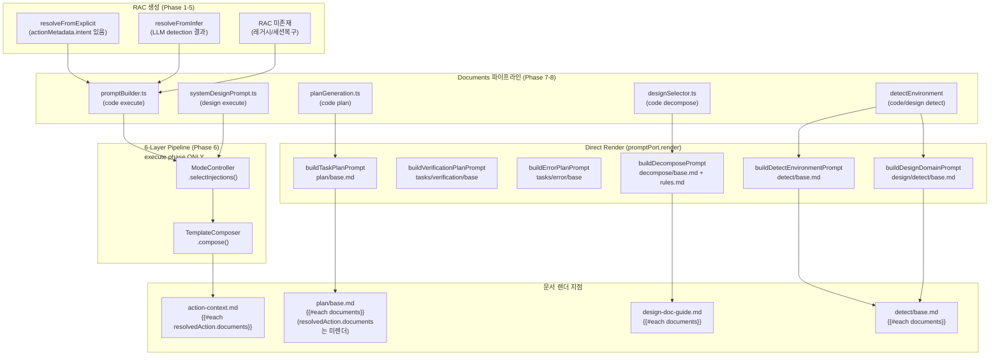

# RAC + Prompt System 종결 전수조사

## 무엇을 검증하는가

Phase 1~8에 걸친 리팩토링이 구축한 **전체 프롬프트 시스템**의 정합성.

| Phase | 도입한 것 | 이 테스트에서 검증하는 것 |
|-------|-----------|--------------------------|
| 1-4 | RAC 시스템 (ResolvedActionContext, explicit/infer 경로, action-context.md) | RAC 생성 정확성, action-context 렌더 |
| 5 | action-config-matrix, INTENT_DEFINITIONS, deriveFromIntent | intent → jobMode/workType/environment 매핑 정확성 |
| 6 | ModeController RAC 통합 (explicit tech, framework augmentation) | explicit/infer 경로별 injection 선택 |
| 7 | documents[] 일반화 (공존기) | documents가 action-context로 단일 렌더 |
| 8 | 레거시 완전 제거 (designDoc/prdSpec/uiDoc) | 레거시 경로 부재, documents 단일 경로 |

## 사전 수정 필수 (테스트 작성 전 코드 버그 수정)

### BUG-1: Error 태스크 preview-setup 주입 — 데드 코드

`ModeController.selectInjections()` line 258-264에서 error 태스크의 `preview-setup` 주입 코드가
`if (!isVerification && !isError && !isTestCode && !isDoc)` guard **내부**에 있어 절대 실행되지 않는다.

```typescript
// ModeController.ts line 232
if (!isVerification && !isError && !isTestCode && !isDoc) {
  // ... environment rules ...
  // line 261 — isError는 바깥 guard에서 이미 false
  if (isError && (environment === 'browser' || environment === 'fullstack')) {
    injections.push(`${jobPrefix}/preview-setup`);  // DEAD CODE
  }
}
```

**수정**: `if (isError && ...)` 블록을 바깥 guard 밖으로 이동. 축 5의 "error → preview-setup 예외"가 실제 동작하도록.

### BUG-2: `PromptEngine.buildPlanPrompt()` 데드 코드

6-layer pipeline의 `buildPlanPrompt()` 메서드는 어디에서도 호출되지 않는다.
`planGeneration.ts`의 `buildPlanPrompt`는 동명의 **로컬 함수**이며, 내부에서 `promptEngine.buildTaskPlanPrompt()` (direct render)를 호출한다.
Plan phase는 ModeController를 경유하지 않으므로, plan phase에 대한 injection 테스트는 무의미하다.

**수정**: 데드 코드 삭제 또는 향후 사용 시까지 보류. 테스트에서 `phase: 'plan'`은 제외.

---

## 프롬프트 빌드 경로 전체 맵



**주의**: Plan phase는 6-Layer Pipeline을 경유하지 않는다. `PromptEngine.buildPlanPrompt()`는 데드 코드이며, 실제로는 `promptEngine.buildTaskPlanPrompt()` (direct render)가 호출된다. 따라서 ModeController injection은 execute phase에서만 적용된다.

---

## 전수조사 축 (7개)

### 축 1: Source (RAC 생성 경로)

| 값 | 트리거 | RAC 상태 |
|----|--------|----------|
| `explicit` | UI에서 intent 선택 → `resolveFromExplicit` → resolve 노드에서 refs/context 파일 로드 | `source: 'explicit'`, `hasExplicitFields: true`, `documents: [loaded files]` |
| `infer` | LLM detection → `resolveFromInfer` → promptBuilder에서 designDoc/prd/uiDoc → documents 합성 | `source: 'infer'`, documents는 promptBuilder가 구성 |
| `infer+metadata` | LLM detection + actionMetadata(basis/refs/context 있음, intent 없음) | `source: 'infer'`, `basis`/`refs`/`context` 설정, documents는 promptBuilder가 구성 |
| `none` | resolvedAction 미존재 (세션 복구, 레거시 호출) | `resolvedAction: undefined`, action-context 미주입 |

### 축 2: Intent → jobMode/workType/environment 매핑

| intent | actionId | derived jobMode | derived environment |
|--------|----------|-----------------|---------------------|
| `create-plan` | plan | generate | - |
| `revise-plan` | plan | refactor | - |
| `create-fe` | system-design | generate | frontend |
| `create-be` | system-design | generate | backend |
| `create-fullstack` | system-design | generate | fullstack |
| `revise-system` | system-design | refactor | - |
| `create-code` | code | generate | - |
| `refactor-code` | code | refactor | - |
| `create-figma` | ui-design | generate | frontend |
| `create-ref` | ui-design | generate | frontend |
| `create-desc` | ui-design | generate | frontend |
| `revise-ui` | ui-design | refactor | frontend |
| `create-spec` | spec | generate | - |
| `revise-spec` | spec | refactor | - |
| `create-visual` | visual | generate | - |
| `create-learn` | learn | generate | - |

### 축 3: Environment (런타임 판정 — ModeController.detectEnvironment)

결정 우선순위:
1. RAC.tech.environment (explicit path)
2. context.detectedEnvironment (LLM detectEnvironment 노드)
3. designDocPath 파일명 패턴 (fe-system-* → browser)
4. codebaseProfile.environment
5. documents[] 본문 키워드 검색 (Next.js → browser, Express → node-api)
6. 언어 기본값 (TS → browser, Go → go-api)
7. 최종 fallback: browser

| 값 | injection 경로 |
|----|---------------|
| `browser` | `languages/{lang}/environments/browser/rules` + preview-setup |
| `node-api` | `languages/{lang}/environments/node-api/rules` |
| `go-api` | `languages/go/environments/go-api/rules` |
| `fullstack` | browser + (go-api\|node-api) + fullstack rules 3개 + preview-setup |
| `node-cli` | `languages/{lang}/environments/node-cli/rules` |
| `go-cli` | `languages/go/environments/go-cli/rules` |

### 축 4: Language (런타임 판정 — ModeController.detectLanguage)

결정 우선순위:
1. RAC.tech.language (explicit path)
2. codebaseProfile.language
3. detectionReportProfile.language
4. 기본값: typescript

| 값 | 특수 동작 |
|----|-----------|
| `typescript` | TS/JS 통합, browser 기본 |
| `go` | go-api/go-cli 분기, go-api-augmentation |
| `python` | node-api로 매핑 |
| `rust` | node-api로 매핑 |
| `java` | node-api로 매핑 |

### 축 5: TaskType

| 값 | skipStaticPolicy | skipHeavyContext | 전용 템플릿 | 환경 rules |
|----|-----------------|-----------------|-------------|-----------|
| `feature` | false | false | 기본 base/rules | 주입 |
| `setup` | false | false | 기본 + setup constraints/config | 주입 |
| `verification` | true | true | tasks/verification/base+rules | 건너뜀 |
| `error` | false | true | tasks/error/base+rules | 건너뜀 (preview-setup 예외 — BUG-1 수정 후) |
| `test-code` | true | true | tasks/test-code/base+rules | 건너뜀 (hints 주입) |
| `doc` | true | true | tasks/docgen/base+rules | 건너뜀 |

**환경 rules 외 injection 상세 (taskType별 차이)**:

| injection | feature | setup | verification | error | test-code | doc |
|-----------|---------|-------|-------------|-------|-----------|-----|
| env-specific rules | O | O | X | X | X | X |
| tool-calling-rules-compact | O | O | X | X | X | X |
| preview-setup (browser/fullstack) | O | O | X | O (BUG-1 수정 후) | X | X |
| preview-env-contract | O | O | O | O | X | X |
| port-management | O | O | O | O | X | X |
| backend-safety (backend/fullstack) | O | O | X | O | O | X |
| test-code hints | X | X | X | X | O | X |
| visual-source-authority | O (non-backend) | O (non-backend) | X | O (non-backend) | X | X |
| ui-design-policy | O (ui docs + non-backend) | O | X | O | X | X |

### 축 6: Documents 조합

| 값 | 내용 | 소스 |
|----|------|------|
| `none` | documents 미존재 | directive만 있는 경우 |
| `design-only` | system-design 1건 | designDocForTask만 |
| `design+prd` | system-design + PRD | designDoc + sourceDocuments |
| `full` | design + PRD + ui-spec | 위 + parsedUiDocs |
| `explicit-refs` | explicit path의 refs/context 로드 결과 | resolve 노드에서 파일 로드 |

### 축 7: Context Flags

| 플래그 | 주입되는 injection | 조건 |
|--------|-------------------|------|
| `hasMemory` | `common/injections/memory` | context.stats.hasMemory |
| `hasDirective` | `common/injections/directive` | context.stats.hasDirective |
| `retryContext` | `code/phases/execute/injections/retry-context` | context.retryContext 존재 |
| `lessons` | `code/phases/execute/injections/lessons` | context.lessons.length > 0 |
| `sessionContext` | `code/phases/execute/injections/session-context` | sessionContext.totalRuns > 0 |
| `hasMissingDependency` | `code/phases/execute/injections/missing-dependency-fix` | stats + language |
| `runtimeError` | `code/phases/execute/injections/runtime-error-fix` | directive 패턴 매칭 |
| `gitDiff` | `code/base/injections/git-diff` | projectCodeContext.gitDiff |
| `projectCodeContext` | `code/base/injections/retrieved-code` | files.length > 0 |
| `referenceCodeContexts` | `code/base/injections/reference-code` | contexts.length > 0 |
| `basis` | `common/injections/basis-guidance` | resolvedAction.basis |
| `jobMode=refactor` | `common/injections/refactor-guidance` (RAC R3) + `code/base/injections/behavioral-debugging` (code job only, explicit OR mode='refactor') | resolvedAction.jobMode, 두 injection의 조건이 다름에 주의 |
| `designDomain=game` | `design/phases/execute/injections/game-domain-guide` | design job |
| `designDomain=service` | `design/phases/execute/injections/service-domain-guide` | design job |
| `hasUiInDocuments` | `common/injections/ui-design-policy` | documents에 ui- path |

---

## Audit 1: ModeController 전축 매트릭스

파일: `tests/injection-audit.test.ts`

ModeController.determineMode()의 injection 목록을 모든 축 조합에서 snapshot으로 고정.

### 1A. 핵심 직교 매트릭스 (source × env × taskType × docs)

**주의**: `phase: 'execute'`만 테스트. Plan phase는 ModeController를 경유하지 않는다 (BUG-2 참조).

```typescript
const SOURCES = ['explicit', 'infer', 'none'] as const;
const ENVS = ['frontend', 'backend', 'fullstack'] as const;
const TASK_TYPES = ['feature', 'setup', 'verification', 'error', 'test-code', 'doc'] as const;
const DOC_COMBOS = ['none', 'design-only', 'full'] as const;

// 3 × 3 × 6 × 3 = 162 cases (execute phase only)
for (const source of SOURCES) {
  for (const env of ENVS) {
    for (const taskType of TASK_TYPES) {
      for (const docs of DOC_COMBOS) {
        it(`${source} | ${env} | ${taskType} | docs=${docs}`, () => {
          const ctx = buildContext(env, docs);
          const rac = buildRAC(source, env, docs);
          const config = mc.determineMode('code', 'execute', ctx, undefined, taskType, rac);
          expect(config.templates.injections).toMatchSnapshot();
        });
      }
    }
  }
}
```

### 1B. Language × Environment 교차 (런타임 판정 정확성)

```typescript
const LANG_ENV_PAIRS = [
  { lang: 'typescript', env: 'frontend', expectedRule: 'browser' },
  { lang: 'typescript', env: 'backend', expectedRule: 'node-api' },
  { lang: 'go', env: 'backend', expectedRule: 'go-api' },
  { lang: 'go', env: 'fullstack', expectedRules: ['browser', 'go-api', 'fullstack'] },
  { lang: 'typescript', env: 'fullstack', expectedRules: ['browser', 'node-api', 'fullstack'] },
];
```

### 1C. Context flags 개별 toggle

```typescript
const FLAG_CASES = [
  { name: 'retryContext', flag: { retryContext: {...} }, expected: 'retry-context' },
  { name: 'lessons', flag: { lessons: [{...}] }, expected: 'lessons' },
  { name: 'sessionContext', flag: { sessionContext: { totalRuns: 1 } }, expected: 'session-context' },
  { name: 'basis=prd', racFlag: { basis: 'prd' }, expected: 'basis-guidance' },
  { name: 'refactor-explicit', racFlag: { jobMode: 'refactor', source: 'explicit' }, expected: ['refactor-guidance', 'behavioral-debugging'] },
  { name: 'refactor-infer-with-mode', racFlag: { jobMode: 'refactor' }, mode: 'refactor', expected: ['refactor-guidance', 'behavioral-debugging'] },
  { name: 'runtimeError', flag: { directive: 'TypeError: x is not a function' }, expected: 'runtime-error-fix' },
  { name: 'missingDep', flag: { stats: { hasMissingDependency: true } }, expected: 'missing-dependency-fix' },
  { name: 'uiInDocs', docFlag: [{ path: 'ui-spec', ... }], expected: 'ui-design-policy' },
  { name: 'designDomain=game', flag: { designDomain: 'game' }, expected: 'game-domain-guide', job: 'design' },
  { name: 'designDomain=service', flag: { designDomain: 'service' }, expected: 'service-domain-guide', job: 'design' },
];
// 각 플래그 ON/OFF → injection 존재/부재 검증
```

### 1C-2. TaskType별 환경 외 injection 매트릭스

축 5 상세표를 테스트로 검증. 각 taskType에서 환경 rules 외 injection의 포함/미포함을 명시적으로 assert.

```typescript
const TASK_INJECTION_MATRIX = [
  { taskType: 'feature',      expect: { previewEnvContract: true,  portMgmt: true,  backendSafety: 'env', toolCalling: true,  testHints: false } },
  { taskType: 'setup',        expect: { previewEnvContract: true,  portMgmt: true,  backendSafety: 'env', toolCalling: true,  testHints: false } },
  { taskType: 'verification', expect: { previewEnvContract: true,  portMgmt: true,  backendSafety: false, toolCalling: false, testHints: false } },
  { taskType: 'error',        expect: { previewEnvContract: true,  portMgmt: true,  backendSafety: 'env', toolCalling: false, testHints: false } },
  { taskType: 'test-code',    expect: { previewEnvContract: false, portMgmt: false, backendSafety: 'env', toolCalling: false, testHints: true  } },
  { taskType: 'doc',          expect: { previewEnvContract: false, portMgmt: false, backendSafety: false, toolCalling: false, testHints: false } },
];
// 'env' = backend/fullstack 환경에서만 주입
// BUG-1 수정 후: error + browser/fullstack → preview-setup 포함도 검증
```

### 1D. Design job 전용 (framework augmentation + targetFile)

```typescript
const DESIGN_CASES = [
  { targetFile: 'fe-system-main.md', profile: { framework: 'Next.js' }, expected: 'nextjs-augmentation' },
  { targetFile: 'be-system-main.md', profile: { language: 'Go' }, expected: 'go-api-augmentation' },
  { targetFile: 'api-contract-main.md', expected: 'api-contract-guide' },
  { targetFile: 'fe-system-main.md', expected: 'frontend-guide' },
  { targetFile: 'be-system-main.md', expected: 'backend-guide' },
  // documents[] 본문에서 framework 키워드 추론
  { documents: [{ content: 'Next.js app router' }], targetFile: 'fe-system-main.md', expected: 'nextjs-augmentation' },
  { documents: [{ content: 'Golang gin API' }], targetFile: 'be-system-main.md', expected: 'go-api-augmentation' },
];
```

**예상: ~200+ 테스트**

---

## Audit 2: RAC 생성 검증

파일: `tests/rac-creation-audit.test.ts`

resolveFromExplicit/resolveFromInfer이 모든 intent에 대해 올바른 필드를 생성하는지.

### 2A. resolveFromExplicit — 전 intent 순회

```typescript
for (const intent of INTENT_DEFINITIONS) {
  it(`resolveFromExplicit: ${intent.id}`, () => {
    const rac = resolveFromExplicit({ intent: intent.id, explicit: true }, mockProfile);
    expect(rac.source).toBe('explicit');
    expect(rac.jobMode).toMatchSnapshot();
    expect(rac.tech).toMatchSnapshot();
    expect(rac.workType).toMatchSnapshot();
    // intent 없는 경우 intentDescription 존재 확인
    expect(rac.intentDescription).toBeTruthy();
  });
}
```

### 2B. resolveFromInfer — DetectionReport 변형

```typescript
const DETECTION_REPORTS = [
  { jobMode: 'generate', environment: 'frontend', profile: { language: 'TypeScript' } },
  { jobMode: 'refactor', environment: 'backend', profile: { language: 'Go' } },
  { jobMode: 'explain', environment: 'fullstack', profile: { language: 'TypeScript', framework: 'Next.js' } },
  { jobMode: 'generate', environment: 'unknown', profile: { language: 'TypeScript' } },  // unknown → undefined 매핑 검증
];

for (const report of DETECTION_REPORTS) {
  // with/without actionMetadata
  // actionMetadata.basis, .refs, .context 조합

  it('infer path: intentDescription is always undefined', () => {
    const rac = resolveFromInfer(report, actionMetadata, profile);
    expect(rac.source).toBe('infer');
    expect(rac.intentDescription).toBeUndefined();  // explicit에서만 설정됨
  });

  it('infer path: hasExplicitFields reflects actionMetadata presence', () => {
    const withMeta = resolveFromInfer(report, { basis: 'prd', refs: ['a.md'] }, profile);
    expect(withMeta.hasExplicitFields).toBe(true);
    expect(withMeta.basisDescription).toBeTruthy();

    const withoutMeta = resolveFromInfer(report, undefined, profile);
    expect(withoutMeta.hasExplicitFields).toBe(false);
    expect(withoutMeta.basisDescription).toBeUndefined();
  });
}
```

### 2C. deriveFromIntent — intent → 파생값 정확성

```typescript
for (const intent of INTENT_DEFINITIONS) {
  it(`deriveFromIntent: ${intent.id}`, () => {
    const derived = deriveFromIntent(intent.id);
    expect(derived).toMatchSnapshot(); // jobMode, workType, environment
  });
}
```

**예상: ~60+ 테스트**

---

## Audit 3: Documents 파이프라인

파일: `tests/documents-pipeline-audit.test.ts`

각 프롬프트 빌드 지점에서 documents[]가 올바르게 구성되는지 단위 검증.

### 3A. promptBuilder (code execute)

| 시나리오 | hasExplicitDocs | 결과 |
|----------|-----------------|------|
| explicit + documents 있음 | true | RAC.documents 그대로 사용, infer docs 미생성 |
| explicit + documents 없음 | false | designDoc/prd/uiDoc에서 합성 |
| infer + designDoc+prd+ui | false | 3건 합성 |
| infer + designDoc만 | false | 1건 합성 |
| infer + 아무것도 없음 | false | documents 미존재 |
| verification task | false | prd/uiDoc 건너뜀 |
| error task + selectedSpec | false | spec → documents |

### 3B. systemDesignPrompt (design execute)

| 시나리오 | hasExplicitDocs | 결과 |
|----------|-----------------|------|
| explicit + documents | true | RAC.documents 그대로 사용, prdSpec는 계산되지만 documents에 미추가, useSourceFileTool=false 강제 |
| infer + prdSpec 있음 | false | prdSpec → document 1건 합성 (path='source-docs', label='PRD Specification') |
| infer + prdSpec 없음 | false | documents 미존재 |
| infer + prdSpec > EXECUTE_SOURCE_THRESHOLD | false | prdSpec → index로 변환, useSourceFileTool=true |

### 3C. planGeneration (code plan)

| 시나리오 | 결과 |
|----------|------|
| designDoc + uiDoc | planDocs 2건 (system-design + ui-spec) |
| designDoc만 | planDocs 1건 |
| 둘 다 없음 | planDocs 빈 배열 |

### 3D. designSelector (code decompose)

| 시나리오 | 결과 |
|----------|------|
| inline mode (< threshold) | documents = 개별 ResolvedDocument[] |
| tool mode (> threshold) | documents = [design-index] 1건 |
| designDocs 없음, state.design fallback | documents = [design] 1건 |

**예상: ~30+ 테스트**

---

## Audit 4: 직접렌더 경로 documents 검증

파일: `tests/direct-render-audit.test.ts`

### 4A. buildTaskPlanPrompt

```typescript
const scenarios = [
  { name: 'design+prd', docs: [designDoc, prdDoc], expectContains: ['Design Specification', 'PRD'] },
  { name: 'no docs', docs: [], expectNotContains: ['{{documents}}'] },
  { name: 'spec-driven', docs: [specDoc], expectContains: ['Feature Specification'] },
];
```

**불변식 4A-INV**: plan/base.md에서 `resolvedAction.documents`는 렌더되지 않는다.
- `{{#each documents}}` → planGeneration.ts가 구성한 planDocs (designDoc + uiDoc) 렌더
- `{{#if resolvedAction.hasExplicitFields}}` → 메타데이터(intent/basis/target)만 렌더
- explicit path에서 resolve 노드가 로드한 refs/context 파일(resolvedAction.documents)은 plan phase에서 **미포함**

```typescript
it('explicit RAC documents are NOT rendered in plan phase', async () => {
  const racWithDocs = buildRAC('explicit', 'frontend', [
    { path: 'ref-file', content: 'UNIQUE_REF_MARKER', role: 'ref' }
  ]);
  const prompt = await engine.buildTaskPlanPrompt(task, directive, planDocs, ctx, undefined, undefined, undefined, undefined, undefined, racWithDocs);
  expect(prompt).not.toContain('UNIQUE_REF_MARKER');
  expect(prompt).toContain(racWithDocs.intentDescription); // 메타데이터는 렌더
});
```

### 4B. buildVerificationPlanPrompt / buildErrorPlanPrompt

```typescript
// documents를 받지 않는 경로 — resolvedAction만 전달
// 문서 렌더가 발생하지 않는 것이 정상
```

### 4C. buildDecomposePrompt

```typescript
const scenarios = [
  { name: 'inline docs', docs: feAndBeDocs, expectContains: ['Frontend System Design', 'Backend System Design'] },
  { name: 'no docs', docs: [], expectNotContains: ['{{designDoc}}'] },
];
```

### 4D. buildDetectEnvironmentPrompt / buildDesignDomainPrompt

```typescript
// detectDocs → documents[] → detect/base.md의 {{#each documents}} 렌더 확인
```

**예상: ~25+ 테스트**

---

## Audit 5: E2E 프롬프트 렌더 시나리오

파일: `tests/e2e-prompt-audit.test.ts`

실제 FilePromptAdapter로 전체 렌더. 최종 프롬프트 텍스트에서 5가지 불변식 검증.

### 불변식 (모든 시나리오에 적용)

```typescript
function assertPromptInvariants(text: string, injections: string[], scenario: Scenario) {
  // INV-1: 레거시 Handlebars 부재
  expect(text).not.toMatch(/\{\{designDoc\}\}/);
  expect(text).not.toMatch(/\{\{prdSpec\}\}/);
  expect(text).not.toMatch(/\{\{uiDoc\}\}/);

  // INV-2: 문서 1회 렌더 (중복 없음)
  for (const doc of scenario.expectedDocs) {
    const count = countOccurrences(text, doc.label);
    expect(count).toBe(1);
  }

  // INV-3: 삭제된 injection 미포함
  expect(injections.some(i => i.includes('prd-spec'))).toBe(false);
  expect(injections.some(i => i.includes('/design-doc'))).toBe(false);
  expect(injections.some(i => i.includes('ui-doc'))).toBe(false);

  // INV-4: 미해결 Handlebars 없음
  const unresolvedMatches = text.match(/\{\{[^!#/][^}]+\}\}/g) || [];
  const filtered = unresolvedMatches.filter(m => !m.includes('{{>'));
  expect(filtered).toEqual([]);

  // INV-5: 필수 injection 존재
  for (const req of scenario.requiredInjections) {
    expect(injections.some(i => i.includes(req))).toBe(true);
  }
}
```

### 시나리오 목록 (25개)

**Code Execute (12개)**

| # | source | env | lang | taskType | docs | 핵심 검증 |
|---|--------|-----|------|----------|------|-----------|
| 1 | explicit | frontend | ts | feature | full | 전체 문서 렌더, browser rules |
| 2 | explicit | backend | go | feature | design-only | go-api rules, no visual-source-authority |
| 3 | explicit | fullstack | ts | feature | design+prd | 3-env composite rules |
| 4 | infer | frontend | ts | feature | full | action-context 렌더 |
| 5 | infer | backend | go | feature | design-only | go-api, backend-safety |
| 6 | none | frontend | ts | feature | none | no action-context, directive only |
| 7 | explicit | frontend | ts | verification | full | skipStaticPolicy, no env rules |
| 8 | explicit | frontend | ts | error | full | preview-setup (BUG-1 수정 후), preview-env-contract, port-management, no env rules, no tool-calling |
| 9 | explicit | frontend | ts | test-code | full | test-code hints, skipStaticPolicy |
| 10 | explicit | frontend | ts | setup | design+prd | setup constraints |
| 11 | infer+metadata | frontend | ts | feature | full | basis-guidance, action-context |
| 12 | explicit | frontend | ts | feature | full + refactor | refactor-guidance + behavioral-debugging |

**Design Execute (5개)**

| # | intent | env | targetFile | 핵심 검증 |
|---|--------|-----|------------|-----------|
| 13 | create-fe | frontend | fe-system-main.md | frontend-guide, nextjs-augmentation |
| 14 | create-be | backend | be-system-main.md | backend-guide, go-api-augmentation |
| 15 | create-fullstack | fullstack | api-contract-main.md | api-contract-guide |
| 16 | design + game domain | - | - | game-domain-guide |
| 17 | design + service domain | - | - | service-domain-guide |

**Plan Phase (3개)**

| # | 경로 | 핵심 검증 |
|---|------|-----------|
| 18 | buildTaskPlanPrompt + docs | planDocs(designDoc+uiDoc) 렌더, resolvedAction.documents 미렌더 |
| 19 | buildVerificationPlanPrompt | docs 미렌더 |
| 20 | buildErrorPlanPrompt | docs 미렌더 |

**Decompose Phase (3개)**

| # | 경로 | 핵심 검증 |
|---|------|-----------|
| 21 | inline mode + fe+be docs | documents 개별 렌더, path 기반 annotation |
| 22 | tool mode (large) | design-index document 렌더 |
| 23 | no docs | 빈 출력 (design-doc-guide 조건 스킵) |

**Detect Phase (2개)**

| # | 경로 | 핵심 검증 |
|---|------|-----------|
| 24 | buildDetectEnvironmentPrompt + docs | documents 렌더, no prdSpec |
| 25 | buildDesignDomainPrompt + docs | documents 렌더, no prdSpec |

**예상: 25+ 테스트**

---

## Audit 6: 불변식(Invariant) 정적 검증

파일: `tests/invariant-audit.test.ts`

### 6A. injection-manifest 무결성 + 분류

```typescript
it('manifest has no legacy entries', () => {
  const manifest = JSON.parse(readFileSync(MANIFEST_PATH, 'utf-8'));
  expect(manifest['common/injections']['design-doc']).toBeUndefined();
  expect(manifest['common/injections']['prd-spec']).toBeUndefined();
  expect(manifest['common/injections']['ui-doc']).toBeUndefined();
});

it('all manifest entries have corresponding template files', () => {
  // manifest의 모든 키에 대해 .md 파일 존재 확인
});

it('manifest entry classification: injection vs partial vs unused', () => {
  // manifest에 등록된 각 항목이 실제 사용처를 가지는지 분류
  // (a) ModeController.selectInjections에서 주입되는 항목
  // (b) Handlebars partial ({{> path}})로 사용되는 항목
  // (c) 어디에서도 사용되지 않는 항목 (경고)
  //
  // 주의: job-history, batch-execution, batch-gather, plan-tools-batch,
  // persistence-schema-rule, secure-coding, mock-adapter-contract 등은
  // ModeController가 아닌 Handlebars partial로 사용됨.
  // 이 항목들이 manifest에 있으나 ModeController에서 주입하지 않는 것은 정상.
  //
  // 검증: 모든 manifest 항목은 (a) 또는 (b) 중 하나에 속해야 함
  const allTemplates = collectAllTemplates(TEMPLATES_DIR);
  for (const [category, entries] of Object.entries(manifest)) {
    for (const name of Object.keys(entries)) {
      const fullPath = `${category}/${name}`;
      const isInjectedByMC = mcInjectionPaths.has(fullPath);
      const isUsedAsPartial = allTemplates.some(([_, content]) =>
        content.includes(`{{> ${fullPath}}}`) || content.includes(`{{> ${fullPath} `)
      );
      expect(isInjectedByMC || isUsedAsPartial).toBe(true);
    }
  }
});
```

### 6B. 템플릿 레거시 변수 부재

```typescript
it('no template contains {{designDoc}} or {{prdSpec}} or {{uiDoc}} in render position', async () => {
  const templates = await collectAllTemplates(TEMPLATES_DIR);
  for (const [name, content] of templates) {
    // Handlebars 주석({{!--...--}}) 제외하고 검색
    const cleaned = content.replace(/\{\{!--[\s\S]*?--\}\}/g, '');
    expect(cleaned).not.toMatch(/\{\{designDoc\}\}/);
    expect(cleaned).not.toMatch(/\{\{prdSpec\}\}/);
    expect(cleaned).not.toMatch(/\{\{uiDoc\}\}/);
  }
});
```

### 6C. TemplateComposer getInjectionVars 무결성

```typescript
it('getInjectionVars has no design-doc/prd-spec/ui-doc keys', () => {
  const source = readFileSync(TEMPLATE_COMPOSER_PATH, 'utf-8');
  // varMap 블록 내에서 키 검색
  expect(source).not.toMatch(/'design-doc'\s*:/);
  expect(source).not.toMatch(/'prd-spec'\s*:/);
  expect(source).not.toMatch(/'ui-doc'\s*:/);
});

it('varMap filename keys do not collide across injection paths', () => {
  // TemplateComposer.getInjectionVars는 path.split('/').pop()으로 파일명만 추출하여 varMap 조회.
  // 서로 다른 injection 경로가 동일 파일명을 가지면 잘못된 변수가 매핑될 수 있음.
  // ModeController가 주입하는 모든 경로의 파일명을 수집하여 충돌 검사.
  const allInjectionPaths = collectAllMCInjectionPaths(); // ModeController 소스에서 추출
  const filenameMap = new Map<string, string[]>();
  for (const p of allInjectionPaths) {
    const filename = p.split('/').pop()!;
    if (!filenameMap.has(filename)) filenameMap.set(filename, []);
    filenameMap.get(filename)!.push(p);
  }
  for (const [filename, paths] of filenameMap) {
    if (paths.length > 1) {
      // 동일 파일명의 경로들이 varMap에서 같은 변수를 기대하는지 확인
      // (변수가 불필요한 {} 항목이면 충돌 무해)
      console.warn(`Filename collision: '${filename}' → ${paths.join(', ')}`);
    }
  }
});
```

### 6D. AssembledContext.stats 타입 계약

```typescript
it('AssembledContext.stats includes all declared fields', () => {
  // AssembledContext 타입에 hasSessionHistory가 선언되어 있으나
  // ContextAssembler에서 이 필드를 설정하지 않음 (항상 undefined).
  // 타입 계약 위반 여부를 정적으로 검증.
  const assemblerSource = readFileSync(CONTEXT_ASSEMBLER_PATH, 'utf-8');
  const statsBlock = assemblerSource.match(/const stats = \{[\s\S]*?\};/);
  expect(statsBlock).toBeTruthy();
  // 'hasSessionHistory'가 stats 블록에 없으면 경고
  if (!statsBlock![0].includes('hasSessionHistory')) {
    console.warn('hasSessionHistory is declared in AssembledContext.stats type but not computed in ContextAssembler');
  }
});
```

### 6E. documents 참조 동일성

```typescript
it('assembled.documents and assembled.resolvedAction.documents are the same reference', () => {
  // ModeController는 resolvedAction.documents에서 hasUiInDocuments를 계산하고,
  // TemplateComposer는 assembled.documents에서 hasUiInDocuments를 계산함.
  // 두 소스가 다르면 불일치 발생 가능.
  // promptBuilder/systemDesignPrompt에서 둘을 동일하게 설정하는지 검증.
  const ctx = buildContext('frontend', sampleDocsWithUi);
  const rac = buildRAC('explicit', 'frontend', sampleDocsWithUi);
  // ContextAssembler를 통해 assembled 구성 후 검증
  expect(assembled.documents).toBe(assembled.resolvedAction?.documents);
});
```

**예상: ~20+ 테스트**

---

## 추천 실행 순서

0. **사전 수정** (BUG-1, BUG-2) — 테스트 작성 전 코드 버그/데드코드 수정
1. **Audit 2** (RAC 생성) — 가장 기초, 상위 테스트의 전제 조건
2. **Audit 3** (Documents 파이프라인) — documents 구성 정확성
3. **Audit 1** (ModeController 매트릭스) — injection 선택 정확성 (execute phase only)
4. **Audit 4** (직접렌더 경로) — 6-layer 외 경로 + plan phase 불변식
5. **Audit 5** (E2E 시나리오) — 최종 통합 검증
6. **Audit 6** (불변식) — 안전망 (manifest 분류, varMap 충돌, documents 참조 동일성, stats 타입 계약)

**예상 총 테스트 수**: ~370+

## 필요 인프라

- `FilePromptAdapter` + `initPartials()` (prompt-smoke.test.ts에서 사용 중)
- `ModeController` 인스턴스 (injection-matrix.test.ts에서 사용 중)
- `PromptEngine` + mock contextLoader (prompt-pipeline.test.ts에서 사용 중)
- `resolveFromExplicit`, `resolveFromInfer`, `deriveFromIntent` (@ant/shared에서 import)
- **공용 fixture builders**: `buildContext()`, `buildRAC()`, `buildDocs()` — 전 Audit에서 공유
