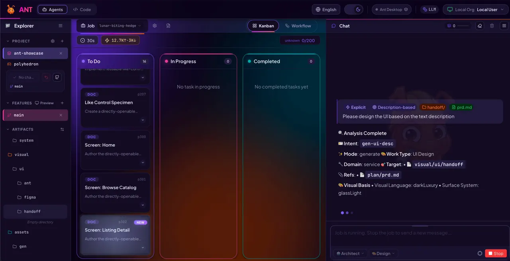
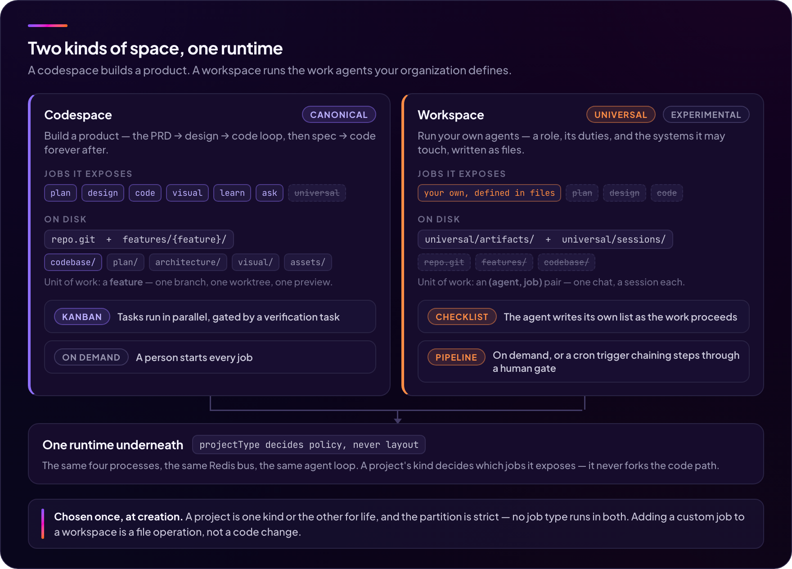
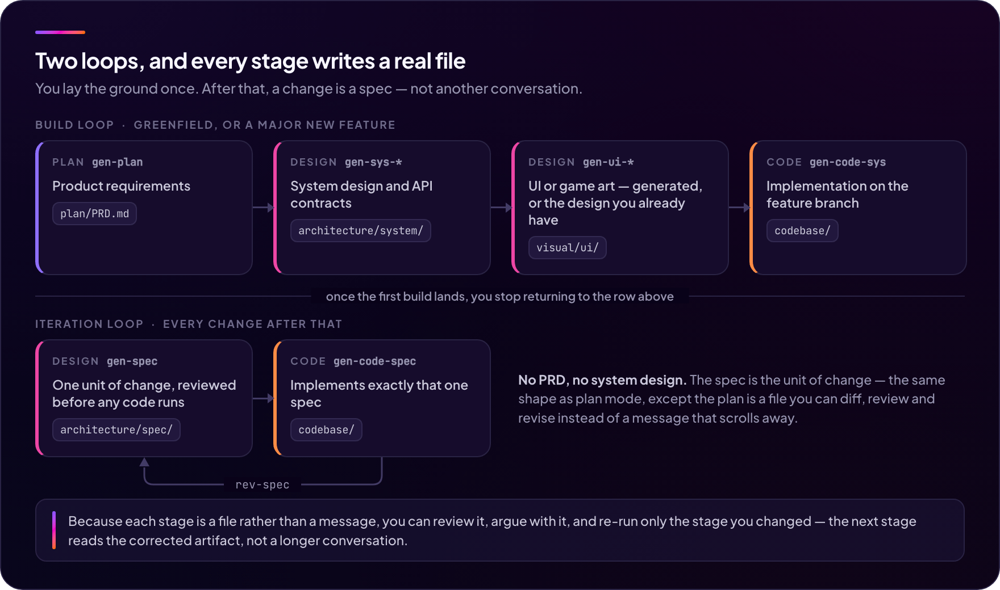
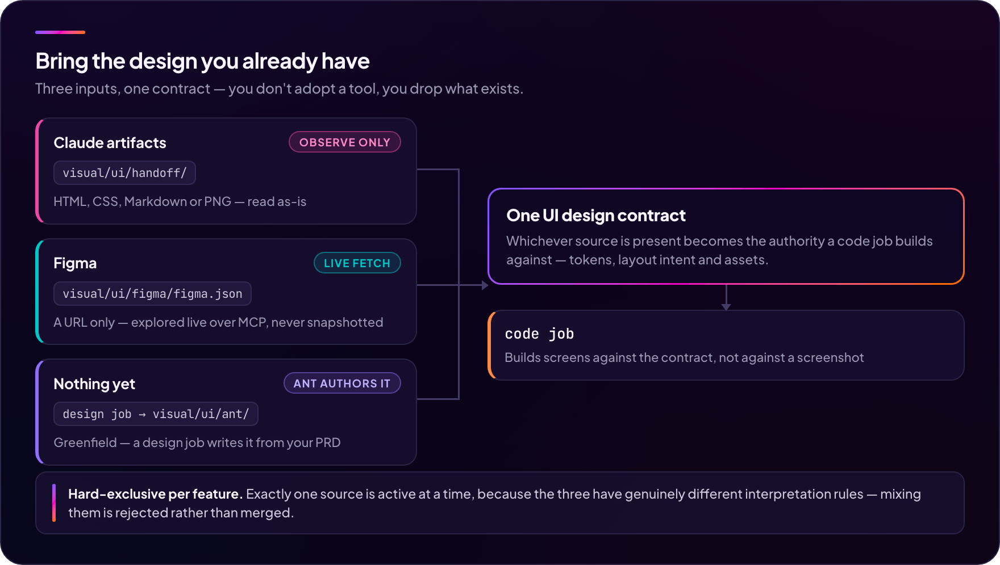
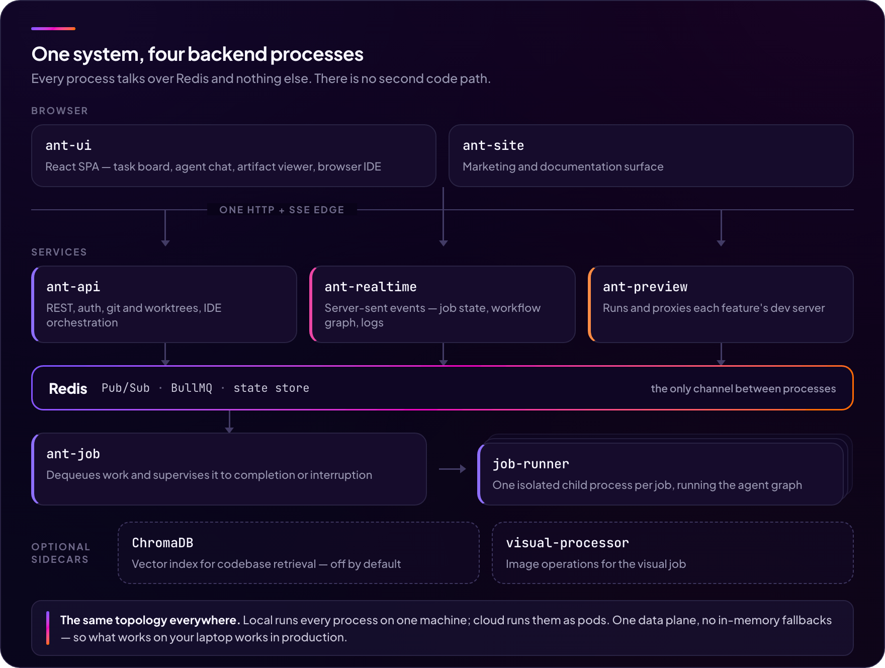
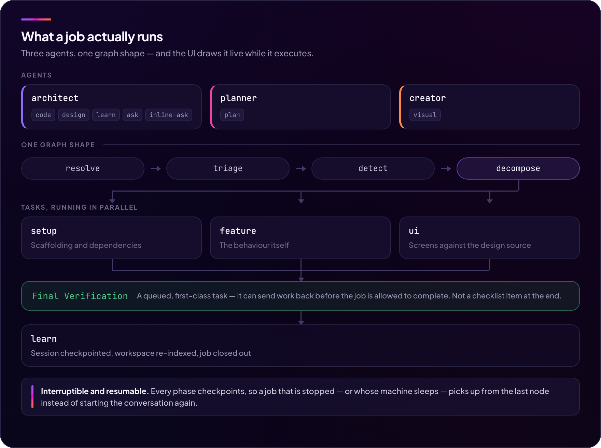
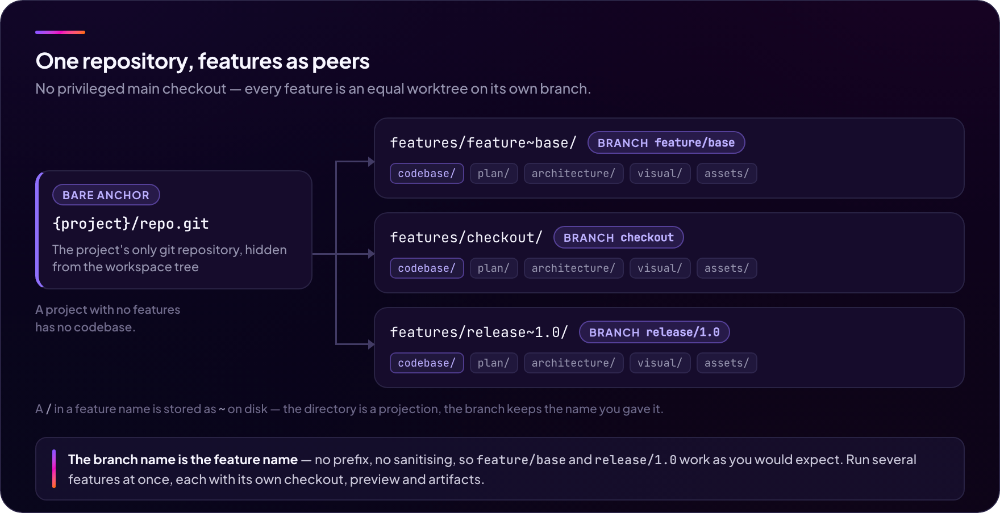

<p align="center">
  
</p>

<p align="center">
  <b>에이전트의 컨텍스트는 검색 결과가 아니라 선언된 목록이어야 합니다.</b><br>
  같은 런타임이 <b>제품을 만들고</b> — PRD → 설계 → 코드, 모든 코드 잡은 스스로 검증합니다 — <b>업무를 돌립니다</b>. 파일로 정의해 스케줄에 올리는, 당신의 업무 에이전트로.<br>
  <sub>Self-hosted · 내 LLM 키로 직접 · Apache-2.0</sub>
</p>

<p align="center">
  <a href="LICENSE"></a>
  <a href="https://github.com/to-nexus/ant/actions/workflows/ci.yml"></a>
  <a href="README.md"></a>
  <a href="docs/local-mode/install.md"></a>
</p>

<p align="center">
  
</p>
<p align="center"><sub>디렉티브 하나 → 병렬 실행되는 분해된 태스크, 각각이 실제 경로에
실제 파일을 씁니다 — 읽고, diff 뜨고, 반박할 수 있는. 커밋만이 아니라.</sub></p>

> ⚠️ **상태: pre-alpha, 1인 개발.** end-to-end로 동작하지만 릴리즈 사이에
> 공개 API와 파일 레이아웃이 아직 움직일 수 있고, 이만큼의 범위를 혼자
> 만들었기에 표면마다 완성도 편차가 있습니다 — 기능별 솔직한 상태는
> **[성숙도](#성숙도)** 를 보세요. 이슈와 PR을 환영하며, 어디에 도움이 가장
> 크게 닿는지는 **[기여하기](#기여하기)** 에 정리해 두었습니다.

---

## Ant이 뭐가 다른가

대부분의 에이전트 도구는 실행 시점에 파일을 검색해서 모델의
컨텍스트를 조립합니다 — 검색이 우연히 찾아낸 것이 곧 모델이 읽는 것입니다.
그래서 매 실행마다 조금씩 다른 컨텍스트를 읽고, 조금씩 다른 비용이 나오고,
재현할 수 없는 방식으로 실패합니다.

Ant은 정반대 전제 위에 서 있습니다: **컨텍스트는 발견하는 것이 아니라
선언하는 것입니다.**

- **잡이 돌기 전에, 무엇이 프롬프트에 들어가는지 보입니다.** 모든 잡은
  결의(resolve)된 아티팩트 셋 — 코드 잡에 건네진 PRD와 시스템 설계, 업무
  에이전트에 건네진 문서 — 을 상대로 실행되고, 프로젝트를 통째로 걸어
  들어가 그 셋을 불리는 것은 구속력 있는 런타임 규칙이 금지합니다. 그 밖을 탐색할 때는 로그가 남는 도구
  호출과 고정 토큰 예산을 거칩니다.
- **채팅은 모델의 컨텍스트가 아닙니다.** UI 트랜스크립트와 LLM 컨텍스트는
  구조적으로 서로 다른 파일입니다. 잡은 이전 작업의 유계 증류본(4–12k
  토큰)을 받습니다 — 채팅 스크롤백이 아니라. 그리고 채팅에서 말한 제약은
  요약을 거듭하다 사라지는 대신 원문 그대로 ledger에 실려 전달됩니다.
- **모든 스테이지는 영속 파일이고, 모든 비용은 항목별로 보입니다.** 같은
  선언된 입력은 같은 프롬프트를 만듭니다. 산출물은 읽고, diff 뜨고, 고칠
  수 있는 실제 경로에 놓이고, 모든 잡은 모델별 토큰 / 비용 / 캐시 적중
  분해로 끝납니다.

---

## 두 날개, 하나의 런타임

Ant은 두 종류의 프로젝트를 돌리며, 그 둘은 별개의 제품이 아닙니다.
**코드스페이스**는 소프트웨어를 만듭니다: PRD가 시스템 설계와 UI 설계와
코드가 되고, 각 단계가 영속 파일이며, 모든 코드 잡이 자기 verification
태스크로 게이팅됩니다. **워크스페이스**는 조직의 업무를 돌립니다: 에이전트와
그 직무를 파일로 정의하고, 손댈 수 있는 시스템을 MCP로 연결하고, 필요할 때
또는 cron 스케줄로 실행합니다.

두 날개는 같은 4개 프로세스, 같은 Redis 버스, 같은 에이전트 루프, 같은
Handlebars 프롬프트 표면, 같은 암호화 크리덴셜 저장소 위에 앉습니다. 그게
핵심입니다: 제품을 만드는 것과 업무를 돌리는 것이 하나의 설치, 하나의 키
묶음, 하나의 감사 기록이라는 뜻입니다 — 서로 맞춰줘야 하는 두 개의 도구가
아니라.

<p align="center">
  
</p>

|                          | **코드스페이스**                              | **워크스페이스** *(실험적)*                     |
|--------------------------|-----------------------------------------------|------------------------------------------------|
| 만드는 것                | 제품                                          | 조직의 업무 에이전트                            |
| 노출하는 잡              | `plan` `design` `code` `visual` `learn` `ask` | 파일로 정의한 당신의 잡                         |
| 작업 단위                | **피처** — 브랜치 + 워크트리                  | **(에이전트, 잡)** 쌍                           |
| 진행 표면                | 칸반 태스크, verification 태스크가 게이팅      | 에이전트가 스스로 쓰는 체크리스트               |
| 실행 계기                | 사람이 잡을 시작                              | 사람이 잡을 시작하거나, **파이프라인**이 cron으로 발화 |
| Git·라이브 프리뷰·브라우저 IDE | 있음                                    | 없음 — 워크스페이스에는 코드베이스가 없습니다   |
| 디스크                   | `repo.git` + `features/{feature}/…`           | `universal/{artifacts,sessions}/`              |

종류는 생성 시점에 고르고 프로젝트 수명 동안 고정되며, `config.json`의
`projectType`에 저장됩니다. 파티션은 양방향으로 엄격합니다 — 두 종류에서 모두
도는 잡 타입은 없습니다 — 그래서 토글이 아니라 생성 시점의 결정입니다.

이 플래그가 *아닌* 것은 포크입니다: `projectType`은 프로젝트가 어떤 잡을
노출하는지만 결정하고, 런타임의 동작이나 디스크 레이아웃은 결코 건드리지
않습니다.

아래로: 코드스페이스는 [구축 루프와 이터레이션 루프](#구축-루프와-이터레이션-루프),
워크스페이스는 [업무 루프](#업무-루프), 각각이 실제로 어디까지 왔는지는
[성숙도](#성숙도)에 있습니다. 더 읽기:
[docs/concepts/spaces.md](docs/concepts/spaces.md) (영문).

---

## 구축 루프와 이터레이션 루프

코드스페이스 안에서 이 레일 위를 도는 것은 채팅이 아니라 엔지니어링의
모양을 한 파이프라인입니다. **구축 루프** — greenfield, 프로젝트당 한 번:

1. **PRD**부터 적습니다. `planner` 에이전트가 명세를 다듬어 줍니다.
2. **시스템 설계** (아키텍처, API 컨트랙트, 시스템 문서)를 생성합니다.
3. **UI 디자인** (game 도메인이면 **game art**)을 만듭니다 — PRD에서
   생성하거나, 갖고 있는 Figma / Claude artifact를 그대로 떨어뜨립니다
   ([디자인을 그대로 가져오기](#디자인을-그대로-가져오기) 참고).
4. 그 설계들을 근거로 **코드**를 작성합니다.

**이터레이션 루프** — 그 이후의 모든 변경:

5. 다음 작업 단위의 **스펙**을 저작하고, 리뷰하고, 코드 잡이 정확히 그
   스펙 하나를 구현합니다 — 스펙은 diff 뜨고, 고치고, 남겨두는 영속
   문서입니다 (`gen-spec` → `gen-code-spec` → `rev-spec` → 반복).

검증은 일정에 넣는 단계가 아니라 **모든 코드 잡의 속성**입니다: 작업은
태스크로 분해되어 병렬 실행되고, 마지막 verification 태스크가 완료를
게이팅합니다. 게이트가 실패하면 error 태스크가 생겨 고치고 재검증합니다.

각 단계는 별도의 잡이며, 각자의 프롬프트 표면, 도구, 영속 아티팩트를
갖습니다. 결과는 감사 가능한 시스템이지, 가끔 코드를 토해내는 블랙박스가
아닙니다.

도구를 고르는 중이라면 **[docs/comparison.md](docs/comparison.md)** (영문)에
솔직한 비교표가 있습니다 — Ant *대신* spec-kit, OpenSpec, Claude Code,
Lovable을 써야 하는 경우까지 포함해서.

<p align="center">
  
</p>

---

## 업무 루프

워크스페이스에는 PRD도 verification 게이트도 없습니다. 무언가를 만드는 게
아니기 때문입니다. 루프는 위보다 짧고, 프로젝트당 한 번이 아니라 달력을 따라
반복됩니다:

1. **에이전트**를 씁니다: 그것이 누구인지 산문으로, 그리고 손댈 수 있는
   시스템을.
2. 그 **잡들**을 씁니다 — 직무당 하나 — 각자 자기 도구 허용목록과, 구분해야
   하는 상황들에 대한 자기 인텐트를 갖습니다.
3. 컴포저에서 **하나를 실행**하거나, cron으로 발화해 다른 잡으로 이어지고
   승인 게이트에서 사람을 기다리는 **파이프라인을 활성화**합니다.
4. `universal/artifacts/` 아래에서 결과를 읽습니다 — 실제 경로의 실제
   파일이고, 모델이 했다고 말한 것이 아니라 실제 도구 부수효과로 만든
   매니페스트와 함께 알려집니다.

1번과 2번은 파일 작업입니다: 코드 변경도, 새 잡 타입도, 배포도 없습니다.
정의는 매 실행마다 새로 읽히므로, 고쳐서 다시 돌리는 것이 이터레이션 주기
전부입니다.

자세히: 아래 [커스텀 에이전트와 유니버설 런타임](#커스텀-에이전트와-유니버설-런타임).

---

## 빠른 시작

**필요한 것** Node.js >= 22.13 · pnpm 11.1.0 (`corepack enable && corepack prepare pnpm@11.1.0 --activate`) · Docker + Compose (Redis용) · [LLM 프로바이더 키](#프로바이더). **macOS/Linux** — Windows는 WSL2 경유만 가능하며 미검증입니다.

```bash
git clone https://github.com/to-nexus/ant && cd ant
pnpm install

cp packages/ant-cli/.env.example.local packages/ant-cli/.env
# packages/ant-cli/.env 편집 — 필수 값은 하나입니다:
#   ANTHROPIC_API_KEY=sk-ant-...
# (Redis URL과 암호화 키는 로컬 모드에서 기본값으로 동작합니다.)

pnpm dev:infra:redis      # Redis — 유일한 필수 인프라
pnpm dev:all              # API + Realtime + Worker + Preview + UI
```

설치가 이상해 보이면 `pnpm doctor`가 버전·Redis·프로세스 상태·프로바이더
키를 한 번에 점검합니다.

컨테이너가 편하다면 `cp .env.example .env`로 키만 넣고
`docker compose up -d` — 호스트에 Node/pnpm 없이 Redis까지 전체 스택이
[http://localhost:4200](http://localhost:4200) 뒤에서 떠오릅니다.

[http://localhost:4200](http://localhost:4200)을 열고 첫 디렉티브를
입력합니다 — 예: *"React + Tailwind로 TODO 앱 만들어줘"*.

Ant에는 두 번째 프로젝트 종류도 있습니다 — 업무 에이전트를 파일로 직접
정의해 같은 런타임에서 돌리는 **워크스페이스**입니다
([커스텀 에이전트](#커스텀-에이전트와-유니버설-런타임)). 같은 위저드에서
만들어 기본 제공되는 `assistant` 에이전트와 대화해 보세요 — 추가 셋업이
필요 없습니다.

`pnpm dev:infra`는 ChromaDB와 visual-processor까지 함께 띄웁니다. 둘 다
**선택**입니다 — 벡터 DB는 `ANT_VECTOR_DB_ENABLED=true`를 켜지 않는 한
꺼져 있고(RAG는 git-changes + 키워드 검색으로 degrade), visual-processor는
`visual` 잡에서만 씁니다.

자세한 셋업: [docs/local-mode/install.md](docs/local-mode/install.md).
클라우드 (매니지드 또는 self-host)로 가시려면
[docs/cloud-mode/install.md](docs/cloud-mode/install.md).

---

## 성숙도

Ant은 1인 프로젝트치고 다루는 범위가 넓고, 그만큼 완성도가 고르지
않습니다. 아래가 솔직한 버전입니다. 체인지로그 각주에 숨겨둔 것은 없습니다.

| 표면 | 상태 | 실제로 무슨 뜻인가 |
|---|---|---|
| `code` / `design` / `plan` 잡 — service 도메인 | **Stable** | 지원되는 경로. 매일 쓰이는 부분입니다. |
| 라이브 프리뷰, 브라우저 IDE | **Stable** | 테스트 커버리지가 두껍고 상시 사용됩니다. |
| 서비스 연결 & 가상화 | **Beta** | 연결 설정 · 자동 탐지 · mock 어댑터 모두 출하돼 있고 테스트도 있습니다. 빠진 것은 **생성된 어댑터가 실제 서비스와 일치함을 증명하는 검증 게이트** 입니다 — 생성된 연동 코드는 실제 백엔드로 테스트한 뒤 신뢰하세요. |
| `creator` 에이전트 / `visual` 잡 | **Experimental** | **Google Gemini 전용** — 다른 곳에서 무엇을 쓰든 `GEMINI_API_KEY`가 필요합니다. 배경 제거는 선택 사이드카가 필요합니다. **그래프 중간 재개 불가**: 중단되면 잡이 처음부터 다시 시작됩니다. 그래프 노드에 실행 테스트가 없습니다. |
| Game 도메인 | **Experimental** | **그린필드 전용** — 기존 코드베이스에서는 game-art 티어가 억제됩니다. Phaser 전용(3D는 별도 엔진이 아니라 `enable3d` 확장). design 잡과 visual 잡 사이의 스프라이트 아틀라스 인계가 닫혀 있지 않아 프로덕션 아트는 직접 배치해야 합니다. |
| Vector DB / RAG (`learn` 잡) | **Experimental** | end-to-end로 연결돼 있지만 **기본 비활성 — 그리고 끄는 것을 권장합니다** (`ANT_VECTOR_DB_ENABLED=false`; ChromaDB 사이드카 필요; UI 미노출). 청킹 / 인덱싱 전략이 아직 튜닝되지 않아 인덱싱의 실익이 없습니다 — 프레임워크는 향후 조직 공유 vector DB 수요를 내다보고 미리 갖춰둔 것입니다. 꺼도 저하되는 것은 없습니다: 조회는 3단 체인(vector → git-changes → 키워드)입니다. `learn` 노드 자체는 DB가 꺼져 있어도 몫을 합니다 — 모든 잡이 끝날 때의 LLM 잡 요약과 세션 증류를 이 노드가 씁니다. |
| 워크스페이스 & 커스텀 에이전트 (`universal` 런타임) | **Experimental** | 런타임, 정의 로더, 암호화 크레덴셜 저장소를 갖춘 MCP 오버레이, 체크리스트 보드 모두 출하돼 있고 테스트가 있습니다. HTTP MCP 서버를 상대로 하는 읽기 전용 업무가 검증된 경로입니다(end-to-end 확인 완료). 가장 먼저 걸리는 공백은 **대화형 승인**입니다 — 게이트에 걸린 쓰기 도구는 안내와 함께 거부되므로, 잡은 `approval: never` 를 명시한 곳에만 씁니다. 그리고 MCP 이미지 결과는 버려지고(텍스트 전용), 중단된 실행은 체크리스트 한 턴을 잃을 수 있습니다. |
| 파이프라인 — 스케줄된 에이전트 체인 | **Experimental** | cron 트리거와 즉시 실행, `on: success / failure / always` 를 갖는 선형 체인, 승인 게이트(채팅 카드 · 인박스 · 타임아웃 암), 답할 때까지 실행을 세워두는 clarify 질문, 비활성화 후에도 남는 프로젝트별 활성화 이력. 정의는 조직 스코프로 승격할 수 있습니다. 아직 없는 것: 웹훅·이벤트 트리거, Slack/이메일 전달, 스텝별 재시도, 스텝 간 `{{steps.*}}` 치환, 병렬 브랜치. **워크스페이스 전용** — UI의 코드스페이스 토글은 예약만 되어 있고 배선되지 않았습니다. |
| 팀 / 조직 공유 | **Beta** | 팀 조직, owner/admin/member 3단 권한, 초대, 도메인 클레임 모두 출하돼 있습니다. 에이전트와 파이프라인 정의는 실제 조직 스코프를 갖습니다: 승격하면 정의가 조직 디렉터리로 이동하고, ACL 사이드카가 소유자와 위임 편집자를 적고, 권한은 토큰 클레임이 아니라 살아 있는 멤버십으로 매번 다시 판정됩니다. 날카로운 지점 하나 — **MCP 크레덴셜은 사용자별**이므로, 조직 에이전트를 돌리는 각 멤버가 `${secret:}` 키를 자기 저장소에 등록해야 합니다. |
| 매니지드 클라우드 (빌링, 크레딧, 배포 쿼터, 커스텀 도메인) | **미공개** | self-host 배포에서는 무력화된 no-op seam. |

Experimental 항목이 발목을 잡으면 이슈로 알려주세요 — 사람들이 실제로 어디에
부딪히는지 아는 게 로드맵 추측보다 훨씬 쓸모 있습니다.

---

## 프로바이더

키는 직접 준비합니다. `packages/ant-cli/.env`에 하나 이상 설정하면 잡별 ·
노드별로 모델을 고를 수 있습니다.

| 프로바이더 | 환경 변수            | 비고                                  |
|------------|----------------------|---------------------------------------|
| Anthropic  | `ANTHROPIC_API_KEY`  | 1차 지원 모델                          |
| OpenAI     | `OPENAI_API_KEY`     |                                       |
| Google     | `GEMINI_API_KEY`     |                                       |
| DeepSeek   | `DEEPSEEK_API_KEY`   | third-party · 중국 호스팅 — 동의 게이트 |
| GLM        | `GLM_API_KEY`        | third-party · 중국 호스팅 — 동의 게이트 |
| Kimi       | `KIMI_API_KEY`       | third-party · 중국 호스팅 — 동의 게이트 |

동의 게이트가 걸린 프로바이더는 선택 전에 앱 내 데이터 처리 동의가
필요합니다 — 프롬프트(= 여러분의 소스 코드)가 제3국 사업자로 나가기
때문입니다.

Ant은 에이전트 런타임을 직접 구성했으므로 **중간에 라우터가 없습니다**.
세 어댑터 계열 — Anthropic, OpenAI 호환, Gemini — 이 각 벤더의 API에
여러분의 키로 직접 통신합니다. 프로바이더 정가 그대로입니다: 토큰당
마진도, 요청 미터링도 없고, 프롬프트가 여러분이 고르지 않은 제3자를
경유하지 않습니다.

고르기 전에 알아둘 두 가지: DeepSeek · GLM · Kimi는 1급 클라이언트가 아니라
OpenAI 호환 어댑터를 경유하므로 프로바이더 고유 기능이 늦게 반영될 수
있습니다. 그리고 **이미지 생성은 Google 전용**입니다 — `visual` 잡은 다른
곳에서 무엇을 쓰든 `GEMINI_API_KEY`가 필요합니다.

**로컬 모델(Ollama, llama.cpp 등)은 지원하지 않습니다.** 정책이 아니라
크기의 문제입니다: code 잡 execute 시스템 프롬프트만 ≈39k 토큰이고, 실효
최소 요건은 **≈200K 컨텍스트 + 신뢰할 수 있는 네이티브 tool calling**입니다
— 32K 로컬 모델은 첫 tool call 이전에 시스템 프롬프트에서 무너집니다.
지원되는 것: 레지스트리에 등록된 DeepSeek / GLM / Kimi 모델 id를
`ANT_{DEEPSEEK,GLM,KIMI}_BASE_URL`로 자체 OpenAI 호환 게이트웨이(LiteLLM,
vLLM, OpenRouter)에 라우팅하는 것 —
[docs/reference/env-vars.md](docs/reference/env-vars.md#local--self-hosted-models) 참고.

---

## 디자인을 그대로 가져오기

Ant은 **세 가지 디자인 입력**을 1급 시민으로 취급합니다. 도구를 고를
필요 없이, 가진 것을 그대로 떨어뜨리세요. (이 절과 뒤따르는 두 절은
코드스페이스 날개 이야기입니다.)

<p align="center">
  
</p>

| 소스                  | 무엇을 떨어뜨리는가                          | 언제 쓰나                                                                  |
|-----------------------|----------------------------------------------|----------------------------------------------------------------------------|
| **Claude artifacts**  | HTML/CSS/Markdown/PNG → `visual/ui/handoff/` | Claude.ai에서 디자인을 굴리던 분에게 가장 적합. 라이선스/셋업/스키마 불필요. |
| **Figma**             | Figma URL → `visual/ui/figma/figma.json`     | 이미 Figma 프로젝트가 있는 팀. 프롬프트 시점에 MCP로 실시간 탐색.          |
| **아직 아무것도 없음** | PRD에 `design` 잡을 돌림                      | Greenfield. Ant이 handoff 번들을 대신 작성.                                |

세 소스는 피처 단위로 hard-exclusive이며 해석 컨트랙트가 다릅니다.
(Claude handoff은 observation-only / FPOP, Figma는 live-fetched, ant
native JSON은 schema-based.)

**`design` 잡의 산출물은 어느 소스에서 출발했는지에 따라 달라집니다.** PRD에서
출발하면 (`gen-ui-desc`) `visual/ui/handoff/` 에 `DESIGN.md`를 루트로 하는 번들
(`styles.css`, `tokens/`, `components/`, `screens/`, `assets/`) 을 쓰고,
`figma.json` 에서 출발하면 (`gen-ui-figma`) `visual/ui/ant/` 에 canonical 3종
`ui-tokens.json` + `ui-assets.json` + `ui-spec.json` 을 씁니다.

풀 가이드:
[docs/guides/design-input/claude-handoff.md](docs/guides/design-input/claude-handoff.md).

---

## 동작 방식

<p align="center">
  
</p>

백엔드 4개 프로세스, 단일 코드베이스, 오직 Redis로만 통신. 로컬 모드와
클라우드(K8s) 모드는 같은 데이터 플레인을 공유합니다 — 로컬은 단지
"모든 프로세스가 한 머신에" 일 뿐입니다.

각 잡은 LangGraph 에이전트 상태 머신으로 실행됩니다:
`resolve` → `triage` → 잡별 phase → `learn`. UI가 이 그래프를 실시간으로
그리므로 지금 어떤 노드가 실행 중이고 병렬 워커가 몇 개 떠 있는지 볼 수
있습니다.

<p align="center">
  
</p>

| 에이전트    | 담당 잡                                        |
|-------------|-----------------------------------------------|
| `architect` | `code`, `design`, `learn`, `ask`, `inline-ask` |
| `planner`   | `plan`                                        |
| `creator`   | `visual`                                      |
| `universal` | 모든 커스텀 잡 — [커스텀 에이전트](#커스텀-에이전트와-유니버설-런타임) 참고 |

`design` 잡 하나가 세 표면을 담당하며 인텐트가 하나를 고릅니다:
시스템 설계(`gen-sys-*`), UI · game-art 디자인(`gen-ui-*` /
`gen-game-art-*`), 스펙 저작(`gen-spec` / `rev-spec`).

커스텀 잡은 의도적으로 더 짧은 그래프를 씁니다 — `resolve → agent ⇄ tool →
respond`, triage 도 decompose 도 없습니다. 분류할 것이 없고(잡을 이미
당신이 골랐습니다) 태스크로 분해할 것도 없으니, 두 phase 는 결정 없는
지연일 뿐입니다.

자세히: [docs/concepts/architecture.md](docs/concepts/architecture.md).

---

## 코드스페이스 레이아웃

한 **프로젝트**의 git 저장소는 하나뿐입니다 — 숨겨진 bare 앵커
`{project}/repo.git`. 모든 **피처**는 동등한 linked worktree
(`features/{feature}/codebase/`)이고, **브랜치 이름은 피처 이름과
정확히 같습니다** — prefix 도, sanitize 도 없습니다. 피처 이름에 `/`를
쓸 수 있어 `feature/base`, `release/1.0` 같은 이름이 그대로 동작합니다.

<p align="center">
  
</p>

피처가 없는 프로젝트는 코드베이스가 없습니다. 특권을 가진 "main"
worktree 는 존재하지 않고 모든 피처가 대등합니다.

`codebase/` 옆에는 에이전트 산출물이 함께 놓입니다: `plan/`(PRD),
`architecture/`(시스템 설계 + 스펙), `visual/`(UI · game-art 디자인),
`assets/`, 그리고 에이전트 내부용 `sessions/` · `meta/`.

피처가 대등한 worktree이기 때문에 여러 피처를 병렬로 진행할 수 있습니다 —
각자 자기 브랜치, 자기 체크아웃, 자기 프리뷰 서버, 자기 아티팩트 셋을
갖고, 여느 브랜치처럼 머지하면 됩니다.

---

## 코드스페이스가 무엇을 만들 수 있나

| 도메인                    | 상태       | 예시                                            |
|---------------------------|------------|-------------------------------------------------|
| **Service** (웹/백엔드)   | Stable     | 풀스택 SaaS, 대시보드, REST API                |
| **Game**                  | Experimental | Phaser/Web 게임 (sprite + HUD + audio)        |

여기서 "Experimental"이 구체적으로 무슨 뜻인지는 [성숙도](#성숙도)를 보세요.

두 도메인은 같은 에이전트를 공유하지만 다른 프롬프트 오버레이, 다른
디자인 템플릿, 다른 visual-tier 카탈로그를 갖습니다. 새 도메인 추가는
도메인 레지스트리 변경 한 곳 — fork 불필요.

도메인은 코드스페이스의 개념이고, 반대편에는 의도적으로 대응하는 손잡이가
없습니다: 워크스페이스는 구조상 도메인이 없으며, 무엇을 하는지는 레지스트리
항목이 아니라 당신이 작성한 에이전트가 결정합니다.

---

## 워크스페이스 레이아웃

워크스페이스에는 피처가 없으므로 코드스페이스의 축이 하나도 적용되지 않습니다:
`repo.git`도, `codebase/`도, 피처별 프리뷰도 없습니다. 피처 생성은 아예 거부됩니다 — git
없는 피처는 열화 모드가 아니라 모순이기 때문입니다. 전부 하나의 컨테이너
아래에 있습니다:

```
{project}/
  config.json                      projectType: 'universal'
  universal/
    artifacts/                     공유 작업 트리 — 에이전트가 읽고 씁니다
      plan/{agentId}/{jobId}/      예약됨; `@plan` 턴이 여기 씁니다
      …                            자유 형식; 잡이 만들어내는 무엇이든
    sessions/                      (에이전트, 잡)별 체크포인트, 채팅 하나, 디버그 로그
```

이 모양에서 두 개의 소유 규칙이 따라 나오고, 둘 사이의 비대칭이 사람들이
걸려 넘어지는 지점입니다:

- **정의는 계정 소유입니다.** 에이전트와 잡은 모든 프로젝트 바깥에 살기
  때문에, `ops-team` 에이전트 하나가 당신이 가진 모든 워크스페이스를
  섬깁니다 — 조직으로 승격하면 팀 전체가 공유합니다.
- **아티팩트는 프로젝트 소유입니다.** 공유 `universal/artifacts/` 트리 하나가
  그 프로젝트의 모든 에이전트와 잡을 섬기므로, 폴더를 한 번 올리면 모든
  커스텀 잡이 읽을 수 있습니다.

더 읽기: [docs/concepts/spaces.md](docs/concepts/spaces.md) (영문).

---

## 커스텀 에이전트와 유니버설 런타임

> ⚠️ **실험적**이지만, 곁가지가 아니라 대표 기능입니다 — 여기서 "실험적"은
> 중요도가 아니라 성숙도를 뜻합니다. 무엇이 있고 무엇이 없는지는
> [성숙도](#성숙도) 표에 그대로 적어 두었습니다.

어느 조직에나 반복적이고 판단이 많이 들어가면서 아무도 즐겁게 하지 않는 업무가
있습니다: 장애 리포트, 주간 운영 보고, 릴리즈 노트, 벤더 인보이스 정산.
이런 일은 코딩 에이전트에도, 채팅창에도 잘 맞지 않습니다 — 코드베이스도
대화도 아니라 **역할과 그 직무**이기 때문입니다.

그래서 그것을 적어 둡니다. **에이전트**는 역할이고, 그 **잡**들은 그 역할의
직무이며, 둘 다 그냥 파일입니다:

```
.ant/agents/ops-team/
  agent.yaml               # 정체성 + 공유 MCP 연결
  base/role.md             # 이 에이전트가 누구인지 — 항상 프롬프트에 들어감
  jobs/weekly-report/
    job.yaml               # 잡 컨트랙트: 쓸 수 있는 도구, 승인이 필요한 도구
    base/system.md         # 이 잡이 어떻게 도는지 — 항상 프롬프트에 들어감
    injections/*.md        # 상황별 산문, 해당될 때 끌어옴
    intents.yaml           # 어떤 상황이 어떤 injection 에 매핑되는지
```

잡을 추가·수정·삭제하는 것은 **파일 작업**입니다 — 코드 변경도, 새 잡 타입도,
배포도 없습니다. 정의는 매 실행마다 새로 읽고, 계정 레벨에 살기 때문에
`ops-team` 에이전트 하나가 당신의 모든 워크스페이스를 담당합니다. 기본
제공되는 `assistant` 에이전트는 읽기 전용 예제로 들여다볼 수 있고,
[`examples/`](examples/) 에는 위 `ops-team` 에이전트가 실제로 돌아가는 파일과
그것이 붙는 MCP 서버가 함께 들어 있습니다 — `pnpm build:example:mcp &&
MCP_AUTH_TOKEN=dev-token pnpm start:example:mcp` 로 그 서버를 띄울 수 있고,
[커스텀 에이전트 작성하기](docs/guides/custom-agent-authoring.md) 가 양쪽을
끝에서 끝까지 안내합니다.

"Claude Projects / 커스텀 GPT, 단 내가 통제하는 인프라 위에서"로 생각하면
됩니다 — 다만 그 아래에 있는 것이 채팅 엔드포인트가 아닙니다. 모든 커스텀
잡은 다음을 그냥 받습니다:

- **에이전틱 루프** — 도구, 그리고 긴 잡이 자기 히스토리에서 떨어지지 않도록
  하는 컨텍스트 윈도우 compaction. 대화는 (에이전트, 잡) 단위로 영속합니다.
- **두 개의 루트를 가진 샌드박스** — 프로젝트가 공유하는
  `universal/artifacts/` 트리는 읽기·쓰기, 에이전트 자신의 정의는 읽기 전용.
  코드스페이스 플레인은 어떤 설정으로도 커스텀 잡에서 닿을 수 없습니다.
- **MCP 연결** — 정의에 선언하면 `mcp__{server}__{tool}` 로 노출됩니다.
  크레덴셜은 AES-256-GCM 사용자별 저장소를 가리키는 `${secret:KEY}` 참조이며
  (값만 교체하고 파일은 건드리지 않습니다), 해석은 그 저장소만 읽습니다 —
  정의가 Ant 자신의 환경 변수를 지목해 빼내는 것이 불가능합니다. stdio
  서버의 자식 프로세스는 스스로 선언한 변수만 봅니다.
- **승인 게이트** — 변경성 도구 전부에 걸립니다. 현재 동작은 fail-closed:
  게이트에 걸린 호출은 실행되지 않고 *안내와 함께 거부*되므로, 잡은 저자가
  `approval: never` 를 명시한 곳에만 씁니다.
- **컴포저의 `@intent:` 와 `@plan`.** 인텐트는 해당 상황의 산문을 전문 그대로
  끌어와, 드문 케이스 규칙이 정확히 그때 도착하게 합니다. `@plan` 은 그 턴이
  작업 대신 plan 문서를 만들게 합니다 — 권고가 아니라 강제입니다: 쓰기는
  `plan/` 로 제한되고 실행 도구는 그 턴 동안 거부됩니다.
- **체크리스트 보드** — 산출물이 여럿인 작업에서 에이전트가 직접 관리합니다.
  그리고 모델이 했다고 말한 것이 아니라 실제 파일 쓰기로 만든 **쓰기 매니페스트**.

이 구조가 실전에서 버티는 이유가 되는 경계:

> **프롬프트는 판단을 특화할 수 있지만, 행동을 보장할 수는 없습니다.**

"어떤 장애가 sev-1 인가"는 산문의 몫입니다. 환불 상한이나 대량 발송 제한은
산문의 몫이 아닙니다 — 그건 정의가 그저 연결하는 MCP 서버 안으로 갑니다.
모델은 `refund_payment` 를 *언제* 호출할지 결정하고, 서버는 *이 환불이
허용되는지* 결정합니다. Ant 은 오케스트레이션을 갖고, 각 시스템은 자기
보장을 갖습니다.

### 파이프라인 — 스케줄에 올리기

매주 월요일에 도는 직무가 누군가 월요일을 기억해야만 도는 것은 이상합니다.
**파이프라인**은 파일 하나가 더 늘어나는 일입니다: cron 트리거와 스텝 목록,
그리고 각 스텝은 커스텀 잡이거나 사람을 기다리는 게이트입니다.

```yaml
version: 2
name: Weekly ops report
on:
  schedule:
    cron: "0 9 * * 1"                    # 매주 월요일 09:00
    tz: Asia/Seoul
steps:
  - id: draft
    customJobRef: ops-team/weekly-report
    intent: report
    directive: "지난주 보고서 초안. 실행 일자: {{trigger.fireDate}}."
  - id: sign-off
    type: approval
    prompt: "주간 보고서를 발행할까요?"
    timeout: { after: 24h, onTimeout: reject }
  - id: publish
    customJobRef: ops-team/weekly-report
    directive: "승인된 보고서를 발행."
    on: success
```

정의는 **템플릿**입니다 — 프로젝트에 묶이지 않고, 조직으로 승격할 수
있습니다. 프로젝트에 묶는 것은 별개의 행위이므로, 파이프라인 하나가 여러
프로젝트에서 동시에 돌면서 각자의 이력을 남길 수 있습니다. 바인딩이 살아 있는
동안 그 파이프라인이 프로젝트를 *소유*합니다: 대화형 잡은 거부되므로, 예약
실행과 사람이 같은 아티팩트를 두고 다툴 일이 없습니다.

두 종류의 멈춤이 1급이고, 이게 이것을 cron 엔트리가 아니라 파이프라인으로
만드는 이유입니다. **승인 게이트**는 채팅 카드에서, 승인 인박스에서, 또는
타임아웃 암이 발화할 때까지 기다립니다. 그리고 무언가를 *물어봐야* 하는
스텝은 실행 전체를 세웁니다 — **clarify**는 기한 없이 기다리고, 멈춘 지점에서
정확히 재개하며, 다시 물어볼 수도 있습니다.

개념: [docs/concepts/custom-agents.md](docs/concepts/custom-agents.md) ·
[docs/concepts/pipelines.md](docs/concepts/pipelines.md) ·
직접 만들기: [docs/guides/custom-agent-authoring.md](docs/guides/custom-agent-authoring.md).

---

## 주요 기능

- **스펙 단위 이터레이션.** 스펙을 저작하고, 리뷰하고, 코드 잡이 정확히
  그 스펙 하나를 구현합니다 — 일회성 계획이 아니라 diff 뜨고 수정할 수
  있는 영속 아티팩트입니다.
- **커스텀 업무 에이전트.** 에이전트, 그 잡들, 그리고 닿을 수 있는 시스템을
  파일로 정의해 같은 런타임 위에서 돌립니다 — 코드 변경도, 새 잡 타입도
  없습니다. 역량은 MCP, 그 비밀은 암호화된 크레덴셜 저장소, 변경성 도구는
  fail-closed 승인 게이트. 정의를 조직으로 승격하면 팀이 공유합니다
  ([커스텀 에이전트](#커스텀-에이전트와-유니버설-런타임), 실험적).
- **스케줄된 에이전트 체인.** 업무 에이전트를 cron 트리거에 올리고, 에이전트를
  넘나들며 잇고, 스텝 하나를 사람에게 맡깁니다 — 기다리는 승인 카드이거나,
  답할 때까지 실행을 세우는 확인 질문
  ([파이프라인](#파이프라인--스케줄에-올리기), 실험적).
- **Claude 디자인 drop-in.** Claude.ai에서 만든 artifact (HTML/CSS/MD)을
  `visual/ui/handoff/`에 떨어뜨리면 Ant이 관찰 전용 디자인 소스로
  취급합니다. 변환도, 스키마도 불필요. 프롬프트 only 도구에서 갈아타는
  팀의 가장 큰 단일 이유입니다.
- **Figma MCP.** Figma MCP 서버를 통해 프롬프트 시점에 실시간 탐색 —
  디스크에 스냅샷을 남기지 않습니다. 디자인 토큰은 canonical
  `visual/ui/ant/` 3종으로 emit.
- **멀티 에이전트 구축 파이프라인.** Planner가 PRD를 쓰고, architect가 시스템
  설계·UI 디자인·코드를 생성합니다. 모든 코드 잡은 완료를 게이팅하는
  verification 태스크로 끝납니다 — 실패하면 fix 태스크가 생겨 재검증합니다.
- **5 실행 tier.** 원샷 Q&A부터 refs-grounded 멀티태스크 프로젝트까지
  요청에 따라 자동 dispatch.
- **스택 불문.** 프론트엔드, 백엔드, 풀스택 — 대상 언어와 프레임워크는
  프롬프트에 하드코딩되지 않고 확장 가능한 tech tier로 기술됩니다.
- **서비스 연결 & 가상화.** 앱이 통신하는 외부 서비스를 선언하면 Ant이
  토글 가능한 mock 어댑터를 생성합니다 — 실제 백엔드가 생기기 전에 앱이
  돌고 데모가 됩니다.
- **병렬 피처 + 라이브 프리뷰.** 각 피처는 자기 브랜치와 핫 리로드 dev
  server를 가진 git worktree — 여러 피처를 동시에 진행하고 브랜치처럼
  머지합니다.
- **브라우저 IDE.** VSCode + 코드베이스를 한 클릭으로 — 로컬에서는 Docker
  컨테이너, `ANT_K8S_NAMESPACE`를 설정하면 Kubernetes Pod.
- **중단 & 재개.** 잡은 phase마다 체크포인트를 남깁니다 — 멈추든, 죽든,
  노트북을 덮든, 멈춘 지점에서 재개합니다.
- **프롬프트 커스터마이징.** 모든 에이전트 프롬프트는 디스크 위의
  Handlebars 템플릿이고 기동 시 자동 등록됩니다 — 여러분 코드베이스에
  맞게 에이전트를 튜닝하세요 ([가이드](docs/guides/custom-prompts.md)).
- **Self-host, 비용 투명성.** 6개 프로바이더 중 원하는 LLM 키를 직접
  관리합니다 — 런타임이 Anthropic, OpenAI 호환, Gemini를 네이티브로
  구사해 각 벤더 엔드포인트에 직접 통신, **라우터 마진 없음** — 그리고
  잡마다 모델별 토큰 / 비용 / 캐시 적중 분해를 확인합니다. 에이전트가 닿는
  서비스의 비밀은 설정 파일이 아니라 로컬 AES-256-GCM 저장소에 있습니다.

### 클라우드 전용 영역

리포지토리에는 매니지드 서비스용 seam(빌링/크레딧, 조직, 배포, 커스텀
도메인)이 함께 들어 있습니다. self-host 배포에서는 **전부 inert** 입니다 —
capability 게이트가 no-op 구현을 유지하며, 크레딧을 구매하는 대신 LLM
프로바이더에 직접 결제합니다. self-host 경로에서 외부로 신호를 보내는
코드는 없습니다. 이건 CI가 강제합니다 — 클라우드 전용 심볼이 오픈소스
번들에 새어 들어가면 빌드가 실패합니다.

---

## 문서

- **[비교](docs/comparison.md)** — Ant vs spec-kit · OpenSpec · Claude Code · OpenHands · Lovable — 어떤 경우에 그쪽을 써야 하는지까지 (영문)
- **[로컬 모드](docs/local-mode/)** — 자기 머신에서 설치 + 개발 (페르소나 A)
- **[클라우드 모드](docs/cloud-mode/)** — 매니지드 (페르소나 B) 또는 self-host (페르소나 C) 설치 + 개발
- **[개념](docs/concepts/)** — 아키텍처, 에이전트, 잡, 실행 tier, 엔지니어링 루프 철학
- **[코드스페이스와 워크스페이스](docs/concepts/spaces.md)** — 두 프로젝트 종류와 각각의 디스크 레이아웃
- **[커스텀 에이전트](docs/concepts/custom-agents.md)** — 유니버설 런타임, 그리고 [커스텀 에이전트 저작하기](docs/guides/custom-agent-authoring.md)
- **[파이프라인](docs/concepts/pipelines.md)** — cron 트리거, 이어지는 스텝, 승인·확인 게이트
- **[가이드](docs/guides/)** — 디자인 입력, 커스텀 프롬프트, 옵저버빌리티
- **[English documentation](README.md)** — 영어 본문

기여자용 (영문):
- **[CONTRIBUTING.md](CONTRIBUTING.md)** — dev setup, 컨벤션, PR 워크플로
- **[AGENTS.md](AGENTS.md)** — 구속력 있는 아키텍처 규칙 (인간/AI 공통)
- **[docs/internals/](docs/internals/)** — 깊이 있는 SSOT 정책, debug logging

---

## 스택

**백엔드** — Node.js 22+, TypeScript(strict), Express, LangGraph,
Anthropic / OpenAI / Google SDK, BullMQ, ioredis, Handlebars, Zod.

**프론트엔드** — React 18, Vite, Zustand, Tailwind CSS, Radix UI, ReactFlow.
마케팅 사이트(`ant-site`)는 정적 export 된 Next.js 앱입니다.

**인프라** — pnpm 워크스페이스, Redis, Docker, Kubernetes, 클라우드 모드의
공유 워크스페이스 볼륨용 EFS.

---

## 기여하기

**Ant은 1인 개발입니다.** 한 사람이 에이전트, 프롬프트, 프론트엔드, 문서를
전부 썼습니다. 그래서 리뷰는 당일이 아니라 best-effort 이고, 로드맵은
위원회 결정이 아니라 판단입니다. PR이나 이슈에 일주일째 답이 없으면 코멘트로
찔러 주세요 — 무례한 게 아니라 도움이 됩니다.

동시에 외부의 도움이 실제로 유용하다는 뜻이기도 합니다. 필요한 맥락이 가장
적으면서 기여가 가장 크게 닿는 지점들입니다:

| 영역 | 왜 좋은 진입점인가 |
|---|---|
| **문서** | 문서를 읽다가 헷갈린 부분을 고치는 게 가장 가치 있는 첫 PR입니다. 문서는 영어로만 유지합니다 — 한국어는 최상위 [README.ko.md](README.ko.md) 하나뿐입니다. |
| **LLM 프로바이더 어댑터** | 6개 중 3개가 OpenAI 호환 shim 경유입니다. 하나를 1급 클라이언트로 승격하는 작업은 범위가 명확하고 독립적입니다. |
| **`visual` 잡 테스트** | `creator` 에이전트 그래프에 실행 테스트가 없습니다. 여기 추가되는 건 전부 순증 커버리지입니다. |
| **프론트엔드 테스트** | `ant-ui`는 백엔드에 비해 커버리지가 얇습니다. |
| **커스텀 에이전트 정의** | 정의는 코드가 아니라 파일입니다 — 실제로 쓸모 있는 에이전트를 하나 만들어 보고 포맷이 어디서 발목을 잡았는지 알려주는 데는 그래프 지식이 전혀 필요하지 않습니다. |
| **재현 절차가 있는 버그 리포트** | 재현 절차는 패치보다 가치 있습니다. 버그를 재현하게 해주는 리포트는 이미 수정의 대부분입니다. |

에이전트 그래프를 깊이 건드리기 전에는 이슈부터 열어 주세요. LangGraph
코어에는 diff에 드러나지 않는 불변식이 있어서, 먼저 설계를 이야기하는 편이
나중의 재작업을 아낍니다.

셋업과 PR 워크플로는 [CONTRIBUTING.md](CONTRIBUTING.md), 구속력 있는 아키텍처
규칙은 [AGENTS.md](AGENTS.md)를 보세요. AGENTS.md는 보이는 것보다 중요합니다 —
대부분의 규칙에 회귀 가드 테스트가 붙어 있어, 위반하면 리뷰가 아니라 CI가
실패합니다.

---

## 라이선스

Apache-2.0 — [LICENSE](LICENSE) 참조. 서드파티 의존성 고지는
[THIRD_PARTY_NOTICES.md](THIRD_PARTY_NOTICES.md)에 있습니다.

기여는 동일 라이선스(Apache-2.0 §5)로 받습니다. 서명할 CLA도, DCO
sign-off도 필요 없습니다.
