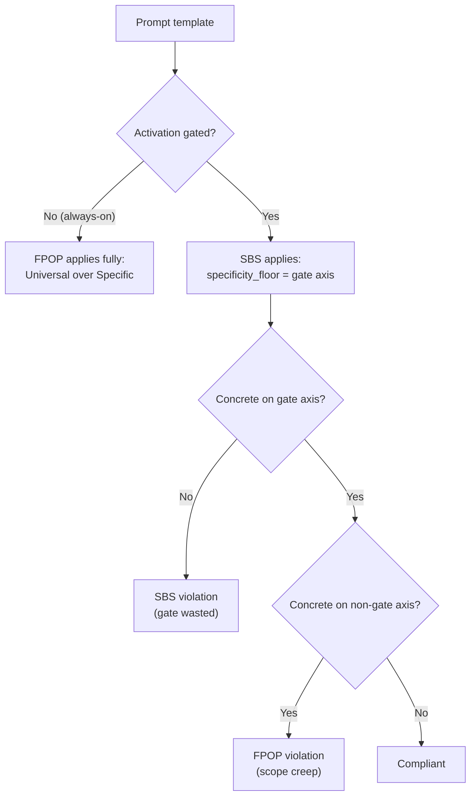

# Prompt System

## 개요

ANT의 프롬프트 시스템은 **선언적 설정(PromptBuildConfig) + 4-Tier 주입(Injection) 모델**로 설계된다. 템플릿은 Handlebars 기반이며, 용도에 따라 `PromptBuilder.build()` 파이프라인 또는 `promptBuilder.render()` 직접 호출로 최종 프롬프트가 조립된다.

## 대원칙: 프롬프트 하드코딩 금지

모든 LLM 프롬프트 텍스트는 `.md` 템플릿 파일에 작성한다. TypeScript 코드에 시스템 프롬프트를 문자열 상수(`const SYSTEM_PROMPT = ...`)나 템플릿 리터럴로 하드코딩하지 않는다.

코드에서 허용되는 것:
- 동적 데이터 조립 (conversation slice, state 값 추출 등)
- `promptBuilder.render()` 또는 `promptBuilder.build()` 호출과 변수 전달
- LLM 응답 파싱 로직

코드에서 금지되는 것:
- 시스템/사용자 프롬프트 텍스트를 TS 상수로 정의
- 프롬프트 규칙이나 역할을 코드 내 문자열로 기술

이유: 프롬프트 수정 시 코드 변경/빌드 없이 템플릿만 수정 가능, FPOP 검증 용이, 프롬프트 로깅/테스트 일관성.

## WHAT/HOW 분리

| 접두사 | 역할 | 내용 |
|--------|------|------|
| `base-*.md` | WHAT | 컨텍스트, 데이터, 현재 상태, 태스크 정의 |
| `rules-*.md` | HOW | 규칙, 형식, 제약, 방법 |

### 규약

- `base-*.md`에는 규칙/제약/금지 표현을 넣지 않는다
- `rules-*.md`에는 동적 데이터/컨텍스트 주입을 넣지 않는다
- 모든 프롬프트는 영문으로 작성한다
- 프로젝트 특정 예시를 넣지 않는다 (플랫폼/언어 중립)

## 템플릿 디렉토리 구조

```
core/prompt/templates/
    code/
        phases/
            decompose/      (base.md, rules.md)
            detect/         (base.md, rules.md)
            enforce/        (rules-enforcement.md)
            execute/        (base.md, rules.md, tasks/*, languages/*)
            plan/           (base.md, rules.md, tasks/*)
            revise/         (base.md, rules.md)
        base/
            system.md
            examples.md
            injections/     (git-diff, retrieved-code, preview-setup 등)
            tools/          (도구별 파셜)
    design/
        phases/
            decompose/      (base.md, rules.md, 변형별 base-*.md)
            detect/         (base.md, rules.md)
            execute/        (base-*.md, rules-*.md, injections/*)
        base/
            system.md
            injections/     (document-language, frontend-guide, backend-guide 등)
    common/
        injections/         (directive, memory, action-context, refactor-guidance 등)
        compaction/         (압축 관련 파셜)
    agents/
        architect/          (base.md, rules.md)
        creator/            (base.md, rules.md)
    visual/
        nodes/
            direct/         (base.md, rules.md, context.md)
            engrave/        (base.md, rules.md)
        injections/         (asset-logo.md, asset-icon.md, asset-hero.md)
    planner/
        plan/               (base.md, rules.md)
    basis/
        techTier/
            language/       (typescript.md, go.md)
            framework/      (react.md, nextjs.md, react-native.md, gin.md)
        visualTier/
            design-system/  (.gitkeep)
    triage/                 (base.md, rules.md)
    ask/                    (base.md, rules.md)
    learn/                  (system.md)
```

## 프롬프트 조립 경로

프롬프트 조립에는 두 가지 경로가 존재한다. 두 경로 모두 동일한 인프라(`initPartials`, `FilePromptAdapter`, Handlebars)를 사용한다.

| 경로 | 사용처 | 설명 |
|------|--------|------|
| A: `PromptBuilder.build(config)` | code execute, design system-design | 4-tier injection + 프로필 + 가드레일 포함 전체 파이프라인 |
| B: `promptBuilder.render(template, vars)` | decompose, detect, plan, revise, ui-design, spec, visual, ask, triage | 직접 템플릿 렌더링. 템플릿 내부 `{{> partial}}` 조립 |

경로 B는 injection 해석이 불필요하거나 대화형 노드처럼 파이프라인이 과한 경우에 적합하다.

## PromptBuilder 아키텍처 (경로 A)

`PromptBuilder`는 `PromptBuildConfig`를 받아 4단계로 프롬프트를 조립한다.

### PromptBuildConfig (선언적 설정)

호출자는 WHAT을 선언하고, PromptBuilder가 HOW를 결정한다:

```
PromptBuildConfig
├── templates: { base, rules?, system? }     ← 렌더할 템플릿 경로
├── intent?: IntentId                         ← Tier I 정책 결정
├── artifactPolicies?: PolicyKey[]            ← Tier N 사전 계산 결과
├── techContext?                              ← Tier A+D 입력 신호
│   ├── techTier / techTiers                  ← 기술 스택 (decompose에서 도출)
│   ├── taskType                              ← feature/setup/verification/error/test-code/doc
│   ├── mode                                  ← generate/refactor/explain
│   └── resolvedAction                        ← RAC 객체
├── pipeline                                  ← 기능 플래그
│   ├── sanitizeInput                         ← 사용자 입력 경계 태그
│   ├── includeTechProfile                    ← 언어/프레임워크 프로필
│   ├── includeExamples                       ← 예시 섹션
│   ├── applyPolicyGuardrails                 ← 가드레일 + 품질 정책
│   └── strictValidation                      ← strict mode
├── vars: Record<string, unknown>             ← Handlebars 변수
└── artifacts?: ResolvedArtifact[]            ← 역할 라벨 아티팩트
```

### Build 4단계

| 단계 | 설명 |
|------|------|
| 1. Injection Resolution | 4-tier 모델로 주입 템플릿 목록 결정 (아래 상세) |
| 2. Variable Preparation | artifacts → documents/hasDocuments, resolvedAction 동기화, 선택적 sanitize |
| 3. Section Rendering | system → profiles → rules → injections → examples → base(user) 순서로 렌더 |
| 4. Assembly | 섹션 병합 + 가드레일/품질정책 래핑 → system/user 문자열 + 분리 sections 반환 |

### PromptBuildResult

```
PromptBuildResult
├── system: string                ← 전체 시스템 프롬프트 (병합)
├── user: string                  ← 사용자 프롬프트 (base 템플릿)
├── sections                      ← 캐시 블록 분리용 (Anthropic prompt caching 등)
│   ├── systemBase                ← 시스템 템플릿 (변경 빈도 낮음)
│   ├── rules                     ← 규칙 템플릿
│   ├── injections                ← 주입 병합 텍스트
│   ├── profiles                  ← 기술 프로필
│   ├── examples                  ← 예시
│   └── failedTemplates           ← 렌더 실패 진단
├── injections: string[]          ← 적용된 injection 경로 목록
└── buildTimeMs: number           ← 빌드 소요 시간
```

## 4-Tier Injection 모델

PromptBuilder는 4개의 독립 Tier에서 injection 템플릿을 수집하고 중복 제거한다.

```
Tier I (Intent)        → prompt-policy-matrix[intent].policies
Tier A (Auto-tech)     → AutoInjectionResolver (techTier, taskType, mode, phase, job)
Tier D (Data-presence) → AutoInjectionResolver (vars에서 추출한 데이터 플래그)
Tier N (Artifact-cond) → deriveArtifactPolicies() (config-matrix 슬롯 × 실제 아티팩트)
```

### Tier I: Intent 정책

`@ant/shared`의 `prompt-policy-matrix.ts`가 `IntentId → IntentPromptPolicy` 매핑을 정의한다.

| 필드 | 설명 |
|------|------|
| `policies: PolicyKey[]` | 해당 intent에 무조건 적용되는 정적 정책 |
| `conditionalPolicies` | 아티팩트 존재 시에만 적용 (Tier N에서 처리) |
| `refMediaHints` | ref 아티팩트의 미디어 타입 힌트 (text, image) |

`POLICY_TEMPLATE_MAP`이 `PolicyKey → 템플릿 경로`를 매핑한다:

| PolicyKey | 템플릿 경로 |
|-----------|-------------|
| `ui-design-policy` | `common/injections/ui-design-policy` |
| `visual-source-authority` | `common/injections/visual-source-authority` |
| `frontend-guide` | `design/base/injections/frontend-guide` |
| `backend-guide` | `design/base/injections/backend-guide` |
| `api-contract-guide` | `design/base/injections/api-contract-guide` |

예: `gen-sys-full` intent → `['frontend-guide', 'backend-guide', 'api-contract-guide']` 정적 주입.

### Tier A: Auto-tech (정적 기술/워크플로우 컨텍스트)

`AutoInjectionResolver`가 `techTier`, `taskType`, `mode`, `job`, `phase`를 기반으로 결정:

| 조건 | 주입 |
|------|------|
| frontend 스택 + feature/setup/error 타입 | `visual-source-authority` |
| setup 타입 + 언어 감지 | `languages/{lang}/setup/constraints` |
| execute phase + code job + 환경 | `languages/{lang}/environments/{env}/rules` |
| frontend + execute | `preview-setup` |
| code job + execute | `tool-calling-rules-compact`, `preview-env-contract`, `port-management` |
| backend 스택 | `backend-safety` |
| test-code + 언어 | `languages/{lang}/test-code/hints` |
| design job + execute | `document-language` |

### Tier D: Data-presence (데이터 존재 플래그)

`PromptBuilder.extractDataSignals()`가 `vars`에서 플래그를 추출하고, `AutoInjectionResolver`가 처리:

| 플래그 | 주입 |
|--------|------|
| `hasDirective` | `common/injections/directive` |
| `hasMemory` | `common/injections/memory` |
| `hasGitDiff` | `code/base/injections/git-diff` |
| `hasRetrievedCode` | `code/base/injections/retrieved-code` |
| `hasReferenceCode` | `code/base/injections/reference-code` |
| `hasRetryContext` | `code/phases/execute/injections/retry-context` |
| `hasLessons` | `code/phases/execute/injections/lessons` |
| `hasSessionContext` | `code/phases/execute/injections/session-context` |
| `hasMissingDependency` | `code/phases/execute/injections/missing-dependency-fix` |
| `hasRuntimeError` | `code/phases/execute/injections/runtime-error-fix` |

RAC 기반 주입도 Tier D에 포함:

| 조건 | 주입 |
|------|------|
| `resolvedAction` 존재 | `common/injections/action-context` |
| `resolvedAction.mode === 'refactor'` | `common/injections/refactor-guidance` |
| `resolvedAction.mode === 'explain'` | `common/injections/explain-guidance` |

### Tier N: Artifact-conditional 정책

`ArtifactRoleResolver.deriveArtifactPolicies(intent, artifacts)`가 담당:

1. `prompt-policy-matrix`에서 해당 intent의 `conditionalPolicies` 조회
2. `action-config-matrix`의 슬롯과 교차 — `slotPath`에 매칭되는 슬롯이 있고, 해당 경로로 시작하는 아티팩트가 실제로 존재하면 정책 적용

예: `gen-code-sys` intent + `outputs/design/ui/ant` 경로에 UI 설계 문서가 있으면 → `ui-design-policy` 주입. 세 UiSource 별 해석 규약은 `ui-source-dispatch` 를 통해 `ui-source-{ant,figma,handoff}.md` 중 하나로 라우팅된다.

## ArtifactRoleResolver

아티팩트의 `role`은 upstream에서 결정된다 (FE 슬롯 배치 또는 `loadResolvedArtifacts`). ArtifactRoleResolver는 역할을 재도출하지 않으며, Tier N 조건부 정책 도출만 담당한다.

| 함수 | 입력 | 출력 | 용도 |
|------|------|------|------|
| `deriveArtifactPolicies(intent, artifacts)` | IntentId + 아티팩트 배열 | `PolicyKey[]` | Tier N 조건부 정책 도출 |

## Injection Manifest

`injection-manifest.json`이 injection 템플릿과 기대 변수의 계약을 선언한다:

```json
{
  "common/injections": {
    "directive": ["directive"],
    "action-context": ["resolvedAction"]
  },
  "code/base/injections": {
    "git-diff": ["gitDiff"],
    "retrieved-code": ["files", "filePaths", "stats"]
  }
}
```

빈 배열(`[]`)은 변수 없이 렌더 가능한 정책 템플릿을 의미한다. 스모크 테스트가 이 manifest를 기반으로 모든 injection 파일의 존재를 검증한다.

## Policy Guardrails

`PromptBuilder`는 `pipeline.applyPolicyGuardrails`가 true일 때 `ruleset.json` 기반으로 가드레일과 품질 정책을 시스템 프롬프트에 래핑한다:

- **Guardrail section** (`<guardrails>...</guardrails>`): job별 사전 검증 규칙 → 시스템 **앞**에 삽입
- **Quality policy section** (`<quality_policies>...</quality_policies>`): 포맷/금지/품질 규칙 → 시스템 **뒤**에 삽입

strict mode가 활성화되면 추가 엄격 규칙이 삽입된다.

## InputSanitizer

`pipeline.sanitizeInput`가 true일 때 사용자 제공 콘텐츠에 경계 태그를 래핑하여 프롬프트 인젝션을 방지한다:

- `directive` 필드 → `<user_provided_content type="directive">...</user_provided_content>`
- `documents` 배열의 각 `content` → `<user_provided_content type="{label|path}">...</user_provided_content>`

## Basis Section (Tech/Visual Profile)

`pipeline.includeBasis`가 true이고 `config.basis`가 있을 때, `PromptBuilder.buildBasisSection()`이 basis 템플릿을 조립한다.

**템플릿 4축 구조**:

```
templates/basis/
    techTier/
        language/       (typescript.md, go.md)
        framework/      (react.md, nextjs.md, react-native.md, gin.md)
    visualTier/
        design-system/  (.gitkeep — 향후 확장)
```

각 축의 템플릿 존재 여부에 따라 `<basis axis="...">` 섹션이 조건부로 주입된다. 파일 미발견 시 catch로 skip.

`basis.techTier`는 **decompose 노드에서 도출**되거나, UI에서 explicit preset으로 사전 설정된다. decompose를 경유하지 않는 job(plan, ask, visual)은 techTier가 없으므로 주입되지 않는다.

## Hints 계층 (Blind-Spot 환기)

`basis/techTier/{language,framework}/<X>.md` 자리는 **모델 pre-training이 커버하지 않는 선제 환기** 용도이다. 주입 경로는 `AutoInjectionResolver`의 단일 헬퍼 `resolveTechTierInjections(job, tiers, taskType)`로 한정한다.

### 자리 목적

| 구분 | 원칙 |
|------|------|
| 용도 | pre-training 갭 환기 (blind-spot reminder) |
| 금지 | API 레퍼런스·튜토리얼·일반 best practice 등재 |
| 파일명 | 허용 집합 고정. 집합 외 값은 주입 skip — fallback 금지 |
| 토큰 예산 | 파일당 ≤ 400 토큰, 섹션당 항목 ≤ 4 |
| 형식 | SBS + FPOP — gate(framework / language) 축의 specifics(버전·API·툴체인 이름)는 의무, gate 무관한 프로젝트 코드 나열은 금지. Hints 계층은 SBS의 canonical 적용 사례 — `framework=X` gate 가 닫혔을 때 `<X>.md` 의 모든 문장이 잉여여야 정상 |
| 증거 의무 | 항목 추가/변경 PR은 실증 job의 chat/log JSON 경로를 커밋 메시지에 기재 |
| 유지보수 | 메이저 릴리즈 시에만 업데이트 |

### 허용 파일명

| Job | language | framework |
|-----|----------|-----------|
| `code` | `typescript-node`, `typescript-browser`, `go` | `nextjs`, `react`, `react-native`, `nestjs`, `gin` |
| `design` | (미정 — 구조만 준비) | `nextjs`, `go` |

### Partial 컨벤션 (`_` prefix = partial-only)

동일 룰을 여러 framework에 재사용해야 할 때는 **Handlebars partial**로 분해한다. `_<name>.md` 접두어가 붙은 파일은 **partial-only** — 절대 직접 주입 대상이 되지 않으며, 다른 framework/language 파일이 `{{> ...}}` 로 포함한다.

`framework/` 디렉토리 현황:

| 파일 | 역할 | 포함 관계 |
|------|------|-----------|
| `_react-core.md` | React 코어 (hooks, 타입, 생명주기, React 19 관련) | `react.md`, `nextjs.md`가 partial로 포함 |
| `_react-csr.md` | CSR 전용 (Vite SVGR, Vite SWC/Babel) | `react.md`만 partial로 포함 |
| `react.md` | framework='react' 직접 주입 target | `{{> _react-core}} + {{> _react-csr}}` |
| `nextjs.md` | framework='nextjs' 직접 주입 target, Next.js 전용(SSR/RSC/Image/Next 빌드) 본문 | `{{> _react-core}}` + 본문 (CSR 미포함) |

Next.js는 React를 반드시 쓰지만 SSR 컨텍스트라 CSR 전용 룰(번들러·JSX runtime)을 받아서는 안 된다. 이 때문에 React 코어와 CSR을 별도 partial로 쪼개고, `nextjs.md`는 코어 partial만 품는다.

`basis/techTier/language/_typescript-common.md` 가 동일 컨벤션의 선례(TS의 언어 공통 서문 + Go는 자체 파일). 언어 축에서는 stack(frontend/backend) 분기가 파일 이름 기반이므로 partial이 필요 없지만, framework 축은 `react`가 여러 런타임(브라우저 CSR·Next.js SSR·RN)에서 재사용되므로 partial 분해가 유효.

### Partial 렌더링 메커니즘

basis 섹션은 `PromptBuilder.buildBasisSection` → `pushBasisTemplate` → `promptPort.render(path, {})` 경로로 조립된다. `render` 는 Handlebars 컴파일러를 거치므로 `{{> name}}` 파싱/확장이 동작한다. 빈 변수 맵(`{}`)을 넘겨도 basis 파일은 `{{variable}}` 바인딩이 없는 정적 markdown이라 missing-var 경고가 나지 않는다.

토큰 예산 측정도 partial 확장 후 합쳐진 텍스트 기준 — `tests/techtier-hint-budget.test.ts` 가 `expandPartials()`로 재귀 치환한 뒤 ≤ 600 토큰을 검증한다.

### Code Job 허용 섹션 (순서·헤더 고정)

| # | 섹션 | 의미 |
|---|------|------|
| 1 | `## Forbidden Patterns` | 컴파일 통과해도 런타임/하이드레이션 실패하는 패턴 |
| 2 | `## Symptom → Upstream Cues` | N ≥ 5 파일 반복 증상은 상위 설정 신호 — 국소 패치 금지 |
| 3 | `## Version Notes` | 직전 메이저 API 이관 2–3개 |
| 4 | `## Toolchain Compatibility` | 런타임·러너·빌더 메이저 호환성 2–3개 |

각 섹션은 선택적이며 미등재 섹션은 헤더도 넣지 않는다. 허용 섹션 외 헤더 등장은 린터로 차단한다.

### 주입 조건 (SSOT: `AutoInjectionResolver.resolveTechTierInjections`)

| Job | 조건 | 주입 |
|-----|------|------|
| `code` | `taskType ∈ {verification, error, ui, feature, setup}` | framework + language 동시 |
| `code` | `taskType ∈ {test-code, doc}` | skip — 프레임워크 blind-spot은 테스트 스캐폴딩/문서 작성과 무관 |
| `design` | framework/language 판별 가능 | framework + language 동시 |

Blind-spot hints는 **사전 예방** 지식(Forbidden Patterns / Version Notes)이 본체이므로 작성 시점(feature/setup)에도 주입되어야 문제 발생 자체를 막는다. verification/error는 진단 시점의 보조 활용이다. `setup/config`와는 중복이 아니라 보완 관계(규약 vs 블라인드스팟)이다.

**경로 규칙**:

```
jobs/{job}/basis/techTier/language/{typescript-node|typescript-browser|go}
jobs/{job}/basis/techTier/framework/{allowed-framework-name}
```

미지 언어/프레임워크는 주입 **skip**(반드시 fallback 금지 — 잘못된 경로 주입 위험).

### Design Job 섹션 스펙

Design job은 이번 단계에서 **구조·배선만** 표준화되며, 섹션 스펙·허용 파일 집합은 후속 작업에서 확정한다. 배선은 code job과 동일하게 `resolveTechTierInjections(job='design', tiers, taskType)` 경유.

### 비 FPOP 금지 목록

- ❌ "How do I use X?" 같은 튜토리얼 문체
- ❌ 구체 import 예시 (권장/금지 어느 쪽이든)
- ❌ 스니펫 나열 (관찰 원칙은 설명문으로)
- ❌ "You MUST..." 반복 훈계 — FPOP는 제약을 중립적으로 명시

### 비 SBS 금지 목록

- ❌ `basis/techTier/framework/<X>.md` 가 X의 이름·버전·툴체인을 한 번도 명시하지 않음 — gate 의 정보 payload 가 0이 되어 주입할 가치가 사라짐
- ❌ `common/injections/refactor-guidance.md` 같은 mode-gated 파일이 mode 와 무관한 일반 best practice 만 늘어놓음
- ❌ Intent/taskType 변종 파일이 같은 phase 의 default 파일과 구분되는 변종-specific 가이드를 안 담음 — 변종이 SBS-empty
- ❌ Always-on 위치(agents/system, jobs/{job}/base/system)에 framework/library/version 이름이 등장 — SBS 가 FPOP를 약화시키지 않으므로 여전히 위반
- ❌ 한 파일에 여러 gate 축의 specifics 가 섞임 (e.g. `nextjs.md` 안에 generic React 룰을 박아넣음 → `_react-core.md` partial 로 분리해야 함)

### PR 체크리스트

Hints 계층 파일(`jobs/code/basis/techTier/**.md`, `jobs/design/basis/techTier/**.md`)을 추가·수정하는 PR은 아래 항목을 만족해야 한다:

- [ ] 변경 사유가 되는 **실증 chat/log 경로**가 커밋 메시지에 기재되어 있는가?
- [ ] 추가된 항목이 현 모델이 **이미 알고 있는 일반 지식**이 아닌, **pre-training 갭 / blind-spot**인가?
- [ ] 파일당 토큰 예산(≤ 400)을 충족하는가? (`tests/techtier-hint-budget.test.ts` 통과)
- [ ] 허용 섹션 4개 (`Forbidden Patterns` / `Symptom → Upstream Cues` / `Version Notes` / `Toolchain Compatibility`)만 사용했는가?
- [ ] 파일명이 허용 집합에 속하는가? (집합 외 이름은 주입 skip됨 — fallback 없음)
- [ ] partial-only 파일은 `_` prefix를 따랐는가? 직접 주입 framework 이름과 충돌하지 않는가?
- [ ] partial 포함 관계가 MECE한가? — 같은 룰이 두 파일에 중복 등장하지 않고(M), framework별 합쳐진 결과에 누락이 없는가(E)
- [ ] AutoInjectionResolver 외 경로에서 같은 파일을 중복 주입하고 있지 않은가?

## 템플릿 렌더링

Handlebars를 사용하며, 조건부 섹션(`{{#if}}`)과 반복(`{{#each}}`)을 지원한다. 삼중 중괄호(`{{{...}}}`)로 HTML 이스케이프 없이 raw 출력한다.

### 주입 데이터 예시

| 변수 | 출처 |
|------|------|
| `directive` | 사용자 입력 또는 overrideDirective |
| `resolvedAction` | detect 노드 — RAC 객체 (intent, mode, target, refs, context, artifacts) |
| `taskDescription` | decompose에서 생성된 태스크 설명 |
| `previousChaptersSummary` | 이전 챕터 요약 (Design Job) |
| `projectCodeContext` | plan 노드의 로컬 RAG 결과 (task 진입 1회) — plan 템플릿 전용, state 에 저장되지 않음 |

## FPOP 원칙

프롬프트 작성 시 FPOP (First-Principles Observation Prompting)을 따른다.

| 원칙 | 의미 |
|------|------|
| Principles over Examples | 보편적 규칙 사용, 구체적 사례 배제 |
| What over How | 대상 명시, 방법 생략 (LLM이 이미 알고 있음) |
| Observable over Assumed | 관찰 요구, 추론 금지 |
| Universal over Specific | 플랫폼/언어 중립 |
| Constraints over Instructions | 금지 사항으로 범위 한정 |
| Reminders for Blind Spots | 자주 누락되는 항목만 상기 |

## SBS 원칙 (Scope-Bound Specificity)

**프롬프트 조각의 요구되는 추상화 레벨은 그것의 활성화 범위(activation scope)에 의해 묶인다.** FPOP 의 "Universal over Specific" 은 무조건 주입되는(always-on) 콘텐츠에만 적용되며, gate 로 조건부 주입되는 콘텐츠는 그 gate 의 discriminator 축을 따라 구체적이어야 한다 — gate 보다 더 추상화하면 gate 의 정보 payload 가 0 이 된다.

SBS 는 FPOP, MECE 와 더불어 프롬프트 작성의 세 번째 정책이다. FPOP 만으로는 `basis/techTier/framework/nextjs.md` 가 "Next.js" 를 명시하는 것이 위반인지 아닌지 판정할 수 없는 회색지대가 발생하는데, SBS 가 그 회색지대를 닫는다.

### Specificity floor 공식

```
specificity_floor(template) = activation_scope(template)
```

| 결과 | 진단 |
|------|------|
| gate 보다 더 추상 | **SBS 위반** — gate 의 정보 payload 가 0 |
| gate 와 무관한 다른 축에서 더 구체 | **FPOP 위반** — scope creep ("Universal over Specific" 가 작동) |
| gate 와 같은 축에서만 구체 | **준수** |

### Gate 축 6 종

SBS 가 적용되는 gate 종류 (broad scope — 다음 중 하나라도 활성화 조건에 들어가면 SBS 가 의무화된다).

| 축 | 예시 |
|----|------|
| **techTier** | `framework=nextjs`, `language=typescript-browser`, `version=react@19`, runtime |
| **intent** | `gen-code-sys`, `rev-code`, `gen-code-spec`, `gen-ui-figma`, … |
| **taskType** | `verification`, `error`, `ui`, `feature`, `setup`, `test-code`, `doc` |
| **mode** | `generate` / `refactor` / `explain` |
| **role** | `ref` / `context` / `target` (3-axis Authority) |
| **artifact-presence** | `hasUi` / `hasSpec` / `hasSystemDesign` / `hasSources`, `uiSource` discriminator |

### 활성화-범위 사다리

| 활성화 위치 | gate | specificity floor |
|-------------|------|-------------------|
| `agents/{agent}/system.md` | always-on | Universal — FPOP 만 |
| `jobs/{job}/base/system.md` | job axis | job 축만 구체 |
| `basis/techTier/framework/<X>.md` | `framework=X` | X 의 versions / APIs / toolchain — 의무 |
| `basis/techTier/language/<X>.md` | `language=X` (+ stack) | X+stack specifics — 의무 |
| `nodes/{phase}/variants/<V>/*.md` | intent / taskType / mode 변종 | V specifics — 의무 |
| `common/injections/refactor-guidance.md` | `mode=refactor` | refactor-mode specifics — 의무 |
| `common/injections/ui-source-{ant,figma,handoff}.md` | `uiSource=X` | source-X 해석 규약 — 의무 |

### FPOP 와의 관계



모든 paragraph 는 두 검사를 통과해야 한다:

1. **SBS 검사** — 이 문장이 파일의 활성화 gate 축을 따라 구체적인가? 아니면 덜 gated 된 위치로 올리거나, gate 의 discriminator 이름을 반영하도록 다시 쓴다.
2. **FPOP 검사** — 이 문장이 파일의 gate 가 아닌 다른 축에서 구체적인가? 그렇다면 scope creep 이므로 들어내거나 옮긴다.

준수 paragraph: gate 축 정확히 따라 구체, 다른 모든 축에선 일반.

### Hints 계층은 SBS 의 canonical 사례

`basis/techTier/{language,framework}/<X>.md` 자리는 정의상 `techTier=X` gate 로만 활성화된다. SBS 는 이 자리에 X의 versions / APIs / toolchain 을 **의무화**하며, FPOP "Universal over Specific" 인용으로 그 의무를 무력화하는 PR 코멘트는 SBS 위반이다. 자세한 형식·금지 목록은 [Hints 계층](#hints-계층-blind-spot-환기) 절 참고.

## 리소스 경로 해석

`WorkspacePathResolver.getCliRoot()`가 모든 내부 리소스(템플릿, 정책, 프로필 등)의 루트 경로를 결정한다.

| 실행 컨텍스트 | getCliRoot() 반환값 | 예시 |
|---------------|---------------------|------|
| dev 모드 (`tsx src/...`) | `src/` | `src/core/prompt/templates/` |
| prod 모드 (`node dist/...`) | `dist/` | `dist/core/prompt/templates/` |
| 자식 프로세스 (job-runner) | `ANT_CLI_ROOT` 환경변수 | JobWorker가 설정 |

이 경로에 의존하는 파생 메서드:
- `getPromptTemplatesPath()` → `{root}/core/prompt/templates`
- `getPoliciesPath()` → `{root}/core/policies/prompts`
- `getProfilesPath()` → `{root}/periphery/profiles`
- `getDocsRoot()` → `{root}/../../../docs`

## FilePromptAdapter

`periphery/adapters/prompt/FilePromptAdapter.ts`가 파일시스템에서 템플릿을 로드한다. 빌드 시 esbuild가 `templates/` 디렉토리를 dist에 복사한다.

### initPartials()

서버 시작 시 `initPartials()`를 await하여 모든 Handlebars partial을 자동 탐색/등록한다. `templates/` 하위의 모든 `.md` 파일을 재귀 탐색하여 partial로 등록하므로, 템플릿 추가/삭제/이름변경 시 코드 수정이 필요 없다.

## 빌드/테스트 파이프라인

```
pnpm test:cli     → vitest run (인프라 불필요, ~0.3초)
pnpm build        → prebuild(=test) → esbuild → cp templates to dist/
```

| 스크립트 | 위치 | 설명 |
|----------|------|------|
| `test` | ant-cli | vitest run (스모크 + RAC 감사 + injection 검증) |
| `prebuild` | ant-cli | build 전 자동 실행 (= test) |
| `test:cli` | root | `pnpm --filter @ant/cli test` |

테스트가 실패하면 빌드가 중단된다.

## 안전 메커니즘

- **Fail-fast**: critical 템플릿(base/rules) 실패 시 에러 로그 + failedTemplates에 기록
- **Contract logging**: PromptLogger가 `contractViolations` 필드로 누락 변수 기록
- **Injection manifest**: `injection-manifest.json`이 injection 템플릿 → 변수 매핑을 선언
- **Input sanitization**: 사용자 콘텐츠 경계 태그 래핑 (프롬프트 인젝션 방지)
- **테스트 게이트**: 스모크 + RAC 감사 + injection 검증 (CI에서 자동 실행)

자세한 내용은 [docs/testing/prompt-test-spec.md](../testing/prompt-test-spec.md) 참고.

## 소스 파일 맵

| 파일 | 역할 |
|------|------|
| `core/prompt/builder/PromptBuilder.ts` | 4-tier injection + 렌더 + 조립 메인 클래스 |
| `core/prompt/builder/PromptBuildConfig.ts` | 선언적 설정 + 결과 타입 |
| `core/prompt/builder/AutoInjectionResolver.ts` | Tier A + D injection 해석 |
| `core/prompt/builder/ArtifactRoleResolver.ts` | Tier N 조건부 정책 도출 |
| `core/prompt/builder/InputSanitizer.ts` | 경계 태그 + 키워드 중복 |
| `core/prompt/builder/policyRules.ts` | guardrail + quality policy 로드/포맷 |
| `core/prompt/injection-manifest.json` | injection 템플릿 → 변수 계약 |
| `periphery/adapters/prompt/FilePromptAdapter.ts` | Handlebars 렌더러 + partial 등록 |
| `@ant/shared: prompt-policy-matrix.ts` | IntentId → 정책 매핑 (Tier I + N) |
| `@ant/shared: action-config-matrix.ts` | IntentId → 슬롯 정의 (refs/context/target) |
| `@ant/shared: rac.ts` | ResolvedActionContext 타입 + resolveToRAC() |

## 경계

- 각 에이전트의 프롬프트 사용: [14-code-job.md](14-code-job.md), [15-design-job.md](15-design-job.md), [16-planner-job.md](16-planner-job.md), [18-visual-job.md](18-visual-job.md)
- Preview 관련 프롬프트: [22-preview-system.md](22-preview-system.md)
