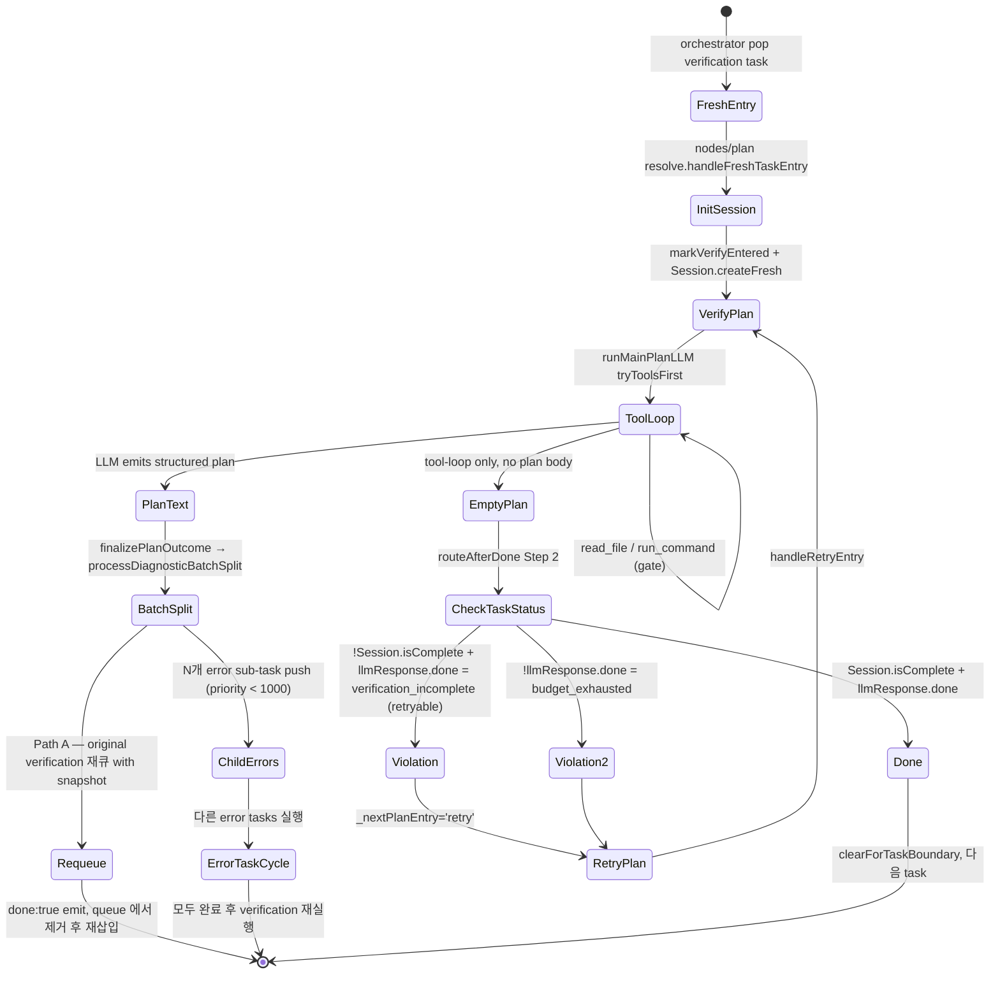

# Code Verification Task — Contract

> **상태**: Code job 의 verification 책임을 declarative 하게 선언하는 SSOT. 코드 현황과 다르면 코드를 따른다(코드가 진실); 단, 본 문서가 선언한 **의도된 책임/불변식/안티패턴**은 리팩토링/버그 fix 시 지침으로 강제된다.
> **1순위 독자**: AI 에이전트 (verification 관련 작업 시 컨텍스트 주입용).
> **관련 진행 중 작업**: `/Users/probe/.cursor/plans/plan-verify_boundary_rca_477232b7.plan.md` (현재 결함 1~6 의 RCA + cleanup 진행 중).

---

## 0. 한 줄 정의

**Verification Task = "코드가 정의된 gate (typecheck / build / test) 를 모두 통과했음을 결정론적으로 확정하고, 실패 시 fix 책임을 다른 task 로 fan-out 하는 책임자"**.

가장 짧은 invariant:

> **Task 완료 ⟺ `Session.isComplete() === true`** (Session 의 모든 required gate 가 passed). 다른 어떤 신호 (`<done>` emit, 빈 planText, file 변경 부재) 도 단독으로 완료를 의미하지 않는다.

---

## 1. 적용 범위 + 책임자 식별

### 1.1 두 종류의 책임자

| 종류 | 식별 | 활성 시점 | 비고 |
|---|---|---|---|
| **Tier 3/4 dedicated verification task** | `isVerificationTask(task)` (priority 1000, type `'verification'`) | task fresh entry 시 즉시 verify-mode | 큐의 마지막 (Final Verification) |
| **Tier 2 self-verify task** | `task.selfVerifyOnDone === true` (decompose 시 set; type 은 error/feature/ui/setup) | apply phase `<done>` emit 시점 (executeRouter.routeAfterDone === 'plan' 분기) | 단일 task 안에서 apply→verify two-cycle |

### 1.2 통합 predicate (SSOT)

```ts
// tasks/_shared/verify/predicate.ts
export function requiresVerification(task): boolean {
  if (!task) return false;
  if (isVerificationTask(task)) return true;
  return task.selfVerifyOnDone === true;
}
```

**phase 노드/router/composeBundle 은 task type 을 직접 참조하지 않고 이 predicate 만 사용.** R1 (Task Type Blind Phases — `.cursorrules` 참조) 의 자연스러운 확장.

### 1.3 phase mode 채널

| 채널 | writer (single) | 의미 |
|---|---|---|
| `state._verifyEntered: boolean` | [`tasks/_shared/verify/markVerifyEntered.ts`](../../packages/ant-cli/src/agents/architect/graph/code/tasks/_shared/verify/markVerifyEntered.ts) | task 가 verify-mode 로 진입했는가 |
| `state.verification: VerificationSession \| undefined` | [`tasks/_shared/verify/initSession.ts`](../../packages/ant-cli/src/agents/architect/graph/code/tasks/_shared/verify/initSession.ts) + Session 메서드 | verify cycle 의 결정론적 상태 |

두 채널의 set 시점:
- **Tier 3/4 verification task**: `_shared/verify/initSession` 첫 호출 시 둘 다 자동 set (fresh entry).
- **Tier 2 self-verify**: `executeRouter` `<done>` 분기에서 `routeAfterDone === 'plan'` 결정 직후 `markVerifyEntered(state)` 호출 → 다음 plan entry 의 `initSession` 이 Session 생성.

---

## 2. 책임 매트릭스 (12개)

각 책임의 **단일 SSOT 위치** + **위반 시 결과**.

| # | 책임 | SSOT | 위반 시 |
|---|---|---|---|
| 1 | **검증 행위 수행** — dependency 설치 (필요 시), typecheck (지원 언어), build, test 를 LLM 이 `run_command` tool 로 실제 실행 | LLM (plan/execute tool-loop) + [`commandGuard`](../../packages/ant-cli/src/agents/architect/graph/code/tasks/_shared/verify/commandGuard.ts) 정책 | 실행 안 한 채 done emit 시 false-pass 가능 |
| 2 | **gate 통과 결정론적 기록** — exit 0 + `verifies` 선언 일치 시 `Session._passed` 에 추가 | [`Session.onCommand`](../../packages/ant-cli/src/agents/architect/graph/code/tasks/_shared/verify/Session.ts) via [`toolHook.onEvent`](../../packages/ant-cli/src/agents/architect/graph/code/tasks/_shared/verify/toolHook.ts) | `verifies` 누락/오선언 시 silent-pass |
| 3 | **root cause 진단** — 실패 시 plan tool-loop 가 build/test 출력 + 에러 파일 내용을 읽어 분리 | [`nodes/plan/`](../../packages/ant-cli/src/agents/architect/graph/code/nodes/plan/) verify-mode prompt + tool-loop | LLM 결정 (휴리스틱) |
| 4 | **solution 생성** — 진단 결과를 planText (구조화 JSON: `implementation.{modify,create,delete}`) 로 emit | LLM via verify-mode plan prompt ([`buildPlanPrompt`](../../packages/ant-cli/src/agents/architect/graph/code/tasks/_shared/verify/buildPlanPrompt.ts)) | LLM 결정 |
| 5 | **batch_split (always-fan-out)** — solution 의 각 target 을 per-target error sub-task 로 fan-out, 부모 verification 은 재큐 | [`tasks/_shared/batchSplit/process.ts::processDiagnosticBatchSplit`](../../packages/ant-cli/src/agents/architect/graph/code/tasks/_shared/batchSplit/process.ts) (Path A — verification parent) | n=0 implementation 시 plan 은 빈 plan + done → check 가 결정 |
| 6 | **부모 재큐 시 Session snapshot 보존** — `task.resumeState.verification = Session.snapshot()` 로 `_passed`/`_required`/`_attempts`/`_planHistoryHashes`/`_installNeeded`/`_batchSplitCount` 캐리오버 | [`Session.snapshot()`](../../packages/ant-cli/src/agents/architect/graph/code/tasks/_shared/verify/Session.ts) + [`orchestrator.restoreIntoWorkerState`](../../packages/ant-cli/src/agents/architect/graph/code/tasks/_shared/verify/orchestrator.ts) | snapshot 누락 시 재진입에서 진단 처음부터 재생성 (재탐색 루프) |
| 7 | **error subtask 완료 후 부모 자동 재실행** — orchestrator 큐에서 priority 1000 (verification) 가 다른 task 들 끝난 뒤 다시 실행됨 | [`TaskOrchestrator`](../../packages/ant-cli/src/agents/architect/graph/code/parallel/TaskOrchestrator.ts) priority queue | 큐 priority 위반 시 verification 이 먼저 실행되어 false-fail |
| 8 | **회귀 솔루션 차단** — 동일 plan 이 반복되면 `Session.isPlanRepeated` 가 detect, `checkRetryTermination` 이 `no_progress` terminal | [`Session.isPlanRepeated`](../../packages/ant-cli/src/agents/architect/graph/code/tasks/_shared/verify/Session.ts) + [`checkRetryTermination`](../../packages/ant-cli/src/agents/architect/graph/code/tasks/_shared/verify/checkRetryTermination.ts) | exact-hash 만 detect — 의미동치 (다른 file 인데 같은 효과 없는 fix) 미감지 |
| 9 | **install 추적 (4번째 implicit gate)** — `Session._installNeeded` 가 `package.json` 변경 후 install 필요 여부를 캐시 | [`nodes/plan/entry/installNeeded.ts::recomputeInstallNeeded`](../../packages/ant-cli/src/agents/architect/graph/code/nodes/plan/entry/installNeeded.ts) + [`Session.markInstallNeeded`](../../packages/ant-cli/src/agents/architect/graph/code/tasks/_shared/verify/Session.ts) | install 미실행 시 build gate 가 잘못된 환경에서 통과 |
| 10 | **`commandGuard` 4 정책 강제** — already-passed reject / 순서 (typecheck → build → test) / `verifies` 선언 신뢰 / inspect 우회 | [`commandGuard.guard`](../../packages/ant-cli/src/agents/architect/graph/code/tasks/_shared/verify/commandGuard.ts) | 정책 우회 시 gate 회귀/누락 |
| 11 | **terminal 종료 보장** — 5-층 카운터 중 어느 하나가 임계 도달 시 `VerificationTerminalError` throw → orchestrator permanent fail | [`Session._batchSplitCount` ≤ MAX_BATCH_SPLIT_CYCLES=10`](../../packages/ant-cli/src/agents/architect/graph/code/tasks/_shared/batchSplit/cycleLimit.ts), `_failedAttempts >= 2`, `state.recursionLimit`, `Session._attempts ≥ DEEP_DIAGNOSTIC_THRESHOLD`, Safety Net C `_finalTaskLoopCount` | 임계 누락 시 무한 루프 |
| 12 | **fix 책임 미보유** — verification task 자신은 fix 를 시도하지 않음. execute phase 가 사실상 호출되지 않음 (fan-out 후 즉시 `done:true`) | [`processDiagnosticBatchSplit`](../../packages/ant-cli/src/agents/architect/graph/code/tasks/_shared/batchSplit/process.ts) Path A | verification 이 직접 fix 시도 시 책임 양극화 위반 |

---

## 3. Lifecycle State Machine



---

## 4. 핵심 모델 — `VerificationSession`

[`tasks/_shared/verify/Session.ts`](../../packages/ant-cli/src/agents/architect/graph/code/tasks/_shared/verify/Session.ts)

### 4.1 필드 (6개) + 의미

| 필드 | type | 의미 | mutator | reader |
|---|---|---|---|---|
| `_required` | `Set<Gate>` | env probe 결과 (`isTs` / `hasTests`) 로 결정. 'build' 항상 포함 | `createFresh` / `hydrateEnv` | `isComplete`, `missing`, `required` |
| `_passed` | `Set<Gate>` | exit 0 + `verifies` 선언 일치 시 추가; `onFileChanged` 로 무효화 | `onCommand`, `onFileChanged` | `isComplete`, `passed` |
| `_attempts` | `number` | reverify cycle + batchSplit 횟수 누적 (monotonic) | `onPlanEntry('reverify')`, `onBatchSplit` | `attempts`, `inDeepMode` |
| `_planHistoryHashes` | `string[]` | applied plan 의 SHA-1 hash 누적 (body 미저장) | `onPlanApplied` | `isPlanRepeated` |
| `_installNeeded` | `boolean \| undefined` | dependency install 필요 여부 캐시 | `markInstallNeeded` | `installNeeded`, `dependencyStatus` |
| `_batchSplitCount` | `number` | 본 task 의 batch-split fan-out 누적 | `onBatchSplit` | `batchSplitCount` |

### 4.2 핵심 query

| query | 의미 |
|---|---|
| `isComplete()` | `_required ⊆ _passed` (모든 required gate 통과) |
| `missing()` | required - passed (canonical 순서) |
| `inDeepMode()` | `_attempts >= DEEP_DIAGNOSTIC_THRESHOLD` (default 2; 환경변수 `ANT_DEEP_DIAGNOSTIC_THRESHOLD`) |
| `isPlanRepeated(planText)` | trailing history 에 같은 hash 가 몇 번 연속 등장했는가 |

### 4.3 `_passed` invariant

- **invariant**: `_passed ⊆ _required`. 생성자에서 강제 (위반 시 silently intersect).
- **gate 통과 추적은 `_passed` 한 채널로만**. `_attempted` 같은 별도 set 은 의도적으로 두지 않음 — `verifies` 선언이 SSOT 이고 정책은 `commandGuard` 가 강제.

---

## 5. 핵심 정책 — `commandGuard`

[`tasks/_shared/verify/commandGuard.ts`](../../packages/ant-cli/src/agents/architect/graph/code/tasks/_shared/verify/commandGuard.ts)

### 5.1 4 정책

| # | 정책 | 조건 | 동작 |
|---|---|---|---|
| 1 | **inspect 우회** | `isDiagnosticInspectCommand(command)` 매치 | 무조건 통과 (cat/ls/pnpm why/tsc --version 등) |
| 2 | **non-gate 통과** | `verifies` 미선언 | 통과 (gate semantics 없음) |
| 3 | **already-passed reject** | `passed.has(verifies)` | `[Policy] ALREADY PASSED: ...` reject |
| 4 | **순서 enforcement** | `verifies='build'` 이지만 `typecheck` 미통과 (and not deep) / `verifies='test'` 이지만 `build` 미통과 (and not deep) | `[Policy] BLOCKED: ...` reject |

### 5.2 `verifies` declaration 신뢰

- **SSOT**: `run_command` tool call 의 `args.verifies: 'typecheck' | 'build' | 'test'`. LLM 이 명시 선언.
- **regex 추론 폐지**: 과거 `gateForCommand(command)` 가 명령 문자열에서 gate 를 추론 → `npm run type-check` (hyphenated) 같은 케이스 mismatch 발생. 폐지 사유는 [`docs/tmp/gate-classification-postmortem.md`](../tmp/gate-classification-postmortem.md) (있는 경우).

### 5.3 deep-diagnostic mode bypass

- `ctx.isDeepDiagnostic === true` 시 정책 4 (순서) 만 우회. 정책 1~3 은 유지.
- 활성 조건: `Session.inDeepMode()` true (`_attempts >= 2`).

---

## 6. 핵심 결정 — `routeAfterDone` (4 step)

[`tasks/_shared/verify/router.ts`](../../packages/ant-cli/src/agents/architect/graph/code/tasks/_shared/verify/router.ts)

| step | 조건 | 결과 | 의미 |
|---|---|---|---|
| 1 | `!session && requiresVerification(currentTask)` | `'plan'` | Tier 2 self-verify FIRST verify entry — Session 없음, plan 으로 가서 initSession |
| 2 | `!hasPlan` (planText 비어있음) | `'checkTaskStatus'` | 진단 phase 가 actionable 한 것 못 찾음 — session/check 가 결정 |
| 3 | `session.isComplete()` | `'checkTaskStatus'` | 모든 gate 통과 — reverify 불필요 |
| 4 | else (plan 있고 gate 미완) | `'plan'` (reverify) | unsatisfied gate 재진단 |

### 6.1 Step 2 의 의미 단편화 (현재 결함)

빈 planText 의 두 가지 의미가 같은 출력으로 합쳐짐:
- (i) verification fresh + tool-loop only 로 plan 못 만듦
- (ii) reverify + 모든 gate 통과로 plan 불필요

→ RCA plan 의 Phase B6 / Phase C 에서 명시 시그널 분리 예정.

---

## 7. 핵심 평가 — `checkEvaluate`

[`tasks/_shared/verify/checkEvaluate.ts`](../../packages/ant-cli/src/agents/architect/graph/code/tasks/_shared/verify/checkEvaluate.ts)

### 7.1 입출력

| 조건 | 출력 |
|---|---|
| `!session` | `null` (defensive) |
| `session.isComplete()` | `null` (통과) |
| else | `{ type: 'verification_incomplete', severity: 'critical', isRetryable: true, message: <첫 missing gate detail> + <last failed command snippet> }` |

### 7.2 호출 조건

`nodes/checkTaskStatus/evaluate.ts` 가 `llmExplicitlyDone === true` 인 경우만 `hooks.check.evaluate` 호출. `<done>` 없이 들어오면 `budget_exhausted` 위반이 먼저 발생 (다른 메시지/경로).

### 7.3 `budgetExhaustedHint`

verify-mode 의 hint: `'Verification task did not complete — build may have failed. Retry pending.'`. `nodes/checkTaskStatus/evaluate.ts` 가 `budget_exhausted` 위반에 첨부.

---

## 8. snapshot ↔ rehydrate 계약

[`tasks/_shared/verify/snapshot.ts`](../../packages/ant-cli/src/agents/architect/graph/code/tasks/_shared/verify/snapshot.ts)

### 8.1 carry-over 경계 (3개)

| 경계 | 위치 | snapshot writer |
|---|---|---|
| 외부 인터럽션 (SIGTERM 등) | [`TaskOrchestrator.handleInterruption`](../../packages/ant-cli/src/agents/architect/graph/code/parallel/TaskOrchestrator.ts) | `captureWorkerSnapshots()` |
| 재시도 가능 실패 후 재큐 | [`TaskOrchestrator.reportFailure`](../../packages/ant-cli/src/agents/architect/graph/code/parallel/TaskOrchestrator.ts) transient 분기 | `worker.captureState()` |
| plan batch-split 재큐 | [`processDiagnosticBatchSplit`](../../packages/ant-cli/src/agents/architect/graph/code/tasks/_shared/batchSplit/process.ts) Path A | `snapshotFromState(state)` |

### 8.2 snapshot 보존 필드

`VerificationSnapshot` interface (필드 6개):
- `required`, `passed`, `attempts`, `planHistoryHashes`, `installNeeded`, `batchSplitCount`

### 8.3 rehydrate 휘발 필드

- `commandHistory` 는 별도 채널 (`state.commandHistory`) — Session snapshot 에 미포함. worker 재진입 시 `state.commandHistory` 가 새로 시작될 수 있음 (rehydrate 매트릭스 작성은 RCA Phase A7 진행 예정).

---

## 9. 카운터 + termination

### 9.1 5-층 카운터 (현재 분산)

| 카운터 | scope | writer | "포기" 임계 |
|---|---|---|---|
| `Session._attempts` | per-Session | `onPlanEntry('reverify')` + `onBatchSplit` | DEEP_DIAGNOSTIC_THRESHOLD (default 2) → mode 전환만 |
| `state.retries` | per-task | `handleRetryEntry` | (별도 임계) |
| `task._failedAttempts` | per-task | `TaskOrchestrator.reportFailure` | `>= 2` → permanent fail |
| `Session._batchSplitCount` | per-Session | `onBatchSplit` | `MAX_BATCH_SPLIT_CYCLES = 10` → `VerificationTerminalError('batch_cycle_limit')` |
| `state._finalTaskLoopCount` | per-task | `executeRouter` | safety net 임계 → force `checkTaskStatus` |

### 9.2 `VerificationTerminalError` kinds

[`tasks/_shared/verify/errors.ts`](../../packages/ant-cli/src/agents/architect/graph/code/tasks/_shared/verify/errors.ts):
- `'max_retries_exceeded'`
- `'no_progress'`
- `'unresolved_violations'`
- `'batch_cycle_limit'`
- `'missed_done_loop'` — `Session._attempts` (reverify cycles) 가 `BUDGET_THRESHOLDS.MISSED_DONE_TERMINAL` (default 5, env `ANT_MISSED_DONE_TERMINAL`) 도달. verify task 가 `<done>` 못 emit 한 채 reverify cycle 만 누적되는 패턴 차단. throw site: `nodes/plan/entry/resolve.ts handleReverifyEntry` (`bumpReverify` 직후 `shouldGiveUp` 검사).

`TaskOrchestrator.reportFailure` 가 `classifyTerminalError(error)` 로 분류 → terminal 이면 permanent fail + drain.

### 9.3 결정 SSOT — `VerificationBudget` aggregate

5-층 카운터의 read AND write 가 [`tasks/_shared/verify/budget.ts`](../../packages/ant-cli/src/agents/architect/graph/code/tasks/_shared/verify/budget.ts) 의 `VerificationBudget` 클래스를 통과한다 (RCA Phase B5 완료).

| 통합 surface | 책임 |
|---|---|
| `VerificationBudget.fromState(state, task?)` | 5-axis read-only `BudgetSnapshot` 반환 (`reverifyCycles` / `planRetries` / `orchestratorFails` / `batchSplits` / `finalLoopCount`) |
| `VerificationBudget.shouldGiveUp(snap, ctx)` | 첫 hit terminal axis 반환 (`max_retries_exceeded` / `batch_cycle_limit` / `orchestrator_fail_limit`) — pure predicate, caller 가 throw |
| `VerificationBudget.loopThreshold(state, task?)` | Safety Net C 의 verify+plan: 2 / verify-only: 1 / general: 3 |
| `VerificationBudget.peekNextBatchSplit(state)` | pre-bump 의 cycle-limit 비교용 prospective count |
| `VerificationBudget.bumpReverify(state)` | wrap `sessionLifecycle.onReverifyEntry` |
| `VerificationBudget.bumpPlanRetry(state)` | `state.retries += 1` (returns 새 값) |
| `VerificationBudget.bumpOrchestratorFail(task)` | `task._failedAttempts += 1` (orchestrator ownCounter false 분기에서만) |
| `VerificationBudget.bumpBatchSplit(state, summary)` | wrap `sessionLifecycle.onBatchSplit` |
| `VerificationBudget.computeFinalLoopCount(prev, isStuck)` | pure helper — execute-node가 increment/reset 결정 시 사용 |
| `BUDGET_THRESHOLDS` | `MAX_TASK_RETRIES=2`, `MAX_BATCH_SPLIT_CYCLES`, `DEEP_DIAGNOSTIC_THRESHOLD`, loop {`VERIFY_WITH_PLAN=2`, `VERIFY_ONLY=1`, `GENERAL=3`}, `MISSED_DONE_TERMINAL` |

`state._finalTaskLoopCount` mutation 은 execute-node delta-style 유지 (LangGraph reducer commit 제약) ; budget 의 `computeFinalLoopCount` 가 increment/reset 의 단일 결정 helper.

---

## 10. composeBundle 합성 계약

[`tasks/_shared/verify/composeBundle.ts`](../../packages/ant-cli/src/agents/architect/graph/code/tasks/_shared/verify/composeBundle.ts)

### 10.1 5 슬롯 × 활성 조건

| 슬롯 | apply hook 발동 | verify hook 발동 | 활성 조건 |
|---|---|---|---|
| `plan.initSession` | — | always `verifyInitSession` | always (idempotent) |
| `plan.checkRetryTermination` | apply | `verifyCheckRetryTermination` | `_verifyEntered` |
| `plan.buildPrompt` | apply | (`activePlanBuildPrompt` 경유, phase 가 직접 dispatch) | `_verifyEntered` |
| `command.guard` | apply | `verifyGuard` | `ctx.verificationSession` |
| `check.evaluate` | apply | `verifyEvaluate` | `_verifyEntered` |
| `router.routeAfterDone` | apply | `verifyRouteAfterDone` | `requiresVerification(task)` |
| `tool.onEvent` | always (apply 후) | `verifyOnEvent` first | always |
| `orchestrator.{hasOwnAttemptCounter, attemptCount, restoreIntoWorkerState}` | — | always verify | always |
| `orchestrator.onTaskComplete` | apply | — | always |

**활성 조건 SSOT 4 종류**: `_verifyEntered`, `ctx.verificationSession`, `requiresVerification(task)`, always. (일관성 검토 RCA Phase A8 대상.)

### 10.2 사용 패턴

Tier 3/4 dedicated verification task ([`tasks/verification/index.ts`](../../packages/ant-cli/src/agents/architect/graph/code/tasks/verification/index.ts)) 는 `composeBundle` 우회하고 `_shared/verify/` 직결.

Tier 2 self-verify 책임 (error/feature/ui/setup) 은 `composeBundle({ apply, taskTypeSpecific })` 한 줄로 합성:

```ts
// tasks/error/index.ts (예시)
export const hooks = composeBundle({
  apply: { plan: {...}, execute: ..., command: {...} },
  taskTypeSpecific: { decompose: {...}, conversations: {...}, orchestrator: {...} },
});
```

---

## 11. 불변식 (Invariants)

| # | 불변식 | 강제 위치 |
|---|---|---|
| I1 | Task 완료 ⟺ `Session.isComplete() === true` | `routeAfterDone` Step 3 + `checkEvaluate` |
| I2 | `_passed ⊆ _required` | `Session` 생성자 |
| I3 | `_verifyEntered` 의 single writer 는 `markVerifyEntered.ts` | regression test |
| I4 | `state.verification` writer 는 `initSession` + Session 메서드 만 | (Session API 가 인캡슐 보장) |
| I5 | task type 별 verification 인프라 fork 금지 — `_shared/verify/` SSOT, 4 bundle 은 `composeBundle` 으로 합성 | `.cursorrules` Tier-Verification Alignment SSOT 섹션 |
| I6 | apply phase 에서 build/test/typecheck 허용 X (`selfVerifyOnDone:true` 에 한해서도 금지) | `error/hooks/command.ts` (apply guard) |
| I7 | gate identity 는 LLM 의 `verifies` 선언이 SSOT — regex 추론 도입 금지 | `commandGuard` |
| I8 | snapshot 의 6 필드는 carry-over 3 경계 모두에서 보존되어야 함 | regression test (Phase A7 매트릭스) |
| I9 | verification task 자신은 fix 책임 미보유 — execute phase 가 사실상 호출되지 않고 fan-out 후 즉시 done | `processDiagnosticBatchSplit` Path A |
| I10 | terminal 종료는 `VerificationTerminalError` typed 만 — string 매칭 / regex 분류 금지 | `classifyTerminalError` |

---

## 12. 안티패턴 (Anti-patterns)

### 12.1 ❌ 절대 금지

- `if (task.type === 'verification')` 분기를 phase 노드/router/parallel/common tool handler 에 추가 (R1 위반). hook 으로 위임.
- verification 인프라를 task type 별로 fork (`tasks/error/hooks/check.ts` 같은 verify 인프라 복제). `_shared/verify/` 가 SSOT.
- `state._verifyEntered` 직접 mutation. `markVerifyEntered.ts` 만이 writer.
- `Session._passed` 외 별도 "통과" 채널 (`_completed`, `_done`, `_satisfied` 등) 추가.
- `verifies` 인자 없는 `run_command` 를 build/test/typecheck 명령으로 사용 (현재 정책 미강제이지만, 도입 시 silent-pass 회귀 발생 — RCA Phase C 후보).
- regex / 명령 문자열로 gate 추론 (`gateForCommand` 같은 함수 부활).
- snapshot 의 6 필드 외 fields 추가 후 rehydrate 미구현 (snapshot ↔ rehydrate 비대칭).
- `Session.snapshot()` 우회하고 직접 `task.resumeState.verification = { ... }` 객체 합성.
- `MAX_BATCH_SPLIT_CYCLES`, `DEEP_DIAGNOSTIC_THRESHOLD`, `MAX_TASK_RETRIES`, loopThreshold (verify+plan: 2 / verify-only: 1 / general: 3) 같은 임계값을 phase 노드 / router 안에서 별도로 비교 (Session/batchSplit/`VerificationBudget` SSOT 우회).
- 5-axis 카운터 (`Session._attempts` / `state.retries` / `task._failedAttempts` / `Session._batchSplitCount` / `state._finalTaskLoopCount`) 의 mutation 을 `VerificationBudget.bumpXxx` 우회하고 직접 mutation (단 `state._finalTaskLoopCount` 는 execute-node delta-style 유지 — Phase C 후보).
- phase 노드 / router / orchestrator 에서 `task.type` literal / `isXxxTask` predicate 분기 도입. R1 강제. 현재 hook flag dispatch 8종: `requiresPlanText` / `usesToolLoop` / `exclusiveFastpath` / `allowsEmptyImplShortcut` / `ragQuota` / `acceptsPrePlanText` / `handleFreshEntry` / `hasOwnAttemptCounter`. 새 분기 필요 시 새 hook flag 발행.
- verification task 의 `execute` phase 에서 fix 적용 시도 (책임 양극화 위반 — fan-out 으로만 fix).

### 12.2 ⚠️ 회귀 위험 패턴 (incident 명 보존)

| 패턴 | incident |
|---|---|
| Path A (verification parent) 를 drop-and-replace 로 바꾸기 → `_failedAttempts` 0 으로 리셋, 무한 재시도 | `still-lacing-north` |
| Path B (error parent) 에서 원본을 `{...nextTask}` 로 재큐 → 표현(error)/역할(gate) 불일치, 재탐색 루프 | `firm-jolting-horse` |
| Tier 2 task 에서 `selfVerifyOnDone: true` 누락 → `requiresVerification(task)` false → verify-mode 발동 안 함, silent-bug | `onyx-building-fence` |

---

## 13. 핵심 파일 지도

### 13.1 `_shared/verify/` (SSOT, 25 파일)

| 파일 | 책임 |
|---|---|
| [`predicate.ts`](../../packages/ant-cli/src/agents/architect/graph/code/tasks/_shared/verify/predicate.ts) | `requiresVerification(task)` |
| [`markVerifyEntered.ts`](../../packages/ant-cli/src/agents/architect/graph/code/tasks/_shared/verify/markVerifyEntered.ts) | `_verifyEntered` channel SSOT |
| [`Session.ts`](../../packages/ant-cli/src/agents/architect/graph/code/tasks/_shared/verify/Session.ts) | `VerificationSession` 모델 |
| [`snapshot.ts`](../../packages/ant-cli/src/agents/architect/graph/code/tasks/_shared/verify/snapshot.ts) | snapshot 인터페이스 |
| [`gates.ts`](../../packages/ant-cli/src/agents/architect/graph/code/tasks/_shared/verify/gates.ts) | gate 어휘, inspect allow-list |
| [`planHash.ts`](../../packages/ant-cli/src/agents/architect/graph/code/tasks/_shared/verify/planHash.ts) | plan hash 정규화 |
| [`errors.ts`](../../packages/ant-cli/src/agents/architect/graph/code/tasks/_shared/verify/errors.ts) | `VerificationTerminalError` |
| [`initSession.ts`](../../packages/ant-cli/src/agents/architect/graph/code/tasks/_shared/verify/initSession.ts) | Session 생성/수화 |
| [`sessionLifecycle.ts`](../../packages/ant-cli/src/agents/architect/graph/code/tasks/_shared/verify/sessionLifecycle.ts) | phase→Session 쓰기 SSOT |
| [`router.ts`](../../packages/ant-cli/src/agents/architect/graph/code/tasks/_shared/verify/router.ts) | `routeAfterDone` 4 step |
| [`commandGuard.ts`](../../packages/ant-cli/src/agents/architect/graph/code/tasks/_shared/verify/commandGuard.ts) | 4 정책 |
| [`checkEvaluate.ts`](../../packages/ant-cli/src/agents/architect/graph/code/tasks/_shared/verify/checkEvaluate.ts) | `verification_incomplete` 생성 |
| [`toolHook.ts`](../../packages/ant-cli/src/agents/architect/graph/code/tasks/_shared/verify/toolHook.ts) | tool side-effect → Session |
| [`buildPlanPrompt.ts`](../../packages/ant-cli/src/agents/architect/graph/code/tasks/_shared/verify/buildPlanPrompt.ts) | verify-mode plan prompt |
| [`executeHook.ts`](../../packages/ant-cli/src/agents/architect/graph/code/tasks/_shared/verify/executeHook.ts) | verify-mode execute config |
| [`composeBundle.ts`](../../packages/ant-cli/src/agents/architect/graph/code/tasks/_shared/verify/composeBundle.ts) | 4 bundle 합성 helper |
| [`activeHooks.ts`](../../packages/ant-cli/src/agents/architect/graph/code/tasks/_shared/verify/activeHooks.ts) | phase 가 verify hook 선택 |
| [`emptyImpl.ts`](../../packages/ant-cli/src/agents/architect/graph/code/tasks/_shared/verify/emptyImpl.ts) | empty-plan 불변식 |
| [`env.ts`](../../packages/ant-cli/src/agents/architect/graph/code/tasks/_shared/verify/env.ts) | env probe (isTs/hasTests) |
| [`orchestrator.ts`](../../packages/ant-cli/src/agents/architect/graph/code/tasks/_shared/verify/orchestrator.ts) | resume 시 Session 복원 |
| [`checkRetryTermination.ts`](../../packages/ant-cli/src/agents/architect/graph/code/tasks/_shared/verify/checkRetryTermination.ts) | 동일 plan 반복 종료 |
| [`sessionTrace.ts`](../../packages/ant-cli/src/agents/architect/graph/code/tasks/_shared/verify/sessionTrace.ts) | Session 변경 로깅 |
| [`budget.ts`](../../packages/ant-cli/src/agents/architect/graph/code/tasks/_shared/verify/budget.ts) | `VerificationBudget` aggregate — 5-axis read+write SSOT (§9.3) |
| [`freshEntry.ts`](../../packages/ant-cli/src/agents/architect/graph/code/tasks/_shared/verify/freshEntry.ts) | verification 의 `plan.handleFreshEntry` — Session seed + install probe 요청 + 배너 |
| [`index.ts`](../../packages/ant-cli/src/agents/architect/graph/code/tasks/_shared/verify/index.ts) | barrel |

### 13.2 task type 번들 (얇은 합성)

| 파일 | 역할 |
|---|---|
| [`tasks/verification/index.ts`](../../packages/ant-cli/src/agents/architect/graph/code/tasks/verification/index.ts) | Tier 3/4 dedicated verification (composeBundle 우회, `_shared/verify/` 직결) |
| [`tasks/verification/model/is.ts`](../../packages/ant-cli/src/agents/architect/graph/code/tasks/verification/model/is.ts) | `isVerificationTask(task)` |
| [`tasks/error/index.ts`](../../packages/ant-cli/src/agents/architect/graph/code/tasks/error/index.ts) | error bundle (composeBundle) |
| `tasks/feature/index.ts` / `tasks/ui/index.ts` / `tasks/setup/index.ts` | feature/ui/setup bundle (composeBundle) |

### 13.3 phase 노드 진입 지점

| 파일 | 진입 책임 |
|---|---|
| [`nodes/plan/index.ts`](../../packages/ant-cli/src/agents/architect/graph/code/nodes/plan/index.ts) | plan phase orchestrator |
| [`nodes/plan/entry/resolve.ts`](../../packages/ant-cli/src/agents/architect/graph/code/nodes/plan/entry/resolve.ts) | fresh/retry/reverify dispatch |
| [`nodes/plan/entry/installNeeded.ts`](../../packages/ant-cli/src/agents/architect/graph/code/nodes/plan/entry/installNeeded.ts) | install observation |
| [`nodes/plan/outcome/finalize.ts`](../../packages/ant-cli/src/agents/architect/graph/code/nodes/plan/outcome/finalize.ts) | plan finalize + batchSplit dispatch |
| [`nodes/execute/`](../../packages/ant-cli/src/agents/architect/graph/code/nodes/execute) | execute phase (verification 의 경우 사실상 미사용) |
| [`nodes/checkTaskStatus/`](../../packages/ant-cli/src/agents/architect/graph/code/nodes/checkTaskStatus) | task 완료 평가 |
| [`tasks/_shared/batchSplit/process.ts`](../../packages/ant-cli/src/agents/architect/graph/code/tasks/_shared/batchSplit/process.ts) | Path A/B fan-out |

---

## 14. 경계 (관련 문서)

- [14-code-job.md](14-code-job.md) — code job 전체 흐름 (verification 은 그 sub-system)
- [NODE_GRAPH_LAYOUT.md](NODE_GRAPH_LAYOUT.md) — R1 (Task Type Blind Phases) 불변식
- [11-agent-architecture.md](11-agent-architecture.md) — TaskOrchestrator/TaskWorker, parallel 실행
- [19-tool-system.md](19-tool-system.md) — `run_command` tool, `verifies` argument
- [`.cursorrules`](../../.cursorrules) `Tier-Verification Alignment SSOT` 섹션 — 5-tier × verification 매트릭스
- [`/Users/probe/.cursor/plans/plan-verify_boundary_rca_477232b7.plan.md`](/Users/probe/.cursor/plans/plan-verify_boundary_rca_477232b7.plan.md) — 현재 진행 중인 RCA + cleanup plan (3-phase)
