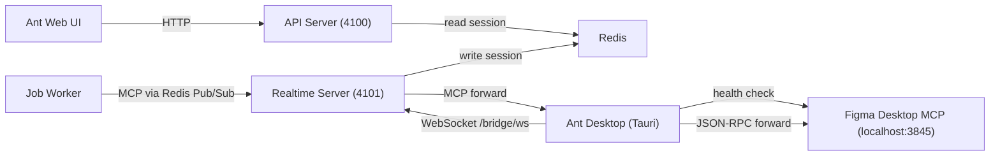
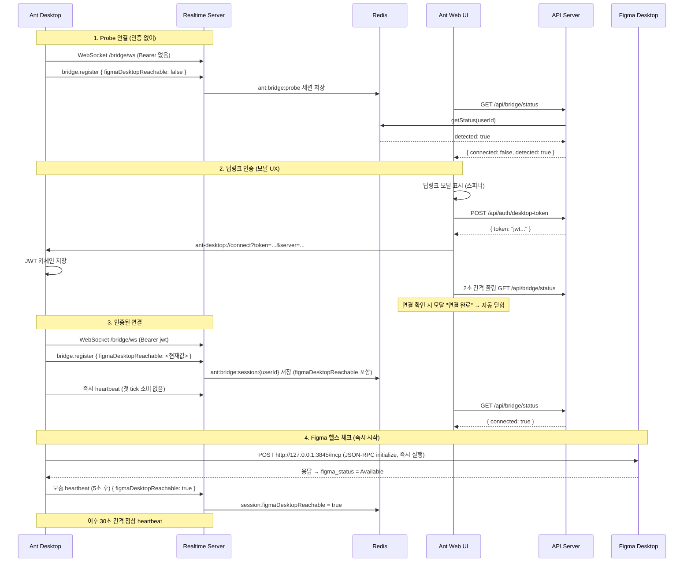

# Figma 연동 인프라

## 개요

Figma Desktop MCP 데이터를 Ant 에이전트가 사용하기 위한 연결 인프라. 세 컴포넌트(Ant Web UI, Ant Desktop, Figma Desktop)의 연결·감지·인증 구조를 다룬다. 연결 이후의 에이전트 파이프라인은 [25-ui-design-pipeline.md](25-ui-design-pipeline.md) 참조.

## 컴포넌트 관계도



## 감지 수준 매트릭스

| 감지 대상 | 방법 | 데이터 소스 | 감지 가능 조건 |
|---|---|---|---|
| Ant Desktop 설치 | 딥링크 시도 → 간접만 가능 | – | 직접 감지 불가 |
| Ant Desktop 기동 | probe WebSocket (Bearer 없이) | `ant:bridge:probe` Redis 키 | 앱이 WS 연결 시 |
| Ant Desktop 인증 | Bearer token 포함 WS | `ant:bridge:session:{userId}` Redis 키 | 딥링크 인증 완료 후 |
| Figma Desktop 기동 | register + heartbeat의 `figmaDesktopReachable` | Redis session 필드 | Ant Desktop 연결 상태에서만 |

## 연결 흐름



### Startup 타이밍

```
T=0.0s : Figma 헬스 체크 즉시 실행 (HTTP 요청 시작, 첫 tick 소비 없음)
T=0.1s : WS 연결 → register { figmaDesktopReachable: <현재값> }
T=0.2s : 즉시 heartbeat (첫 tick 소비 없음)
T=1-3s : Figma 헬스 체크 완료 → figma_status = Available
T=5.2s : 보충 heartbeat { figmaDesktopReachable: true } ← 5초 이내 정확 값 전파
T=30.2s: 정상 heartbeat (이후 30초 주기)
```

### 서버 방어 코드

`handleHeartbeat()`에서 세션이 없을 경우(disconnect→reconnect 레이스 컨디션), client 정보로 세션을 재생성하여 영구 false 상태를 방지한다.

## BridgeSessionManager 상태 판정

`getStatus(userId)` 결과:

| 결과 | 조건 |
|---|---|
| `connected: true` | 인증 세션 존재 + `lastPingAt` < `BRIDGE_HEARTBEAT_TIMEOUT_MS` (90s) |
| `connected: false, detected: true` | probe 세션 존재 + `lastPingAt` < 90s |
| `connected: false, detected: false` | 세션 없거나 타임아웃 |

`figmaDesktopReachable`은 `connected: true`일 때만 의미 있는 값. probe 상태에서는 Figma 감지 불가.

## 프론트엔드 상태 판정 및 UI 안내

Zustand store에 `bridgeConnected: boolean | null` (null=미확인), `bridgeDetected`, `figmaDesktopReachable`, `bridgeStatusChecked` 4개 상태.

| bridgeConnected | bridgeDetected | figmaDesktopReachable | UI 상태 | 사용자 안내 |
|---|---|---|---|---|
| `null` | – | – | 확인 중 | GNB 인디케이터 숨김 |
| `false` | `false` | – | 미감지 | Ant Desktop 다운로드 링크 |
| `false` | `true` | – | 감지/미인증 | 연결 버튼 → 딥링크 모달 (폴링+자동닫힘) |
| `true` | – | `false` | 연결/Figma 미감지 | Figma Desktop 다운로드 링크 |
| `true` | – | `true` | 정상 | 연동 완료 뱃지 (configured) |

GNB 인디케이터: `bridgeStatusChecked && bridgeConnected !== true`일 때만 모니터+경고 아이콘 표시. 클릭 시 Account Config → Figma 섹션으로 자동 스크롤.

## MCP 전송 경로

| 모드 | 경로 | 조건 |
|---|---|---|
| 로컬 | Worker → `localhost:3845` 직접 호출 | Figma Desktop 실행 중 |
| 클라우드 | Worker → Redis → Realtime Server → Ant Desktop → Figma Desktop MCP | Ant Desktop + Figma Desktop 연결 |

`detect`에서 MCP 가용성 검증. 불가 시 `designError`로 잡 차단.

## 관련 코드 경로

| 역할 | 파일 |
|---|---|
| WS 핸들러, 세션 관리 | `packages/ant-cli/src/infrastructure/realtime/BridgeWebSocketHandler.ts`, `BridgeSessionManager.ts` |
| HTTP `GET /api/bridge/status` | `packages/ant-cli/src/periphery/adapters/http/routes/bridge.routes.ts` |
| Desktop 토큰 발급 | `packages/ant-cli/src/periphery/adapters/http/routes/auth.routes.ts` |
| 공유 타입 (`BridgeStatus`, `BridgeSession`) | `packages/ant-shared/src/bridge.ts` |
| 프론트 API (`checkBridgeStatus`, `openDesktopDeepLink`) | `packages/ant-ui/src/infrastructure/http/api/desktop.ts` |
| 프론트 전역 상태 (`setBridgeStatus`) | `packages/ant-ui/src/domain/store/slices/uiSlice.ts` |
| 설정 UI (Figma 연동 섹션) | `packages/ant-ui/src/presentation/components/AccountConfigEditor.tsx` |
| GNB 인디케이터 | `packages/ant-ui/src/presentation/components/AppNavBar.tsx` |
| Ant Desktop 브리지 클라이언트 | `ant-desktop/src-tauri/src/bridge/client.rs` |
| Ant Desktop Figma 헬스 체크 | `ant-desktop/src-tauri/src/health/figma_check.rs` |
| Ant Desktop 딥링크 처리 | `ant-desktop/src-tauri/src/auth/deeplink.rs` |

## 경계

- UI Design Pipeline (연결 이후 에이전트 파이프라인): [25-ui-design-pipeline.md](25-ui-design-pipeline.md)
- Realtime System (SSE, Redis Pub/Sub): [21-realtime-system.md](21-realtime-system.md)
- Frontend Architecture (Zustand, UI 계층): [30-frontend-architecture.md](30-frontend-architecture.md)
- Shared Contracts (BridgeStatus 타입): [01-shared-contracts.md](01-shared-contracts.md)
