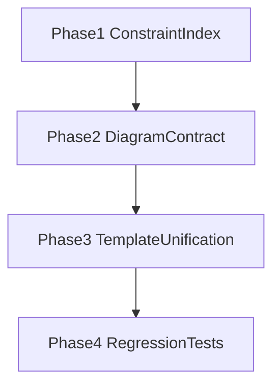

# Prompt-Document Constraint Map

## 개요

이 문서는 `시스템설계/스펙/PRD` 문서 제약이 실제 프롬프트에 어떻게 반영되는지와, FPOP/MECE/SBS 원칙의 적용 위치를 **단일 인덱스**로 고정한다.

핵심 목적:

- 문서 제약 변경 시 수정해야 할 코드/템플릿 경로를 즉시 찾을 수 있게 한다.
- plan/design/code-docgen 간 문서작성 체계 차이를 줄이는 리팩토링 기준점을 제공한다.
- 다이어그램/플로우차트 작성 체계의 제품 대비 갭을 구조적으로 관리한다.

## 프롬프트 템플릿 구조 SSOT

| 축 | SSOT 경로 | 책임 |
|---|---|---|
| Prompt 조립 | `packages/ant-cli/src/core/prompt/builder/PromptBuilder.ts` | `build(config)` 단일 진입점, sections/system/user 조립 |
| Tier A/D 주입 | `packages/ant-cli/src/core/prompt/builder/AutoInjectionResolver.ts` | tech/task/mode/data-presence 기반 자동 주입 |
| Tier N 주입 | `packages/ant-cli/src/core/prompt/builder/ArtifactRoleResolver.ts` | RAC artifact 존재 조건 기반 정책 주입 |
| RAC 문서 로딩 | `packages/ant-cli/src/agents/common/graph/loadDocumentsForRAC.ts` | refs/context 로딩, uiSource 배타성 검사 |
| RAC 계약 | `packages/ant-shared/src/rac.ts` | resolveToRAC/getRACDocuments 계약 |
| 템플릿 루트 | `packages/ant-cli/src/core/prompt/templates/` | jobs/agents/basis/domain/injections 실제 프롬프트 본문 |

## 문서 제약 → 프롬프트 반영 경로

### 1) 시스템설계 문서

| 단계 | 경로 | 제약 반영 |
|---|---|---|
| Design detect/decompose | `agents/architect/graph/design/nodes/detect/*`, `.../decompose/systemDesignDecompose.ts` | workType/documentType 결정, target 파일군 결정 |
| Design docGen(system) | `.../docGen/intent/system.ts` | system-design 전용 rules/guide 주입, sealed plan 반영 |
| Code 소비 | `agents/architect/graph/code/nodes/plan/llm/prompt.ts`, `.../execute/buildMessages.ts` | `hasSystemDesign` 게이트와 policy로 코드 작업 입력화 |

### 2) 스펙 문서

| 단계 | 경로 | 제약 반영 |
|---|---|---|
| Design plan(spec) | `agents/architect/graph/design/nodes/plan/*` | spec intentGroup에서 sealed `<plan>` 생성 |
| Design docGen(spec) | `.../docGen/intent/spec.ts` | spec 변형 템플릿 + sealed plan prepend |
| Code 소비 | `agents/architect/graph/code/nodes/decompose/*`, `.../plan/*` | include/policy 기반으로 spec 범위 제한 |

### 3) PRD 문서

| 단계 | 경로 | 제약 반영 |
|---|---|---|
| Planner 생성/수정 | `agents/planner/graph/plan/nodes/generate/*` | target 기반 PRD 생성, clarify 루프 |
| Design 입력 | `agents/architect/graph/design/nodes/plan/*`, `.../docGen/*` | planText/PRD를 runtimeContext에 주입 |
| Code 입력 | `agents/architect/graph/code/nodes/resolve/*`, `.../decompose/*` | RAC refs/context로 PRD를 범위화해 주입 |

## FPOP / MECE / SBS 적용 기준

## FPOP

- SSOT: `docs/architecture/13-prompt-system.md`
- 적용 원칙:
  - Principles over Examples
  - What over How
  - Observable over Assumed
  - Universal over Specific
  - Constraints over Instructions
  - Blind Spot Reminder
- 적용 위치:
  - `templates/jobs/*/nodes/*/{base,rules}.md`
  - `templates/jobs/*/basis/**`
  - `templates/jobs/shared/injections/**`

## SBS

- SSOT: `docs/architecture/13-prompt-system.md` 의 Scope-Bound Specificity
- 규칙: `specificity_floor(template) = activation_scope(template)`
- gate 축:
  - techTier
  - intent
  - taskType
  - mode
  - role
  - artifact-presence (`hasUi`, `hasSystemDesign`, `hasSpec`, `hasSources`, `uiSource`)
- 핵심 판정:
  - gate 축보다 추상적이면 SBS 위반
  - gate 외 축에서 과도하게 구체적이면 FPOP 위반

## MECE

- SSOT:
  - 프롬프트 작성 정책: `docs/architecture/13-prompt-system.md`
  - 문서 집합 정책: `.cursorrules` 및 `docs/architecture/35-codebase-meta-policy.md`
- 적용 원칙:
  - 중복 규칙은 공통 partial로 승격
  - job별 차이는 variant와 gate로만 표현
  - 동일 의미의 규칙을 다수 문서에 산문으로 복제하지 않는다.

## 다이어그램/플로우차트 체계 현황

| 영역 | 현재 상태 | 남은 갭 |
|---|---|---|
| 공통 계약(plan/design/code-docgen) | `jobs/shared/injections/diagram-contract.md`를 공통 사용 (Mermaid 우선 + ASCII fallback) | 외부 렌더러(ANT UI 외)에서 fallback 품질 일관성 검증 필요 |
| ant-ui 채팅/카드/파일 프리뷰 | Markdown 렌더러가 `language-mermaid`를 Mermaid SVG로 렌더 | 대형 다이어그램 성능/가독성 튜닝 여지 |
| 문서/프롬프트 정합 | design base와 diagram-contract 문구를 Mermaid 우선 정책으로 정렬 | job별 예시 문구의 표현 통일(선택) |

## 제품 대비(운영 관점) 갭

- ANT 내부의 1차 갭(공통 다이어그램 계약 부재)은 해소되었고, 현재 우선순위는 **렌더 환경 차이에 대한 fallback 운영 품질**이다.
- ANT UI는 Mermaid 렌더를 지원하므로 기본 출력은 Mermaid로 수렴하고, 외부/불확실 렌더 대상은 ASCII fallback으로 방어한다.
- 운영상 핵심은 "어디서든 최소 해석 가능" 보장(mermaid + compact ascii)이며, 계약은 `diagram-contract`를 SSOT로 유지한다.

## 리팩토링 전략

### 전략 1: 정책 SSOT 이원화

- Prompt 작성 정책(FPOP/SBS/MECE)과 문서 주입 경로(RAC/Artifact/PromptBuilder)를 분리 문서로 관리한다.
- 본 문서는 경로 인덱스, 세부 규칙은 각 SSOT 문서로 링크 위임한다.

### 전략 2: Diagram Contract 운영 고정

- plan/design/code-docgen 공통 partial(`diagram-contract`)을 유지 SSOT로 고정:
  - 권장 다이어그램 종류(flowchart, sequence, architecture)
  - Mermaid 우선, ASCII fallback 규칙
  - 렌더링 불가 환경에서의 텍스트 보강 규칙

### 전략 3: 템플릿 중복 제거

- design system/spec, plan PRD, code docgen의 문서작성 규칙을 공통 partial로 승격.
- job별 특화 내용만 variant에 유지해 MECE를 강제.

### 전략 4: 회귀 테스트 확장

- 현재의 존재성/경로 검증 위주 테스트에 다음을 추가:
  - 다이어그램 계약 위반(필수 섹션 누락, 금지 포맷)
  - gate 변수 불일치(`has*`, `uiSource`) 탐지
  - stale 문서작성 규칙 탐지

## 단계별 실행 계획

- Phase 1: 본 인덱스 문서 확정 + 관련 문서 경계 링크 정리
- Phase 2: 다이어그램 공통 partial 및 job별 소비 경로 정의
- Phase 3: design/plan/code-docgen 문서작성 규칙 partial 통합
- Phase 4: 테스트 강화 및 CI 게이트 고정

## Codebase mutation gate cross-link

문서 생성 잡(design plan/docGen, planner plan, code plan)의 prompt 는 산출물이 markdown / JSON 임을 명시하고 `decision` 같은 입력의 의미 축을 "기술 대상" 으로 닫아 codebase 변경 시도를 사전 억제한다 (FPOP/SBS/MECE 준수). 실제 차단은 도구 핸들러 + FileRenderer XML 가드가 담당 — prompt 가 가드를 대신하지 않는다. 정책 SSOT: [15-design-job.md "Codebase mutation gate"](15-design-job.md#codebase-mutation-gate).

## 경계

- 프롬프트 시스템 SSOT: [13-prompt-system.md](13-prompt-system.md)
- Design Job 동작: [15-design-job.md](15-design-job.md)
- Planner Job(PRD): [16-planner-job.md](16-planner-job.md)
- Code Job 소비 경로: [14-code-job.md](14-code-job.md)
- Design 파이프라인 상세: [25-design-pipeline.md](25-design-pipeline.md)
- 그래프 구조 규칙: [NODE_GRAPH_LAYOUT.md](NODE_GRAPH_LAYOUT.md)
- 대화 상태 규약: [34-conversations.md](34-conversations.md)
