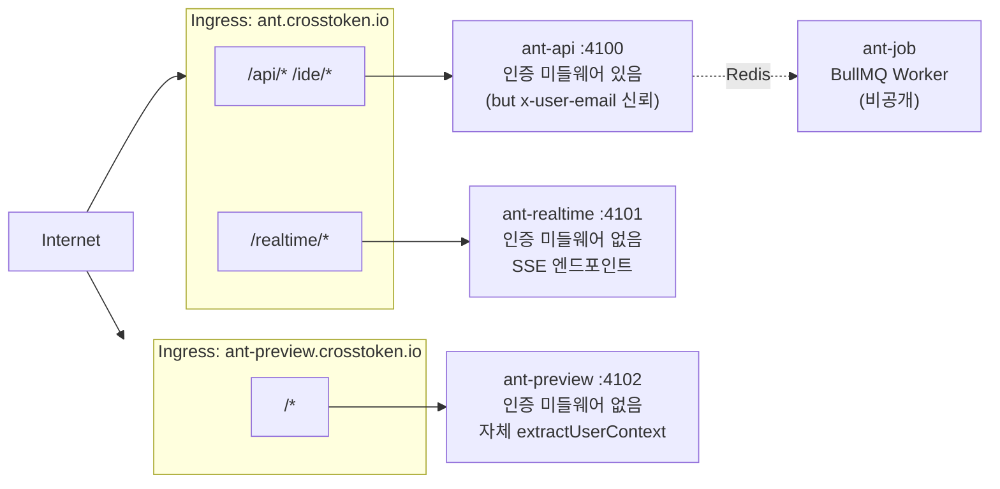
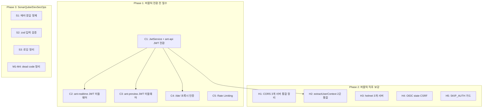
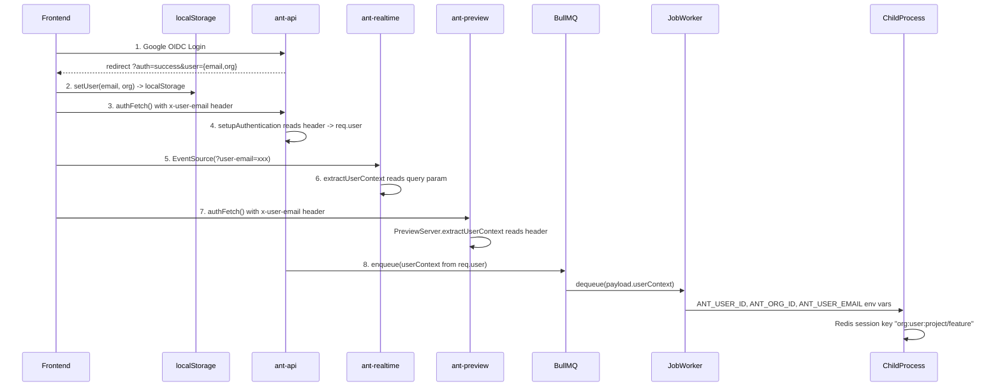
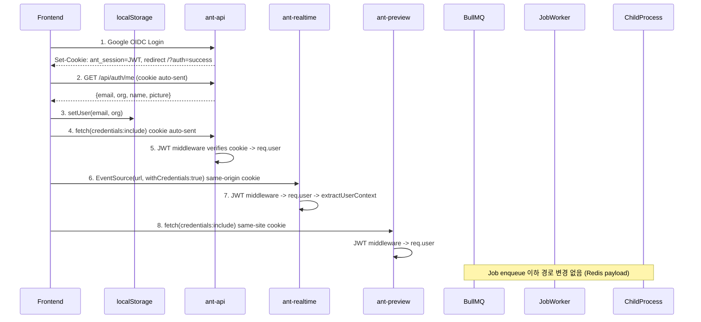

# ANT 퍼블릭 전환 보안 보강 계획

## 전제 사항

- **로컬 모드는 인증이 없는 것이 의도된 설계.** `AuthService`는 `config.mode === 'cloud'`일 때만 생성되며([ServiceInitializer.ts L52](packages/ant-cli/src/periphery/adapters/http/express/services/ServiceInitializer.ts)), 로컬에서는 `setupAuthentication()`이 early return([ServerConfigurator.ts L105-107](packages/ant-cli/src/periphery/adapters/http/express/config/ServerConfigurator.ts)). 아래 모든 취약점은 **클라우드 모드(퍼블릭)에서의 문제**임.
- `**AuthService.authorize()` (L68-71)는 dead code.** 코드베이스 전체에서 `.authorize()` 호출이 0건. 라우트에 인가 체크가 없는 것이 진짜 문제.
- `**/api/jobs/queue/next`, `/api/jobs/queue/complete`는 dead code.** `isPublicPath`에 등록되어 있지만 실제 라우트 핸들러가 없음. 아키텍처 문서에서도 "프로세스 간 통신은 Redis를 통해 이루어진다. 직접적인 프로세스 간 HTTP 호출은 없다"로 확인.
- 보안 수준 목표: **SonarQube 정적 분석 통과 + DevSecOps 보안 감사 통과**

---

## 시스템 아키텍처와 공격 표면

아키텍처 문서([00-system-overview.md](docs/architecture/00-system-overview.md))에 따르면, ANT는 단일 코드베이스에서 **4개 프로세스로 분리 배포**되며, 이 중 **3개가 퍼블릭 인터넷에 직접 노출**된다:




| 서버 | 인증 상태 | 위험 |

|------|----------|------|

| **ant-api** | `x-user-email` 헤더 신뢰, `/stream` `/ide/` 완전 우회 | 사용자 사칭, IDE 무단 접근 |

| **ant-realtime** | **인증 미들웨어 자체가 없음** ([RealtimeServer.ts](packages/ant-cli/src/infrastructure/realtime/RealtimeServer.ts)) | 모든 사용자의 실시간 이벤트 도청 가능 |

| **ant-preview** | **인증 미들웨어 자체가 없음**, 자체 `extractUserContext`가 `x-user-email` 헤더 신뢰 ([PreviewServer.ts L138-157](packages/ant-cli/src/infrastructure/preview/PreviewServer.ts)) | 타 사용자 Preview 시작/중지/접근 |

| **ant-job** | 인터넷 비노출 (BullMQ Worker) | 해당 없음 |

**핵심: ant-realtime과 ant-preview는 ant-api의 인증 미들웨어와 완전히 별개의 Express 앱**이다. ant-api에 JWT 인증을 추가해도, 나머지 2개 서버에는 아무 효과가 없다. 3개 서버 모두에 독립적으로 JWT 검증 미들웨어를 적용해야 한다.

### JWT 쿠키 공유 전략

3개 서버가 모두 `*.crosstoken.io` 도메인에서 서비스되므로, OIDC 콜백 시 JWT 쿠키를 `domain=.crosstoken.io`로 설정하면 모든 서버에서 동일 쿠키를 수신/검증할 수 있다.

```
ant.crosstoken.io       -> ant-api, ant-realtime  (동일 호스트, 경로 분리)
ant-preview.crosstoken.io -> ant-preview           (별도 호스트, 동일 도메인)
```

쿠키 설정: `Set-Cookie: ant_session=<jwt>; HttpOnly; Secure; SameSite=Lax; Domain=.crosstoken.io; Path=/`

---

## CRITICAL: 퍼블릭 전환 전 필수 수정

### C1. ant-api: `x-user-email` 헤더 기반 인증 -> JWT 쿠키 전환

[ServerConfigurator.ts L142-145](packages/ant-cli/src/periphery/adapters/http/express/config/ServerConfigurator.ts)에서 `x-user-email` 헤더를 그대로 신뢰. 공격자가 `curl -H "x-user-email: anyone@to.nexus"`로 OIDC를 완전 우회.

**보강**:

1. `JwtService` 생성: `jsonwebtoken`으로 HS256 서명/검증, `ANT_JWT_SECRET` 환경변수 사용
2. [auth.routes.ts](packages/ant-cli/src/periphery/adapters/http/routes/auth.routes.ts) OIDC 콜백에서 JWT 쿠키 발급 (`domain=.crosstoken.io`)
3. `ServerConfigurator.setupAuthentication()`을 쿠키 JWT 검증으로 전면 교체
4. `x-user-email` 헤더/쿼리 기반 인증 코드 완전 제거

### C2. ant-realtime: 인증 미들웨어 완전 부재

[RealtimeServer.ts](packages/ant-cli/src/infrastructure/realtime/RealtimeServer.ts)는 `setupMiddleware()`에서 CORS와 JSON 파서만 설정. 인증 미들웨어가 **아예 없다**. SSE 엔드포인트([sse.routes.ts L37-46](packages/ant-cli/src/periphery/adapters/http/routes/sse.routes.ts))는 `extractUserContext(req)`를 호출하는데, 이것이 `user-email` 쿼리 파라미터를 그대로 신뢰.

공격: `EventSource('https://ant.crosstoken.io/realtime/projects/X/features/Y/stream?user-email=victim@to.nexus')` 한 줄로 다른 사용자의 **모든 실시간 이벤트(채팅, 칸반, 파일트리, 워크플로우)를 도청** 가능.

아키텍처([09-realtime-system.md](docs/architecture/09-realtime-system.md))에서 Pub/Sub 채널이 `realtime:broadcast:{orgId}:{userId}` 스코프라서 "다른 사용자의 이벤트가 누출되지 않는다"고 하지만, **채널명이 `extractUserContext`의 결과로 결정**되므로 쿼리 파라미터를 조작하면 다른 사용자의 채널을 구독하게 됨.

**보강**: `RealtimeServer.setupMiddleware()`에 JWT 쿠키 검증 미들웨어 추가. `JwtService`를 공유 모듈로 만들어 ant-api와 동일한 검증 로직 사용. SSE는 same-origin 쿠키가 자동 전송되므로 `EventSource`에서 별도 처리 불필요 (`withCredentials: true`만 프론트엔드에서 설정).

### C3. ant-preview: 인증 미들웨어 완전 부재 + 자체 extractUserContext

[PreviewServer.ts L138-157](packages/ant-cli/src/infrastructure/preview/PreviewServer.ts)에 자체 `extractUserContext`가 있으며, `x-user-email` 헤더와 `x-organization-id` / `x-user-id` 헤더를 그대로 신뢰:

```typescript
private extractUserContext(req: Request) {
  const email = req.headers['x-user-email'] as string || req.query['user-email'] as string;
  // ... 또는
  const orgIdHeader = req.headers['x-organization-id'] as string;
  const userIdHeader = req.headers['x-user-id'] as string;
}
```

공격: 헤더 조작으로 **타 사용자의 Preview를 시작/중지/접근** 가능. Preview는 별도 호스트(`ant-preview.crosstoken.io`)이므로 ant-api의 인증을 거치지 않음.

**보강**: `PreviewServer`에 JWT 쿠키 검증 미들웨어 추가. `extractUserContext`를 JWT payload 기반으로 교체. 쿠키 `domain=.crosstoken.io`이므로 별도 호스트에서도 수신됨.

### C4. ant-api: `/ide/` 프록시 인증 없음

[ServerConfigurator.ts L137-139](packages/ant-cli/src/periphery/adapters/http/express/config/ServerConfigurator.ts):

```typescript
if (req.path.startsWith('/ide/')) {
  return next();  // 인증 완전 스킵
}
```

IDE 프록시는 ant-api를 경유([00-system-overview.md](docs/architecture/00-system-overview.md) Ingress: `/ide/*` -> ant-api)하여 Docker/K8s IDE 컨테이너로 프록시됨. 인증 없이 접근 시 **코드 열람, 터미널 실행** 가능.

**보강**: `/ide/` bypass 제거. JWT 쿠키 검증 후, serverKey에서 추출한 userId와 JWT의 userId 일치 확인.

### C5. Rate Limiting 완전 부재

`express-rate-limit` 미설치. LLM API 무제한 호출(비용 폭발), Job 무한 생성, 인증 브루트포스에 무방비.

**보강**: `express-rate-limit` 도입. ant-api와 ant-preview에 적용. ant-realtime은 SSE 연결이므로 연결 수 제한으로 대체.

| 카테고리 | 제한 | 대상 서버 |

|---------|------|----------|

| Auth | 10 req/min/IP | ant-api |

| Job Execute | 5 req/min/user | ant-api |

| Chat/Ask | 20 req/min/user | ant-api |

| General API | 100 req/min/IP | ant-api |

| Preview Mgmt | 10 req/min/user | ant-preview |

| SSE Connections | max 10 per user | ant-realtime |

---

## HIGH: 퍼블릭 직후 보강

### H1. CORS `localhost` 무조건 허용 (3개 서버 모두)

3개 서버 모두 동일한 패턴:

- [ServerConfigurator.ts L61](packages/ant-cli/src/periphery/adapters/http/express/config/ServerConfigurator.ts)
- [RealtimeServer.ts L121](packages/ant-cli/src/infrastructure/realtime/RealtimeServer.ts)
- [PreviewServer.ts L209](packages/ant-cli/src/infrastructure/preview/PreviewServer.ts)

```typescript
if (origin.includes('localhost') || origin.includes('127.0.0.1')) {
  return callback(null, true);
}
```

`evil-localhost.com`으로 CORS 우회 가능.

**보강**: 공유 CORS 설정 유틸 생성. `NODE_ENV === 'production'`이면 localhost 허용 제거. `ANT_CORS_ORIGINS` 환경변수로 명시적 화이트리스트.

### H2. `extractUserContext` 2곳에서 중복 구현, 모두 헤더 신뢰

- [userContext.ts L107-152](packages/ant-cli/src/periphery/adapters/http/routes/helpers/userContext.ts): ant-api + ant-realtime이 사용. 쿼리 > 헤더 > req.user 우선순위로 IDOR 가능.
- [PreviewServer.ts L138-157](packages/ant-cli/src/infrastructure/preview/PreviewServer.ts): ant-preview 자체 구현. 동일한 헤더 신뢰 문제.

**보강**: JWT 전환 후, 두 곳 모두 `req.user` (JWT에서 추출, 미들웨어가 설정)만 사용하도록 변경. 쿼리/헤더 우선순위 제거. PreviewServer의 자체 구현은 공유 유틸로 통합.

### H3. Security Headers 부재 (3개 서버 모두)

`helmet` 미설치. SonarQube "Security Hotspot". 3개 서버 모두에 적용 필요.

### H4. Google OIDC `state` 파라미터 미사용

[GoogleOIDCService.ts](packages/ant-cli/src/infrastructure/auth/GoogleOIDCService.ts): CSRF 방어용 `state` 파라미터 없음.

**보강**: `crypto.randomBytes(32)` -> Redis TTL 5분 저장 -> 콜백에서 검증.

### H5. `SKIP_AUTH_FOR_LOCALHOST` 프로덕션 위험

`NODE_ENV === 'production'`이면 무시하는 가드 추가.

---

## SonarQube / DevSecOps 감사 대응

### S1. 에러 응답에 내부 정보 노출 (CWE-209)

거의 모든 라우트의 catch 블록에서 `res.status(500).json({ error: error.message })` 패턴. [previewProxy.ts](packages/ant-cli/src/periphery/adapters/http/middleware/previewProxy.ts)에서 내부 포트 번호 노출.

**보강**: 에러 응답 래퍼 유틸. 내부 에러는 `logger.error()`, 클라이언트에는 generic 메시지 + correlation ID.

### S2. 입력값 검증 부재 (CWE-20)

`req.body` 값을 검증 없이 직접 사용. 기술 스택에 이미 `Zod`가 포함되어 있으므로([00-system-overview.md L68](docs/architecture/00-system-overview.md)) 이를 라우트 검증에도 활용.

**보강**: 주요 라우트에 zod 스키마 적용 (`POST /execute`, `POST /projects`, `POST /chat/message`).

### S3. 민감 정보 로깅 (CWE-532)

[figma-oauth.routes.ts L94](packages/ant-cli/src/periphery/adapters/http/routes/figma-oauth.routes.ts)에서 `credentials.accessToken` 존재 여부 로깅. 프로덕션 코드에서 `console.log` 직접 사용.

**보강**: `console.log` -> `logger` 교체. 프로덕션 로그 레벨 `info`. 민감 필드 마스킹.

---

## MEDIUM: 안정화 후 보강

### M1. `authorize()` dead code 정리

`AuthService.authorize()`, `GoogleOIDCService.authorize()` 미사용. `AuthPort` 인터페이스에서 제거하거나, 향후 라우트 미들웨어 레벨에서 재설계. 워크스페이스 경로에 `tenantId/userId`가 이미 포함되므로 JWT userId와 요청 대상 일치 검증으로 충분.

### M2. `graph-metadata` 경로 과도한 인증 우회

`path.includes('/graph-metadata')` -> 정확한 경로 패턴으로 제한.

### M3. OAuth 콜백 URL에 사용자 정보 노출

JWT 쿠키 전환 시 자연스럽게 해소. 쿠키 설정 후 clean redirect.

### M4. `isPublicPath`의 dead internal endpoints 정리

`/api/jobs/queue/next`, `/api/jobs/queue/complete` 라우트 핸들러 없음. `isPublicPath` 목록에서 제거.

---

## 보강 작업 우선순위 및 의존관계




---

## 사이드이펙트 분석: 인증 데이터 흐름 End-to-End 추적

JWT 쿠키 전환 시 영향받는 모든 컴포넌트를 추적한 결과.

### 현재 인증 데이터 흐름 (8단계)




### 전환 후 인증 데이터 흐름 (목표)




### 사이드이펙트 점검 결과

#### SE-1: 프론트엔드가 사용자 정보를 알 수 없게 되는 문제

**원인**: httpOnly 쿠키는 JS에서 읽을 수 없음. 현재는 OIDC 콜백 URL에서 `?user={email,name,org}`를 파싱해 localStorage에 저장하는데, JWT 쿠키 전환 시 이 데이터가 URL에 없음.

**영향 범위**:

- [App.tsx L40-46](packages/ant-ui/src/presentation/App.tsx): OIDC 콜백 파싱 + `setUser()`
- [workspace-path.ts L66-88](packages/ant-ui/src/shared/utils/workspace-path.ts): `getUserContext()` -> 경로 계산 (`workspaces/${org}/${user}`)
- [authSlice.ts L59-63](packages/ant-ui/src/domain/store/slices/authSlice.ts): `setUser()` -> Zustand + localStorage
- GlobalNavBar: 사용자 이메일 표시

**해결**: `GET /api/auth/me` 엔드포인트 신규 추가. JWT 쿠키에서 사용자 정보 반환. OIDC redirect 후 프론트엔드가 이 엔드포인트를 호출하여 `setUser()` 수행. localStorage의 email/org은 표시용 + 경로 계산용으로 유지 (인증 수단이 아님).

#### SE-2: Preview 서버 cross-origin 쿠키 전송

**원인**: 프론트엔드(`ant.crosstoken.io`)에서 Preview API(`ant-preview.crosstoken.io`)로의 요청은 cross-origin.

**분석**: 두 도메인은 **same-site** (eTLD+1 = `crosstoken.io`). `SameSite=Lax` 쿠키는 same-site 요청에서 모든 메서드(GET, POST)에 전송됨.

**필수 조건**:

1. `authFetch()`에 `credentials: 'include'` 추가 -> [client.ts L140-156](packages/ant-ui/src/infrastructure/http/api/client.ts)
2. Preview CORS에 `credentials: true` (이미 설정됨)
3. CORS `Access-Control-Allow-Origin`이 와일드카드(`*`)가 아닌 specific origin 반환 (cors 패키지가 callback 사용 시 자동 처리)

**사이드이펙트 없음** - 조건 충족 시 정상 동작.

#### SE-3: SSE EventSource 쿠키 전송

**원인**: SSE(`ant.crosstoken.io/realtime/`*)는 프론트엔드와 **same-origin**.

**분석**: same-origin 요청에서 쿠키는 자동 전송됨. `EventSource`에 `withCredentials: true`가 이미 설정되어 있음([SSEManager.ts L231](packages/ant-ui/src/infrastructure/sse/SSEManager.ts)).

**사이드이펙트 없음** - `user-email` 쿼리 파라미터 제거만 필요.

#### SE-4: 파일 다운로드 URL에서 user-email 쿼리 파라미터

**원인**: [files.ts L224](packages/ant-ui/src/infrastructure/http/api/files.ts)에서 다운로드 URL에 `&user-email=` 추가.

**분석**: 다운로드는 브라우저 GET 요청(same-origin). 쿠키 자동 전송. 쿼리 파라미터 불필요.

**사이드이펙트 없음** - 쿼리 파라미터 제거만 필요.

#### SE-5: Figma OAuth 흐름

**원인**: [figma.ts L36](packages/ant-ui/src/infrastructure/http/api/figma.ts)에서 `?user-email=` 쿼리로 사용자 식별. [figma-oauth.routes.ts L142](packages/ant-cli/src/periphery/adapters/http/routes/figma-oauth.routes.ts)에서 이를 읽어 `state`에 포함.

**분석**: `/api/figma/oauth/authorize`가 현재 `isPublicPath`에 포함되어 인증 bypass. JWT 전환 시:

- `/api/figma/oauth/authorize`를 `isPublicPath`에서 제거 -> JWT 인증 필요
- `req.user`에서 userId/orgId 추출 -> state에 포함
- 프론트엔드: `?user-email=` 파라미터 제거
- `/api/figma/oauth/callback`은 public 유지 (Figma redirect이므로 쿠키 없을 수 있음, state에서 사용자 식별)

**사이드이펙트 없음** - 단, `isPublicPath`에서 authorize 제거 필수.

#### SE-6: Job Worker/Child Process 경로는 영향 없음

**분석**: Job enqueue 시점에 `extractUserContext(req)`로 추출한 userContext가 BullMQ payload에 데이터로 저장됨. Job Worker는 payload에서 읽어 `ANT_USER_ID`, `ANT_ORG_ID` 환경변수를 설정. **HTTP 인증과 무관한 Redis 데이터 경로**.

Redis session key 포맷(`org:user:project/feature`), Pub/Sub 채널명 등은 동일한 userId/orgId 값을 사용하므로 **변경 없음**.

#### SE-7: `cloud-ide.routes.ts`의 `req.body.userContext` 보안 결함

[cloud-ide.routes.ts L40](packages/ant-cli/src/periphery/adapters/http/routes/cloud-ide.routes.ts):

```typescript
const userContext: UserContext = req.body.userContext || extractUserContext(req);
```

클라이언트가 request body에 임의의 `userContext`를 보내 타 사용자의 IDE를 조작 가능. JWT 전환 시 `req.body.userContext` fallback을 **완전 제거**하고 `req.user`만 사용.

#### SE-8: Vite 로컬 개발 환경

**분석**: 로컬 개발에서는 `ANT_SERVER_MODE=local`이므로 JWT 미들웨어가 적용되지 않음. 기존 동작 그대로 유지.

클라우드 백엔드를 로컬 Vite에서 테스트하는 경우(`VITE_CLOUD_BACKEND_BASE`): cross-origin 쿠키 문제가 생기나, 이는 개발자 워크플로우이고 `SKIP_AUTH_FOR_LOCALHOST`로 대응 가능. 프로덕션에는 해당 없음.

#### SE-9: PreviewServer 프록시 vs 관리 API 인증 분리

**원인**: PreviewServer에서 프록시 미들웨어(`createPreviewProxyMiddleware`)가 body parser **이전**에 등록됨([PreviewServer.ts L232](packages/ant-cli/src/infrastructure/preview/PreviewServer.ts)). 프록시는 유저의 dev server 출력을 중계하는 것이므로 인증 불필요.

**해결**: JWT 미들웨어를 프록시 **이후**, 관리 API **이전**에 배치:

```
CORS -> Health check -> Preview Proxy (인증 없음) -> JWT middleware -> Body parser -> Management API
```

**사이드이펙트 없음** - 미들웨어 순서만 정확히 배치.

---

## 레거시 잔존 제거 목록 (하위호환 불필요)

JWT 전환 시 반드시 **완전 제거**해야 할 레거시 코드. "이전 방식도 지원" 형태의 fallback을 남기면 안 됨.

### L1. `x-user-email` 헤더 관련 - 완전 제거

| 파일 | 제거 대상 |

|------|----------|

| [client.ts L118-133](packages/ant-ui/src/infrastructure/http/api/client.ts) | `getAuthHeaders()` 함수 전체 (x-user-email 반환) |

| [client.ts L106-113](packages/ant-ui/src/infrastructure/http/api/client.ts) | `getUserEmail()` 함수 전체 |

| [ServerConfigurator.ts L143-145](packages/ant-cli/src/periphery/adapters/http/express/config/ServerConfigurator.ts) | `emailFromHeader`, `emailFromQuery` 파싱 로직 |

| [userContext.ts L108-130](packages/ant-cli/src/periphery/adapters/http/routes/helpers/userContext.ts) | Priority 1 (query) + Priority 2 (header) 블록 |

| [PreviewServer.ts L138-157](packages/ant-cli/src/infrastructure/preview/PreviewServer.ts) | `extractUserContext()` 메서드 전체 (공유 유틸로 교체) |

| [figma-oauth.routes.ts L60-62](packages/ant-cli/src/periphery/adapters/http/routes/figma-oauth.routes.ts) | `emailFromHeader`/`emailFromQuery` 파싱 |

| [figma-files.routes.ts L33-35](packages/ant-cli/src/periphery/adapters/http/routes/figma-files.routes.ts) | `emailFromHeader`/`emailFromQuery` 파싱 |

| [RealtimeServer.ts L129](packages/ant-cli/src/infrastructure/realtime/RealtimeServer.ts) | `allowedHeaders`에서 `'x-user-email'` 제거 |

### L2. `user-email` 쿼리 파라미터 - 완전 제거

| 파일 | 제거 대상 |

|------|----------|

| [SSEManager.ts L205-224](packages/ant-ui/src/infrastructure/sse/SSEManager.ts) | `connect()`에서 `user-email` 쿼리 파라미터 제거 |

| [SSEManager.ts L362-381](packages/ant-ui/src/infrastructure/sse/SSEManager.ts) | `connectWorkflow()`에서 `user-email` 쿼리 파라미터 제거 |

| [files.ts L224](packages/ant-ui/src/infrastructure/http/api/files.ts) | `&user-email=` 파라미터 제거 |

| [figma.ts L36](packages/ant-ui/src/infrastructure/http/api/figma.ts) | `?user-email=` 파라미터 제거 |

### L3. `x-organization-id` / `x-user-id` 헤더 오버라이드 - 완전 제거

| 파일 | 제거 대상 |

|------|----------|

| [PreviewServer.ts L148-153](packages/ant-cli/src/infrastructure/preview/PreviewServer.ts) | `x-organization-id`/`x-user-id` 헤더 파싱 블록 전체 |

### L4. `req.body.userContext` client override - 완전 제거

| 파일 | 제거 대상 |

|------|----------|

| [cloud-ide.routes.ts L40](packages/ant-cli/src/periphery/adapters/http/routes/cloud-ide.routes.ts) | `req.body.userContext ||` fallback 제거 |

| [cloud-ide.routes.ts L140](packages/ant-cli/src/periphery/adapters/http/routes/cloud-ide.routes.ts) | 동일 패턴 제거 |

### L5. Dead code - 완전 제거

| 파일 | 제거 대상 |

|------|----------|

| [ServerConfigurator.ts L199-202](packages/ant-cli/src/periphery/adapters/http/express/config/ServerConfigurator.ts) | `internalEndpoints` 배열 (`/api/jobs/queue/next`, `/complete`) |

| [AuthService.ts L68-71](packages/ant-cli/src/infrastructure/auth/AuthService.ts) | `authorize()` 메서드 (호출 0건) |

| [GoogleOIDCService.ts L108-111](packages/ant-cli/src/infrastructure/auth/GoogleOIDCService.ts) | `authorize()` 메서드 (호출 0건) |

| [ServerConfigurator.ts L131-134](packages/ant-cli/src/periphery/adapters/http/express/config/ServerConfigurator.ts) | `/stream` bypass 블록 |

| [ServerConfigurator.ts L137-139](packages/ant-cli/src/periphery/adapters/http/express/config/ServerConfigurator.ts) | `/ide/` bypass 블록 |

### L6. Legacy email-based signup/signin - 제거 또는 보호 강화

| 파일 | 제거 대상 |

|------|----------|

| [auth.routes.ts L166-242](packages/ant-cli/src/periphery/adapters/http/routes/auth.routes.ts) | `POST /auth/signup` (OIDC만 사용 시 불필요) |

| [auth.routes.ts L248-322](packages/ant-cli/src/periphery/adapters/http/routes/auth.routes.ts) | `POST /auth/signin` (OIDC만 사용 시 불필요) |

| [auth.routes.ts L328-333](packages/ant-cli/src/periphery/adapters/http/routes/auth.routes.ts) | `POST /auth/signout` (JWT 쿠키 clear로 교체) |

이 라우트들은 `SKIP_AUTH_FOR_LOCALHOST=true`일 때만 동작하지만, 퍼블릭에선 OIDC가 유일한 인증 경로이므로 `NODE_ENV=production`에서 완전히 비활성화하거나 제거.

### L7. OIDC 콜백 URL 사용자 정보 노출 - 교체

| 파일 | 제거 대상 |

|------|----------|

| [auth.routes.ts L136-145](packages/ant-cli/src/periphery/adapters/http/routes/auth.routes.ts) | `userData` URL 인코딩 + redirect에 `&user=` 파라미터 |

| [App.tsx L40-56](packages/ant-ui/src/presentation/App.tsx) | URL에서 `user` 파라미터 파싱 로직 |

JWT 쿠키 설정 후 `/?auth=success`만으로 redirect. 프론트엔드는 `GET /api/auth/me`로 사용자 정보 조회.

### L8. `isPublicPath` 정리

| 항목 | 처리 |

|------|------|

| `/api/figma/oauth/authorize` | public에서 제거 (인증 필요: req.user에서 사용자 식별) |

| `/api/figma/oauth/callback` | public 유지 (Figma redirect, state에서 사용자 식별) |

| `/api/jobs/queue/next`, `/api/jobs/queue/complete` | 제거 (라우트 핸들러 없는 dead code) |

| `graph-metadata` | `path.includes()` -> 정확한 패턴으로 교체 |

---

## 구현 방향

### 인증 아키텍처 전환

현재:

```
OIDC -> Frontend: localStorage에 email 저장 -> 매 요청 x-user-email 헤더 -> ant-api만 (불완전) 검증
ant-realtime: 인증 없음, user-email 쿼리 파라미터 신뢰
ant-preview: 인증 없음, x-user-email 헤더 신뢰
```

목표:

```
OIDC -> ant-api: JWT를 httpOnly 쿠키로 발급 (domain=.crosstoken.io)
ant-api: 쿠키 JWT 서명 검증 -> req.user 설정
ant-realtime: 쿠키 JWT 서명 검증 -> req.user 설정 (SSE 쿠키 자동 전송)
ant-preview: 쿠키 JWT 서명 검증 -> req.user 설정 (별도 호스트, 동일 도메인)
Frontend: x-user-email 헤더 대신 credentials:'include'로 쿠키 자동 전송
```

로컬 모드는 변경 없음. 모드 판별은 기존과 동일 (`ANT_SERVER_MODE`).

### 핵심 변경 파일

| 파일 | 변경 내용 |

|------|----------|

| [ServerConfigurator.ts](packages/ant-cli/src/periphery/adapters/http/express/config/ServerConfigurator.ts) | `setupAuthentication()` 전체 교체: JWT 쿠키 검증, bypass 블록 제거, dead code 정리 |

| [RealtimeServer.ts](packages/ant-cli/src/infrastructure/realtime/RealtimeServer.ts) | JWT 쿠키 검증 미들웨어 추가 + helmet + CORS 정리 |

| [PreviewServer.ts](packages/ant-cli/src/infrastructure/preview/PreviewServer.ts) | JWT 미들웨어(프록시 후, 관리API 전) + 자체 extractUserContext 삭제 + helmet + CORS |

| [auth.routes.ts](packages/ant-cli/src/periphery/adapters/http/routes/auth.routes.ts) | OIDC 콜백: JWT 쿠키 발급 + clean redirect. `GET /api/auth/me` 추가. signout: 쿠키 clear. legacy email routes 제거/비활성화 |

| [GoogleOIDCService.ts](packages/ant-cli/src/infrastructure/auth/GoogleOIDCService.ts) | state 파라미터 생성. authorize() dead code 제거 |

| [userContext.ts](packages/ant-cli/src/periphery/adapters/http/routes/helpers/userContext.ts) | cloud 모드: `req.user`만 사용 (Priority 1,2 제거). local 모드: 기존 infer 로직 유지 |

| [sse.routes.ts](packages/ant-cli/src/periphery/adapters/http/routes/sse.routes.ts) | extractUserContext가 req.user를 사용하게 되므로 수정 최소화 |

| [cloud-ide.routes.ts](packages/ant-cli/src/periphery/adapters/http/routes/cloud-ide.routes.ts) | `req.body.userContext` fallback 제거 |

| [figma-oauth.routes.ts](packages/ant-cli/src/periphery/adapters/http/routes/figma-oauth.routes.ts) | getUserContext: req.user만 사용. authorize: user-email 쿼리 제거 |

| [figma-files.routes.ts](packages/ant-cli/src/periphery/adapters/http/routes/figma-files.routes.ts) | getUserContext: req.user만 사용 |

| [client.ts](packages/ant-ui/src/infrastructure/http/api/client.ts) | `getAuthHeaders()`, `getUserEmail()` 삭제. `authFetch()`에 `credentials: 'include'` 추가 |

| [SSEManager.ts](packages/ant-ui/src/infrastructure/sse/SSEManager.ts) | `user-email` 쿼리 파라미터 제거 (connect, connectWorkflow 양쪽) |

| [files.ts](packages/ant-ui/src/infrastructure/http/api/files.ts) | `user-email` 쿼리 파라미터 제거 |

| [figma.ts](packages/ant-ui/src/infrastructure/http/api/figma.ts) | `user-email` 쿼리 파라미터 제거 |

| [App.tsx](packages/ant-ui/src/presentation/App.tsx) | OIDC 콜백: URL `user` 파싱 -> `GET /api/auth/me` 호출로 교체 |

| [AuthService.ts](packages/ant-cli/src/infrastructure/auth/AuthService.ts) | `authorize()` dead code 제거 |

| `package.json` | `helmet`, `express-rate-limit`, `jsonwebtoken`, `cookie-parser` 추가 |

### 신규 파일

| 파일 | 용도 |

|------|------|

| `src/infrastructure/auth/JwtService.ts` | JWT 생성/검증 (3개 서버에서 공유) |

| `src/periphery/adapters/http/middleware/jwtAuth.ts` | Express JWT 쿠키 검증 미들웨어 (3개 서버에서 재사용) |

| `src/periphery/adapters/http/middleware/rateLimiter.ts` | Rate limit 설정 |

| `src/periphery/adapters/http/middleware/corsConfig.ts` | 공유 CORS 설정 유틸 |

| `src/periphery/adapters/http/routes/helpers/errorResponse.ts` | 안전한 에러 응답 유틸 |

### 미들웨어 순서 (서버별)

**ant-api** (ServerConfigurator.configure 순서):

```
1. CORS (corsConfig.ts)
2. helmet
3. favicon handler
4. IDE Proxy middleware (body parser 전)
5. cookie-parser
6. body parsers (json)
7. JWT auth middleware (cloud만, isPublicPath 제외)
8. rate limiter
9. routes
```

**ant-realtime** (RealtimeServer.setupMiddleware 순서):

```
1. CORS (corsConfig.ts)
2. helmet
3. cookie-parser
4. JWT auth middleware (cloud만, /health 제외)
5. json parser
6. SSE routes
```

**ant-preview** (PreviewServer.setupRoutes 순서):

```
1. CORS (corsConfig.ts)
2. helmet
3. health check
4. Preview Proxy middleware (인증 없음, body parser 전)
5. cookie-parser
6. body parsers (json)
7. JWT auth middleware (cloud만)
8. rate limiter
9. Management API routes
```

