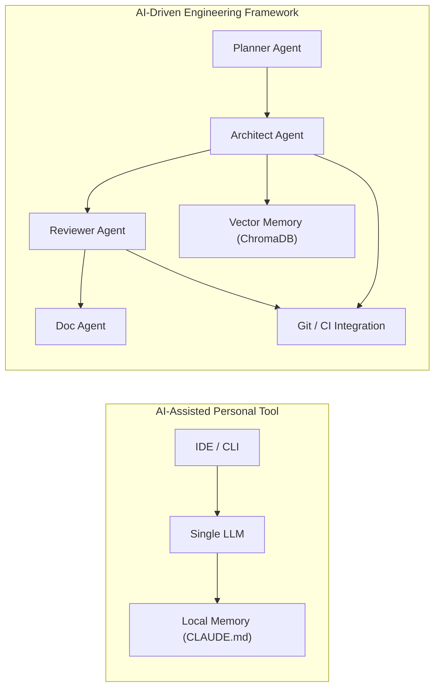

# 🤖 AI-Assisted Personal Tool vs AI-Native Engineering Framework  
**Author:** Woojune Chung (probe@to.nexus)  
**Date:** 2025-10-21  
**Updated:** 2025-10-28  

---

## 1. Overview

| 항목 | **AI-Assisted Personal Tool** | **AI-Driven Engineering Framework** |
|------|-------------------------------|------------------------------------|
| **정의** | 개인 IDE/CLI 내에서 AI를 보조로 활용 | AI가 팀 단위로 개발 사이클 전체를 수행 |
| **구조** | 단일 모델 기반 (Claude Code, Cursor 등) | 다중 역할형 Agent 기반 (Planner, Architect, Reviewer, Doc) |
| **작동 방식** | 사용자가 명령 → AI가 수행 | AI가 스스로 계획 → 실행 → 검증 |
| **결과물** | 코드 diff, 설명, commit | 코드, PR, 리뷰, 문서, 설계 등 완결된 산출물 |
| **지향점** | AI = 개인의 도우미 | AI = 개발조직의 구성원 |

---

## 2. System Structure



---

## 3. Key Differences

| 구분 | **Personal Tool** | **Engineering Framework** |
|------|------------------|---------------------------|
| **주체** | 인간이 명령을 내림 | AI가 자율적으로 실행 |
| **지식 저장소** | 로컬 설정파일 (`CLAUDE.md`) | Vector Memory (Chroma) |
| **맥락 유지** | 세션 단위 | 장기 프로젝트 단위 |
| **협업 방식** | 단일 모델 | 전문화된 Agent 협력 (Architect = 설계+구현) |
| **결과 단위** | 명령 결과 (diff, commit) | 완성된 기능/PR/문서 |
| **운영 범위** | 개인 IDE 중심 | 조직·프로젝트 중심 |

---

## 4. Clarifying “Global FE/BE/Designer Agents”

Claude Code 환경에서는 “전역으로 FE, BE, Designer 등의 에이전트를 생성한다”는 표현이 쓰인다.  
이는 여러 독립 에이전트를 의미하기보다는,  
**하나의 모델이 역할별 프롬프트 설정(profile)** 을 바꿔가며 응답하는 구조다.  

즉, 전역 설정은 “어떤 스타일로 답하라”는 규칙 집합이고,  
AI Framework의 에이전트는 “어떤 일을 수행하라”는 **실행 단위(entity)** 이다.

| 구분 | **Global Agent (설정형)** | **Framework Agent (실행형)** |
|------|----------------------------|------------------------------|
| **정체** | 프롬프트 프로필 | 독립 실행 모듈 |
| **생명주기** | 명령 시 생성 | 지속적 상태 유지 |
| **기억 구조** | 텍스트 기반 (`CLAUDE.md`) | Vector Memory |
| **의사결정** | 없음 (응답형) | 있음 (자율형) |
| **조직 구조** | 단일 모델, 규칙 분리 | 다중 에이전트 협력 |

📌 **요약:**  
> “Global FE/BE Agent”는 역할 규칙을 구분한 설정 파일,  
> “Framework Agent”는 실제로 행동하고 협업하는 실행 프로세스다.

---

## 5. Workflow Example

| 단계 | **Personal Tool** | **Framework** |
|------|-------------------|---------------|
| 기능 요청 | 사용자가 명령 (`claude fix`) | Planner가 목표 분석 |
| 설계/구현 | AI가 단순 코드 제안 | Architect가 설계 및 코드 생성·커밋 |
| 검토 | AI가 diff 설명 | Reviewer가 자동 리뷰 후 피드백 |
| 문서화 | 없음 | Doc Agent가 문서 자동 생성 |

---

## 6. Industry Trend — AI Engineering Frameworks

2024–2025년, **AI가 개발팀처럼 작동하는 프레임워크**가 본격화되고 있다.

| 프로젝트 | 조직 | 설명 |
|-----------|------|------|
| **Devin** | Cognition Labs | Git repo 분석·개발·PR까지 수행하는 autonomous engineer |
| **OpenDevin** | OSS | Devin 오픈소스 버전, multi-agent 구조 |
| **SWE-Agent** | Meta/CMU | 코드 이해·테스트 자동화 집중 |
| **AutoDev** | Builder.io 등 | 사내 CI/CD·Jira 통합형 DevOps AI |
| **현재 시스템** | 내부형 AI Engineering OS | Planner/Architect/Reviewer/Doc 구조로 개발 자동화 수행 (Architect = 설계+구현) |

📌 **요약:**  
> Personal Tool은 **IDE 보조 AI**,  
> Framework는 **자율적으로 일하는 개발조직 AI** 다.

---

## 7. Memory System Comparison

| 구분 | **Claude Code Memory** | **Framework Memory (ChromaDB)** |
|------|--------------------------|--------------------------------|
| **저장 형태** | Markdown 텍스트 (`CLAUDE.md`) | 임베딩 벡터 |
| **검색 방식** | 단순 문자열 포함 | 의미 유사도(Semantic Similarity) |
| **작성 주체** | 사용자가 CLI로 직접 저장 | Agent가 자동 기록 및 업데이트 |
| **맥락 반영 방식** | 파일 전체를 prompt에 삽입 | 의미 기반 검색으로 관련 문맥만 주입 |
| **지속성** | 프로젝트 단위 | 장기·조직 단위 (버전 관리 가능) |
| **역할** | Prompt context 저장 | 실제 지식 기반(Knowledge Base) + 의사결정 기록 |
| **활용도** | 단순 참조용 | Agent 간 지식 공유 및 학습 |

📌 **요약:**  
> Claude Code의 “메모리”는 설정 파일 기반의 수동 컨텍스트이고,  
> Framework의 “메모리”는 의미 기반의 자동 기억 시스템이다.  
> 즉, **전자는 노트, 후자는 뇌.**

---

## 8. Summary

| 비교 포인트 | Personal Tool | Engineering Framework |
|--------------|----------------|-----------------------|
| **AI 역할** | 개발자 보조 | 개발자 대체/협업 |
| **작동 방식** | 명령형 | 자율형 |
| **기억 구조** | 텍스트 기반 | 벡터 기반 |
| **결과 단위** | 코드 조각 | 완결된 기능/PR |
| **목표** | 개인 생산성 | 조직 자동화 |

---

## 9. Conceptual Hierarchy

```
AI-Assisted Personal Tool
   └─ Enhances individual productivity
        ↓
AI-Driven Engineering Framework
   └─ Automates team-level workflows
        ↓
Multi-Agent Engineering OS
   └─ Each Agent acts as a specialized engineer
```

**In short:**  
> The personal tool is *AI inside your IDE*,  
> The framework is *AI acting as your engineering team.*
