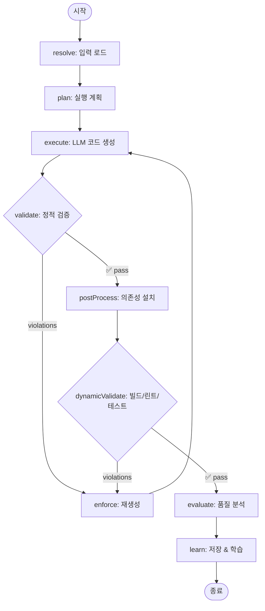

# Code Generation Workflow

ANT의 코드 생성 워크플로우 전체 흐름을 설명합니다.

---

## 📊 전체 Graph 흐름



---

## 🔄 단계별 설명

### 1. **resolve** - 입력 로드
```typescript
// 로드하는 것:
- PRD (선택)
- Design 문서 (선택)
- Directive (필수 or design)
- 관련 코드베이스 (CodebaseRetriever)
- 프로젝트 프로필
```

**출력**: 
- `design`, `directive`, `code`, `profile`

---

### 2. **plan** - 실행 계획
```typescript
// LLM에게 물어봄:
"How would you implement this?"

// 생성:
- 파일 구조
- 구현 순서
- 주요 결정사항
```

**출력**: 
- `planText`

---

### 3. **execute** - 코드 생성
```typescript
// LLM에게 물어봄:
"Generate the complete code following this plan"

// 생성:
- 파일 내용들
- 삭제할 파일 목록
```

**출력**: 
- `files[]`, `filesToDelete[]`

---

### 4. **validate** - 정적 검증

#### 검증 항목:
1. ✅ **Ellipsis 체크** - `...` 없어야 함
2. ✅ **파일 존재** - 최소 1개 이상
3. ✅ **기본 구조** - 올바른 형식

#### 성공 시:
→ `postProcess`로 이동

#### 실패 시:
→ `violations` 추가 → `enforce`로 이동

**출력**: 
- `violations[]` (있으면)

---

### 5. **postProcess** - 의존성 설치

#### 실행 조건:
- `package.json` 생성/수정됨
- `config.localPath` 설정됨
- `CommandPort` 사용 가능

#### 수행 작업:
1. 📦 **패키지 매니저 감지** (pnpm/npm/yarn)
2. 📦 **의존성 설치** (`npm install`)
3. 🔧 **Git 초기화** (새 프로젝트)

#### 왜 여기서?
**의존성이 설치되어야 빌드/테스트가 가능하기 때문!**

```typescript
// 예시:
// 1. 코드에 "import express from 'express'" 추가
// 2. package.json에 express 추가
// 3. npm install 실행 ← 여기!
// 4. 이제 빌드 가능
```

**출력**: 
- 의존성 설치 완료

---

### 6. **dynamicValidate** - 빌드/린트/테스트

#### 실행 조건:
- `config.strictValidation === true`
- 의존성 이미 설치됨 (postProcess 후)

#### 검증 항목:
1. 📘 **Type Check** - `tsc --noEmit`
2. 🔍 **Lint** - `eslint`
3. 🔨 **Build** - `npm run build`
4. 🧪 **Tests** - `npm test` (선택)

#### 성공 시:
→ `evaluate`로 이동

#### 실패 시:
→ 에러 정보를 `violations`에 추가 → `enforce`로 이동

```typescript
// 실패 예시:
violations = [
  "🔴 DYNAMIC VALIDATION FAILED\n" +
  "📘 Type Errors:\n" +
  "  - src/index.ts(10,5): error TS2322\n" +
  "⚠️  Please fix these errors"
]
```

**출력**: 
- `dynamicValidationResult`
- `violations[]` (실패 시)

---

### 7. **enforce** - 재생성

#### 트리거:
- `validate` 실패
- `dynamicValidate` 실패

#### 동작:
```typescript
const reasonHeader = 
  "VIOLATION DETECTED\n" +
  "Regenerate COMPLETE files.\n" +
  "Preserve originals.\n" +
  "No ellipsis.\n" +
  "Minimal changes only.";

// + violations 내용
```

LLM에게 에러 정보와 함께 재생성 요청

#### 재시도 횟수:
- 기본: `maxRetries = 1`
- `retries++` 후 다시 `execute`

---

### 8. **evaluate** - 품질 분석

#### 분석 항목:
1. 📊 **Lines of Code**
2. 📊 **Cyclomatic Complexity**
3. 📊 **Maintainability Index**

#### 생성:
- `report.md` (평가 보고서)
- `report.json` (메트릭)

**출력**: 
- `evaluationReport`

---

### 9. **learn** - 저장 & 학습

#### 수행 작업:
1. 💾 **파일 저장** - Git 브랜치에 저장
2. 📚 **학습 추출** - 세션 정보 생성
3. 🗄️ **Vector DB 저장** - 장기 기억
4. 📝 **Session 저장** - 단기 기억

**출력**: 
- `branch`, `filesWritten`, `learnings`

---

## 🔄 재시도 흐름

### 시나리오 1: Static Validation 실패

```
execute → validate (ellipsis 발견)
            ↓
         enforce (재생성 with "no ellipsis")
            ↓
         execute (다시 생성)
            ↓
         validate (통과)
            ↓
         postProcess
```

### 시나리오 2: Dynamic Validation 실패

```
postProcess (npm install 완료)
    ↓
dynamicValidate (type error 발견)
    ↓
enforce (재생성 with type error info)
    ↓
execute (타입 수정하여 생성)
    ↓
validate (통과)
    ↓
postProcess (이미 설치됨, skip)
    ↓
dynamicValidate (통과!)
```

### 시나리오 3: 최대 재시도 초과

```
retries = 0
execute → validate (fail) → enforce → retries = 1
execute → validate (fail) → enforce → retries = 2
execute → validate (fail) → retries >= maxRetries
    ↓
postProcess (그냥 진행)
    ↓
dynamicValidate (skip or fail)
    ↓
evaluate (문제 있어도 분석)
    ↓
learn (저장)
```

---

## 🎯 핵심 포인트

### 1. **왜 postProcess가 dynamicValidate 전에?**

❌ **잘못된 순서**:
```
dynamicValidate → postProcess
```
- 의존성 없어서 빌드 실패
- npm install 후 다시 검증 안 함

✅ **올바른 순서**:
```
postProcess → dynamicValidate
```
- 의존성 먼저 설치
- 제대로 빌드/테스트
- 실패하면 재생성

### 2. **Static vs Dynamic Validation**

| | Static | Dynamic |
|---|--------|---------|
| **시점** | 코드 생성 직후 | 의존성 설치 후 |
| **검증** | 형식, 구조 | 빌드, 타입, 린트 |
| **빠르기** | 빠름 (<1초) | 느림 (수 분) |
| **필수** | 항상 | 선택 (strictValidation) |

### 3. **재시도 전략**

```typescript
if (violations && retries < maxRetries) {
  retries++;
  return "enforce";  // 재생성
} else {
  return "next";     // 계속 진행
}
```

**재시도 횟수 제한 이유**:
- 무한 루프 방지
- 비용 절감 (LLM API)
- 사용자 개입 필요할 수 있음

---

## 📈 성능 최적화

### 캐싱

```typescript
// CodebaseRetriever
- Git diff 결과 캐시
- Vector search 결과 캐시

// postProcess
- 이미 설치된 의존성 skip
- package.json 변경 없으면 skip
```

### 병렬 처리 (미래)

```typescript
// 현재: 순차
validate → postProcess → dynamicValidate

// 미래: 병렬
validate → [postProcess, lint] → build → test
```

---

## 🔍 디버깅

### 각 노드 출력 확인

```bash
npm run dev architect code workspace/my-app/feature1/

# 출력:
# 🔍 Retrieving relevant codebase...        ← resolve
# ✅ Strategy: git, Files: 5, Tokens: 1000  ← resolve
# 
# 📝 Generating implementation plan...       ← plan
# ✅ Plan generated                          ← plan
# 
# 🤖 Generating code...                      ← execute
# ✅ Code generated (3 files)               ← execute
# 
# ✔️  Validating generated code...           ← validate
# ✅ Validation passed                       ← validate
# 
# 📦 Installing dependencies with pnpm...    ← postProcess
# ✅ Dependencies installed                  ← postProcess
# 
# 🔍 Running dynamic validation...           ← dynamicValidate
# 📘 Running TypeScript type check...        ← dynamicValidate
# ✅ Type check passed                       ← dynamicValidate
# 🔍 Running ESLint...                       ← dynamicValidate
# ✅ Lint passed                            ← dynamicValidate
# 
# 🔬 Evaluating generated code...            ← evaluate
# ✅ Evaluation complete                     ← evaluate
# 
# 💾 Saving to branch...                     ← learn
# ✅ Saved to branch feature/my-feature     ← learn
```

---

## 🎯 요약

**올바른 순서**:
```
resolve → plan → execute → validate → postProcess → dynamicValidate → evaluate → learn
                              ↓                          ↓
                           enforce ←──────────────────────┘
```

**핵심**:
1. ✅ Static validation 먼저 (빠른 체크)
2. ✅ Dependencies 설치 (postProcess)
3. ✅ Dynamic validation (제대로 빌드/테스트)
4. ✅ 실패하면 에러 정보와 함께 재생성
5. ✅ 성공하면 품질 분석 후 저장

**Cursor 스타일 워크플로우 완성!** 🚀

