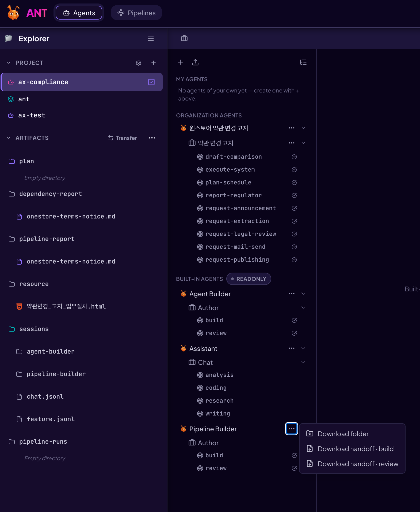

# 빌더 핸드오프 — 같은 작업을 외부 에이전트에게

English: [README.md](README.md)

Ant 에는 빌트인 빌더가 둘 있습니다. `agent-builder` 와 `pipeline-builder` 이고,
각각 `author` 잡 하나에 인텐트 둘을 가집니다. `build` 는 정의를 만들거나 고치고
리포트를 남기며, `review` 는 완성된 정의를 그것이 만들어진 소재와 대조해 판정하고
리포트를 남깁니다. `packages/ant-cli/src/core/data/agents/` 아래의 프로즈가
**계약 그 자체**입니다. 파일 형식, 설계 교리, 리포트 골격, 완료 훅이 전부 거기 있고,
`packages/ant-cli/tests/customAgents/builtin-agents.test.ts` 가 실제 검증기로 그것을
실행합니다.

이 작업은 Ant 안에서 해도 됩니다. 컴포저에서 `Agent Builder` 또는
`Pipeline Builder` 를 고르고, `@ctx` 로 소재를 첨부한 뒤, `build` 나 `review`
인텐트를 핀하면 됩니다. 아래 내용은 그 경로를 대체하지 않습니다. 같은 작업을 다른
곳에서 도는 에이전트에게 넘기는 방법이고, 프론티어 모델을 붙일 수 있어 결과가 더
좋은 경우가 많습니다.

이 디렉토리의 문서들은 어떤 에이전트든 빌트인과 똑같은 작업을 하고 똑같은 산출물을
내놓게 합니다. 계약을 복사하지 않고 그렇게 합니다. **각 핸드오프는 채널 차이만
담습니다.** 어떤 계약 파일을 어떤 순서로 읽는지, 그리고 프로즈가 "API를 호출하라"고
말하는 자리에서 오프라인으로는 무엇을 하는지입니다. 규칙을 다시 쓰지 않으므로,
핸드오프와 빌트인 프로즈가 어긋나면 프로즈가 정답이고 핸드오프가 버그입니다.

| 핸드오프 | 빌더 / 인텐트 | 산출물 |
|---|---|---|
| `docs/guides/builder-handoff/agent-build.md` | `agent-builder` / `build` | 에이전트 정의 폴더 + `dependency-report/{agentId}.md` |
| `docs/guides/builder-handoff/agent-review.md` | `agent-builder` / `review` | `review-report/{agentId}.md` |
| `docs/guides/builder-handoff/pipeline-build.md` | `pipeline-builder` / `build` | `pipeline.yaml` 하나 이상 + `pipeline-report/{flowId}.md` |
| `docs/guides/builder-handoff/pipeline-review.md` | `pipeline-builder` / `review` | `review-report/{pipelineId}-pipeline.md` |

## 1. 핸드오프 받기

각 핸드오프는 **자급형 마크다운 번들 한 파일**로 내려받습니다. Part 1 이 핸드오프,
Part 2 는 그 핸드오프가 지명하는 계약 파일 전문, Part 3 은 검증을 통과하는 예제입니다.
이 파일 하나를 마크다운을 읽는 아무 에이전트에게나 주면 됩니다. 저장소 클론은 필요
없습니다.

Ant 에서: **Agent Settings → 해당 빌더 행의 ⋯ 메뉴 → "핸드오프 내려받기 · build"**
(리뷰는 `· review`). 에이전트를 만들 때는 `Agent Builder`, 파이프라인은
`Pipeline Builder` 입니다. 서버가 자기 정의 파일로 번들을 합치므로, 에이전트가 읽는
버전이 곧 반입될 버전입니다.



클론이 있다면: `pnpm --filter @ant/cli definition handoff agent-builder author build --out handoff.md`

## 2. 작업에 필요한 것 받기

나머지도 전부 Ant UI 에서 내려받습니다. 해당되는 것만 받아 에이전트가 작업할 폴더에
두면 됩니다.

| 무엇 | 어디서 | 언제 필요한가 |
|---|---|---|
| 소재 | 팀이 보관하는 곳 — 업무 인벤토리의 도메인 폴더, 절차서, 일정표 | 항상. 에이전트는 전부 읽습니다 |
| 기존 에이전트 정의 | Agent Settings → 그 에이전트의 ⋯ → **Download folder** (zip, 압축 해제) | 에이전트를 고치거나 리뷰할 때 |
| 기존 파이프라인 | Pipelines 레일 → 그 파이프라인의 다운로드 (zip, 압축 해제) | 파이프라인을 고치거나 리뷰할 때 |
| 파이프라인이 실행할 에이전트들 | Agent Settings → 각 에이전트의 ⋯ → **Download folder** | 파이프라인을 만들거나 리뷰할 때 |
| 이전 리포트 | 프로젝트 Artifacts 패널 → `dependency-report/`, `pipeline-report/`, `review-report/` | 고칠 때, 그리고 모든 리뷰 |

빌트인 정의는 내려받지 않습니다. 번들의 Part 2 에 해당 빌더의 것이 들어 있고, 클론이
있으면 `packages/ant-cli/src/core/data/agents/` 아래에 있습니다. 그 id 들은 어느 쪽이든
이미 사용 중이라 쓸 수 없습니다.

## 3. 에이전트에게 시키기

준비한 폴더에서 에이전트를 엽니다. 한 줄이면 충분합니다. 나머지는 핸드오프가
지시합니다.

```
handoff.md 를 읽고 그대로 수행해라. 작업 디렉토리는 이 폴더다.
소재는 material/ 아래 전부다.
끝나면 무엇을 어디에 만들었고 사람이 할 일이 무엇인지 목록으로 보고해라.
```

실제로 붙인 이름을 쓰면 됩니다. "여기서 작업해라, 소재는 저기 있다" 외에 폴더 구조를
정해줄 필요는 없습니다. 각 핸드오프가 진짜로 구속력이 있는 두세 가지 이름만 말합니다.
정의 폴더의 이름은 에이전트 id, 파이프라인 폴더의 이름은 파이프라인 id, 리포트 파일명은
그것이 다루는 id 입니다. 나머지는 에이전트가 알아서 하고, 어디에 두었는지 보고합니다.

양보할 수 없는 규칙이 하나 있고 핸드오프마다 반복됩니다. **Ant 클론 밖에서
작업하십시오.** 저장소 루트나 `packages/`, `docs/` 아래에 쓰면 git 작업 트리에
섞이고, 체크아웃 한 번에 쓸려 갈 수 있습니다.

## 4. 산출물 반입하기

여기부터는 사람이 Ant UI 에서 합니다. 빌더의 API 토큰은 업로드 라우트에서 의도적으로
거부되므로, Ant 안에서 도는 에이전트는 이 단계를 할 수 없습니다.

1. 에이전트 폴더 → Agent Settings → 목록 상단의 업로드 아이콘 → 정의 폴더를 선택.
   `409` 가 뜨면 내 소유 에이전트를 덮어쓸지 물어봅니다. 응답에 잡별 로더 판정이
   실려 오고 화면에 표시됩니다.
2. `pipeline.yaml` → Pipelines 레일 → 업로드 → 파일이나 그 폴더를 선택. 저장된
   파이프라인은 비활성 초안이고, 켜고 프로젝트에 활성화하는 것은 사람의 몫입니다.
3. 리포트 → 프로젝트 Artifacts 패널 → `dependency-report/`, `pipeline-report/`,
   `review-report/` 중 해당 폴더에 업로드. 그 프로젝트의 다음 빌더 턴이 자기가 쓴
   것처럼 읽습니다.

**클론이 없으면 업로드가 곧 검증기입니다.** 에이전트 폴더 반입과 파이프라인 업로드가
응답에 로더 판정을 실어 오고 화면이 보여줍니다. 그 문구를 에이전트에게 그대로 붙여
고치게 한 뒤 다시 올리면 됩니다.

## 5. 품질 올리기 — 리뷰, 수정, 다시 리뷰

리뷰 핸드오프는 반복해서 돌리라고 있는 것입니다. **빌드와 다른 세션에서** 돌리십시오.
작성자의 추론을 컨텍스트에 들고 있는 리뷰어는 자기 자신을 감사하게 되고, 이 실패는
가설이 아니라 측정된 사실입니다.

1. 정의를 그것이 만들어진 소재와 대조해 리뷰합니다. 리포트에는 소재 파일 하나당 Trace
   행이 하나씩 있습니다. 옮겨졌는지, 병합됐는지, 쪼개졌는지, 바뀌었는지, 빠졌는지,
   소재에서 폐기된 것인지가 판정으로 들어갑니다. 역방향 대조와, 빌드 리포트가 스스로
   주장한 내용에 대한 검증도 함께 나옵니다.
2. Findings 를 빌드 세션에 넘겨 반영시킵니다.
3. 다시 리뷰합니다. `dropped` 나 `unsourced` 행이 설명 없이 남아 있으면 아직 끝난
   것이 아닙니다.

## 클론이 있다면 — 오프라인 검증기

서버와 같은 커밋의 클론이 있으면 `pnpm --filter @ant/cli definition <command>` 를 쓸 수
있습니다. 저장소 루트에서 `pnpm install` 과 `pnpm --filter @ant/shared build` 를 먼저
합니다. 서버가 반입 시점에 돌리는 바로 그 함수들(`gateDefinitionSave`,
`loadCustomJob`, `validatePipelineDefServer`, 카탈로그 어드바이저리, 크론 파서)을
실행하므로, 여기서 통과한 폴더는 반입도 통과합니다. 종료 코드는 `0` 이상 없음,
`1` 지적 있음, `2` 사용법 오류입니다. 커밋이 서버와 다르면 다른 규칙으로 판정하니
주의하십시오. 번들 경로에는 이 문제가 없습니다.

| 명령 | 무엇을 답하는가 |
|---|---|
| `pnpm --filter @ant/cli definition validate-agent <agentDir>` | 잡마다 `GET /definitions/agents/{agentId}/jobs/{jobId}/validate` 가 답할 내용, 그리고 파일마다 `PUT /definitions/agents/{agentId}/file` 이 거부했을 내용 |
| `pnpm --filter @ant/cli definition validate-pipeline <pipeline.yaml> --agents <dir>` | 저장 퍼널의 `errors[]` 와 `catalogWarnings` |
| `pnpm --filter @ant/cli definition preview-fires "<cron>" --tz <zone>` | `POST /definitions/pipelines/preview-fires` |
| `pnpm --filter @ant/cli definition check-review <report.md> <materialDir>` | 리뷰 리포트의 Trace 표가 소재 파일을 빠짐없이, 그리고 없는 파일 없이 담았는지 |
| `pnpm --filter @ant/cli definition handoff <agentId> <jobId> <intentId> --out <file>` | "핸드오프 내려받기" 메뉴가 주는 것과 같은 번들을, 이 클론에서 합성 |

클론이 있으면 번들 대신 핸드오프 파일 경로를 그대로 주고, 마무리에 검증을 덧붙일 수
있습니다.

```
/path/to/ant/docs/guides/builder-handoff/agent-build.md 를 읽고 그대로 수행해라.
작업 디렉토리는 이 폴더다 (클론 안이 아니다). 소재는 material/ 아래 전부다.
보고하기 전에 /path/to/ant 에서 핸드오프가 말하는 validate 명령을 돌려 exit 0 인지 보여달라.
```

## 가드가 고정하는 것

`packages/ant-cli/tests/policy/builder-handoff-binding.test.ts` 는 핸드오프가 자기가
대변하는 정의와 어긋나면 빌드를 실패시킵니다. 읽기 목록에서 빠진 파일, 존재하지 않는
경로, 빌트인의 `hooks.yaml` 이나 `on-demand/api-surface.md` 와 다르게 적힌 훅이나
라우트, 등록되지 않은 CLI 명령, 순서가 틀린 절이 그 대상입니다. 산문은 고정하지
않습니다. 결속만 고정합니다.
