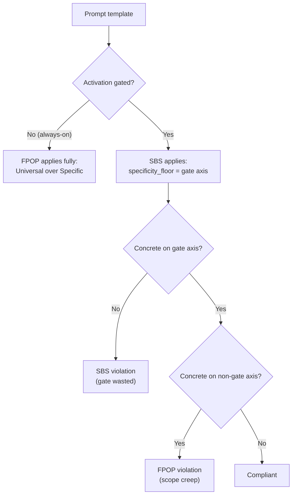

# Prompt System

## Overview

ANT's prompt system is designed around a **declarative configuration (PromptBuildConfig) + 4-tier injection model**. Templates are Handlebars-based, and depending on the use case the final prompt is assembled either through the `PromptBuilder.build()` pipeline or by calling `promptBuilder.render()` directly.

## Core Principle: No Hardcoded Prompts

All LLM prompt text is written in `.md` template files. System prompts are never hardcoded in TypeScript code as string constants (`const SYSTEM_PROMPT = ...`) or template literals.

Allowed in code:
- Dynamic data assembly (conversation slices, extracting state values, etc.)
- Calling `promptBuilder.render()` or `promptBuilder.build()` and passing variables
- LLM response parsing logic

Forbidden in code:
- Defining system/user prompt text as TS constants
- Describing prompt rules or roles as strings inside code

Rationale: prompt edits require only template changes with no code change/build, FPOP validation stays easy, and prompt logging/testing remain consistent.

## WHAT/HOW Split

| Prefix | Role | Content |
|--------|------|------|
| `base-*.md` | WHAT | Context, data, current state, task definition |
| `rules-*.md` | HOW | Rules, formats, constraints, methods |

### Conventions

- Do not put rules/constraints/prohibitions in `base-*.md`
- Do not put dynamic data/context injection in `rules-*.md`
- All prompts are written in English
- No project-specific examples (platform/language neutral)

## Template Directory Structure

```
core/prompt/templates/
    code/
        phases/
            decompose/      (base.md, rules.md)
            detect/         (base.md, rules.md)
            enforce/        (rules-enforcement.md)
            execute/        (base.md, rules.md, tasks/*, languages/*)
            plan/           (base.md, rules.md, tasks/*)
            revise/         (base.md, rules.md)
        base/
            system.md
            examples.md
            injections/     (git-diff, retrieved-code, preview-setup, etc.)
            tools/          (per-tool partials)
    design/
        phases/
            decompose/      (base.md, rules.md, per-variant base-*.md)
            detect/         (base.md, rules.md)
            execute/        (base-*.md, rules-*.md, injections/*)
        base/
            system.md
            injections/     (document-language, frontend-guide, backend-guide, etc.)
    common/
        injections/         (directive, memory, action-context, refactor-guidance, etc.)
        compaction/         (compaction-related partials)
    agents/
        architect/          (base.md, rules.md)
        creator/            (base.md, rules.md)
    visual/
        nodes/
            direct/         (base.md, rules.md, context.md)
            engrave/        (base.md, rules.md)
        injections/         (asset-logo.md, asset-icon.md, asset-hero.md)
    planner/
        plan/               (base.md, rules.md)
    basis/
        techTier/
            language/       (typescript.md, go.md)
            framework/      (react.md, nextjs.md, react-native.md, gin.md)
        visualTier/
            design-system/  (.gitkeep)
    triage/                 (base.md, rules.md)
    ask/                    (base.md, rules.md)
    learn/                  (system.md)
```

## Prompt Assembly Paths

There are two paths for prompt assembly. Both use the same infrastructure (`initPartials`, `FilePromptAdapter`, Handlebars).

| Path | Used by | Description |
|------|--------|------|
| A: `PromptBuilder.build(config)` | code execute, design system-design | Full pipeline including 4-tier injection + profiles + guardrails |
| B: `promptBuilder.render(template, vars)` | decompose, detect, plan, revise, ui-design, spec, visual, ask, triage | Direct template rendering. `{{> partial}}` assembly inside the template |

Path B suits cases where injection resolution is unnecessary, or where the full pipeline is overkill — e.g. conversational nodes.

## PromptBuilder Architecture (Path A)

`PromptBuilder` takes a `PromptBuildConfig` and assembles the prompt in 4 stages.

### PromptBuildConfig (Declarative Configuration)

The caller declares the WHAT; PromptBuilder decides the HOW:

```
PromptBuildConfig
├── templates: { base, rules?, system? }     ← template paths to render
├── intent?: IntentId                         ← determines Tier I policies
├── artifactPolicies?: PolicyKey[]            ← precomputed Tier N results
├── techContext?                              ← Tier A+D input signals
│   ├── techTier / techTiers                  ← tech stack (derived at decompose)
│   ├── taskType                              ← feature/setup/verification/error/test-code/doc
│   ├── mode                                  ← generate/refactor/explain
│   └── resolvedAction                        ← RAC object
├── pipeline                                  ← feature flags
│   ├── sanitizeInput                         ← boundary-tag user input
│   ├── includeTechProfile                    ← language/framework profiles
│   ├── includeExamples                       ← examples section
│   ├── applyPolicyGuardrails                 ← guardrails + quality policies
│   └── strictValidation                      ← strict mode
├── vars: Record<string, unknown>             ← Handlebars variables
└── artifacts?: ResolvedArtifact[]            ← role-labeled artifacts
```

### The 4 Build Stages

| Stage | Description |
|------|------|
| 1. Injection Resolution | Determine the list of injection templates via the 4-tier model (detailed below) |
| 2. Variable Preparation | artifacts → documents/hasDocuments, resolvedAction synchronization, optional sanitize |
| 3. Section Rendering | Render in order: system → profiles → rules → injections → examples → base(user) |
| 4. Assembly | Merge sections + wrap with guardrails/quality policies → return system/user strings + separate sections |

### PromptBuildResult

```
PromptBuildResult
├── system: string                ← full system prompt (merged)
├── user: string                  ← user prompt (base template)
├── sections                      ← for cache-block separation (Anthropic prompt caching, etc.)
│   ├── systemBase                ← system template (low change frequency)
│   ├── rules                     ← rules template
│   ├── injections                ← merged injection text
│   ├── profiles                  ← tech profiles
│   ├── examples                  ← examples
│   └── failedTemplates           ← render-failure diagnostics
├── injections: string[]          ← list of applied injection paths
└── buildTimeMs: number           ← build duration
```

## 4-Tier Injection Model

PromptBuilder collects injection templates from 4 independent tiers and deduplicates them.

```
Tier I (Intent)        → prompt-policy-matrix[intent].policies
Tier A (Auto-tech)     → AutoInjectionResolver (techTier, taskType, mode, phase, job)
Tier D (Data-presence) → AutoInjectionResolver (data flags extracted from vars)
Tier N (Artifact-cond) → deriveArtifactPolicies() (config-matrix slots × actual artifacts)
```

### Tier I: Intent Policies

`prompt-policy-matrix.ts` in `@ant/shared` defines the `IntentId → IntentPromptPolicy` mapping.

| Field | Description |
|------|------|
| `policies: PolicyKey[]` | Static policies applied unconditionally for the intent |
| `conditionalPolicies` | Applied only when artifacts are present (handled at Tier N) |
| `refMediaHints` | Media-type hints for ref artifacts (text, image) |

`POLICY_TEMPLATE_MAP` maps `PolicyKey → template path`:

| PolicyKey | Template path |
|-----------|-------------|
| `ui-design-policy` | `common/injections/ui-design-policy` |
| `visual-source-authority` | `common/injections/visual-source-authority` |
| `frontend-guide` | `design/base/injections/frontend-guide` |
| `backend-guide` | `design/base/injections/backend-guide` |
| `api-contract-guide` | `design/base/injections/api-contract-guide` |

Example: the `gen-sys-full` intent → static injection of `['frontend-guide', 'backend-guide', 'api-contract-guide']`.

### Tier A: Auto-tech (Static Technical/Workflow Context)

`AutoInjectionResolver` decides based on `techTier`, `taskType`, `mode`, `job`, and `phase`:

| Condition | Injection |
|------|------|
| frontend stack + feature/setup/error type | `visual-source-authority` |
| setup type + language detected | `languages/{lang}/setup/constraints` |
| execute phase + code job + environment | `languages/{lang}/environments/{env}/rules` |
| frontend + execute | `preview-setup` |
| code job + execute | `tool-calling-rules-compact`, `preview-env-contract`, `port-management` |
| backend stack | `backend-safety` |
| test-code + language | `languages/{lang}/test-code/hints` |
| design job + execute | `document-language` |

### Tier D: Data-presence (Data Existence Flags)

`PromptBuilder.extractDataSignals()` extracts flags from `vars`, and `AutoInjectionResolver` handles them:

| Flag | Injection |
|--------|------|
| `hasDirective` | `common/injections/directive` |
| `hasMemory` | `common/injections/memory` |
| `hasGitDiff` | `code/base/injections/git-diff` |
| `hasRetrievedCode` | `code/base/injections/retrieved-code` |
| `hasReferenceCode` | `code/base/injections/reference-code` |
| `hasRetryContext` | `code/phases/execute/injections/retry-context` |
| `hasLessons` | `code/phases/execute/injections/lessons` |
| `hasSessionContext` | `code/phases/execute/injections/session-context` |
| `hasMissingDependency` | `code/phases/execute/injections/missing-dependency-fix` |
| `hasRuntimeError` | `code/phases/execute/injections/runtime-error-fix` |

RAC-based injections also belong to Tier D:

| Condition | Injection |
|------|------|
| `resolvedAction` present | `common/injections/action-context` |
| `resolvedAction.mode === 'refactor'` | `common/injections/refactor-guidance` |
| `resolvedAction.mode === 'explain'` | `common/injections/explain-guidance` |

### Tier N: Artifact-conditional Policies

`ArtifactRoleResolver.deriveArtifactPolicies(intent, artifacts)` is responsible:

1. Look up the intent's `conditionalPolicies` in `prompt-policy-matrix`
2. Intersect with the slots in `action-config-matrix` — the policy applies when a slot matches the `slotPath` and an artifact actually exists whose path starts with it

Example: `gen-code-sys` intent + a UI design document under the `visual/ui/ant` path → inject `ui-design-policy`. The interpretation contract for each of the three UiSources is routed via `ui-source-dispatch` to one of `ui-source-{ant,figma,handoff}.md`.

## ArtifactRoleResolver

An artifact's `role` is determined upstream (FE slot placement or `loadResolvedArtifacts`). ArtifactRoleResolver never re-derives roles; it is responsible only for deriving Tier N conditional policies.

| Function | Input | Output | Purpose |
|------|------|------|------|
| `deriveArtifactPolicies(intent, artifacts)` | IntentId + artifact array | `PolicyKey[]` | Derive Tier N conditional policies |

## Injection Manifest

`injection-manifest.json` declares the contract between injection templates and their expected variables:

```json
{
  "common/injections": {
    "directive": ["directive"],
    "action-context": ["resolvedAction"]
  },
  "code/base/injections": {
    "git-diff": ["gitDiff"],
    "retrieved-code": ["files", "filePaths", "stats"]
  }
}
```

An empty array (`[]`) means a policy template renderable without variables. A smoke test verifies the existence of every injection file based on this manifest.

## Policy Guardrails

When `pipeline.applyPolicyGuardrails` is true, `PromptBuilder` wraps the system prompt with guardrails and quality policies based on `ruleset.json`:

- **Guardrail section** (`<guardrails>...</guardrails>`): per-job pre-validation rules → inserted **before** the system prompt
- **Quality policy section** (`<quality_policies>...</quality_policies>`): format/prohibition/quality rules → inserted **after** the system prompt

When strict mode is active, additional strict rules are inserted.

## InputSanitizer

When `pipeline.sanitizeInput` is true, user-provided content is wrapped in boundary tags to prevent prompt injection:

- `directive` field → `<user_provided_content type="directive">...</user_provided_content>`
- Each `content` in the `documents` array → `<user_provided_content type="{label|path}">...</user_provided_content>`

## Basis Section (Tech/Visual Profile)

When `pipeline.includeBasis` is true and `config.basis` is present, `PromptBuilder.buildBasisSection()` assembles the basis templates.

**4-axis template structure**:

```
templates/basis/
    techTier/
        language/       (typescript.md, go.md)
        framework/      (react.md, nextjs.md, react-native.md, gin.md)
    visualTier/
        design-system/  (.gitkeep — future expansion)
```

A `<basis axis="...">` section is injected conditionally depending on whether a template exists for each axis. If the file is not found, it is skipped via catch.

`basis.techTier` is **derived at the decompose node**, or preset explicitly from the UI. Jobs that don't pass through decompose (plan, ask, visual) have no techTier, so nothing is injected.

## Hints Layer (Blind-Spot Reminders)

The `basis/techTier/{language,framework}/<X>.md` slot is for **proactive reminders of things the model's pre-training does not cover**. The injection path is confined to a single helper on `AutoInjectionResolver`: `resolveTechTierInjections(job, tiers, taskType)`.

### Purpose of the Slot

| Aspect | Principle |
|------|------|
| Purpose | Pre-training gap reminders (blind-spot reminders) |
| Forbidden | Listing API references, tutorials, or general best practices |
| Filenames | Fixed allowed set. Values outside the set skip injection — no fallback |
| Length policy | No quantitative cap. FPOP/SBS/MECE compliance is the primary gate — bloat regressions are caught in PR review. The former 600-token cap was a cargo-culted heuristic that pushed SBS-mandated specificity into FPOP-violating compression, and was removed |
| Format | SBS + FPOP — specifics along the gate axis (framework / language: version, API, toolchain names) are mandatory; listing project code unrelated to the gate is forbidden. The Hints layer is the canonical application of SBS — when the `framework=X` gate is closed, every sentence in `<X>.md` should be redundant |
| Evidence requirement | PRs adding/changing items must cite the chat/log JSON path of the evidencing job in the commit message |
| Maintenance | Updated only on major releases |

### Allowed Filenames

| Job | language | framework |
|-----|----------|-----------|
| `code` | `typescript-node`, `typescript-browser`, `go` | `nextjs`, `react`, `react-native`, `nestjs`, `gin` |
| `design` | (TBD — structure only) | `nextjs`, `go` |

### Partial Convention (`_` prefix = partial-only)

When the same rules must be reused across multiple frameworks, decompose them into **Handlebars partials**. Files prefixed with `_<name>.md` are **partial-only** — never a direct injection target; other framework/language files include them via `{{> ...}}`.

Current state of the `framework/` directory:

| File | Role | Inclusion relationship |
|------|------|-----------|
| `_react-core.md` | React core (hooks, types, lifecycle, React 19 material) | Included as a partial by `react.md`, `nextjs.md` |
| `_react-csr.md` | CSR-only (Vite SVGR, Vite SWC/Babel) | Included as a partial by `react.md` only |
| `react.md` | Direct injection target for framework='react' | `{{> _react-core}} + {{> _react-csr}}` |
| `nextjs.md` | Direct injection target for framework='nextjs'; Next.js-specific (SSR/RSC/Image/Next build) body | `{{> _react-core}}` + body (no CSR) |

Next.js necessarily uses React but runs in an SSR context, so it must not receive CSR-only rules (bundler, JSX runtime). This is why React core and CSR are split into separate partials, and `nextjs.md` includes only the core partial.

`basis/techTier/language/_typescript-common.md` is the precedent for the same convention (TS's language-common preamble; Go has its own file). On the language axis, the stack (frontend/backend) split is filename-based so no partial is needed, but on the framework axis `react` is reused across multiple runtimes (browser CSR, Next.js SSR, RN), so partial decomposition is warranted.

### Partial Rendering Mechanism

The basis section is assembled via `PromptBuilder.buildBasisSection` → `pushBasisTemplate` → `promptPort.render(path, {})`. `render` goes through the Handlebars compiler, so `{{> name}}` parsing/expansion works. Passing an empty variable map (`{}`) is fine because basis files are static markdown with no `{{variable}}` bindings, so no missing-var warnings arise.

`tests/techtier-hint-budget.test.ts` verifies structure + the MECE invariant only: allowed filenames, allowed H2 sections and their order, React core rule occurrence in the partial-expansion result, and blocking of CSR-only markers in nextjs. It carries no quantitative token cap (see the length policy above).

### Allowed Sections for the Code Job (fixed order and headers)

| # | Section | Meaning |
|---|------|------|
| 1 | `## Forbidden Patterns` | Patterns that compile but fail at runtime/hydration |
| 2 | `## Symptom → Upstream Cues` | A symptom repeating across N ≥ 5 files signals an upstream config issue — no local patching |
| 3 | `## Version Notes` | 2–3 API migrations from the previous major |
| 4 | `## Toolchain Compatibility` | 2–3 major compatibility notes for runtime/runner/builder |

Each section is optional; omitted sections don't include the header either. Headers outside the allowed set are blocked by a linter.

### Injection Conditions (SSOT: `AutoInjectionResolver.resolveTechTierInjections`)

| Job | Condition | Injection |
|-----|------|------|
| `code` | `taskType ∈ {verification, error, ui, feature, setup}` | framework + language together |
| `code` | `taskType ∈ {test-code, doc}` | skip — framework blind-spots are irrelevant to test scaffolding/documentation writing |
| `design` | framework/language identifiable | framework + language together |

Blind-spot hints are primarily **preventive** knowledge (Forbidden Patterns / Version Notes), so they must be injected at authoring time (feature/setup) to prevent the problem from occurring at all. verification/error is a secondary diagnostic-time use. The relationship to `setup/config` is complementary, not duplicative (conventions vs blind-spots).

**Path rules**:

```
jobs/{job}/basis/techTier/language/{typescript-node|typescript-browser|go}
jobs/{job}/basis/techTier/framework/{allowed-framework-name}
```

Unknown languages/frameworks **skip** injection (absolutely no fallback — risk of injecting the wrong path).

### Design Job Section Spec

For the design job, only the **structure and wiring** are standardized at this stage; the section spec and allowed file set will be finalized in follow-up work. Wiring goes through the same `resolveTechTierInjections(job='design', tiers, taskType)` as the code job.

### Non-FPOP Prohibitions

- ❌ Tutorial phrasing like "How do I use X?"
- ❌ Concrete import examples (whether recommended or forbidden)
- ❌ Snippet listings (observation principles should be prose)
- ❌ Repeated "You MUST..." admonitions — FPOP states constraints neutrally

### Non-SBS Prohibitions

- ❌ `basis/techTier/framework/<X>.md` never naming X's name/version/toolchain even once — the gate's information payload becomes 0 and the injection loses its value
- ❌ A mode-gated file like `common/injections/refactor-guidance.md` containing only general best practices unrelated to the mode
- ❌ An intent/taskType variant file carrying no variant-specific guidance distinguishing it from the same phase's default file — the variant is SBS-empty
- ❌ Framework/library/version names appearing in always-on locations (agents/system, jobs/{job}/base/system) — SBS does not weaken FPOP, so this is still a violation
- ❌ Specifics from multiple gate axes mixed in one file (e.g. embedding generic React rules inside `nextjs.md` → they must be split into the `_react-core.md` partial)

### PR Checklist

PRs adding or modifying Hints layer files (`jobs/code/basis/techTier/**.md`, `jobs/design/basis/techTier/**.md`) must satisfy the following:

- [ ] Is the **evidencing chat/log path** motivating the change cited in the commit message?
- [ ] Is the added item a **pre-training gap / blind-spot**, not **general knowledge the current model already has**?
- [ ] **FPOP** compliance: no concrete import examples, snippet listings, how-to tutorial phrasing, or "You MUST" admonitions? Are constraints stated neutrally?
- [ ] **SBS** compliance: are the gate axis's (framework/language) version/API/toolchain names explicit (satisfying the gate's information payload), and are gate-unrelated specifics kept out?
- [ ] Are only the 4 allowed sections (`Forbidden Patterns` / `Symptom → Upstream Cues` / `Version Notes` / `Toolchain Compatibility`) used?
- [ ] Does the filename belong to the allowed set? (Names outside the set skip injection — no fallback)
- [ ] Do partial-only files follow the `_` prefix? Do they avoid colliding with a direct-injection framework name?
- [ ] **MECE** compliance: is the partial inclusion relationship MECE — no rule appears in two files (M), and the merged result per framework has no gaps (E)?
- [ ] Is the same file not being injected redundantly via a path other than AutoInjectionResolver?

## Template Rendering

Handlebars is used, supporting conditional sections (`{{#if}}`) and loops (`{{#each}}`). Triple braces (`{{{...}}}`) output raw without HTML escaping.

### Injected Data Examples

| Variable | Source |
|------|------|
| `directive` | User input or overrideDirective |
| `resolvedAction` | detect node — RAC object (intent, mode, target, refs, context, artifacts) |
| `taskDescription` | Task description generated at decompose |
| `previousChaptersSummary` | Summary of previous chapters (Design Job) |
| `projectCodeContext` | Local RAG result from the plan node (once per task entry) — plan-template-only, not stored in state |

## FPOP Principles

Prompt authoring follows FPOP (First-Principles Observation Prompting).

| Principle | Meaning |
|------|------|
| Principles over Examples | Use universal rules, exclude concrete cases |
| What over How | Name the target, omit the method (the LLM already knows it) |
| Observable over Assumed | Require observation, forbid inference |
| Universal over Specific | Platform/language neutral |
| Constraints over Instructions | Bound the scope with prohibitions |
| Reminders for Blind Spots | Remind only what is frequently missed |

## SBS Principle (Scope-Bound Specificity)

**A prompt fragment's required abstraction level is bounded by its activation scope.** FPOP's "Universal over Specific" applies only to unconditionally-injected (always-on) content; gate-conditionally-injected content must be specific along the gate's discriminator axis — abstracting beyond the gate reduces the gate's information payload to 0.

SBS is the third prompt-authoring policy alongside FPOP and MECE. FPOP alone leaves a gray zone where it cannot decide whether `basis/techTier/framework/nextjs.md` naming "Next.js" is a violation or not; SBS closes that gray zone.

### Specificity Floor Formula

```
specificity_floor(template) = activation_scope(template)
```

| Outcome | Diagnosis |
|------|------|
| More abstract than the gate | **SBS violation** — the gate's information payload is 0 |
| More concrete on an axis unrelated to the gate | **FPOP violation** — scope creep ("Universal over Specific" bites) |
| Concrete only on the gate's axis | **Compliant** |

### The 6 Gate Axes

Gate kinds where SBS applies (broad scope — if any of these enter the activation condition, SBS becomes mandatory).

| Axis | Examples |
|----|------|
| **techTier** | `framework=nextjs`, `language=typescript-browser`, `version=react@19`, runtime |
| **intent** | `gen-code-sys`, `gen-code-spec`, `gen-code-directive`, `gen-ui-figma`, … |
| **taskType** | `verification`, `error`, `ui`, `feature`, `setup`, `test-code`, `doc` |
| **mode** | `generate` / `refactor` / `explain` |
| **role** | `ref` / `context` / `target` (3-axis Authority) |
| **artifact-presence** | `hasUi` / `hasSpec` / `hasSystemDesign` / `hasSources`, `uiSource` discriminator |

### Activation-Scope Ladder

| Activation location | Gate | Specificity floor |
|-------------|------|-------------------|
| `agents/{agent}/system.md` | always-on | Universal — FPOP only |
| `jobs/{job}/base/system.md` | job axis | Specific only along the job axis |
| `basis/techTier/framework/<X>.md` | `framework=X` | X's versions / APIs / toolchain — mandatory |
| `basis/techTier/language/<X>.md` | `language=X` (+ stack) | X+stack specifics — mandatory |
| `nodes/{phase}/variants/<V>/*.md` | intent / taskType / mode variant | V specifics — mandatory |
| `common/injections/refactor-guidance.md` | `mode=refactor` | refactor-mode specifics — mandatory |
| `common/injections/ui-source-{ant,figma,handoff}.md` | `uiSource=X` | source-X interpretation contract — mandatory |

### Relationship to FPOP



Every paragraph must pass both checks:

1. **SBS check** — Is this sentence specific along the file's activation-gate axis? If not, lift it to a less-gated location or rewrite it to reflect the gate's discriminator name.
2. **FPOP check** — Is this sentence specific along an axis other than the file's gate? If so, that's scope creep — remove or relocate it.

A compliant paragraph: specific exactly along the gate axis, generic on every other axis.

### The Hints Layer Is the Canonical SBS Case

The `basis/techTier/{language,framework}/<X>.md` slot is, by definition, activated only by the `techTier=X` gate. SBS **mandates** X's versions / APIs / toolchain here, and a PR comment citing FPOP's "Universal over Specific" to void that mandate is itself an SBS violation. For the detailed format and prohibition lists, see the [Hints Layer](#hints-layer-blind-spot-reminders) section.

## Resource Path Resolution

`WorkspacePathResolver.getCliRoot()` determines the root path of all internal resources (templates, policies, profiles, etc.).

| Execution context | getCliRoot() return value | Example |
|---------------|---------------------|------|
| dev mode (`tsx src/...`) | `src/` | `src/core/prompt/templates/` |
| prod mode (`node dist/...`) | `dist/` | `dist/core/prompt/templates/` |
| child process (job-runner) | `ANT_CLI_ROOT` env var | Set by JobWorker |

Derived methods depending on this path:
- `getPromptTemplatesPath()` → `{root}/core/prompt/templates`
- `getPoliciesPath()` → `{root}/core/policies/prompts`
- `getProfilesPath()` → `{root}/periphery/profiles`
- `getDocsRoot()` → `{root}/../../../docs`

## FilePromptAdapter

`periphery/adapters/prompt/FilePromptAdapter.ts` loads templates from the filesystem. At build time, esbuild copies the `templates/` directory into dist.

### initPartials()

At server startup, `initPartials()` is awaited to auto-discover and register all Handlebars partials. All `.md` files under `templates/` are recursively discovered and registered as partials, so adding/removing/renaming templates requires no code change.

## Build/Test Pipeline

```
pnpm test:cli     → vitest run (no infrastructure needed, ~0.3s)
pnpm build        → esbuild → cp templates to dist/   (does not run tests)
```

| Script | Location | Description |
|----------|------|------|
| `test` | ant-cli | vitest run (smoke + RAC audit + injection validation) |
| `test:cli` | root | `pnpm --filter @ant/cli test` |

**The build does not run tests, and no `prebuild` hook should be added** — the Dockerfile
builds with `pnpm build:cli`, so charging every image build the full suite is a deliberate
non-goal. CI is the only gate ([.github/workflows/ci.yml](../../.github/workflows/ci.yml)).

## Safety Mechanisms

- **Fail-fast**: on critical template (base/rules) failure, error log + recorded in failedTemplates
- **Contract logging**: PromptLogger records missing variables via the `contractViolations` field
- **Injection manifest**: `injection-manifest.json` declares the injection template → variable mapping
- **Input sanitization**: user content wrapped in boundary tags (prompt-injection prevention)
- **Test gate**: smoke + RAC audit + injection validation (run automatically in CI)

For details, see [docs/testing/prompt-test-spec.md](../testing/prompt-test-spec.md).

## Source File Map

| File | Role |
|------|------|
| `core/prompt/builder/PromptBuilder.ts` | Main class for 4-tier injection + rendering + assembly |
| `core/prompt/builder/PromptBuildConfig.ts` | Declarative config + result types |
| `core/prompt/builder/AutoInjectionResolver.ts` | Tier A + D injection resolution |
| `core/prompt/builder/ArtifactRoleResolver.ts` | Tier N conditional policy derivation |
| `core/prompt/builder/InputSanitizer.ts` | Boundary tags + keyword dedup |
| `core/prompt/builder/policyRules.ts` | Guardrail + quality policy loading/formatting |
| `core/prompt/injection-manifest.json` | Injection template → variable contract |
| `periphery/adapters/prompt/FilePromptAdapter.ts` | Handlebars renderer + partial registration |
| `@ant/shared: prompt-policy-matrix.ts` | IntentId → policy mapping (Tier I + N) |
| `@ant/shared: action-config-matrix.ts` | IntentId → slot definitions (refs/context/target) |
| `@ant/shared: rac.ts` | ResolvedActionContext type + resolveToRAC() |

## Boundaries

- Prompt usage per agent: [14-code-job.md](14-code-job.md), [15-design-job.md](15-design-job.md), [16-planner-job.md](16-planner-job.md), [18-visual-job.md](18-visual-job.md)
- Preview-related prompts: [22-preview-system.md](22-preview-system.md)
- Document constraint map (system design/spec/PRD): [36-prompt-document-constraint-map.md](36-prompt-document-constraint-map.md)
