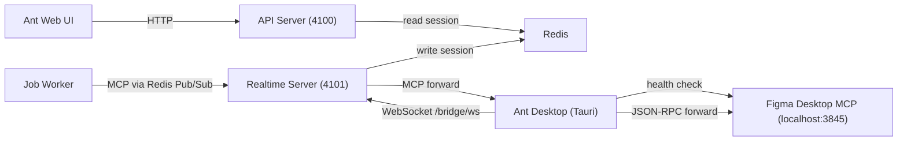
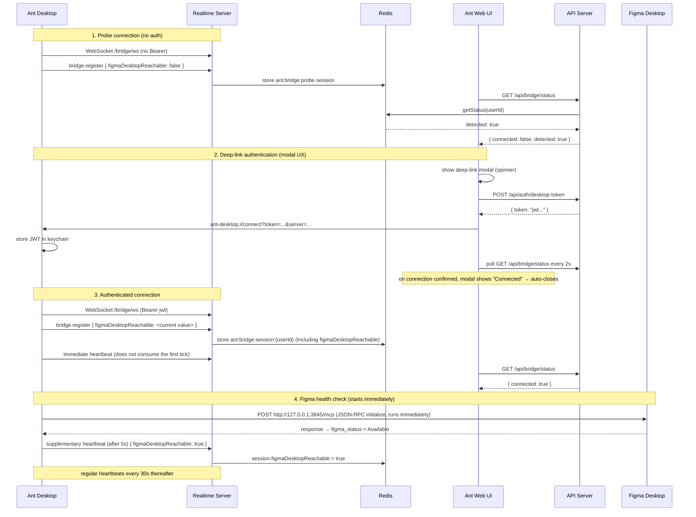

# Figma Integration Infrastructure

## Overview

The connection infrastructure that lets Ant agents use Figma Desktop MCP data. Covers the connection, detection, and authentication structure across three components (Ant Web UI, Ant Desktop, Figma Desktop). For the agent pipeline after connection, see [25-design-pipeline.md](25-design-pipeline.md).

## Component Relationship Diagram



## Detection Level Matrix

| Detection target | Method | Data source | Detectable condition |
|---|---|---|---|
| Ant Desktop installed | Deep-link attempt → indirect only | – | Not directly detectable |
| Ant Desktop running | Probe WebSocket (without Bearer) | `ant:bridge:probe` Redis key | When the app connects via WS |
| Ant Desktop authenticated | WS with Bearer token | `ant:bridge:session:{userId}` Redis key | After deep-link auth completes |
| Figma Desktop running | `figmaDesktopReachable` in register + heartbeat | Redis session field | Only while Ant Desktop is connected |

## Connection Flow



### Startup Timing

```
T=0.0s : Figma health check runs immediately (HTTP request starts, does not consume the first tick)
T=0.1s : WS connect → register { figmaDesktopReachable: <current value> }
T=0.2s : immediate heartbeat (does not consume the first tick)
T=1-3s : Figma health check completes → figma_status = Available
T=5.2s : supplementary heartbeat { figmaDesktopReachable: true } ← accurate value propagated within 5s
T=30.2s: regular heartbeat (30s cadence thereafter)
```

### Server Defense Code

In `handleHeartbeat()`, when no session exists (disconnect→reconnect race condition), the session is recreated from the client info to prevent a permanently false state.

## BridgeSessionManager State Determination

`getStatus(userId)` results:

| Result | Condition |
|---|---|
| `connected: true` | Authenticated session exists + `lastPingAt` < `BRIDGE_HEARTBEAT_TIMEOUT_MS` (90s) |
| `connected: false, detected: true` | Probe session exists + `lastPingAt` < 90s |
| `connected: false, detected: false` | No session or timed out |

`figmaDesktopReachable` is only meaningful when `connected: true`. Figma cannot be detected in the probe state.

## Frontend State Determination and UI Guidance

The Zustand store holds 4 states: `bridgeConnected: boolean | null` (null=unverified), `bridgeDetected`, `figmaDesktopReachable`, `bridgeStatusChecked`.

| bridgeConnected | bridgeDetected | figmaDesktopReachable | UI state | User guidance |
|---|---|---|---|---|
| `null` | – | – | Checking | GNB indicator hidden |
| `false` | `false` | – | Not detected | Ant Desktop download link |
| `false` | `true` | – | Detected/unauthenticated | Connect button → deep-link modal (polling + auto-close) |
| `true` | – | `false` | Connected/Figma not detected | Figma Desktop download link |
| `true` | – | `true` | Healthy | Integration-complete badge (configured) |

GNB indicator: the monitor+warning icon is shown only when `bridgeStatusChecked && bridgeConnected !== true`. Clicking auto-scrolls to Account Config → the Figma section.

## MCP Transport Paths

| Mode | Path | Condition |
|---|---|---|
| Local | Worker → direct call to `localhost:3845` | Figma Desktop running |
| Cloud | Worker → Redis → Realtime Server → Ant Desktop → Figma Desktop MCP | Ant Desktop + Figma Desktop connected |

MCP availability is verified in `detect`. When unavailable, the job is blocked with a `designError`.

## Related Code Paths

| Role | File |
|---|---|
| WS handler, session management | `packages/ant-cli/src/infrastructure/realtime/BridgeWebSocketHandler.ts`, `BridgeSessionManager.ts` |
| HTTP `GET /api/bridge/status` | `packages/ant-cli/src/periphery/adapters/http/routes/bridge.routes.ts` |
| Desktop token issuance | `packages/ant-cli/src/periphery/adapters/http/routes/auth.routes.ts` |
| Shared types (`BridgeStatus`, `BridgeSession`) | `packages/ant-shared/src/bridge.ts` |
| Frontend API (`checkBridgeStatus`, `openDesktopDeepLink`) | `packages/ant-ui/src/infrastructure/http/api/desktop.ts` |
| Frontend global state (`setBridgeStatus`) | `packages/ant-ui/src/domain/store/slices/uiSlice.ts` |
| Settings UI (Figma integration section) | `packages/ant-ui/src/presentation/components/AccountConfigEditor.tsx` |
| GNB indicator | `packages/ant-ui/src/presentation/components/AppNavBar.tsx` |
| Ant Desktop bridge client | `ant-desktop/src-tauri/src/bridge/client.rs` |
| Ant Desktop Figma health check | `ant-desktop/src-tauri/src/health/figma_check.rs` |
| Ant Desktop deep-link handling | `ant-desktop/src-tauri/src/auth/deeplink.rs` |

## Boundaries

- Design Pipeline (UI + Game-Art, the agent pipeline after connection): [25-design-pipeline.md](25-design-pipeline.md)
- Realtime System (SSE, Redis Pub/Sub): [21-realtime-system.md](21-realtime-system.md)
- Frontend Architecture (Zustand, UI layers): [30-frontend-architecture.md](30-frontend-architecture.md)
- Shared Contracts (BridgeStatus type): [01-shared-contracts.md](01-shared-contracts.md)
