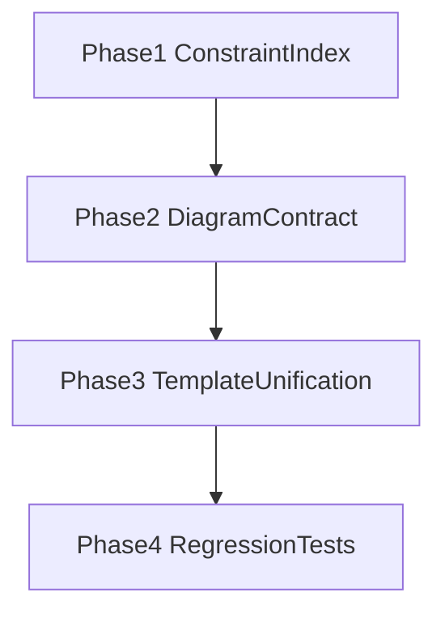

# Prompt-Document Constraint Map

## Overview

This document fixes, as a **single index**, how the document constraints of `system design / spec / PRD` are reflected in actual prompts, and where the FPOP/MECE/SBS principles apply.

Core goals:

- When a document constraint changes, make the code/template paths that need editing immediately findable.
- Provide a refactoring baseline that reduces the differences in document-authoring machinery across plan/design/code-docgen.
- Structurally manage the product gap in the diagram/flowchart authoring machinery.

## Prompt Template Structure SSOT

| Axis | SSOT path | Responsibility |
|---|---|---|
| Prompt assembly | `packages/ant-cli/src/core/prompt/builder/PromptBuilder.ts` | Single `build(config)` entry point; assembles sections/system/user |
| Tier A/D injection | `packages/ant-cli/src/core/prompt/builder/AutoInjectionResolver.ts` | Auto-injection based on tech/task/mode/data-presence |
| Tier N injection | `packages/ant-cli/src/core/prompt/builder/ArtifactRoleResolver.ts` | Policy injection based on RAC artifact presence conditions |
| RAC document loading | `packages/ant-cli/src/agents/common/graph/loadDocumentsForRAC.ts` | refs/context loading, uiSource exclusivity check |
| RAC contract | `packages/ant-shared/src/rac.ts` | resolveToRAC/getRACDocuments contract |
| Template root | `packages/ant-cli/src/core/prompt/templates/` | Actual prompt bodies for jobs/agents/basis/domain/injections |

## Document Constraint → Prompt Reflection Paths

### 1) System design documents

| Stage | Path | Constraint reflection |
|---|---|---|
| Design detect/decompose | `agents/architect/graph/design/nodes/detect/*`, `.../decompose/systemDesignDecompose.ts` | Decides workType/documentType and the target file group |
| Design execute(system) | `.../execute/intent/system.ts` | Injects system-design-specific rules/guide, applies the sealed plan |
| Code consumption | `agents/architect/graph/code/nodes/plan/llm/prompt.ts`, `.../execute/buildMessages.ts` | Turns it into code-work input via the `hasSystemDesign` gate and policy |

### 2) Spec documents

| Stage | Path | Constraint reflection |
|---|---|---|
| Design plan(spec) | `agents/architect/graph/design/nodes/plan/*` | Generates the sealed `<plan>` for the spec intentGroup |
| Design execute(spec) | `.../execute/intent/spec.ts` | Spec variant templates + sealed plan prepend |
| Code consumption | `agents/architect/graph/code/nodes/decompose/*`, `.../plan/*` | Restricts spec scope via include/policy |

### 3) PRD documents

| Stage | Path | Constraint reflection |
|---|---|---|
| Planner generate/revise | `agents/planner/graph/plan/nodes/generate/*` | Target-based PRD generation, clarify loop |
| Design input | `agents/architect/graph/design/nodes/plan/*`, `.../execute/*` | Injects planText/PRD into runtimeContext |
| Code input | `agents/architect/graph/code/nodes/resolve/*`, `.../decompose/*` | Injects the PRD scoped via RAC refs/context |

## FPOP / MECE / SBS Application Criteria

## FPOP

- SSOT: `docs/internals/13-prompt-system.md`
- Applied principles:
  - Principles over Examples
  - What over How
  - Observable over Assumed
  - Universal over Specific
  - Constraints over Instructions
  - Blind Spot Reminder
- Application locations:
  - `templates/jobs/*/nodes/*/{base,rules}.md`
  - `templates/jobs/*/basis/**`
  - `templates/jobs/shared/injections/**`

## SBS

- SSOT: Scope-Bound Specificity in `docs/internals/13-prompt-system.md`
- Rule: `specificity_floor(template) = activation_scope(template)`
- Gate axes:
  - techTier
  - intent
  - taskType
  - band (FeatureTask sub-classification: `foundation` | `integration`; absent on non-feature types)
  - mode
  - role
  - artifact-presence (`hasUi`, `hasSystemDesign`, `hasSpec`, `hasSources`, `uiSource`)
- Core verdicts:
  - More abstract than the gate axis → SBS violation
  - Excessively concrete along a non-gate axis → FPOP violation

## MECE

- SSOT:
  - Prompt-authoring policy: `docs/internals/13-prompt-system.md`
  - Document-set policy: `.cursorrules` and `docs/internals/35-codebase-meta-policy.md`
- Applied principles:
  - Promote duplicated rules to a shared partial
  - Express per-job differences only via variants and gates
  - Do not replicate semantically identical rules as prose across multiple documents.

## Diagram/Flowchart Machinery Status

| Area | Current state | Remaining gap |
|---|---|---|
| Shared contract (plan/design/code-docgen) | Common use of `jobs/shared/injections/diagram-contract.md` (Mermaid first + ASCII fallback) | Fallback quality consistency in external renderers (outside ANT UI) needs verification |
| ant-ui chat/card/file preview | The Markdown renderer renders `language-mermaid` as Mermaid SVG | Room for tuning large-diagram performance/readability |
| Doc/prompt alignment | Design base and diagram-contract wording aligned on the Mermaid-first policy | Unifying per-job example wording (optional) |

## Product Gap (Operational View)

- ANT's primary internal gap (absence of a shared diagram contract) has been resolved; the current priority is **operational fallback quality across differing render environments**.
- Since ANT UI supports Mermaid rendering, default output converges on Mermaid, while external/uncertain render targets are defended with the ASCII fallback.
- The operational core is guaranteeing "minimally interpretable anywhere" (mermaid + compact ascii), keeping `diagram-contract` as the contract SSOT.

## Refactoring Strategy

### Strategy 1: Split policy SSOTs in two

- Manage the prompt-authoring policy (FPOP/SBS/MECE) and the document-injection paths (RAC/Artifact/PromptBuilder) as separate documents.
- This document is the path index; detailed rules are delegated via links to each SSOT document.

### Strategy 2: Pin down Diagram Contract operations

- Fix the shared plan/design/code-docgen partial (`diagram-contract`) as the maintained SSOT:
  - Recommended diagram kinds (flowchart, sequence, architecture)
  - Mermaid-first, ASCII-fallback rules
  - Textual reinforcement rules for render-incapable environments

### Strategy 3: Deduplicate templates

- Promote the document-authoring rules of design system/spec, plan PRD, and code docgen to shared partials.
- Keep only job-specific content in variants to enforce MECE.

### Strategy 4: Expand regression tests

- Add the following to today's existence/path-oriented tests:
  - Diagram contract violations (missing required sections, prohibited formats)
  - Gate variable mismatches (`has*`, `uiSource`) detection
  - Stale document-authoring rule detection

## Phased Execution Plan

- Phase 1: Finalize this index document + tidy up boundary links to related documents
- Phase 2: Define the shared diagram partial and per-job consumption paths
- Phase 3: Consolidate the design/plan/code-docgen document-authoring rules into partials
- Phase 4: Strengthen tests and fix the CI gate

## Codebase mutation gate cross-link

The prompts of document-producing jobs (design plan/execute, planner plan, code plan) state that the deliverable is markdown / JSON and close the semantic axis of inputs like `decision` to "subject of description", preemptively suppressing attempts to mutate the codebase (in compliance with FPOP/SBS/MECE). Actual blocking is owned by the tool handlers + the FileRenderer XML guard — the prompt does not substitute for the guard. The code job plan's `run_command` is an orthogonal responsibility (`allowShellExecution`) and is not a blocking target — it has legitimate uses like verification gates, test-runner installation, error diagnosis, and dep discovery. Policy SSOT: [15-design-job.md "Codebase mutation gate"](15-design-job.md#codebase-mutation-gate).

## Boundaries

- Prompt system SSOT: [13-prompt-system.md](13-prompt-system.md)
- Design Job behavior: [15-design-job.md](15-design-job.md)
- Planner Job (PRD): [16-planner-job.md](16-planner-job.md)
- Code Job consumption paths: [14-code-job.md](14-code-job.md)
- Design pipeline details: [25-design-pipeline.md](25-design-pipeline.md)
- Graph structure rules: [NODE_GRAPH_LAYOUT.md](NODE_GRAPH_LAYOUT.md)
- Conversation state conventions: [34-conversations.md](34-conversations.md)
