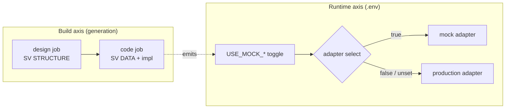
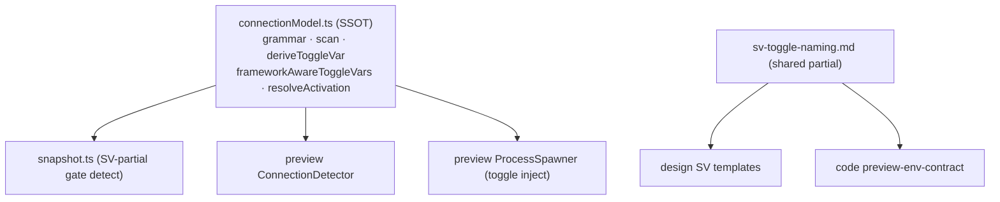
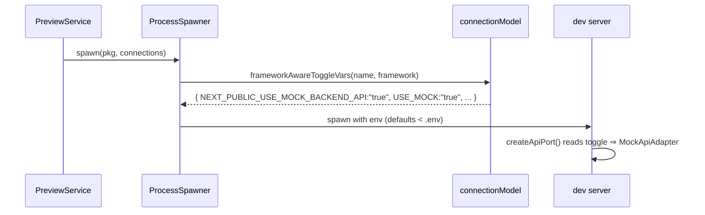

# 38 — Service Virtualization (SV)

Service Virtualization (SV) is how an Ant-generated project stays **runnable
and demonstrable without the external systems it depends on**. Every external
dependency (third-party API, peer service, cross-project reference) is reached
through a **port** whose **production** and **virtualized (mock)** adapters sit
side by side and satisfy the same interface; the runtime picks one via an
environment toggle.

This document is the single architecture reference for SV across the three
jobs that touch it (design, code, preview/runtime) and the verification that
guards it.

> **Implementation status (2026-06).** §1–3, §5, §7 describe live behavior.
> The connection-config SSOT (§3) is implemented; SV partials currently still
> activate via the resolve-time `hasBusinessConnection` flag
> (greenfield-defaulted). **§4 (default-ON + `<serviceVirtualization>`
> opt-out)** and **§6 (preview mock-toggle injection that guarantees
> greenfield mock boot)** are the TARGET and are NOT yet implemented — they
> are the next steps. Until §6 lands, a greenfield app whose toggle lives only
> in `.env.example` is NOT guaranteed to boot on mock. There is no
> SV-specific verification gate (§7).

---

## 1. Two orthogonal axes

SV has two independent concerns that were historically conflated. Keep them
separate:

| Axis | Question | When | Decided by |
|---|---|---|---|
| **Build / generation** | "Is the SV implementation (adapter pair + mock + fixtures + toggle wiring) written into the code?" | while generating | **default ON** for generative code work; opt-out only (§4) |
| **Runtime on/off** | "When the built app runs, does it use the mock adapter or the real backend?" | at app start | the `.env` toggle (§6) |

> The runtime default ("both toggles unset ⇒ production adapter active",
> stated in `service-virtualization-contract.md`) is a **runtime** default. It
> is NOT the build decision. The build decision is "generate SV by default".



---

## 2. Responsibility split — design = structure, code = data

SV is designed in **both** jobs, at different layers (MECE):

| Job | Owns | Does NOT own |
|---|---|---|
| **design** | SV **structure**: which external-dependency ports are virtualized, the production + mock **strategy labels**, and the **toggle env var name** | mock **data** / fixtures / fake bodies / switching code (explicitly: *"Do NOT specify mock implementation details"*) |
| **code** | SV **data + implementation**: the adapter pair code, the factory/selection, fake-body realism, cross-request session coherence, image placeholders, and the `.env.example` toggle lines | — |

Rationale: data does not need to be pre-decided in design; deferring it keeps
the design doc small and lets the code job own generation/insertion. When the
design doc carries SV structure (best case) the code job follows it; when the
design is silent (second-best) the code job still builds SV by default (§4).

Design-side SV lives in
[`jobs/design/nodes/execute/variants/system-design/rules.md`](../../packages/ant-cli/src/core/prompt/templates/jobs/design/nodes/execute/variants/system-design/rules.md)
("Infrastructure Independence Guardrail"),
[`jobs/design/domain/service.md`](../../packages/ant-cli/src/core/prompt/templates/jobs/design/domain/service.md),
and the frontend/backend guides. Code-side SV lives in the four partials under
[`jobs/code/base/injections/`](../../packages/ant-cli/src/core/prompt/templates/jobs/code/base/injections/).

---

## 3. Connection-config SSOT

All knowledge about `@connection` annotations and mock toggles lives in ONE
runtime module — [`core/prompt/builder/serviceVirtualization/connectionModel.ts`](../../packages/ant-cli/src/core/prompt/builder/serviceVirtualization/connectionModel.ts)
(runtime helpers cannot live in `@ant/shared`, which is types-only).

It owns:

- the single `@connection` annotation grammar (`# @connection <business|infrastructure> <name> [modifier]`) and the bounded root + depth-2 monorepo scan (`scanAnnotationsInRadius`);
- `deriveToggleVar(name)` → bare `USE_MOCK_<NAME>` (uppercase snake);
- **`frameworkAwareToggleVars(name, framework)`** → the framework-correct toggle name(s) + master, the runtime codification of the naming table (server → `USE_MOCK_*`; Next.js client → `NEXT_PUBLIC_USE_MOCK_*`; Vite → `VITE_USE_MOCK_*`; CRA → `REACT_APP_USE_MOCK_*`);
- `resolveActivation(toggleEnvVar, envMap)` → per-connection toggle > master > false.

The naming table itself is documented once in the shared partial
[`jobs/shared/injections/sv-toggle-naming.md`](../../packages/ant-cli/src/core/prompt/templates/jobs/shared/injections/sv-toggle-naming.md),
included by both the design SV content and the code `preview-env-contract`, so
neither job reaches across the job boundary to the other's templates.



---

## 4. Build activation — default ON, opt-out only

Code-job SV generation is **on by default** for generative code work. There is
no `@connection`-detection precondition (a generated artifact cannot gate its
own generation). The only thing that turns it off is an **explicit opt-out**
the LLM infers from the user's `directive` / `context` / `refs` at decompose
("no mock", "connect to the real backend only", etc.), emitted as the
`<serviceVirtualization>` decision tag (default = build) and parsed into a
job-level `optedOut` flag.

The four partials fire on these axes (detection axis removed):

| Partial | Scope | Gate (post-redesign) |
|---|---|---|
| `service-virtualization-contract` | port shape + toggle grammar | generative code task ∧ `domain==='service'` ∧ ¬optedOut |
| `service-virtualization-data` | one response body realism | taskType ∈ {feature, ui, design-system} ∧ `domain==='service'` ∧ ¬optedOut |
| `service-virtualization-session` | cross-body demo coherence | taskType ∈ {feature, ui, design-system, setup} ∧ `domain==='service'` ∧ ¬optedOut |
| `service-virtualization-imagery` | image-subtype placeholders | `hasFrontend` ∧ `domain==='service'` ∧ taskType ∈ {feature, ui, design-system, setup, error, verification} ∧ ¬optedOut |

`domain==='service'` gates all four (game-domain visuals are served by the
game-art surface, not SV). The partials self-scope ("every external-dependency
port…"), so a project with no external dependency yields no extra content even
though the gate is open.

---

## 5. Greenfield first-generation composition

For a new (greenfield) service-domain web app the code job produces, by
default, the SV implementation alongside the feature code:

```
codebase/
  .env.example                 # @connection business backend-api  +  NEXT_PUBLIC_USE_MOCK_BACKEND_API=true
  apps/app/src/
    domain/ports/api-port.ts          # the interface both adapters satisfy
    infrastructure/api/
      http-api-adapter.ts             # production adapter
      mock-api-adapter.ts             # virtualized adapter (mock)
      fixtures.ts                     # coherent fake data (code job owns this)
      index.ts                        # createApiPort(): factory selecting by toggle
```

The design doc (when present) named the port, the two strategy labels, and the
toggle env var; the code job filled in the adapters, the fixtures, and the
factory.

---

## 6. Runtime mock-boot guarantee (preview)

A greenfield app must boot on its mock adapters when previewed, even though the
toggle was declared only in `.env.example` (Next.js does not load
`.env.example`). The preview process guarantees this by **injecting the
framework-correct mock toggle as a default** for every business connection at
spawn time.

Env precedence in [`ProcessSpawner`](../../packages/ant-cli/src/periphery/adapters/http/services/PreviewService/managers/ProcessSpawner.ts)
(low → high): `process.env` → **mock toggle defaults** → `.env`/`.env.local`
→ connection URLs → platform → caller. So an explicit `.env` toggle (`=false`,
i.e. the user opting into the real backend) overrides the default; a greenfield
project with no `.env` gets mock-on.



Injecting a toggle that the generated factory does not read is inert. For an
opted-out (real-only) project there is no mock branch, so the default injection
is harmless.

---

## 7. Verification

There is **no SV-specific verification gate**. A dedicated mock↔real
"parity" check previously spawned a second build under `USE_MOCK=false`, but
it was removed: its distinctive value (catching mock↔real divergence) needs a
reachable real backend, which is absent in the SV-first greenfield case it was
meant to serve, so it rarely fired; its always-runnable half was just a
mock-mode compile gate that did not catch incoherent mock *data*; and a
final-verification gate is reactive (upstream tasks already erred) rather than
preventive.

SV correctness is instead pursued where it has leverage: **generation** (the
design structure + code partials produce a coherent adapter pair and mock
data) and **runtime boot** (§6). A general whole-workspace compile gate and
generation-time contract-drift prevention are tracked as separate work.

---

## 8. Invariants & boundaries

- **Generation ≠ runtime.** Default-ON is a build decision; mock/real is a `.env` runtime decision.
- **One connection SSOT.** Grammar, scan, toggle-name derivation, framework prefix, and activation live only in `connectionModel.ts`; the naming table prose lives once in the shared partial. No job reaches into another job's templates.
- **Domain.** SV is service-domain; `domain==='service'` gates all four partials. Game visuals use the game-art surface (see [33-visual-tier.md](33-visual-tier.md)).
- **Boundary with preview (22).** [22-preview-system.md](22-preview-system.md) owns runtime connection detection/management; this document owns the SV contract and generation. The toggle-injection that guarantees mock boot lives in preview but uses the `connectionModel` SSOT.
