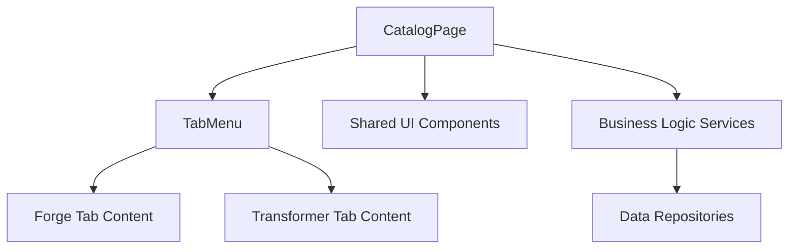

# System Design Document: Cross-Ramp Catalog Page Redesign

## 1. Architecture Overview

The existing codebase follows a modular and component-based architecture, with a clear separation of concerns between the application logic and shared components. The codebase is organized into "apps" and "packages" directories, where the "apps" directory contains the main application code and the "packages" directory contains shared UI and utility components.

For this redesign, we will maintain the existing architectural principles and leverage the existing technology stack, including the use of Zustand for state management and the built-in routing system of Next.js for navigation and URL structure.

## 2. Component Structure and Responsibilities

### 2.1. TabMenu Component
- **Responsibility**: Render a tabbed interface with the "Forge" and "Transformer" tabs.
- **Parent Container**: The TabMenu component will be placed within a parent container with a `bg-gray-200` background color.

### 2.2. CatalogPage Component
- **Responsibility**: Render the main catalog page, including the TabMenu component and the content for the selected tab.
- **Interaction**: The CatalogPage component will handle the state and logic for the TabMenu component, including the active tab selection and any associated data or functionality.

## 3. Data Flow Diagrams

## 4. Technology Stack Choices

The existing technology stack, including the use of Next.js, Zustand, and the current set of dependencies, will be maintained for this redesign. This approach ensures seamless integration with the existing codebase and avoids introducing unnecessary complexity.

## 5. API Design

No changes to the existing API design are required for this redesign.

## 6. Database Schema

No changes to the existing database schema are required for this redesign.

## 7. Integration Points with Existing Codebase

The changes introduced in this redesign will be integrated into the existing codebase by modifying the relevant files and components. The new TabMenu component will be added to the "apps/ramp/components" directory, and the CatalogPage component will be updated to use the new TabMenu component.

## 8. Implementation Files

### New Files:
- `apps/ramp/components/TabMenu.tsx` - New tab menu component with `bg-gray-200` container
- `apps/ramp/components/TabMenu.module.css` - Styles for tab menu component

### Modified Files:
- `apps/ramp/app/catalog/page.tsx` - Integrate the new TabMenu component
- `apps/ramp/app/catalog/layout.tsx` - Update the layout structure to accommodate the new TabMenu component