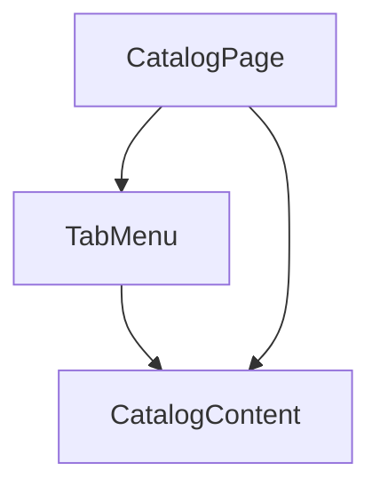

# System Design Document

## 1. Architecture Overview

The existing `cross-ramp` project follows a monorepo structure with a microservices architecture. The project is built using a React-based frontend and a GraphQL-based backend. The proposed changes for the catalog page's tab menu UI will be implemented within the existing architectural framework.

## 2. Component Structure and Responsibilities

The main components involved in the tab menu UI update are:

1. **TabMenu** (new component)
   - Responsibility: Render the tab menu with the "Forge" and "Transformer" tabs.
   - Location: `apps/ramp/presentation/components/catalog/TabMenu.tsx` (new file)

2. **CatalogPage**
   - Responsibility: Render the catalog page, including the tab menu and the content for the selected tab.
   - Location: `apps/ramp/app/catalog/page.tsx` (modification of existing file)

3. **CatalogContent** (existing component)
   - Responsibility: Render the content for the selected tab (Forge or Transformer).
   - Location: `apps/ramp/presentation/components/catalog/CatalogContent.tsx` (existing file)

## 3. Data Flow Diagrams

1. The `CatalogPage` component renders the `TabMenu` component, which handles the tab selection and rendering.
2. The `TabMenu` component communicates the selected tab to the `CatalogContent` component, which renders the appropriate content based on the selected tab.
3. The `CatalogPage` component also directly passes data to the `CatalogContent` component, as needed.

## 4. Technology Stack Choices

The proposed changes will utilize the existing technology stack of the `cross-ramp` project, which includes:

- **Frontend**: React, Next.js, TypeScript
- **State Management**: React Context API, Zustand
- **Styling**: Tailwind CSS
- **API**: GraphQL, Apollo Client

These technologies are well-suited for the proposed changes and align with the overall project architecture.

## 5. API Design

No new API endpoints are required for the proposed tab menu UI changes.

## 6. Database Schema

The proposed changes do not require any modifications to the existing database schema.

## 7. Integration Points with Existing Codebase

The proposed changes will be integrated into the existing `cross-ramp` codebase by modifying the `CatalogPage` component and introducing a new `TabMenu` component.

## 8. File-Level Implementation Plan

1. **NEW FILE**: `apps/ramp/presentation/components/catalog/TabMenu.tsx`
   - Description: Render the tab menu with the "Forge" and "Transformer" tabs.

2. **MODIFICATION**: `apps/ramp/app/catalog/page.tsx`
   - Description: Update the `CatalogPage` component to include the new `TabMenu` component and pass the necessary data to the `CatalogContent` component.

3. **EXISTING FILE**: `apps/ramp/presentation/components/catalog/CatalogContent.tsx`
   - Description: No changes required. The existing `CatalogContent` component will continue to render the content for the selected tab.