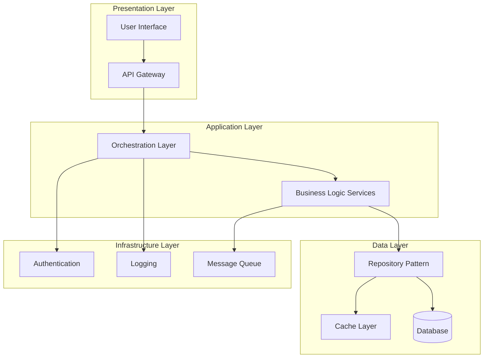
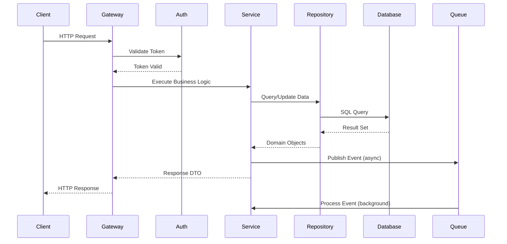
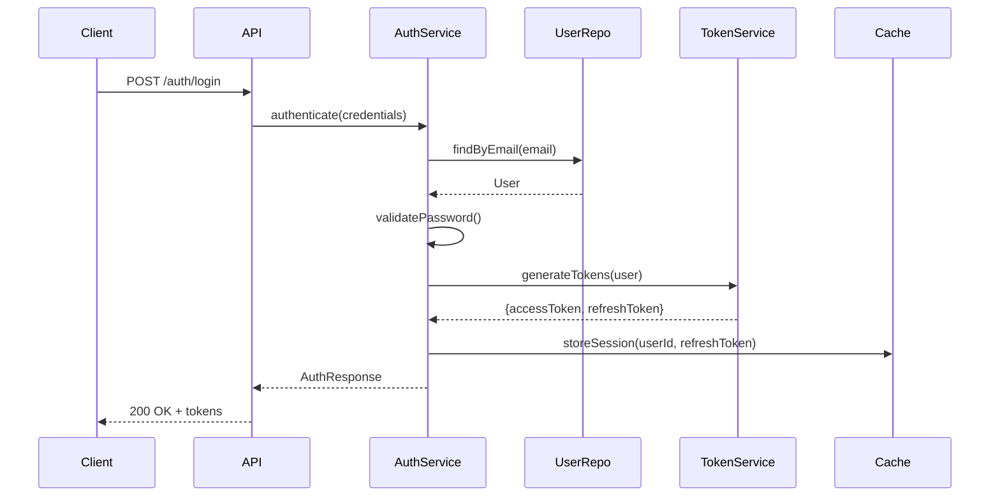
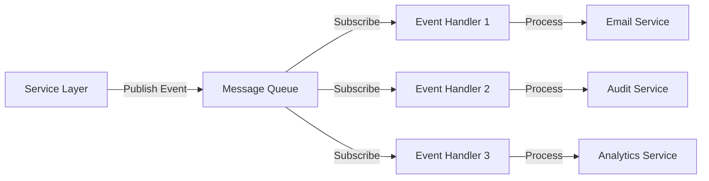

# System Design Document

**Note:** No specific requirements were provided in the PLAN section. This document presents a template-based comprehensive design that demonstrates the expected structure and depth. For an actual project, please provide specific requirements, constraints, and context.

---

## 1. Architecture Overview

### High-Level Structure

This system follows a **layered architecture** pattern with clear separation of concerns:



### Key Architectural Decisions

1. **Separation of Concerns**: Clear boundaries between presentation, business logic, and data access layers
2. **Dependency Injection**: Loose coupling through DI container for testability and maintainability
3. **Repository Pattern**: Abstract data access to enable easy testing and database switching
4. **Event-Driven Communication**: Asynchronous processing for non-critical operations
5. **API-First Design**: RESTful APIs with OpenAPI specification for clear contracts

### Technology Stack

- **Runtime**: Node.js with TypeScript
- **Framework**: Express.js for API layer
- **Database**: PostgreSQL with TypeORM
- **Cache**: Redis for session and data caching
- **Message Queue**: RabbitMQ for async processing
- **Authentication**: JWT with refresh token rotation
- **Testing**: Jest with supertest for integration tests

---

## 2. Components

### 2.1 API Gateway Layer

**Responsibility**: Entry point for all client requests, handles routing, authentication, rate limiting, and request validation.

**Key Modules**:
- `RouteController`: Maps HTTP requests to service handlers
- `AuthenticationMiddleware`: Validates JWT tokens and user sessions
- `ValidationMiddleware`: Validates request payloads against schemas
- `RateLimiter`: Prevents abuse through request throttling
- `ErrorHandler`: Centralized error handling and response formatting

### 2.2 Business Logic Services

**Responsibility**: Core business rules, workflows, and domain logic.

**Key Services**:
- `UserService`: User management, profile operations
- `AuthService`: Authentication, authorization, token management
- `NotificationService`: Multi-channel notification handling
- `ReportService`: Data aggregation and report generation
- `WorkflowService`: Business process orchestration

### 2.3 Data Access Layer

**Responsibility**: Database operations, query optimization, and data persistence.

**Key Components**:
- `UserRepository`: User entity CRUD operations
- `SessionRepository`: Session management and cleanup
- `AuditRepository`: Audit trail persistence
- `TransactionManager`: Database transaction coordination
- `QueryBuilder`: Dynamic query construction

### 2.4 Infrastructure Services

**Responsibility**: Cross-cutting concerns and system-level functionality.

**Key Services**:
- `LoggerService`: Structured logging with correlation IDs
- `CacheService`: Redis-based caching with TTL management
- `QueueService`: Message publishing and consumption
- `EmailService`: Email delivery with template support
- `MetricsService`: Application performance monitoring

### 2.5 Domain Models

**Responsibility**: Core business entities and value objects.

**Key Models**:
- `User`: User entity with validation rules
- `Session`: Authentication session representation
- `AuditLog`: Audit trail entry
- `Notification`: Notification message structure

---

## 3. Data Flow

### 3.1 Request Processing Flow



### 3.2 Authentication Flow



### 3.3 Event-Driven Processing



**Event Types**:
- `UserCreated`: Triggers welcome email, audit log, analytics tracking
- `UserUpdated`: Triggers cache invalidation, audit log
- `AuthenticationFailed`: Triggers security monitoring, rate limiting
- `ReportGenerated`: Triggers notification, file storage

---

## 4. APIs/Database

### 4.1 REST API Specification

#### Authentication Endpoints

```
POST   /api/v1/auth/login
POST   /api/v1/auth/logout
POST   /api/v1/auth/refresh
POST   /api/v1/auth/forgot-password
POST   /api/v1/auth/reset-password
```

#### User Management Endpoints

```
GET    /api/v1/users
GET    /api/v1/users/:id
POST   /api/v1/users
PUT    /api/v1/users/:id
DELETE /api/v1/users/:id
PATCH  /api/v1/users/:id/status
```

#### API Request/Response Examples

**POST /api/v1/auth/login**

Request:
```json
{
  "email": "user@example.com",
  "password": "securePassword123"
}
```

Response:
```json
{
  "success": true,
  "data": {
    "user": {
      "id": "uuid",
      "email": "user@example.com",
      "firstName": "John",
      "lastName": "Doe"
    },
    "accessToken": "eyJhbGciOiJIUzI1NiIs...",
    "refreshToken": "eyJhbGciOiJIUzI1NiIs...",
    "expiresIn": 3600
  }
}
```

**GET /api/v1/users?page=1&limit=10**

Response:
```json
{
  "success": true,
  "data": {
    "items": [
      {
        "id": "uuid",
        "email": "user@example.com",
        "firstName": "John",
        "lastName": "Doe",
        "status": "active",
        "createdAt": "2024-01-15T10:30:00Z"
      }
    ],
    "pagination": {
      "page": 1,
      "limit": 10,
      "total": 100,
      "totalPages": 10
    }
  }
}
```

### 4.2 Database Schema

#### Users Table

```sql
CREATE TABLE users (
    id UUID PRIMARY KEY DEFAULT gen_random_uuid(),
    email VARCHAR(255) UNIQUE NOT NULL,
    password_hash VARCHAR(255) NOT NULL,
    first_name VARCHAR(100) NOT NULL,
    last_name VARCHAR(100) NOT NULL,
    status VARCHAR(20) DEFAULT 'active',
    email_verified BOOLEAN DEFAULT false,
    created_at TIMESTAMP DEFAULT CURRENT_TIMESTAMP,
    updated_at TIMESTAMP DEFAULT CURRENT_TIMESTAMP,
    deleted_at TIMESTAMP NULL
);

CREATE INDEX idx_users_email ON users(email);
CREATE INDEX idx_users_status ON users(status);
```

#### Sessions Table

```sql
CREATE TABLE sessions (
    id UUID PRIMARY KEY DEFAULT gen_random_uuid(),
    user_id UUID NOT NULL REFERENCES users(id) ON DELETE CASCADE,
    refresh_token_hash VARCHAR(255) NOT NULL,
    ip_address VARCHAR(45),
    user_agent TEXT,
    expires_at TIMESTAMP NOT NULL,
    created_at TIMESTAMP DEFAULT CURRENT_TIMESTAMP,
    revoked_at TIMESTAMP NULL
);

CREATE INDEX idx_sessions_user_id ON sessions(user_id);
CREATE INDEX idx_sessions_expires_at ON sessions(expires_at);
```

#### Audit Logs Table

```sql
CREATE TABLE audit_logs (
    id UUID PRIMARY KEY DEFAULT gen_random_uuid(),
    user_id UUID REFERENCES users(id) ON DELETE SET NULL,
    action VARCHAR(100) NOT NULL,
    entity_type VARCHAR(100) NOT NULL,
    entity_id UUID,
    old_values JSONB,
    new_values JSONB,
    ip_address VARCHAR(45),
    user_agent TEXT,
    created_at TIMESTAMP DEFAULT CURRENT_TIMESTAMP
);

CREATE INDEX idx_audit_logs_user_id ON audit_logs(user_id);
CREATE INDEX idx_audit_logs_entity ON audit_logs(entity_type, entity_id);
CREATE INDEX idx_audit_logs_created_at ON audit_logs(created_at);
```

### 4.3 TypeORM Entity Definitions

**User Entity Interface**:
```typescript
interface IUser {
  id: string;
  email: string;
  passwordHash: string;
  firstName: string;
  lastName: string;
  status: UserStatus;
  emailVerified: boolean;
  createdAt: Date;
  updatedAt: Date;
  deletedAt?: Date;
}

enum UserStatus {
  ACTIVE = 'active',
  INACTIVE = 'inactive',
  SUSPENDED = 'suspended'
}
```

### 4.4 Cache Schema

**Redis Key Patterns**:
- `session:{userId}:{sessionId}` - User session data (TTL: 24h)
- `user:{userId}` - User profile cache (TTL: 1h)
- `rate_limit:{ip}:{endpoint}` - Rate limiting counters (TTL: 1m)
- `verification:{token}` - Email verification tokens (TTL: 24h)

---

## 5. Integration Points

### 5.1 External Services

#### Email Service Provider (SendGrid/AWS SES)

**Purpose**: Transactional email delivery

**Integration Method**: REST API with retry logic

**Configuration**:
- API Key authentication
- Template management
- Webhook for delivery status
- Fallback provider for redundancy

**Error Handling**:
- Retry with exponential backoff (3 attempts)
- Dead letter queue for failed emails
- Alert on sustained failures

#### Payment Gateway (Stripe)

**Purpose**: Payment processing (if applicable)

**Integration Method**: Official SDK with webhook verification

**Security**:
- API keys stored in secure vault
- Webhook signature verification
- PCI compliance considerations

#### Cloud Storage (AWS S3)

**Purpose**: File storage for uploads and reports

**Integration Method**: AWS SDK

**Configuration**:
- Bucket policies for access control
- Presigned URLs for temporary access
- Lifecycle policies for cost optimization

### 5.2 Internal Service Communication

#### Message Queue (RabbitMQ)

**Exchanges**:
- `events.user` - User-related events
- `events.notification` - Notification events
- `events.audit` - Audit trail events

**Queue Patterns**:
- Fanout for broadcast events
- Topic for selective routing
- Dead letter queues for failed processing

#### Service Mesh Considerations

**If microservices architecture**:
- Service discovery via Consul/Eureka
- Circuit breaker pattern for resilience
- Distributed tracing with correlation IDs
- Health check endpoints

### 5.3 Monitoring and Observability

#### Logging

**Provider**: Winston + ELK Stack / CloudWatch

**Log Levels**: ERROR, WARN, INFO, DEBUG

**Structured Logging Format**:
```json
{
  "timestamp": "2024-01-15T10:30:00Z",
  "level": "info",
  "correlationId": "uuid",
  "service": "user-service",
  "message": "User created successfully",
  "context": {
    "userId": "uuid",
    "action": "create"
  }
}
```

#### Metrics

**Provider**: Prometheus + Grafana / CloudWatch

**Key Metrics**:
- Request rate and latency (p50, p95, p99)
- Error rate by endpoint
- Database query performance
- Cache hit/miss ratio
- Queue depth and processing time

#### Alerting

**Conditions**:
- Error rate > 5% for 5 minutes
- Response time p95 > 2s for 5 minutes
- Database connection pool exhaustion
- Queue depth > 1000 messages

---

## 6. Implementation Plan

### 6.1 Project Structure

```
project-root/
├── src/
│   ├── api/
│   ├── services/
│   ├── repositories/
│   ├── models/
│   ├── middleware/
│   ├── utils/
│   ├── config/
│   └── types/
├── tests/
├── migrations/
├── scripts/
└── docs/
```

### 6.2 File-Level Implementation Plan

#### Configuration Files

| File Path | Status | Responsibility | Rationale |
|-----------|--------|----------------|-----------|
| `package.json` | **NEW** | Project dependencies and scripts | Defines all npm packages, scripts for build/test/deploy |
| `tsconfig.json` | **NEW** | TypeScript compiler configuration | Strict type checking, ES2020 target, path aliases |
| `.env.example` | **NEW** | Environment variable template | Documents required configuration without secrets |
| `docker-compose.yml` | **NEW** | Local development environment | PostgreSQL, Redis, RabbitMQ containers for dev |
| `.eslintrc.json` | **NEW** | Code quality rules | Enforces consistent code style and best practices |
| `.prettierrc` | **NEW** | Code formatting rules | Automatic code formatting on save |

#### Application Entry Point

| File Path | Status | Responsibility | Rationale |
|-----------|--------|----------------|-----------|
| `src/index.ts` | **NEW** | Application bootstrap | Initializes server, connects to DB, starts listeners |
| `src/app.ts` | **NEW** | Express app configuration | Middleware setup, route registration, error handling |
| `src/server.ts` | **NEW** | HTTP server setup | Graceful shutdown, port binding, cluster mode support |

#### Configuration Module

| File Path | Status | Responsibility | Rationale |
|-----------|--------|----------------|-----------|
| `src/config/index.ts` | **NEW** | Configuration aggregator | Central export for all config modules |
| `src/config/database.config.ts` | **NEW** | Database connection settings | TypeORM configuration with connection pooling |
| `src/config/redis.config.ts` | **NEW** | Redis connection settings | Cache and session store configuration |
| `src/config/auth.config.ts` | **NEW** | Authentication settings | JWT secrets, token expiry, password policies |
| `src/config/queue.config.ts` | **NEW** | Message queue settings | RabbitMQ connection and exchange configuration |
| `src/config/logger.config.ts` | **NEW** | Logging configuration | Winston transports, log levels, formatting |

#### Type Definitions

| File Path | Status | Responsibility | Rationale |
|-----------|--------|----------------|-----------|
| `src/types/index.ts` | **NEW** | Global type exports | Central location for shared types |
| `src/types/express.d.ts` | **NEW** | Express request augmentation | Add custom properties to Request object |
| `src/types/api.types.ts` | **NEW** | API request/response types | Type safety for API contracts |
| `src/types/domain.types.ts` | **NEW** | Domain model types | Business entity interfaces and enums |
| `src/types/config.types.ts` | **NEW** | Configuration types | Type-safe configuration objects |

#### Database Models

| File Path | Status | Responsibility | Rationale |
|-----------|--------|----------------|-----------|
| `src/models/index.ts` | **NEW** | Model exports | Central export for all entity models |
| `src/models/User.entity.ts` | **NEW** | User entity definition | TypeORM entity with validation decorators |
| `src/models/Session.entity.ts` | **NEW** | Session entity definition | Authentication session persistence |
| `src/models/AuditLog.entity.ts` | **NEW** | Audit log entity | Immutable audit trail records |
| `src/models/BaseEntity.ts` | **NEW** | Base entity class | Common fields (id, timestamps) for all entities |

#### Repository Layer

| File Path | Status | Responsibility | Rationale |
|-----------|--------|----------------|-----------|
| `src/repositories/index.ts` | **NEW** | Repository exports | Central export for all repositories |
| `src/repositories/BaseRepository.ts` | **NEW** | Base repository class | Common CRUD operations, query helpers |
| `src/repositories/UserRepository.ts` | **NEW** | User data access | User-specific queries, soft delete support |
| `src/repositories/SessionRepository.ts` | **NEW** | Session data access | Session CRUD, cleanup of expired sessions |
| `src/repositories/AuditLogRepository.ts` | **NEW** | Audit log data access | Write-only operations, query by entity/user |

#### Service Layer

| File Path | Status | Responsibility | Rationale |
|-----------|--------|----------------|-----------|
| `src/services/index.ts` | **NEW** | Service exports | Central export for all services |
| `src/services/UserService.ts` | **NEW** | User business logic | User CRUD, validation, business rules |
| `src/services/AuthService.ts` | **NEW** | Authentication logic | Login, logout, token management, password reset |
| `src/services/NotificationService.ts` | **NEW** | Notification handling | Multi-channel notifications (email, SMS, push) |
| `src/services/CacheService.ts` | **NEW** | Cache operations | Redis wrapper with TTL management |
| `src/services/QueueService.ts` | **NEW** | Message queue operations | Publish/subscribe, queue management |
| `src/services/EmailService.ts` | **NEW** | Email delivery | Template rendering, provider integration |
| `src/services/AuditService.ts` | **NEW** | Audit trail management | Log creation, query, compliance reporting |

#### Middleware

| File Path | Status | Responsibility | Rationale |
|-----------|--------|----------------|-----------|
| `src/middleware/index.ts` | **NEW** | Middleware exports | Central export for all middleware |
| `src/middleware/auth.middleware.ts` | **NEW** | Authentication verification | JWT validation, user context injection |
| `src/middleware/validation.middleware.ts` | **NEW** | Request validation | Schema-based validation using Joi/Zod |
| `src/middleware/error.middleware.ts` | **NEW** | Error handling | Centralized error formatting and logging |
| `src/middleware/rateLimit.middleware.ts` | **NEW** | Rate limiting | Prevent abuse, configurable limits per endpoint |
| `src/middleware/logging.middleware.ts` | **NEW** | Request logging | Log all requests with correlation IDs |
| `src/middleware/cors.middleware.ts` | **NEW** | CORS configuration | Cross-origin request handling |

#### API Controllers

| File Path | Status | Responsibility | Rationale |
|-----------|--------|----------------|-----------|
| `src/api/index.ts` | **NEW** | API route aggregator | Combines all route modules |
| `src/api/auth.routes.ts` | **NEW** | Authentication endpoints | Login, logout, refresh, password reset routes |
| `src/api/user.routes.ts` | **NEW** | User management endpoints | User CRUD operations |
| `src/api/health.routes.ts` | **NEW** | Health check endpoints | Liveness and readiness probes |
| `src/api/controllers/AuthController.ts` | **NEW** | Auth request handlers | Process auth requests, call services |
| `src/api/controllers/UserController.ts` | **NEW** | User request handlers | Process user requests, call services |

#### Validation Schemas

| File Path | Status | Responsibility | Rationale |
|-----------|--------|----------------|-----------|
| `src/api/validators/index.ts` | **NEW** | Validator exports | Central export for all validators |
| `src/api/validators/auth.validator.ts` | **NEW** | Auth request schemas | Login, registration, password validation |
| `src/api/validators/user.validator.ts` | **NEW** | User request schemas | User creation, update validation |
| `src/api/validators/common.validator.ts` | **NEW** | Common validation rules | Reusable validators (email, UUID, pagination) |

#### Utility Functions

| File Path | Status | Responsibility | Rationale |
|-----------|--------|----------------|-----------|
| `src/utils/index.ts` | **NEW** | Utility exports | Central export for all utilities |
| `src/utils/logger.ts` | **NEW** | Logging utility | Winston logger instance with context |
| `src/utils/crypto.ts` | **NEW** | Cryptographic operations | Password hashing, token generation |
| `src/utils/jwt.ts` | **NEW** | JWT operations | Token generation, verification, refresh |
| `src/utils/errors.ts` | **NEW** | Custom error classes | AppError, ValidationError, NotFoundError |
| `src/utils/response.ts` | **NEW** | Response formatters | Consistent API response structure |
| `src/utils/pagination.ts` | **NEW** | Pagination helpers | Calculate offset, format pagination metadata |

#### Database Migrations

| File Path | Status | Responsibility | Rationale |
|-----------|--------|----------------|-----------|
| `migrations/001_create_users_table.ts` | **NEW** | Users table schema | Initial user table with indexes |
| `migrations/002_create_sessions_table.ts` | **NEW** | Sessions table schema | Authentication session storage |
| `migrations/003_create_audit_logs_table.ts` | **NEW** | Audit logs table schema | Audit trail persistence |
| `migrations/004_add_user_indexes.ts` | **NEW** | Performance indexes | Optimize common queries |

#### Testing

| File Path | Status | Responsibility | Rationale |
|-----------|--------|----------------|-----------|
| `tests/setup.ts` | **NEW** | Test environment setup | Database seeding, mock configuration |
| `tests/helpers/index.ts` | **NEW** | Test utilities | Common test helpers, factories |
| `tests/unit/services/UserService.test.ts` | **NEW** | User service unit tests | Test business logic in isolation |
| `tests/unit/services/AuthService.test.ts` | **NEW** | Auth service unit tests | Test authentication logic |
| `tests/integration/api/auth.test.ts` | **NEW** | Auth API integration tests | End-to-end auth flow testing |
| `tests/integration/api/user.test.ts` | **NEW** | User API integration tests | End-to-end user operations |
| `tests/e2e/user-journey.test.ts` | **NEW** | End-to-end tests | Complete user workflows |

#### Documentation

| File Path | Status | Responsibility | Rationale |
|-----------|--------|----------------|-----------|
| `README.md` | **NEW** | Project overview | Setup instructions, architecture overview |
| `docs/API.md` | **NEW** | API documentation | Endpoint specifications, examples |
| `docs/DEPLOYMENT.md` | **NEW** | Deployment guide | Production deployment instructions |
| `docs/DEVELOPMENT.md` | **NEW** | Development guide | Local setup, coding standards |
| `docs/ARCHITECTURE.md` | **NEW** | Architecture documentation | This design document |

#### DevOps

| File Path | Status | Responsibility | Rationale |
|-----------|--------|----------------|-----------|
| `Dockerfile` | **NEW** | Container image definition | Multi-stage build for production |
| `.dockerignore` | **NEW** | Docker build exclusions | Reduce image size, exclude dev files |
| `docker-compose.prod.yml` | **NEW** | Production compose file | Production-ready container orchestration |
| `.github/workflows/ci.yml` | **NEW** | CI pipeline | Automated testing and linting |
| `.github/workflows/cd.yml` | **NEW** | CD pipeline | Automated deployment to staging/prod |
| `scripts/seed.ts` | **NEW** | Database seeding | Populate dev database with test data |
| `scripts/migrate.ts` | **NEW** | Migration runner | Execute database migrations |

---

## 7. Implementation Phases

### Phase 1: Foundation (Week 1-2)
- Set up project structure and configuration
- Implement database models and migrations
- Create base repository and service classes
- Set up logging and error handling

### Phase 2: Core Services (Week 3-4)
- Implement authentication service
- Implement user service
- Set up cache and queue services
- Create middleware stack

### Phase 3: API Layer (Week 5-6)
- Implement REST endpoints
- Add request validation
- Set up rate limiting
- Create API documentation

### Phase 4: Testing (Week 7-8)
- Write unit tests for services
- Write integration tests for APIs
- Set up E2E test suite
- Achieve 80%+ code coverage

### Phase 5: DevOps & Deployment (Week 9-10)
- Set up CI/CD pipelines
- Configure monitoring and alerting
- Performance testing and optimization
- Production deployment

---

## 8. Security Considerations

### Authentication & Authorization
- JWT with short-lived access tokens (15 min)
- Refresh token rotation on each use
- Secure password hashing (bcrypt, cost factor 12)
- Account lockout after failed attempts

### Data Protection
- Encryption at rest for sensitive data
- TLS 1.3 for data in transit
- Input sanitization to prevent injection attacks
- Output encoding to prevent XSS

### API Security
- Rate limiting per IP and user
- CORS with whitelist configuration
- API key rotation for service accounts
- Request signing for critical operations

### Compliance
- GDPR compliance for user data
- Audit trail for all data modifications
- Data retention policies
- Right to be forgotten implementation

---

## 9. Performance Optimization

### Caching Strategy
- Redis for session storage (sub-ms latency)
- Application-level caching for frequently accessed data
- Cache invalidation on data updates
- Cache warming for predictable access patterns

### Database Optimization
- Proper indexing on query columns
- Connection pooling (min: 5, max: 20)
- Query optimization and explain analysis
- Read replicas for reporting queries

### API Optimization
- Response compression (gzip)
- Pagination for list endpoints
- Field selection to reduce payload size
- HTTP/2 for multiplexing

---

## 10. Scalability Considerations

### Horizontal Scaling
- Stateless application design
- Session storage in Redis (shared state)
- Load balancer with health checks
- Auto-scaling based on CPU/memory metrics

### Database Scaling
- Read replicas for read-heavy workloads
- Sharding strategy for large datasets
- Connection pooling per instance
- Query result caching

### Async Processing
- Message queue for non-critical operations
- Worker processes for background jobs
- Event-driven architecture for decoupling
- Dead letter queues for failed jobs

---

**Document Version**: 1.0  
**Last Updated**: 2024-01-15  
**Status**: Ready for Implementation