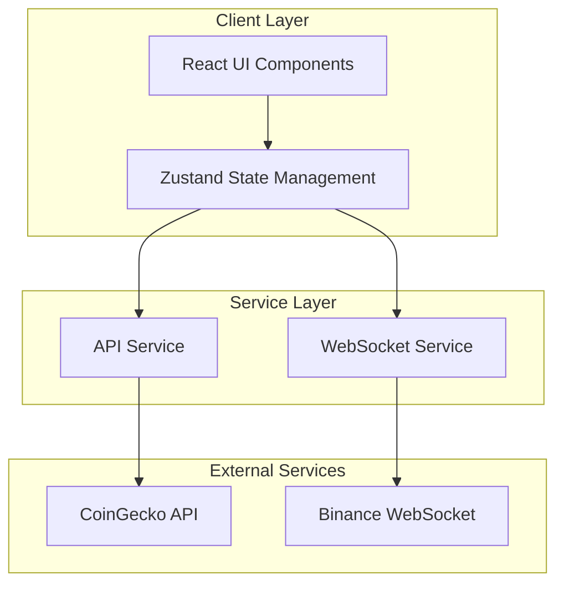
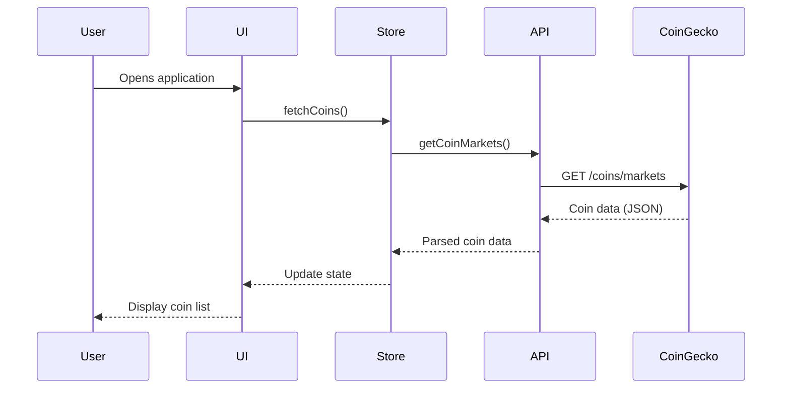
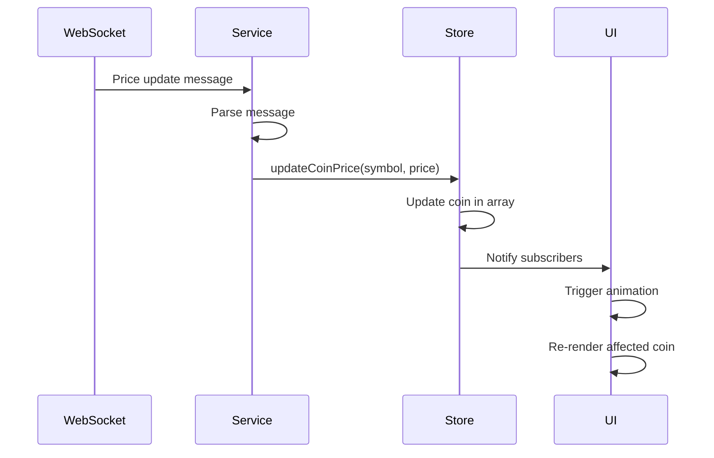
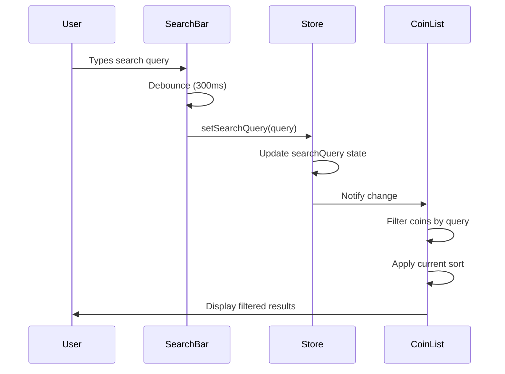
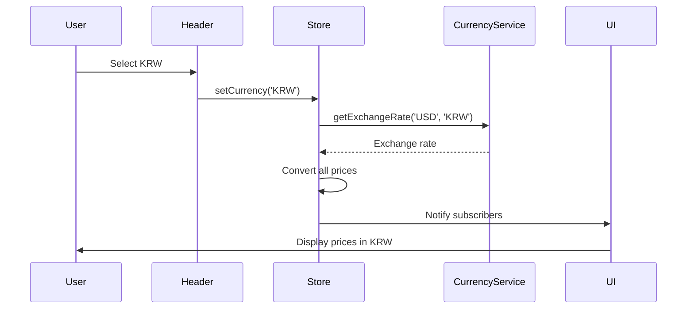

# Coin Price Monitoring Service - System Design Document

## 1. Architecture Overview

### High-Level Architecture



### Key Architectural Decisions

1. **Frontend-Only Architecture**: Single Page Application (SPA) with no backend server
   - Rationale: Reduces infrastructure complexity, faster development, leverages free public APIs
   - Trade-off: Limited to public API rate limits, no custom business logic server-side

2. **Hybrid Data Strategy**: REST API for initial load + WebSocket for real-time updates
   - Rationale: REST provides comprehensive data, WebSocket ensures real-time price updates
   - Trade-off: Complexity in synchronizing two data sources

3. **Client-Side State Management**: Zustand for global state
   - Rationale: Lightweight, TypeScript-friendly, simpler than Redux
   - Trade-off: All state logic runs client-side

4. **Responsive-First Design**: Mobile-first CSS with Tailwind
   - Rationale: Majority of crypto traders use mobile devices
   - Trade-off: Additional testing surface area

5. **Vite Build Tool**: Modern, fast development experience
   - Rationale: Superior HMR, faster builds than CRA
   - Trade-off: Newer ecosystem, fewer examples

## 2. Components

### 2.1 Core Components

#### **CoinList Component**
- **Responsibility**: Main container for displaying cryptocurrency list
- **Features**:
  - Renders table/grid of coins
  - Handles sorting interactions
  - Manages loading and error states
  - Responsive layout switching (table ↔ cards)

#### **CoinCard Component**
- **Responsibility**: Individual coin display unit
- **Features**:
  - Shows coin logo, name, symbol
  - Displays price with currency formatting
  - Shows 24h change with color coding
  - Price change animation
  - Click to expand details

#### **SearchBar Component**
- **Responsibility**: Coin filtering interface
- **Features**:
  - Real-time search input
  - Debounced search to prevent excessive filtering
  - Clear button
  - Search suggestions (optional enhancement)

#### **SortControls Component**
- **Responsibility**: Sorting interface
- **Features**:
  - Dropdown or button group for sort options
  - Sort direction toggle (asc/desc)
  - Active sort indicator

#### **PriceChart Component**
- **Responsibility**: Visual price trend display
- **Features**:
  - Mini sparkline chart (24h)
  - Uses Chart.js or Recharts
  - Responsive sizing
  - Color-coded by trend

#### **Header Component**
- **Responsibility**: Application header
- **Features**:
  - App title and logo
  - Currency selector (USD/KRW)
  - Theme toggle (light/dark)
  - Last update timestamp

#### **ErrorBoundary Component**
- **Responsibility**: Error handling and recovery
- **Features**:
  - Catches React errors
  - Displays user-friendly error message
  - Retry mechanism

### 2.2 Service Layer

#### **CoinGeckoService**
- **Responsibility**: REST API integration with CoinGecko
- **Methods**:
  - `fetchCoins()`: Get top coins with market data
  - `fetchCoinDetails(id)`: Get detailed coin information
  - `fetchMarketChart(id, days)`: Get historical price data
- **Features**:
  - Request caching (5-minute TTL)
  - Rate limit handling
  - Error retry logic

#### **WebSocketService**
- **Responsibility**: Real-time price updates via Binance WebSocket
- **Methods**:
  - `connect()`: Establish WebSocket connection
  - `subscribe(symbols)`: Subscribe to coin price streams
  - `unsubscribe(symbols)`: Unsubscribe from streams
  - `disconnect()`: Close connection
- **Features**:
  - Auto-reconnect on disconnect
  - Heartbeat/ping-pong
  - Message queue for offline periods

#### **CurrencyService**
- **Responsibility**: Currency conversion and formatting
- **Methods**:
  - `convert(amount, from, to)`: Convert between currencies
  - `format(amount, currency)`: Format with proper symbols
  - `fetchExchangeRates()`: Get current exchange rates
- **Features**:
  - Cached exchange rates
  - Locale-aware formatting

### 2.3 State Management

#### **CoinStore (Zustand)**
- **State**:
  - `coins`: Array of coin data
  - `loading`: Boolean loading state
  - `error`: Error message string
  - `lastUpdate`: Timestamp of last data fetch
  - `sortBy`: Current sort field
  - `sortDirection`: 'asc' | 'desc'
  - `searchQuery`: Current search string
  - `currency`: 'USD' | 'KRW'
- **Actions**:
  - `fetchCoins()`: Load initial coin data
  - `updateCoinPrice(symbol, price)`: Update single coin price
  - `setSortBy(field)`: Change sort field
  - `setSearchQuery(query)`: Update search filter
  - `setCurrency(currency)`: Change display currency

#### **UIStore (Zustand)**
- **State**:
  - `theme`: 'light' | 'dark'
  - `viewMode`: 'table' | 'grid'
  - `selectedCoin`: Currently selected coin ID
- **Actions**:
  - `toggleTheme()`: Switch theme
  - `setViewMode(mode)`: Change view mode
  - `selectCoin(id)`: Select coin for details

## 3. Data Flow

### 3.1 Initial Load Flow



### 3.2 Real-Time Update Flow



### 3.3 Search and Sort Flow



### 3.4 Currency Conversion Flow



## 4. APIs/Database

### 4.1 External API Integration

#### **CoinGecko API v3**

**Base URL**: `https://api.coingecko.com/api/v3`

**Endpoints Used**:

1. **Get Coin Markets**
   ```
   GET /coins/markets
   Query Parameters:
   - vs_currency: usd | krw
   - ids: bitcoin,ethereum,ripple,...
   - order: market_cap_desc
   - per_page: 100
   - page: 1
   - sparkline: true
   - price_change_percentage: 24h
   ```
   
   **Response Schema**:
   ```typescript
   interface CoinMarketData {
     id: string;
     symbol: string;
     name: string;
     image: string;
     current_price: number;
     market_cap: number;
     market_cap_rank: number;
     total_volume: number;
     high_24h: number;
     low_24h: number;
     price_change_24h: number;
     price_change_percentage_24h: number;
     circulating_supply: number;
     total_supply: number;
     max_supply: number;
     ath: number;
     ath_change_percentage: number;
     ath_date: string;
     last_updated: string;
     sparkline_in_7d?: {
       price: number[];
     };
   }
   ```

2. **Get Coin Details**
   ```
   GET /coins/{id}
   Query Parameters:
   - localization: false
   - tickers: false
   - market_data: true
   - community_data: false
   - developer_data: false
   ```

3. **Get Market Chart**
   ```
   GET /coins/{id}/market_chart
   Query Parameters:
   - vs_currency: usd | krw
   - days: 1 | 7 | 30
   - interval: hourly | daily
   ```

**Rate Limits**: 
- Free tier: 10-50 calls/minute
- Strategy: Cache responses for 30 seconds, implement exponential backoff

#### **Binance WebSocket API**

**Base URL**: `wss://stream.binance.com:9443/ws`

**Stream Format**:
```
{symbol}@ticker
Example: btcusdt@ticker
```

**Message Schema**:
```typescript
interface BinanceTickerMessage {
  e: string;           // Event type
  E: number;           // Event time
  s: string;           // Symbol
  p: string;           // Price change
  P: string;           // Price change percent
  w: string;           // Weighted average price
  c: string;           // Last price
  Q: string;           // Last quantity
  o: string;           // Open price
  h: string;           // High price
  l: string;           // Low price
  v: string;           // Total traded base asset volume
  q: string;           // Total traded quote asset volume
}
```

**Connection Strategy**:
- Combined stream: Subscribe to multiple symbols in one connection
- Format: `/stream?streams=btcusdt@ticker/ethusdt@ticker/...`
- Reconnect on disconnect with exponential backoff
- Max 1024 streams per connection

### 4.2 Data Models

#### **Coin Model**
```typescript
interface Coin {
  id: string;
  symbol: string;
  name: string;
  image: string;
  currentPrice: number;
  priceChange24h: number;
  priceChangePercentage24h: number;
  marketCap: number;
  marketCapRank: number;
  totalVolume: number;
  high24h: number;
  low24h: number;
  circulatingSupply: number;
  totalSupply: number | null;
  maxSupply: number | null;
  ath: number;
  athChangePercentage: number;
  athDate: string;
  lastUpdated: string;
  sparkline?: number[];
}
```

#### **Price Update Model**
```typescript
interface PriceUpdate {
  symbol: string;
  price: number;
  priceChange: number;
  priceChangePercentage: number;
  volume: number;
  timestamp: number;
}
```

#### **User Preferences Model**
```typescript
interface UserPreferences {
  currency: 'USD' | 'KRW';
  theme: 'light' | 'dark';
  viewMode: 'table' | 'grid';
  sortBy: 'rank' | 'price' | 'change' | 'volume' | 'marketCap';
  sortDirection: 'asc' | 'desc';
  favoriteCoins: string[];
}
```

### 4.3 Local Storage Schema

**Key**: `coin-monitor-preferences`

**Value**:
```json
{
  "currency": "USD",
  "theme": "dark",
  "viewMode": "table",
  "sortBy": "rank",
  "sortDirection": "asc",
  "favoriteCoins": ["bitcoin", "ethereum"],
  "lastVisit": "2024-01-15T10:30:00Z"
}
```

## 5. Integration Points

### 5.1 External Dependencies

#### **CoinGecko API**
- **Purpose**: Primary data source for coin information
- **Integration Type**: REST API
- **Authentication**: None (public API)
- **Fallback Strategy**: 
  - Cache last successful response
  - Display stale data with warning
  - Retry with exponential backoff
- **Error Handling**:
  - 429 (Rate Limit): Wait and retry
  - 5xx: Retry up to 3 times
  - Network error: Show offline message

#### **Binance WebSocket**
- **Purpose**: Real-time price updates
- **Integration Type**: WebSocket
- **Authentication**: None (public stream)
- **Fallback Strategy**:
  - Fall back to 30-second polling if WebSocket fails
  - Use CoinGecko API for updates
- **Error Handling**:
  - Connection lost: Auto-reconnect with backoff
  - Invalid message: Log and ignore
  - Stream error: Resubscribe

#### **Exchange Rate API** (Optional)
- **Purpose**: USD to KRW conversion
- **Integration Type**: REST API
- **Options**: 
  - exchangerate-api.com (free tier)
  - fixer.io
  - CoinGecko simple/price endpoint
- **Caching**: 1-hour cache for exchange rates

### 5.2 Browser APIs

#### **LocalStorage**
- **Purpose**: Persist user preferences
- **Data**: Theme, currency, sort preferences, favorites
- **Size Limit**: 5-10MB (well within limits)
- **Error Handling**: Graceful degradation if unavailable

#### **Notification API** (Future Enhancement)
- **Purpose**: Price alerts
- **Permission**: Request on user action
- **Fallback**: In-app notifications only

#### **Service Worker** (Future Enhancement)
- **Purpose**: Offline support, background sync
- **Strategy**: Cache-first for static assets, network-first for API

### 5.3 Third-Party Libraries

#### **UI Framework**
- **React 18**: Core framework
- **React Router**: Client-side routing (if multi-page)
- **Tailwind CSS**: Utility-first styling

#### **State Management**
- **Zustand**: Global state management
- **React Query** (Alternative): Server state management with caching

#### **Data Visualization**
- **Recharts** or **Chart.js**: Price charts and sparklines
- **Rationale**: Recharts is React-native, Chart.js has more features

#### **Utilities**
- **date-fns**: Date formatting and manipulation
- **numeral.js**: Number formatting