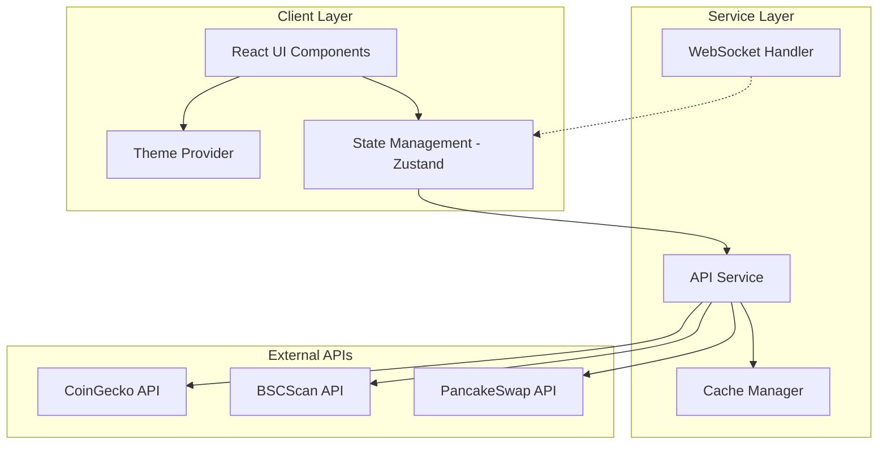
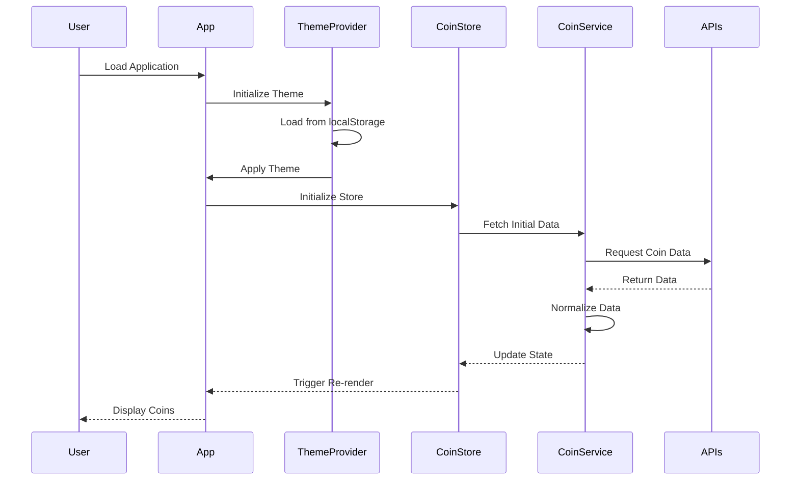
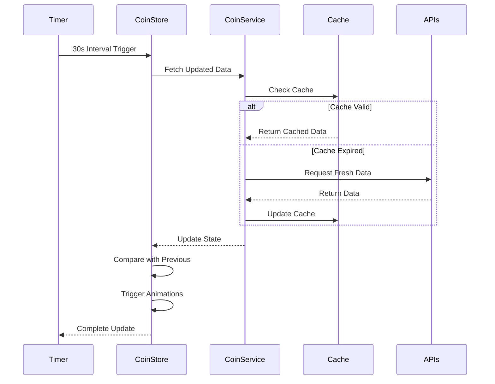
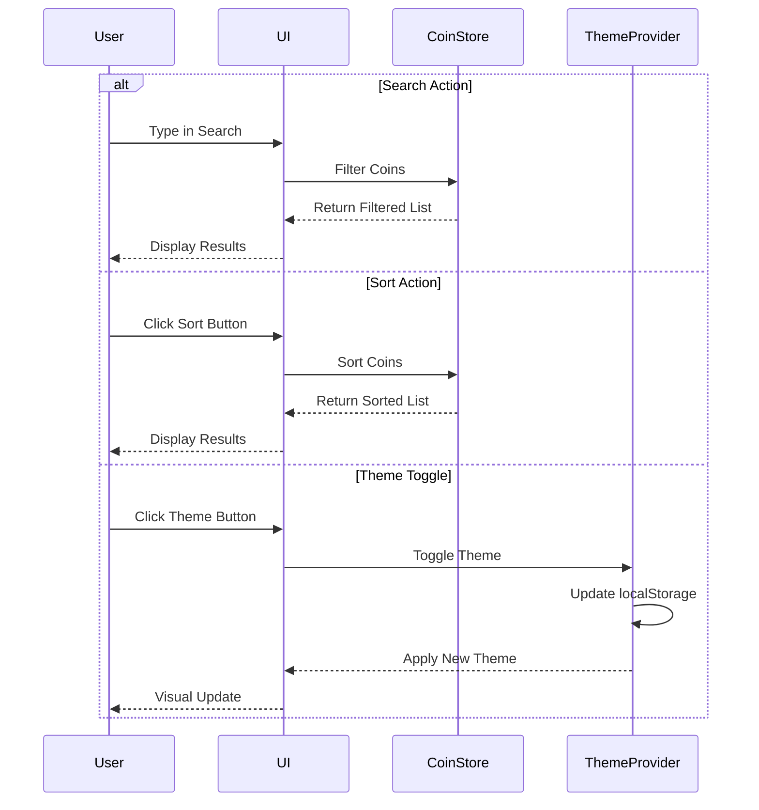
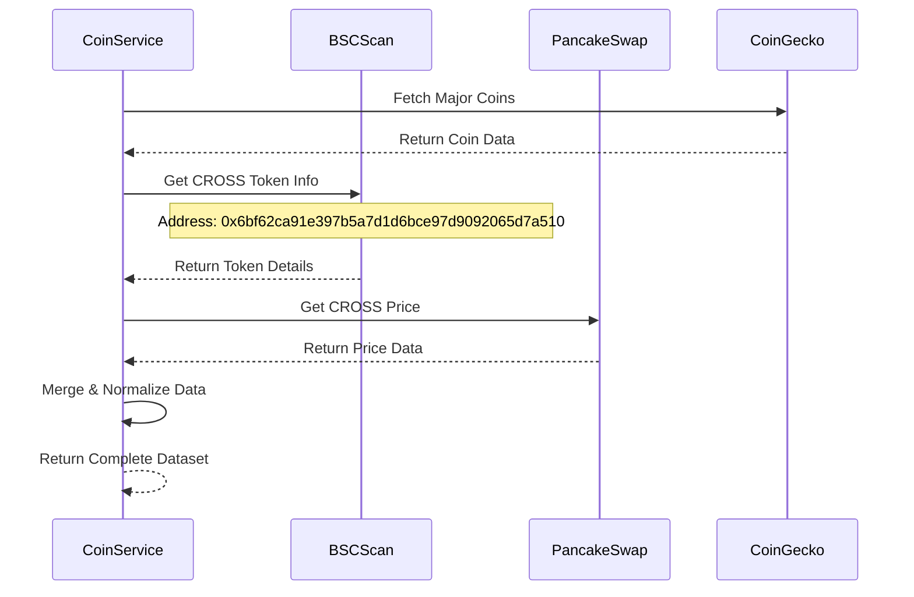

# Coin Price Monitoring Service - System Design Document

## 1. Architecture Overview

### High-Level Architecture



### Key Architectural Decisions

1. **Frontend Framework**: React 18 with TypeScript for type safety and modern features
2. **State Management**: Zustand for lightweight, performant global state
3. **Styling**: Tailwind CSS for rapid UI development with dark/light mode support
4. **API Strategy**: 
   - CoinGecko for major cryptocurrencies
   - BSCScan + PancakeSwap for CROSS token (BSC-specific)
   - Client-side polling (30s interval) with cache layer
5. **Theme System**: CSS variables + Tailwind dark mode for seamless theme switching
6. **Build Tool**: Vite for fast development and optimized production builds

### Technology Stack

- **Frontend**: React 18, TypeScript 5.x
- **State Management**: Zustand 4.x
- **Styling**: Tailwind CSS 3.x
- **HTTP Client**: Axios
- **Build Tool**: Vite 5.x
- **Icons**: Lucide React
- **Deployment**: Static hosting (Vercel/Netlify)

---

## 2. Components

### 2.1 Core Components

#### **ThemeProvider**
- **Responsibility**: Manage dark/light mode state and persistence
- **Features**: 
  - Toggle between themes
  - Persist preference to localStorage
  - Apply theme class to document root
  - Provide theme context to all children

#### **CoinList**
- **Responsibility**: Display grid/list of cryptocurrency cards
- **Features**:
  - Responsive grid layout
  - Loading states
  - Empty states
  - Virtualization for performance (if needed)

#### **CoinCard**
- **Responsibility**: Display individual coin information
- **Features**:
  - Price display with formatting
  - 24h change with color coding
  - Volume and market cap
  - Logo and symbol
  - Price change animation

#### **SearchBar**
- **Responsibility**: Filter coins by name/symbol
- **Features**:
  - Real-time search
  - Debounced input
  - Clear button
  - Keyboard shortcuts

#### **SortControls**
- **Responsibility**: Sort coins by various criteria
- **Features**:
  - Sort by price, change%, volume, market cap
  - Ascending/descending toggle
  - Active state indication

#### **Header**
- **Responsibility**: App branding and global controls
- **Features**:
  - App title/logo
  - Theme toggle button
  - Last update timestamp
  - Refresh button

#### **RefreshIndicator**
- **Responsibility**: Show auto-refresh status
- **Features**:
  - Countdown timer
  - Manual refresh trigger
  - Loading spinner

### 2.2 Service Components

#### **CoinService**
- **Responsibility**: Fetch and normalize coin data from multiple sources
- **Features**:
  - Fetch major coins from CoinGecko
  - Fetch CROSS token from BSC/PancakeSwap
  - Normalize data structure
  - Error handling and retries

#### **CacheService**
- **Responsibility**: Cache API responses to reduce requests
- **Features**:
  - In-memory cache with TTL
  - Cache invalidation
  - Cache hit/miss tracking

#### **PriceFormatter**
- **Responsibility**: Format prices and numbers consistently
- **Features**:
  - Currency formatting (USD/KRW)
  - Percentage formatting
  - Large number abbreviation (K, M, B)
  - Decimal precision handling

---

## 3. Data Flow

### 3.1 Application Initialization Flow



### 3.2 Real-time Update Flow



### 3.3 User Interaction Flow



### 3.4 CROSS Token Integration Flow



---

## 4. APIs/Database

### 4.1 External API Integrations

#### **CoinGecko API**

**Endpoint**: `GET https://api.coingecko.com/api/v3/coins/markets`

**Parameters**:
```typescript
{
  vs_currency: 'usd',
  ids: 'bitcoin,ethereum,ripple,cardano,solana,dogecoin,polkadot,polygon,chainlink,uniswap',
  order: 'market_cap_desc',
  per_page: 10,
  page: 1,
  sparkline: false,
  price_change_percentage: '24h'
}
```

**Response Schema**:
```typescript
interface CoinGeckoResponse {
  id: string;
  symbol: string;
  name: string;
  image: string;
  current_price: number;
  market_cap: number;
  market_cap_rank: number;
  total_volume: number;
  price_change_24h: number;
  price_change_percentage_24h: number;
  circulating_supply: number;
  last_updated: string;
}
```

#### **BSCScan API**

**Endpoint**: `GET https://api.bscscan.com/api`

**Parameters**:
```typescript
{
  module: 'token',
  action: 'tokeninfo',
  contractaddress: '0x6bf62ca91e397b5a7d1d6bce97d9092065d7a510',
  apikey: process.env.VITE_BSCSCAN_API_KEY
}
```

**Response Schema**:
```typescript
interface BSCScanTokenInfo {
  status: string;
  message: string;
  result: [{
    contractAddress: string;
    tokenName: string;
    symbol: string;
    divisor: string;
    tokenType: string;
    totalSupply: string;
  }];
}
```

#### **PancakeSwap API (via BSC RPC)**

**Endpoint**: `POST https://bsc-dataseed.binance.org/`

**Method**: Call PancakeSwap Router contract for price

**Alternative - DexScreener API**:
```typescript
GET https://api.dexscreener.com/latest/dex/tokens/0x6bf62ca91e397b5a7d1d6bce97d9092065d7a510
```

### 4.2 Internal Data Models

#### **Coin Interface**
```typescript
interface Coin {
  id: string;
  symbol: string;
  name: string;
  image: string;
  currentPrice: number;
  priceChangePercentage24h: number;
  priceChange24h: number;
  marketCap: number;
  totalVolume: number;
  lastUpdated: Date;
  source: 'coingecko' | 'bsc';
}
```

#### **CoinStore State**
```typescript
interface CoinStoreState {
  coins: Coin[];
  filteredCoins: Coin[];
  isLoading: boolean;
  error: string | null;
  lastUpdate: Date | null;
  searchQuery: string;
  sortBy: 'price' | 'change' | 'volume' | 'marketCap';
  sortOrder: 'asc' | 'desc';
  
  // Actions
  fetchCoins: () => Promise<void>;
  setSearchQuery: (query: string) => void;
  setSortBy: (sortBy: string) => void;
  toggleSortOrder: () => void;
}
```

#### **Theme State**
```typescript
interface ThemeState {
  theme: 'light' | 'dark';
  toggleTheme: () => void;
  setTheme: (theme: 'light' | 'dark') => void;
}
```

### 4.3 Cache Structure

```typescript
interface CacheEntry<T> {
  data: T;
  timestamp: number;
  ttl: number;
}

interface CacheStore {
  coingecko: CacheEntry<CoinGeckoResponse[]> | null;
  crossToken: CacheEntry<Coin> | null;
}
```

---

## 5. Integration Points

### 5.1 External Dependencies

#### **CoinGecko API**
- **Purpose**: Primary data source for major cryptocurrencies
- **Rate Limit**: 50 calls/minute (free tier)
- **Fallback**: Cache previous data if API fails
- **Error Handling**: Retry with exponential backoff

#### **BSCScan API**
- **Purpose**: CROSS token metadata and contract info
- **Rate Limit**: 5 calls/second (free tier)
- **API Key**: Required (stored in environment variables)
- **Error Handling**: Graceful degradation if unavailable

#### **DexScreener API**
- **Purpose**: CROSS token price data from DEX
- **Rate Limit**: No official limit (use responsibly)
- **Fallback**: Primary source for BSC token prices
- **Error Handling**: Return null if unavailable

### 5.2 Browser APIs

#### **LocalStorage**
- **Purpose**: Persist theme preference
- **Keys**: 
  - `theme`: 'light' | 'dark'
- **Error Handling**: Fallback to system preference

#### **Window.matchMedia**
- **Purpose**: Detect system theme preference
- **Usage**: Initial theme detection
- **Fallback**: Default to 'light' theme

### 5.3 Environment Variables

```typescript
interface EnvironmentVariables {
  VITE_BSCSCAN_API_KEY?: string;
  VITE_COINGECKO_API_KEY?: string; // Optional, for pro tier
  VITE_REFRESH_INTERVAL?: string; // Default: 30000ms
  VITE_CACHE_TTL?: string; // Default: 25000ms
}
```

### 5.4 Error Boundaries

```typescript
interface ErrorBoundaryProps {
  fallback: ReactNode;
  onError?: (error: Error, errorInfo: ErrorInfo) => void;
}
```

---

## 6. Implementation Plan

### 6.1 Project Structure

```
coin-monitor/
├── public/
│   ├── favicon.ico
│   └── logo.svg
├── src/
│   ├── components/
│   │   ├── CoinCard.tsx
│   │   ├── CoinList.tsx
│   │   ├── Header.tsx
│   │   ├── SearchBar.tsx
│   │   ├── SortControls.tsx
│   │   ├── RefreshIndicator.tsx
│   │   ├── ThemeToggle.tsx
│   │   ├── ErrorBoundary.tsx
│   │   └── LoadingSpinner.tsx
│   ├── services/
│   │   ├── coinService.ts
│   │   ├── cacheService.ts
│   │   ├── bscService.ts
│   │   └── formatters.ts
│   ├── stores/
│   │   ├── useCoinStore.ts
│   │   └── useThemeStore.ts
│   ├── types/
│   │   ├── coin.types.ts
│   │   ├── api.types.ts
│   │   └── theme.types.ts
│   ├── hooks/
│   │   ├── useAutoRefresh.ts
│   │   ├── useDebounce.ts
│   │   └── usePriceAnimation.ts
│   ├── utils/
│   │   ├── constants.ts
│   │   ├── helpers.ts
│   │   └── validators.ts
│   ├── styles/
│   │   └── globals.css
│   ├── App.tsx
│   ├── main.tsx
│   └── vite-env.d.ts
├── .env.example
├── .gitignore
├── index.html
├── package.json
├── tsconfig.json
├── tsconfig.node.json
├── vite.config.ts
├── tailwind.config.js
├── postcss.config.js
└── README.md
```

### 6.2 File-Level Implementation Plan

#### **Configuration Files**

| File Path | Status | Responsibility | Rationale |
|-----------|--------|----------------|-----------|
| `package.json` | NEW |