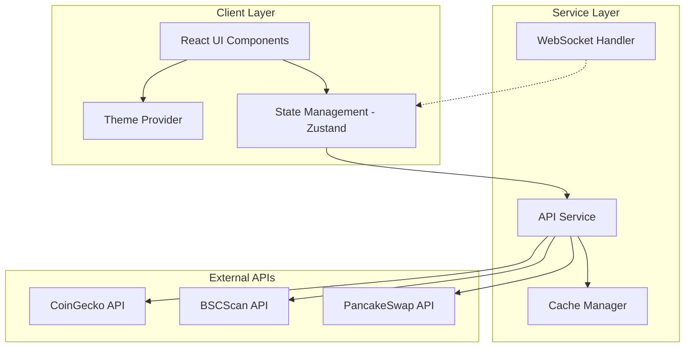
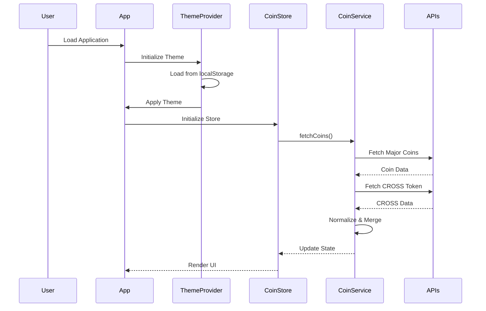
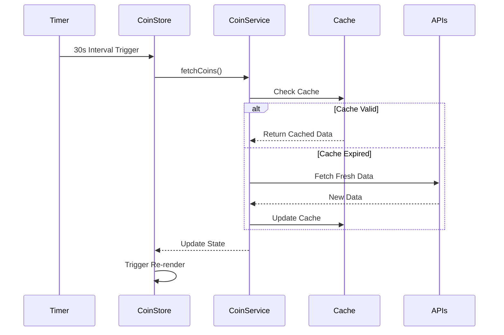
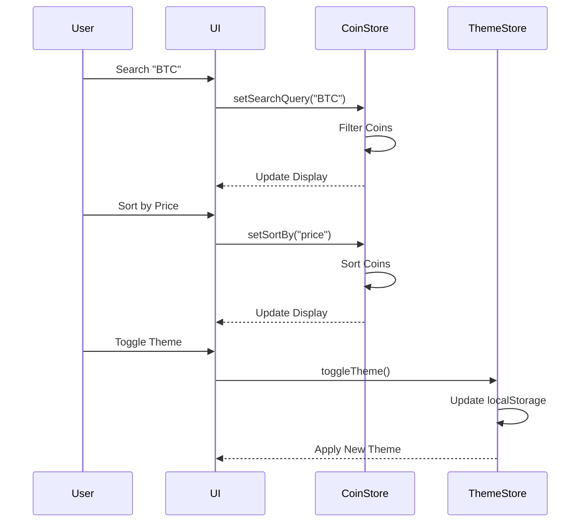
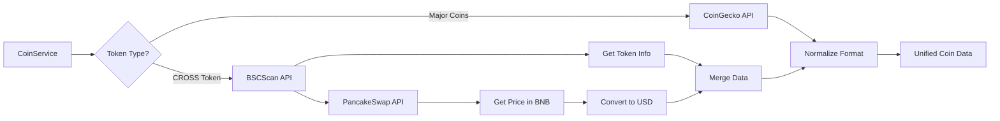

# Coin Price Monitoring Service - System Design Document

## 1. Architecture Overview

### High-Level Architecture



### Key Architectural Decisions

1. **Frontend Framework**: React 18 with TypeScript for type safety and modern features
2. **State Management**: Zustand for lightweight, performant global state
3. **Styling**: Tailwind CSS for rapid UI development with dark/light mode support
4. **API Strategy**: 
   - CoinGecko for major cryptocurrencies
   - BSCScan + PancakeSwap for CROSS token (BSC-specific)
   - Client-side polling (30s interval) with cache layer
5. **Theme System**: CSS variables + Tailwind dark mode for seamless theme switching
6. **Build Tool**: Vite for fast development and optimized production builds

### Technology Stack

- **Frontend**: React 18, TypeScript 5.x
- **State Management**: Zustand 4.x
- **Styling**: Tailwind CSS 3.x
- **HTTP Client**: Axios
- **Build Tool**: Vite 5.x
- **Icons**: Lucide React
- **Deployment**: Static hosting (Vercel/Netlify)

---

## 2. Components

### 2.1 Core Components

#### **ThemeProvider**
- **Responsibility**: Manage dark/light mode state and persistence
- **Features**: 
  - Toggle between themes
  - Persist preference to localStorage
  - Apply theme class to document root
  - Provide theme context to all children

#### **CoinList**
- **Responsibility**: Display grid/list of cryptocurrency cards
- **Features**:
  - Responsive grid layout
  - Loading states
  - Empty states
  - Error handling

#### **CoinCard**
- **Responsibility**: Display individual coin information
- **Features**:
  - Price display with formatting
  - 24h change with color coding
  - Volume and market cap
  - Price change animation
  - Responsive design

#### **SearchBar**
- **Responsibility**: Filter coins by name or symbol
- **Features**:
  - Real-time search
  - Debounced input
  - Clear button
  - Theme-aware styling

#### **SortControls**
- **Responsibility**: Sort coins by various criteria
- **Features**:
  - Sort by price, change%, volume, market cap
  - Ascending/descending toggle
  - Active state indication

#### **Header**
- **Responsibility**: App branding and theme toggle
- **Features**:
  - Logo and title
  - Theme switcher button
  - Last update timestamp
  - Refresh button

#### **RefreshIndicator**
- **Responsibility**: Show auto-refresh countdown
- **Features**:
  - Visual countdown (30s)
  - Manual refresh trigger
  - Loading state

### 2.2 Service Components

#### **CoinService**
- **Responsibility**: Fetch and normalize coin data from multiple sources
- **Features**:
  - Fetch major coins from CoinGecko
  - Fetch CROSS token from BSC/PancakeSwap
  - Normalize data structure
  - Error handling and retries

#### **CacheService**
- **Responsibility**: Cache API responses to reduce requests
- **Features**:
  - In-memory cache with TTL
  - Cache invalidation
  - Cache hit/miss tracking

#### **PriceFormatter**
- **Responsibility**: Format prices and numbers consistently
- **Features**:
  - Currency formatting (USD/KRW)
  - Percentage formatting
  - Large number abbreviation (K, M, B)
  - Locale-aware formatting

---

## 3. Data Flow

### 3.1 Application Initialization Flow



### 3.2 Real-time Update Flow



### 3.3 User Interaction Flow



### 3.4 CROSS Token Data Flow



---

## 4. APIs/Database

### 4.1 External API Integrations

#### **CoinGecko API**
- **Base URL**: `https://api.coingecko.com/api/v3`
- **Endpoints Used**:
  - `GET /coins/markets` - Fetch market data for multiple coins
- **Rate Limit**: 50 calls/minute (free tier)
- **Authentication**: None required

**Request Example**:
```typescript
GET /coins/markets?vs_currency=usd&ids=bitcoin,ethereum,ripple,cardano,solana,dogecoin,polkadot,polygon,chainlink,uniswap&order=market_cap_desc&sparkline=false&price_change_percentage=24h
```

**Response Schema**:
```typescript
interface CoinGeckoResponse {
  id: string;
  symbol: string;
  name: string;
  image: string;
  current_price: number;
  market_cap: number;
  market_cap_rank: number;
  total_volume: number;
  price_change_percentage_24h: number;
  price_change_24h: number;
}
```

#### **BSCScan API**
- **Base URL**: `https://api.bscscan.com/api`
- **Endpoints Used**:
  - `GET /api?module=token&action=tokeninfo` - Get token information
- **Rate Limit**: 5 calls/second (free tier)
- **Authentication**: API Key required

**Request Example**:
```typescript
GET /api?module=token&action=tokeninfo&contractaddress=0x6bf62ca91e397b5a7d1d6bce97d9092065d7a510&apikey=YOUR_API_KEY
```

#### **PancakeSwap API / BSC RPC**
- **Strategy**: Use PancakeSwap subgraph or direct contract calls
- **Purpose**: Get CROSS token price in BNB, then convert to USD
- **Fallback**: Use DEX aggregator APIs (1inch, DexScreener)

**Alternative - DexScreener API** (Recommended):
- **Base URL**: `https://api.dexscreener.com/latest/dex`
- **Endpoint**: `GET /tokens/{tokenAddress}`
- **No Authentication Required**

```typescript
GET /tokens/0x6bf62ca91e397b5a7d1d6bce97d9092065d7a510
```

### 4.2 Data Models

#### **Coin Interface**
```typescript
interface Coin {
  id: string;                    // Unique identifier
  symbol: string;                // Ticker symbol (BTC, ETH)
  name: string;                  // Full name (Bitcoin, Ethereum)
  image: string;                 // Logo URL
  currentPrice: number;          // Current price in USD
  priceChangePercentage24h: number; // 24h change %
  priceChange24h: number;        // 24h change absolute
  marketCap: number;             // Market capitalization
  totalVolume: number;           // 24h trading volume
  rank: number;                  // Market cap rank
  source: 'coingecko' | 'bsc';  // Data source
  lastUpdated: Date;             // Last update timestamp
}
```

#### **Theme State**
```typescript
type Theme = 'light' | 'dark';

interface ThemeState {
  theme: Theme;
  toggleTheme: () => void;
  setTheme: (theme: Theme) => void;
}
```

#### **Coin Store State**
```typescript
interface CoinStoreState {
  coins: Coin[];
  loading: boolean;
  error: string | null;
  searchQuery: string;
  sortBy: 'price' | 'change' | 'volume' | 'marketCap';
  sortOrder: 'asc' | 'desc';
  lastUpdate: Date | null;
  
  // Actions
  fetchCoins: () => Promise<void>;
  setSearchQuery: (query: string) => void;
  setSortBy: (sortBy: string) => void;
  toggleSortOrder: () => void;
  refreshCoins: () => Promise<void>;
}
```

### 4.3 Local Storage Schema

```typescript
interface LocalStorageData {
  theme: 'light' | 'dark';           // User theme preference
  lastVisit: string;                  // ISO timestamp
  favoriteCoins?: string[];           // Future feature
}
```

---

## 5. Integration Points

### 5.1 External Dependencies

#### **CoinGecko Integration**
- **Purpose**: Primary data source for major cryptocurrencies
- **Reliability**: High (99.9% uptime)
- **Fallback**: Cache previous data, show stale data warning
- **Error Handling**: Retry with exponential backoff (3 attempts)

#### **BSC/DexScreener Integration**
- **Purpose**: CROSS token price and metadata
- **Reliability**: Medium (dependent on BSC network)
- **Fallback**: Show "Price Unavailable" for CROSS token
- **Error Handling**: Silent fail, log error, continue with other coins

#### **CDN for Coin Images**
- **Source**: CoinGecko CDN, DexScreener
- **Fallback**: Generic token icon
- **Lazy Loading**: Implement for performance

### 5.2 Browser APIs

#### **LocalStorage**
- **Usage**: Theme persistence
- **Quota**: 5-10MB (sufficient)
- **Error Handling**: Graceful degradation if unavailable

#### **Intersection Observer**
- **Usage**: Lazy load coin cards (future optimization)
- **Fallback**: Load all cards immediately

#### **Network Information API**
- **Usage**: Adjust polling frequency based on connection
- **Fallback**: Default 30s interval

### 5.3 Third-Party Libraries

| Library | Version | Purpose | Bundle Impact |
|---------|---------|---------|---------------|
| React | 18.x | UI Framework | ~45KB |
| Zustand | 4.x | State Management | ~3KB |
| Axios | 1.x | HTTP Client | ~15KB |
| Tailwind CSS | 3.x | Styling | ~10KB (purged) |
| Lucide React | latest | Icons | ~5KB (tree-shaken) |

**Total Estimated Bundle Size**: ~150KB (gzipped)

---

## 6. Implementation Plan

### 6.1 Project Structure

```
coin-monitor/
├── public/
│   ├── favicon.ico
│   └── logo.png
├── src/
│   ├── components/
│   │   ├── CoinCard.tsx
│   │   ├── CoinList.tsx
│   │   ├── Header.tsx
│   │   ├── SearchBar.tsx
│   │   ├── SortControls.tsx
│   │   ├── RefreshIndicator.tsx
│   │   ├── ThemeToggle.tsx
│   │   └── ErrorBoundary.tsx
│   ├── services/
│   │   ├── coinService.ts
│   │   ├── cacheService.ts
│   │   ├── bscService.ts
│   │   └── apiClient.ts
│   ├── stores/
│   │   ├── useCoinStore.ts
│   │   └── useThemeStore.ts
│   ├── utils/
│   │   ├── formatters.ts
│   │   ├── constants.ts
│   │   └── helpers.ts
│   ├── types/
│   │   ├── coin.types.ts
│   │   ├── api.types.ts
│   │   └── theme.types.ts
│   ├── hooks/
│   │   ├── useAutoRefresh.ts
│   │   ├── useCoinData.ts
│   │   └── useTheme.ts
│   ├── styles/
│   │   └── globals.css
│   ├── App.tsx
│   ├── main.tsx
│   └── vite-env.d.ts
├── .env.example
├── .gitignore
├── index.html
├── package.json
├── tsconfig.json
├── tailwind.config.js
├── postcss.config.js
├── vite.config.ts
└── README.md
```

### 6.2 File-Level Implementation Plan

#### **Configuration Files**

| File Path | Status | Responsibility | Rationale |
|-----------|--------|----------------|-----------|
| `package.json` | **NEW** | Project dependencies and scripts | Define all required packages, build scripts, and project metadata |
| `tsconfig.json` | **NEW** | TypeScript configuration | Enable strict mode, path aliases, and modern ES