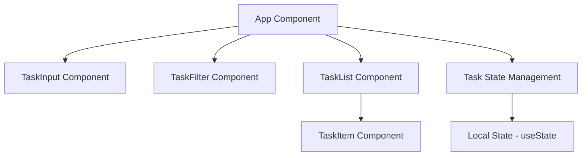
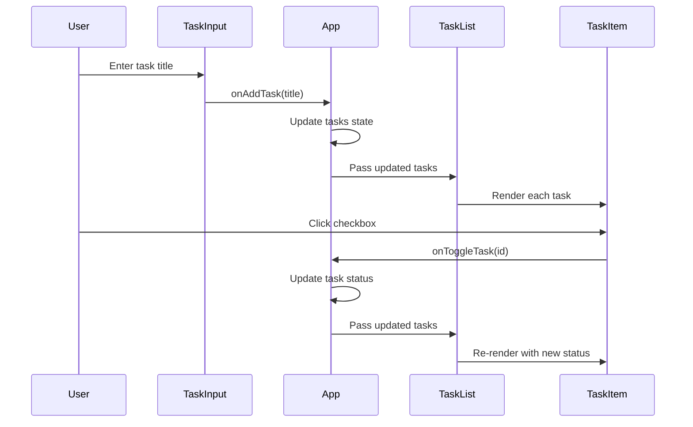

# Simple Tasks - System Design Document

## 1. Architecture Overview

### High-Level Structure
Simple Tasks is a client-side single-page application (SPA) built with React, TypeScript, and Vite. The architecture follows a component-based design pattern with unidirectional data flow.



### Key Architectural Decisions

1. **State Management**: Using React's `useState` hook for simplicity, with state lifted to the App component
2. **Component Hierarchy**: Flat structure with App as the single source of truth
3. **Data Persistence**: No backend - state exists only in memory during session
4. **Styling**: Tailwind CSS for rapid, utility-first styling
5. **Type Safety**: Full TypeScript implementation with strict type checking

### Technology Stack
- **Framework**: React 18+
- **Build Tool**: Vite
- **Language**: TypeScript
- **Styling**: Tailwind CSS
- **Package Manager**: npm

---

## 2. Components

### 2.1 App Component (`App.tsx`)
**Responsibility**: Root component managing global state and orchestrating child components

**State Management**:
- `tasks`: Array of task objects
- `filter`: Current filter state ('all' | 'completed' | 'active')

**Key Functions**:
- `addTask(title: string)`: Creates new task with unique ID
- `toggleTask(id: string)`: Toggles completion status
- `deleteTask(id: string)`: Removes task from state
- `setFilter(filter: FilterType)`: Updates current filter

### 2.2 TaskInput Component
**Responsibility**: Handle new task creation

**Props**: 
- `onAddTask: (title: string) => void`

**Features**:
- Controlled input field
- Form submission handling
- Input validation (non-empty)
- Auto-clear after submission

### 2.3 TaskFilter Component
**Responsibility**: Display and manage filter options

**Props**:
- `currentFilter: FilterType`
- `onFilterChange: (filter: FilterType) => void`
- `taskCounts: { all: number, active: number, completed: number }`

**Features**:
- Three filter buttons (All, Active, Completed)
- Visual indication of active filter
- Display count for each category

### 2.4 TaskList Component
**Responsibility**: Render filtered list of tasks

**Props**:
- `tasks: Task[]`
- `onToggleTask: (id: string) => void`
- `onDeleteTask: (id: string) => void`

**Features**:
- Iterate and render TaskItem components
- Handle empty state display
- Pass event handlers to children

### 2.5 TaskItem Component
**Responsibility**: Display individual task with actions

**Props**:
- `task: Task`
- `onToggle: (id: string) => void`
- `onDelete: (id: string) => void`

**Features**:
- Checkbox for completion toggle
- Strike-through styling for completed tasks
- Delete button
- Accessible markup

---

## 3. Data Flow

### Data Flow Diagram



### State Flow

1. **Task Creation Flow**:
   - User types in TaskInput → controlled input updates local state
   - User submits → TaskInput calls `onAddTask` prop
   - App receives title → generates unique ID → adds to tasks array
   - State update triggers re-render → TaskList receives new tasks

2. **Task Toggle Flow**:
   - User clicks checkbox in TaskItem → calls `onToggle` prop
   - Event bubbles to App → finds task by ID → toggles `completed` flag
   - State update → filtered tasks recalculated → TaskList re-renders

3. **Task Delete Flow**:
   - User clicks delete in TaskItem → calls `onDelete` prop
   - App filters out task by ID → updates state
   - TaskList re-renders without deleted task

4. **Filter Flow**:
   - User clicks filter button → TaskFilter calls `onFilterChange`
   - App updates filter state → recalculates filtered tasks
   - TaskList receives filtered subset → re-renders

### Data Transformation Pipeline

```
Raw Tasks Array → Filter Application → Sorted Tasks → Rendered UI
```

---

## 4. APIs/Database

### Data Models

#### Task Interface
```typescript
interface Task {
  id: string;           // Unique identifier (UUID or timestamp-based)
  title: string;        // Task description
  completed: boolean;   // Completion status
  createdAt: number;    // Timestamp for sorting
}
```

#### Filter Type
```typescript
type FilterType = 'all' | 'active' | 'completed';
```

### State Schema

```typescript
// App Component State
{
  tasks: Task[];
  filter: FilterType;
}
```

### Helper Functions

```typescript
// Generate unique ID
function generateId(): string

// Filter tasks based on current filter
function getFilteredTasks(tasks: Task[], filter: FilterType): Task[]

// Calculate task counts
function getTaskCounts(tasks: Task[]): {
  all: number;
  active: number;
  completed: number;
}
```

### No External APIs
- All data operations are in-memory
- No HTTP requests
- No local storage (session-only persistence)

---

## 5. Integration Points

### Internal Dependencies

1. **React Ecosystem**:
   - `react`: Core library (v18+)
   - `react-dom`: DOM rendering

2. **Build Tools**:
   - `vite`: Development server and build tool
   - `@vitejs/plugin-react`: React plugin for Vite

3. **TypeScript**:
   - `typescript`: Type checking
   - `@types/react`: React type definitions
   - `@types/react-dom`: React DOM type definitions

4. **Styling**:
   - `tailwindcss`: Utility-first CSS framework
   - `postcss`: CSS processing
   - `autoprefixer`: CSS vendor prefixing

### Configuration Files Integration

- `vite.config.ts`: Vite configuration with React plugin
- `tsconfig.json`: TypeScript compiler options
- `tailwind.config.js`: Tailwind CSS configuration
- `postcss.config.js`: PostCSS configuration for Tailwind

### No External Integrations
- No backend API
- No authentication service
- No analytics
- No third-party UI libraries

---

## 6. Implementation Plan

### File Structure
```
simple-tasks/
├── public/
├── src/
│   ├── components/
│   │   ├── TaskInput.tsx
│   │   ├── TaskFilter.tsx
│   │   ├── TaskList.tsx
│   │   └── TaskItem.tsx
│   ├── types/
│   │   └── task.ts
│   ├── utils/
│   │   └── taskHelpers.ts
│   ├── App.tsx
│   ├── App.css
│   ├── main.tsx
│   └── index.css
├── index.html
├── package.json
├── tsconfig.json
├── tsconfig.node.json
├── vite.config.ts
├── tailwind.config.js
├── postcss.config.js
└── .gitignore
```

### Detailed File Plan

#### Configuration Files

| File Path | Status | Responsibility | Rationale |
|-----------|--------|----------------|-----------|
| `package.json` | NEW | Define project dependencies and scripts | Configure React, TypeScript, Vite, and Tailwind dependencies with dev server and build scripts |
| `tsconfig.json` | NEW | TypeScript compiler configuration for app code | Enable strict type checking, JSX support, and modern ES features for application code |
| `tsconfig.node.json` | NEW | TypeScript configuration for Vite config | Separate config for Node.js environment used by Vite configuration files |
| `vite.config.ts` | NEW | Vite build tool configuration | Configure React plugin and development server settings |
| `tailwind.config.js` | NEW | Tailwind CSS configuration | Define content paths for Tailwind to scan and enable JIT mode |
| `postcss.config.js` | NEW | PostCSS configuration | Enable Tailwind CSS and Autoprefixer plugins |
| `.gitignore` | NEW | Git ignore patterns | Exclude node_modules, build artifacts, and IDE files from version control |

#### HTML Entry Point

| File Path | Status | Responsibility | Rationale |
|-----------|--------|----------------|-----------|
| `index.html` | NEW | HTML entry point for SPA | Minimal HTML shell with root div and script tag for Vite to inject React app |

#### Application Entry

| File Path | Status | Responsibility | Rationale |
|-----------|--------|----------------|-----------|
| `src/main.tsx` | NEW | Application bootstrap | Initialize React app, mount to DOM, and import global styles |
| `src/index.css` | NEW | Global styles and Tailwind directives | Import Tailwind base, components, and utilities; define global CSS resets |

#### Type Definitions

| File Path | Status | Responsibility | Rationale |
|-----------|--------|----------------|-----------|
| `src/types/task.ts` | NEW | Define Task and FilterType interfaces | Centralize type definitions for reuse across components and ensure type safety |

#### Utility Functions

| File Path | Status | Responsibility | Rationale |
|-----------|--------|----------------|-----------|
| `src/utils/taskHelpers.ts` | NEW | Task manipulation helper functions | Encapsulate ID generation, filtering logic, and count calculations for reusability and testability |

#### Core Application

| File Path | Status | Responsibility | Rationale |
|-----------|--------|----------------|-----------|
| `src/App.tsx` | NEW | Root component with state management | Central state container managing tasks and filter; orchestrates all child components |
| `src/App.css` | NEW | App-specific styles (if needed) | Optional component-specific styles not covered by Tailwind utilities |

#### UI Components

| File Path | Status | Responsibility | Rationale |
|-----------|--------|----------------|-----------|
| `src/components/TaskInput.tsx` | NEW | Task creation input form | Isolated component for adding new tasks with validation and controlled input |
| `src/components/TaskFilter.tsx` | NEW | Filter button group | Separate component for filter UI to maintain single responsibility principle |
| `src/components/TaskList.tsx` | NEW | Task list container | Wrapper component that maps tasks to TaskItem components and handles empty state |
| `src/components/TaskItem.tsx` | NEW | Individual task display | Presentational component for single task with toggle and delete actions |

---

## Implementation Notes

### Development Workflow
1. Initialize project with `npm create vite@latest`
2. Install dependencies: `npm install`
3. Configure Tailwind CSS
4. Implement types and utilities first
5. Build components bottom-up (TaskItem → TaskList → TaskInput → TaskFilter → App)
6. Test each component in isolation
7. Run development server: `npm run dev`

### Code Quality Standards
- All components must be fully typed with TypeScript
- Use functional components with hooks only
- Follow React best practices (keys in lists, controlled inputs)
- Implement proper event handling with type-safe callbacks
- Use semantic HTML for accessibility
- Apply consistent Tailwind utility classes

### Testing Strategy (Future Enhancement)
- Unit tests for utility functions
- Component tests for user interactions
- Integration tests for complete workflows

### Performance Considerations
- Small dataset (no virtualization needed)
- Memoization not required for this scale
- Simple filter operations are performant enough

---

## Success Criteria Validation

✅ **npm run dev executable**: Vite configuration ensures instant dev server startup

✅ **All features functional**:
- Task creation via TaskInput
- Task completion toggle via TaskItem checkbox
- Task deletion via TaskItem delete button
- Filtering via TaskFilter buttons

✅ **Complete code**: All files contain full implementation without ellipsis or placeholders

✅ **Type safety**: Full TypeScript coverage with strict mode enabled

✅ **Minimal design**: Tailwind utilities provide clean, functional UI without custom CSS complexity