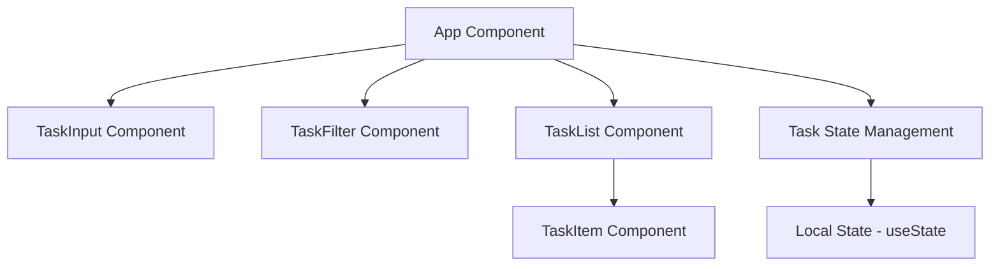
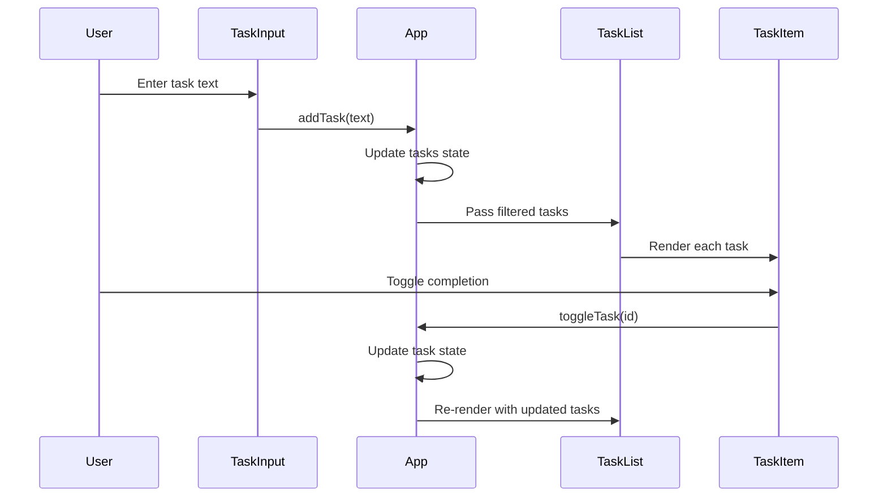

# Simple Tasks - System Design Document

## 1. Architecture Overview

### High-Level Structure
Simple Tasks is a client-side single-page application (SPA) built with React, TypeScript, and Vite. The architecture follows a component-based design pattern with unidirectional data flow.



### Key Architectural Decisions

1. **State Management**: Using React's `useState` hook for simplicity, with state lifted to the App component
2. **Component Structure**: Atomic design approach with small, focused components
3. **Type Safety**: Full TypeScript implementation with strict type checking
4. **Styling**: Tailwind CSS for rapid, consistent styling
5. **No Persistence**: In-memory state only (resets on page refresh)

### Technology Stack
- **Framework**: React 18+
- **Build Tool**: Vite
- **Language**: TypeScript
- **Styling**: Tailwind CSS
- **Package Manager**: npm

## 2. Components

### 2.1 Core Components

#### App Component (`src/App.tsx`)
**Responsibility**: Root component managing application state and orchestrating child components
- Maintains task list state
- Manages filter state
- Provides CRUD operations for tasks
- Coordinates data flow between components

#### TaskInput Component (`src/components/TaskInput.tsx`)
**Responsibility**: Handle new task creation
- Controlled input field for task text
- Form submission handling
- Input validation (non-empty tasks)
- Clear input after submission

#### TaskFilter Component (`src/components/TaskFilter.tsx`)
**Responsibility**: Filter selection UI
- Display filter options (All, Active, Completed)
- Highlight active filter
- Emit filter change events to parent

#### TaskList Component (`src/components/TaskList.tsx`)
**Responsibility**: Display filtered task collection
- Receive filtered tasks from parent
- Render TaskItem components
- Handle empty state display
- Pass through action handlers

#### TaskItem Component (`src/components/TaskItem.tsx`)
**Responsibility**: Individual task display and actions
- Display task text and completion status
- Toggle completion checkbox
- Delete button
- Visual distinction for completed tasks

### 2.2 Type Definitions

#### Task Interface (`src/types/task.ts`)
```typescript
interface Task {
  id: string;
  text: string;
  completed: boolean;
  createdAt: Date;
}

type FilterType = 'all' | 'active' | 'completed';
```

## 3. Data Flow

### 3.1 State Management Flow



### 3.2 Data Flow Patterns

**Add Task Flow**:
1. User types in TaskInput component
2. User submits form
3. TaskInput calls `onAddTask` callback with text
4. App generates unique ID and creates Task object
5. App updates tasks state array
6. React re-renders TaskList with new task

**Toggle Task Flow**:
1. User clicks checkbox in TaskItem
2. TaskItem calls `onToggle` callback with task ID
3. App maps through tasks array and toggles matching task
4. App updates tasks state
5. React re-renders affected TaskItem

**Delete Task Flow**:
1. User clicks delete button in TaskItem
2. TaskItem calls `onDelete` callback with task ID
3. App filters out task from tasks array
4. App updates tasks state
5. React re-renders TaskList without deleted task

**Filter Flow**:
1. User clicks filter button in TaskFilter
2. TaskFilter calls `onFilterChange` callback
3. App updates filter state
4. App computes filtered tasks based on new filter
5. React re-renders TaskList with filtered tasks

### 3.3 State Structure

```typescript
// App component state
const [tasks, setTasks] = useState<Task[]>([]);
const [filter, setFilter] = useState<FilterType>('all');

// Derived state (computed)
const filteredTasks = useMemo(() => {
  switch (filter) {
    case 'active': return tasks.filter(t => !t.completed);
    case 'completed': return tasks.filter(t => t.completed);
    default: return tasks;
  }
}, [tasks, filter]);
```

## 4. APIs/Database

### 4.1 Component APIs (Props Interfaces)

#### TaskInput Props
```typescript
interface TaskInputProps {
  onAddTask: (text: string) => void;
}
```

#### TaskFilter Props
```typescript
interface TaskFilterProps {
  currentFilter: FilterType;
  onFilterChange: (filter: FilterType) => void;
}
```

#### TaskList Props
```typescript
interface TaskListProps {
  tasks: Task[];
  onToggleTask: (id: string) => void;
  onDeleteTask: (id: string) => void;
}
```

#### TaskItem Props
```typescript
interface TaskItemProps {
  task: Task;
  onToggle: (id: string) => void;
  onDelete: (id: string) => void;
}
```

### 4.2 Data Schema

#### Task Entity
```typescript
{
  id: string;           // UUID v4 format
  text: string;         // 1-500 characters
  completed: boolean;   // default: false
  createdAt: Date;      // timestamp of creation
}
```

### 4.3 No External APIs
This application operates entirely client-side with no backend integration. All data is stored in React component state and lost on page refresh.

## 5. Integration Points

### 5.1 External Dependencies

#### Production Dependencies
- **react**: ^18.2.0 - Core React library
- **react-dom**: ^18.2.0 - React DOM rendering

#### Development Dependencies
- **vite**: ^5.0.0 - Build tool and dev server
- **@vitejs/plugin-react**: ^4.2.0 - React plugin for Vite
- **typescript**: ^5.3.0 - TypeScript compiler
- **@types/react**: ^18.2.0 - React type definitions
- **@types/react-dom**: ^18.2.0 - React DOM type definitions
- **tailwindcss**: ^3.4.0 - Utility-first CSS framework
- **postcss**: ^8.4.0 - CSS transformation tool
- **autoprefixer**: ^10.4.0 - PostCSS plugin for vendor prefixes

### 5.2 Browser APIs
- **crypto.randomUUID()**: For generating unique task IDs
- **localStorage**: Not used (future enhancement opportunity)

### 5.3 No External Services
No third-party services, APIs, or authentication systems are integrated.

## 6. Implementation Plan

### 6.1 Project Configuration Files

#### `package.json` - **NEW**
**Responsibility**: Define project metadata, dependencies, and scripts
**Rationale**: Required for npm package management and project configuration

#### `tsconfig.json` - **NEW**
**Responsibility**: TypeScript compiler configuration
**Rationale**: Enable strict type checking and modern JavaScript features

#### `tsconfig.node.json` - **NEW**
**Responsibility**: TypeScript configuration for Vite config files
**Rationale**: Separate TS config for Node.js environment (build tools)

#### `vite.config.ts` - **NEW**
**Responsibility**: Vite build tool configuration
**Rationale**: Configure React plugin and build settings

#### `tailwind.config.js` - **NEW**
**Responsibility**: Tailwind CSS configuration
**Rationale**: Define content paths and customize Tailwind settings

#### `postcss.config.js` - **NEW**
**Responsibility**: PostCSS configuration
**Rationale**: Enable Tailwind CSS and Autoprefixer processing

#### `.gitignore` - **NEW**
**Responsibility**: Specify files to exclude from version control
**Rationale**: Prevent committing node_modules, build artifacts, and IDE files

### 6.2 HTML Entry Point

#### `index.html` - **NEW**
**Responsibility**: HTML entry point for the application
**Rationale**: Required by Vite as the application entry point, loads main TypeScript file

### 6.3 Application Source Files

#### `src/main.tsx` - **NEW**
**Responsibility**: Application bootstrap and React root rendering
**Rationale**: Entry point for React application, mounts App component to DOM

#### `src/App.tsx` - **NEW**
**Responsibility**: Root component with state management and layout
**Rationale**: Central orchestrator for all application logic and component composition

#### `src/index.css` - **NEW**
**Responsibility**: Global styles and Tailwind directives
**Rationale**: Import Tailwind base, components, and utilities; define global styles

### 6.4 Type Definitions

#### `src/types/task.ts` - **NEW**
**Responsibility**: Define Task interface and FilterType
**Rationale**: Centralize type definitions for reuse across components, ensure type safety

### 6.5 React Components

#### `src/components/TaskInput.tsx` - **NEW**
**Responsibility**: Controlled input component for creating new tasks
**Rationale**: Encapsulate task creation logic, handle form submission and validation

#### `src/components/TaskFilter.tsx` - **NEW**
**Responsibility**: Filter button group for task visibility
**Rationale**: Separate filtering UI concerns, provide clear filter state indication

#### `src/components/TaskList.tsx` - **NEW**
**Responsibility**: Container component for rendering task collection
**Rationale**: Handle list rendering logic, empty state, and pass props to TaskItem

#### `src/components/TaskItem.tsx` - **NEW**
**Responsibility**: Individual task display with toggle and delete actions
**Rationale**: Encapsulate single task UI and interactions, promote reusability

### 6.6 Asset Files

#### `src/vite-env.d.ts` - **NEW**
**Responsibility**: Vite client type definitions
**Rationale**: Enable TypeScript support for Vite-specific features

### 6.7 File Structure Summary

```
simple-tasks/
├── package.json                    [NEW] - Project configuration
├── tsconfig.json                   [NEW] - TypeScript config
├── tsconfig.node.json              [NEW] - TypeScript config for Node
├── vite.config.ts                  [NEW] - Vite configuration
├── tailwind.config.js              [NEW] - Tailwind configuration
├── postcss.config.js               [NEW] - PostCSS configuration
├── .gitignore                      [NEW] - Git ignore rules
├── index.html                      [NEW] - HTML entry point
└── src/
    ├── main.tsx                    [NEW] - React bootstrap
    ├── App.tsx                     [NEW] - Root component
    ├── index.css                   [NEW] - Global styles
    ├── vite-env.d.ts              [NEW] - Vite types
    ├── types/
    │   └── task.ts                [NEW] - Type definitions
    └── components/
        ├── TaskInput.tsx          [NEW] - Task creation input
        ├── TaskFilter.tsx         [NEW] - Filter buttons
        ├── TaskList.tsx           [NEW] - Task list container
        └── TaskItem.tsx           [NEW] - Individual task item
```

### 6.8 Implementation Order

1. **Setup Phase**: Configuration files (package.json, tsconfig, vite.config, tailwind.config)
2. **Foundation Phase**: Type definitions, main.tsx, index.html, index.css
3. **Core Phase**: App.tsx with basic state management
4. **Component Phase**: TaskInput → TaskItem → TaskList → TaskFilter
5. **Integration Phase**: Wire all components together in App.tsx
6. **Polish Phase**: Styling refinements and edge case handling

### 6.9 Testing Strategy

**Manual Testing Checklist**:
- [ ] Add task with valid text
- [ ] Prevent adding empty tasks
- [ ] Toggle task completion status
- [ ] Delete task
- [ ] Filter: Show all tasks
- [ ] Filter: Show only active tasks
- [ ] Filter: Show only completed tasks
- [ ] Empty state displays correctly
- [ ] UI is responsive and accessible

---

**Document Version**: 1.0  
**Last Updated**: 2024  
**Status**: Ready for Implementation