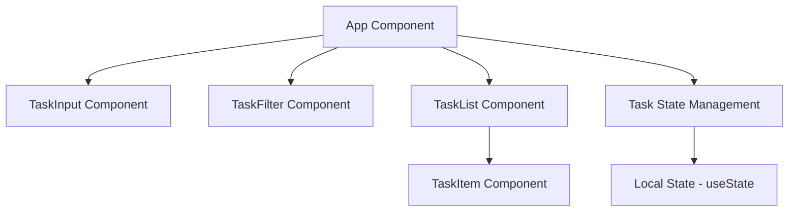
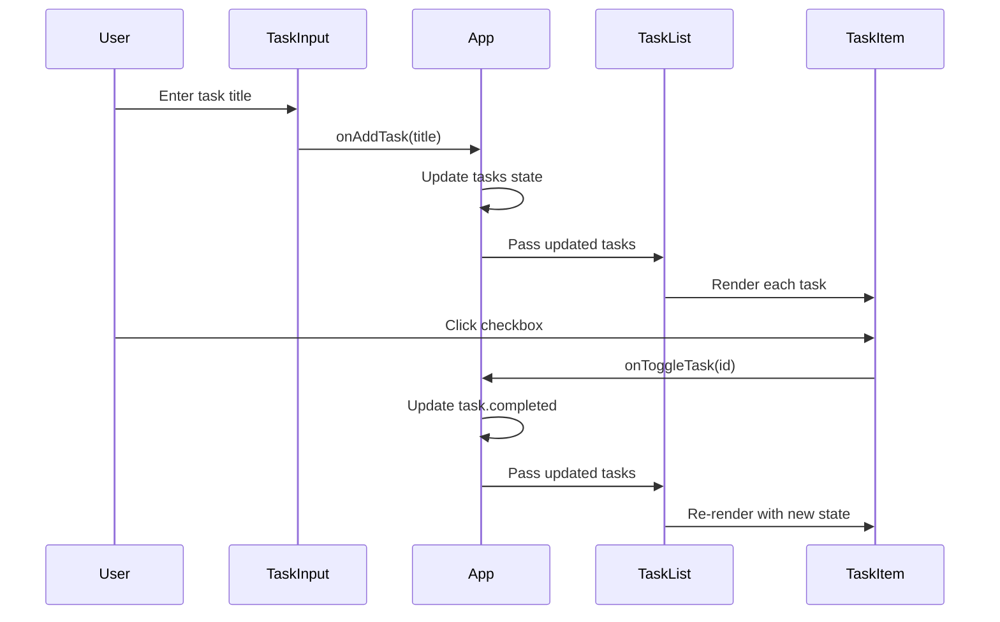
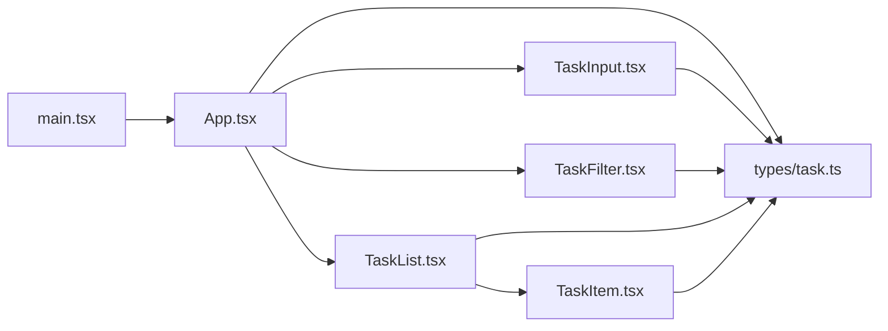

# Simple Tasks - System Design Document

## 1. Architecture Overview

### High-Level Structure
Simple Tasks is a client-side single-page application (SPA) built with React, TypeScript, and Vite. The architecture follows a component-based design pattern with unidirectional data flow.



### Key Architectural Decisions

1. **State Management**: Using React's `useState` hook for simplicity, with state lifted to the App component
2. **Component Structure**: Atomic design approach with small, focused components
3. **Type Safety**: Full TypeScript implementation with strict type checking
4. **Styling**: Tailwind CSS for rapid, consistent styling
5. **No Backend**: All data stored in component state (ephemeral, resets on refresh)

### Technology Stack
- **Framework**: React 18+
- **Build Tool**: Vite
- **Language**: TypeScript
- **Styling**: Tailwind CSS
- **Package Manager**: npm

## 2. Components

### 2.1 Core Components

#### **App Component** (`src/App.tsx`)
- **Responsibility**: Root component, manages global task state and filter state
- **State Management**:
  - `tasks`: Array of task objects
  - `filter`: Current filter selection ('all' | 'completed' | 'active')
- **Functions**:
  - `addTask(title: string)`: Creates new task
  - `toggleTask(id: string)`: Toggles task completion status
  - `deleteTask(id: string)`: Removes task from list
  - `setFilter(filter: FilterType)`: Updates active filter

#### **TaskInput Component** (`src/components/TaskInput.tsx`)
- **Responsibility**: Input form for creating new tasks
- **Props**: `onAddTask: (title: string) => void`
- **State**: Local input value
- **Behavior**: 
  - Validates non-empty input
  - Clears input after submission
  - Handles Enter key submission

#### **TaskFilter Component** (`src/components/TaskFilter.tsx`)
- **Responsibility**: Filter buttons for viewing different task subsets
- **Props**: 
  - `currentFilter: FilterType`
  - `onFilterChange: (filter: FilterType) => void`
- **Behavior**: Highlights active filter, triggers filter changes

#### **TaskList Component** (`src/components/TaskList.tsx`)
- **Responsibility**: Container for rendering filtered task items
- **Props**:
  - `tasks: Task[]`
  - `onToggleTask: (id: string) => void`
  - `onDeleteTask: (id: string) => void`
- **Behavior**: Maps tasks to TaskItem components, shows empty state

#### **TaskItem Component** (`src/components/TaskItem.tsx`)
- **Responsibility**: Individual task display and interaction
- **Props**:
  - `task: Task`
  - `onToggle: (id: string) => void`
  - `onDelete: (id: string) => void`
- **Behavior**: 
  - Displays task title with completion status
  - Checkbox for toggling completion
  - Delete button
  - Visual styling based on completion state

### 2.2 Type Definitions

#### **Task Interface** (`src/types/task.ts`)
```typescript
interface Task {
  id: string;
  title: string;
  completed: boolean;
  createdAt: Date;
}

type FilterType = 'all' | 'completed' | 'active';
```

## 3. Data Flow

### 3.1 State Flow Diagram



### 3.2 Data Flow Description

1. **Task Creation Flow**:
   - User types in TaskInput component
   - On submit, TaskInput calls `onAddTask` callback
   - App component creates new Task object with unique ID
   - App updates `tasks` state array
   - TaskList receives updated tasks via props
   - TaskList renders new TaskItem

2. **Task Toggle Flow**:
   - User clicks checkbox in TaskItem
   - TaskItem calls `onToggle` callback with task ID
   - App finds task by ID and toggles `completed` property
   - App updates `tasks` state (immutably)
   - Re-render propagates down to TaskList and TaskItem

3. **Task Delete Flow**:
   - User clicks delete button in TaskItem
   - TaskItem calls `onDelete` callback with task ID
   - App filters out task with matching ID
   - App updates `tasks` state
   - TaskList re-renders without deleted task

4. **Filter Flow**:
   - User clicks filter button in TaskFilter
   - TaskFilter calls `onFilterChange` callback
   - App updates `filter` state
   - App computes filtered tasks based on filter value
   - TaskList receives filtered subset of tasks

### 3.3 State Management Strategy

- **Single Source of Truth**: All tasks stored in App component
- **Immutable Updates**: State updates use spread operators and array methods
- **Derived State**: Filtered tasks computed on each render (no separate state)
- **ID Generation**: Using `crypto.randomUUID()` or timestamp-based IDs

## 4. APIs/Database

### 4.1 Data Models

#### Task Model
```typescript
interface Task {
  id: string;              // Unique identifier (UUID or timestamp)
  title: string;           // Task description (1-500 characters)
  completed: boolean;      // Completion status
  createdAt: Date;        // Creation timestamp
}
```

#### Filter Type
```typescript
type FilterType = 'all' | 'completed' | 'active';
```

### 4.2 Internal API (Component Props)

#### App Component Interface
```typescript
interface AppState {
  tasks: Task[];
  filter: FilterType;
}

interface AppMethods {
  addTask: (title: string) => void;
  toggleTask: (id: string) => void;
  deleteTask: (id: string) => void;
  setFilter: (filter: FilterType) => void;
}
```

#### TaskInput Props
```typescript
interface TaskInputProps {
  onAddTask: (title: string) => void;
}
```

#### TaskFilter Props
```typescript
interface TaskFilterProps {
  currentFilter: FilterType;
  onFilterChange: (filter: FilterType) => void;
}
```

#### TaskList Props
```typescript
interface TaskListProps {
  tasks: Task[];
  onToggleTask: (id: string) => void;
  onDeleteTask: (id: string) => void;
}
```

#### TaskItem Props
```typescript
interface TaskItemProps {
  task: Task;
  onToggle: (id: string) => void;
  onDelete: (id: string) => void;
}
```

### 4.3 Data Persistence

**Note**: This implementation does NOT persist data. All state is ephemeral and resets on page refresh. Future enhancement could add localStorage persistence.

## 5. Integration Points

### 5.1 External Dependencies

#### Build & Development
- **Vite**: Development server and build tool
- **React**: UI library (v18+)
- **React DOM**: React renderer for web

#### Type System
- **TypeScript**: Static type checking (v5+)
- **@types/react**: React type definitions
- **@types/react-dom**: React DOM type definitions

#### Styling
- **Tailwind CSS**: Utility-first CSS framework
- **PostCSS**: CSS processing (required by Tailwind)
- **Autoprefixer**: CSS vendor prefixing

### 5.2 Browser APIs

- **crypto.randomUUID()**: For generating unique task IDs (fallback to Date.now() for older browsers)
- **localStorage** (future): For data persistence enhancement

### 5.3 Module Dependencies



### 5.4 No External Integrations

This application is fully self-contained with no:
- Backend API calls
- Database connections
- Third-party service integrations
- Authentication systems
- Analytics or tracking

## 6. Implementation Plan

### 6.1 Project Structure

```
simple-tasks/
├── public/
├── src/
│   ├── components/
│   │   ├── TaskInput.tsx
│   │   ├── TaskFilter.tsx
│   │   ├── TaskList.tsx
│   │   └── TaskItem.tsx
│   ├── types/
│   │   └── task.ts
│   ├── App.tsx
│   ├── main.tsx
│   └── index.css
├── index.html
├── package.json
├── tsconfig.json
├── tsconfig.node.json
├── vite.config.ts
├── tailwind.config.js
├── postcss.config.js
└── .gitignore
```

### 6.2 File-Level Implementation Plan

#### Configuration Files

| File Path | Status | Responsibility | Rationale |
|-----------|--------|----------------|-----------|
| `package.json` | **NEW** | Project dependencies and scripts | Defines React, TypeScript, Vite, and Tailwind dependencies with dev server and build scripts |
| `tsconfig.json` | **NEW** | TypeScript compiler configuration | Configures strict type checking, JSX transform, and module resolution for React |
| `tsconfig.node.json` | **NEW** | TypeScript config for Vite | Separate config for Vite configuration files |
| `vite.config.ts` | **NEW** | Vite build tool configuration | Configures React plugin and development server settings |
| `tailwind.config.js` | **NEW** | Tailwind CSS configuration | Defines content paths for Tailwind to scan and optional theme customization |
| `postcss.config.js` | **NEW** | PostCSS configuration | Enables Tailwind CSS and Autoprefixer processing |
| `.gitignore` | **NEW** | Git ignore rules | Excludes node_modules, dist, and IDE files from version control |

#### HTML Entry Point

| File Path | Status | Responsibility | Rationale |
|-----------|--------|----------------|-----------|
| `index.html` | **NEW** | HTML entry point | Root HTML file that loads the React application via main.tsx |

#### Application Entry

| File Path | Status | Responsibility | Rationale |
|-----------|--------|----------------|-----------|
| `src/main.tsx` | **NEW** | Application bootstrap | Renders root App component into DOM, imports global styles |
| `src/index.css` | **NEW** | Global styles and Tailwind directives | Imports Tailwind base, components, and utilities; defines global CSS variables |

#### Type Definitions

| File Path | Status | Responsibility | Rationale |
|-----------|--------|----------------|-----------|
| `src/types/task.ts` | **NEW** | Task and Filter type definitions | Centralized type definitions for Task interface and FilterType, ensuring type consistency across components |

#### Core Application

| File Path | Status | Responsibility | Rationale |
|-----------|--------|----------------|-----------|
| `src/App.tsx` | **NEW** | Root component with state management | Manages tasks array and filter state, implements all CRUD operations, orchestrates child components, provides application layout |

#### UI Components

| File Path | Status | Responsibility | Rationale |
|-----------|--------|----------------|-----------|
| `src/components/TaskInput.tsx` | **NEW** | Task creation input form | Handles user input for new tasks, validates non-empty input, manages local input state, triggers task creation via callback |
| `src/components/TaskFilter.tsx` | **NEW** | Filter button group | Renders three filter buttons (All, Active, Completed), highlights active filter, triggers filter changes via callback |
| `src/components/TaskList.tsx` | **NEW** | Task list container | Receives filtered tasks, maps to TaskItem components, displays empty state when no tasks match filter |
| `src/components/TaskItem.tsx` | **NEW** | Individual task display | Renders single task with checkbox and delete button, handles toggle and delete actions, applies completion styling |

### 6.3 Implementation Order

**Phase 1: Project Setup**
1. Initialize Vite project with React-TypeScript template
2. Install and configure Tailwind CSS
3. Set up configuration files (package.json, tsconfig, vite.config, etc.)

**Phase 2: Type Definitions**
4. Create Task interface and FilterType in `src/types/task.ts`

**Phase 3: Core Application**
5. Implement `src/App.tsx` with state management and CRUD operations
6. Set up basic layout structure

**Phase 4: UI Components (Bottom-Up)**
7. Implement `src/components/TaskItem.tsx` (leaf component)
8. Implement `src/components/TaskList.tsx` (uses TaskItem)
9. Implement `src/components/TaskInput.tsx` (independent)
10. Implement `src/components/TaskFilter.tsx` (independent)

**Phase 5: Integration**
11. Wire up all components in App.tsx
12. Test all user interactions and data flow

**Phase 6: Styling**
13. Apply Tailwind classes for responsive, clean UI
14. Add hover states and transitions
15. Ensure accessibility (keyboard navigation, ARIA labels)

### 6.4 Testing Strategy

**Manual Testing Checklist**:
- [ ] Add new task with valid input
- [ ] Prevent adding empty task
- [ ] Toggle task completion status
- [ ] Delete task
- [ ] Filter by "All" shows all tasks
- [ ] Filter by "Active" shows only incomplete tasks
- [ ] Filter by "Completed" shows only completed tasks
- [ ] UI is responsive on mobile and desktop
- [ ] Keyboard navigation works (Tab, Enter, Space)

### 6.5 Success Criteria Validation

✅ **npm run dev executes successfully**: Vite dev server starts without errors  
✅ **All features functional**: Create, toggle, delete, and filter operations work  
✅ **Complete code**: No ellipsis, placeholders, or incomplete implementations  
✅ **Type safety**: Full TypeScript coverage with no `any` types  
✅ **Clean UI**: Tailwind CSS provides minimal, functional design  

---

## Appendix: Key Design Patterns

### Component Composition
- Small, single-responsibility components
- Props-based communication (unidirectional data flow)
- Callback functions for child-to-parent communication

### State Management
- Lift state up to common ancestor (App component)
- Immutable state updates using spread operators
- Derived state computed during render (filtered tasks)

### Type Safety
- Explicit interfaces for all props
- Strict TypeScript configuration
- No implicit `any` types

### Styling Approach
- Utility-first with Tailwind CSS
- Responsive design with Tailwind breakpoints
- Consistent spacing and color system